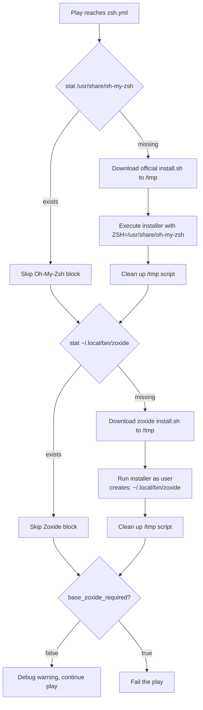

## Overview

The `base` role provisions a complete Zsh working environment through a single, well-bounded task file: `tasks/zsh.yml`. The stack has two layers — **Oh-My-Zsh**, installed system-wide under `/usr/share/oh-my-zsh`, and **Zoxide**, a smarter `cd` replacement installed per-user into `~/.local/bin`. Each component is guarded by an idempotency pre-check (a `stat` probe) so the installer scripts only run when the target artifact is genuinely absent, and each carries its own Ansible tags (`zsh`, `oh-my-zsh`, `zoxide`) for selective replays.

Sources: [tasks/zsh.yml](tasks/zsh.yml#L1-L7), [tasks/zsh.yml](tasks/zsh.yml#L36-L38)

## Layer 1: System-Wide Oh-My-Zsh

The Oh-My-Zsh block is the classic "detect → download → execute → clean" pattern. It is gated on `not base_oh_my_zsh_stat.stat.exists` — the stat probe registered earlier against `/usr/share/oh-my-zsh` — and tagged `["zsh", "oh-my-zsh"]`. Because the official installer writes into `/usr/share`, the block declares a block-level `environment` with `ZSH: "/usr/share/oh-my-zsh"`, which is how the upstream `install.sh` is redirected away from `$HOME/.oh-my-zsh` into a shared location.

Sources: [tasks/zsh.yml](tasks/zsh.yml#L8-L13)

The fetch step pulls the installer directly from the canonical upstream — `https://raw.githubusercontent.com/ohmyzsh/ohmyzsh/master/tools/install.sh` — rather than vendoring a copy, meaning every replay picks up whatever the project currently publishes. Execution is a plain `ansible.builtin.command` (not `shell`), which keeps the interaction surface minimal: the script runs once, non-interactively by virtue of its environment, and the temporary copy at `/tmp/oh-my-zsh-install.sh` is explicitly removed with a `state: absent` file task afterward. No changed-when or created-when guards are needed here because the surrounding block only ever runs when the `/usr/share/oh-my-zsh` directory is missing.

Sources: [tasks/zsh.yml](tasks/zsh.yml#L14-L32)

## Layer 2: Per-User Zoxide

The Zoxide block mirrors the same four-phase pattern but with two deliberate divergences. First, it probes a different artifact — `{{ ansible_user_dir }}/.local/bin/zoxide` — registered as `base_zoxide_stat` before the block begins. Second, and most importantly, the installer execution sets `creates: "{{ ansible_user_dir }}/.local/bin/zoxide"` and runs with `become: false`. Zoxide's upstream installer installs to the user's own bin directory when unprivileged, so the role keeps the entire operation in user space: no root, no system pollution, and the `creates` argument gives Ansible a second idempotency tripwire on top of the initial stat probe.

Sources: [tasks/zsh.yml](tasks/zsh.yml#L36-L55)

The download step fetches `https://raw.githubusercontent.com/ajeetdsouza/zoxide/main/install.sh` into `/tmp/zoxide-install.sh` with mode `0755`, and the block finishes with the same hygiene discipline as the Oh-My-Zsh path — the temporary script is deleted once the binary lands.

Sources: [tasks/zsh.yml](tasks/zsh.yml#L41-L62)

## Failure Semantics: The Optional Rescue

This is the most architecturally interesting decision in the file. The Zoxide block carries a `rescue` clause — labeled in the source as **"Shape 3 (optional)"** — that breaks the pattern used elsewhere in the role. The comment is explicit about the rationale: *"zoxide is a shell convenience, not part of what this role promises."* The rescue path emits a `debug` warning explaining that failures are "usually network connectivity or GitHub availability" and that "the shell is usable without it," and then conditionally fails with `ansible.builtin.fail` only when `base_zoxide_required` is truthy.

Sources: [tasks/zsh.yml](tasks/zsh.yml#L63-L73)

The corresponding default keeps this behavior off by default: `base_zoxide_required: false` in `defaults/main.yml`. The design consequence is that a flaky GitHub mirror degrades gracefully — the play completes, Zsh and Oh-My-Zsh are fully functional, and operators who treat Zoxide as a hard dependency can flip one boolean to escalate the same transient network error into a play failure. Note the contrast the role's own comments draw: *"Every other rescue in this role re-raises unconditionally"* — Zoxide is the sole deliberate exception, which makes the `base_zoxide_required` flag the single knob controlling this component's criticality.

Sources: [tasks/zsh.yml](tasks/zsh.yml#L64-L67), [defaults/main.yml](defaults/main.yml#L22-L24)

| Aspect | Oh-My-Zsh | Zoxide |
|---|---|---|
| Install scope | System-wide (`/usr/share/oh-my-zsh`) | Per-user (`~/.local/bin/zoxide`) |
| Privilege | Elevated (system path) | `become: false` |
| Upstream source | `ohmyzsh/ohmyzsh` master | `ajeetdsouza/zoxide` main |
| Idempotency guards | Block-level `stat` | Block-level `stat` + `creates:` |
| On failure | Hard failure (standard rescue shape) | Soft-fail by default; hard via `base_zoxide_required: true` |
| Tag | `zsh, oh-my-zsh` | `zsh, zoxide` |

Sources: [tasks/zsh.yml](tasks/zsh.yml#L8-L73), [defaults/main.yml](defaults/main.yml#L23-L23)

## Suggested Next Steps

The role delivers the binaries; wiring them into the shell experience is the natural follow-up work, and a few items are worth verifying or building next:

1. **Zsh as login shell** — Oh-My-Zsh only matters if `/bin/zsh` is the account's login shell. Verify whether the role (or a downstream role) runs `chsh` / manages `/etc/passwd`; if not, a `user` module task with `shell: /bin/zsh` is the obvious addition. Sources: [tasks/zsh.yml](tasks/zsh.yml#L8-L13)
2. **Zoxide init hook** — the installed binary does nothing until `.zshrc` sources it with `eval "$(zoxide init zsh)"`. Check whether your `dotfiles` role handles this; if the shell stack is expected to be self-contained, add an `ansible.builtin.lineinfile` guarded by the same `base_zoxide_stat` result so the hook appears exactly when the binary does. Sources: [tasks/zsh.yml](tasks/zsh.yml#L40-L55)
3. **Selective replay workflow** — use the tags for surgical iteration during development: `ansible-playbook site.yml --tags oh-my-zsh` re-attempts only the framework install, while `--skip-tags zoxide` excludes the convenience layer entirely. Sources: [tasks/zsh.yml](tasks/zsh.yml#L8-L10), [tasks/zsh.yml](tasks/zsh.yml#L42-L44)
4. **Escalation policy review** — if your environment treats Zoxide as mandatory (e.g., it is in the golden-dotfiles contract), promote it by setting `base_zoxide_required: true` in inventory or group vars rather than editing the role, keeping the soft-fail default as the shared baseline. Sources: [defaults/main.yml](defaults/main.yml#L22-L24), [tasks/zsh.yml](tasks/zsh.yml#L68-L73)