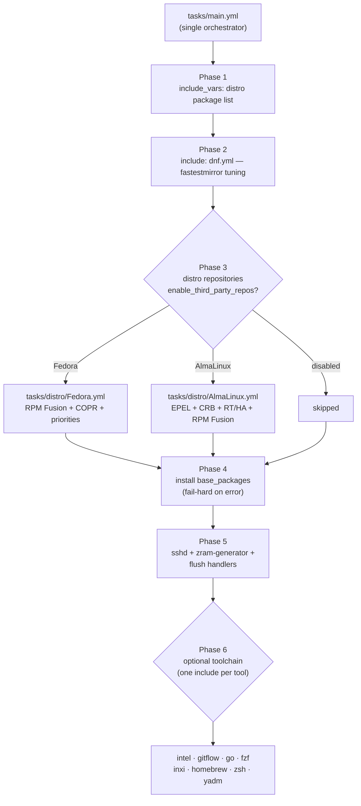

This page is the starting point of the documentation for `b08x.devworkstation.base`, an Ansible role that bootstraps developer workstations on RPM-based Linux distributions. Here you will learn what the role does at a high level, how its execution is architected, where each capability lives on disk, and which variables control its behavior. Everything on this page is derived directly from the role's source code — no feature is described that cannot be traced to a specific file.

Sources: [tasks/main.yml](tasks/main.yml#L1-L2)

## What This Role Is

The role's identity is declared in its metadata: it is the **base** role of the `b08x.devworkstation` collection, published under the GPL-2.0-or-later license and requiring Ansible **2.14 or newer**. Critically for beginners, it declares **zero role dependencies** (`dependencies: []`), meaning nothing needs to be installed from Ansible Galaxy before this role can run. Its entire behavior is self-contained.

Sources: [meta/main.yml](meta/main.yml#L18-L20), [meta/main.yml](meta/main.yml#L51)

Conceptually, the role answers one question: *"How do I turn a freshly installed Fedora or AlmaLinux machine into a usable developer workstation, repeatably?"* It does this in three layers — **system-level tuning** (DNF package manager speed and repository configuration), **core packages** (a distribution-specific package set), and an **optional development toolchain** (Go, Zsh, Homebrew, and friends). The split matters because the first two layers are the role's non-negotiable contract, while the third layer is convenience tooling that can fail without breaking the whole play — a distinction the role enforces explicitly in its error handling.

Sources: [tasks/main.yml](tasks/main.yml#L31-L54), [defaults/main.yml](defaults/main.yml#L18-L24)

## The Big Picture: One Orchestrator, Two Distributions, Many Optional Tools

The role follows a **hub-and-spoke architecture**. A single orchestrator file, `tasks/main.yml`, never does real work itself — instead it *includes* specialized task files in a fixed order. Two of those includes are selected dynamically at runtime using Ansible's `ansible_distribution` fact, which is how one role cleanly supports both Fedora and AlmaLinux without duplicating logic.

Sources: [tasks/main.yml](tasks/main.yml#L9-L29)

The execution flow below shows the six phases in order. Phases 1–5 are the core contract; Phase 6 is a fan-out of eight independent, tag-gated tool installs.



Sources: [tasks/main.yml](tasks/main.yml#L4-L114)

Two details of this flow deserve attention before you read further. First, **every include is tagged** (for example `tags: ["go", "base"]`, `tags: ["homebrew", "base"]`), so you can run the full role or surgically re-run just one tool with `--tags go`. Second, the repository phase is gated by a play-level variable, `enable_third_party_repos`, which defaults to `true` — skip it and the role will still run, but packages resolving against RPM Fusion or EPEL will not be available.

Sources: [tasks/main.yml](tasks/main.yml#L82-L114), [tasks/main.yml](tasks/main.yml#L25-L29), [defaults/main.yml](defaults/main.yml#L10-L12)

## The Anatomy on Disk

The role uses the **standard eight-directory Ansible role layout**, which means any Ansible-experienced developer can navigate it immediately. The tree below annotates what each directory actually contains in this role — note that `templates/` is an empty placeholder and `files/` holds exactly one managed repository file (an EPEL repo definition for the AlmaLinux path).

```text
roles/base/
├── defaults/main.yml          # User-overridable knobs (base_* variables)
├── files/
│   └── etc/yum.repos.d/
│       └── epel.repo          # Managed EPEL repo file, copied verbatim
├── handlers/main.yml          # "Daemon reload", "Restart zram service"
├── meta/
│   ├── main.yml               # Galaxy metadata: license, min Ansible version
│   └── argument_specs.yml     # Input validation for role arguments
├── tasks/
│   ├── main.yml               # Orchestrator — the entry point
│   ├── dnf.yml                # DNF speed tuning (fastestmirror)
│   ├── distro/
│   │   ├── Fedora.yml         # RPM Fusion + COPR repository setup
│   │   └── AlmaLinux.yml      # EPEL + CRB + RPM Fusion repository setup
│   ├── go.yml                 # Version-pinned Go toolchain
│   ├── zsh.yml                # Oh-My-Zsh + zoxide
│   ├── homebrew.yml           # Homebrew on Linux (Fedora only)
│   ├── intel.yml              # Intel graphics + optional oneAPI toolkit
│   └── fzf.yml, inxi.yml, gitflow.yml, yadm.yml
├── templates/                 # (empty — .keep placeholder)
├── tests/
│   └── inventory              # A single line: "localhost"
└── vars/
    ├── main.yml               # (empty)
    ├── Fedora.yml             # base_packages for Fedora
    └── AlmaLinux.yml          # base_packages for AlmaLinux
```

Sources: [tasks/main.yml](tasks/main.yml#L1-L2), [tests/inventory](tests/inventory#L1-L2), [vars/main.yml](vars/main.yml#L1-L3)

Two conventions in this layout are worth internalizing early. Variables in `vars/` are **non-overridable facts** — Ansible's precedence rules mean a user cannot easily replace them, which is exactly why the distribution-specific package lists live there. Variables in `defaults/` are **low-precedence knobs** meant to be overridden from your playbook. This split is the role's primary extension seam: adding behavior means adding a task file and a package list entry; customizing behavior means setting a `base_*` variable.

Sources: [vars/AlmaLinux.yml](vars/AlmaLinux.yml#L2-L67), [defaults/main.yml](defaults/main.yml#L1-L6)

## What the Role Provisions

The table below summarizes each capability, where it is implemented, and whether it runs by default. This is the complete surface of the role — there are no hidden task files.

| Capability | What it does | Implemented in | Runs by default? |
|---|---|---|---|
| DNF tuning | Installs `dnf-plugins-core`, enables `fastestmirror` in `/etc/dnf/dnf.conf` and the plugin config, refreshes the metadata cache when changed | [tasks/dnf.yml](tasks/dnf.yml#L2-L39) | Yes (RedHat family) |
| Third-party repos — Fedora | RPM Fusion free/non-free, COPR repos from a list, repo priorities | [tasks/distro/Fedora.yml](tasks/distro/Fedora.yml#L17-L78) | Yes, gated by `enable_third_party_repos` |
| Third-party repos — AlmaLinux | EPEL (with a managed repo file), CRB, HA/RT repos, RPM Fusion keys + release packages | [tasks/distro/AlmaLinux.yml](tasks/distro/AlmaLinux.yml#L11-L104) | Yes, gated by `enable_third_party_repos` |
| Base packages | Installs the distribution's package set with `allowerasing` | [tasks/main.yml](tasks/main.yml#L31-L40) | Yes — **fail-hard** on error |
| System services | Enables/restarts `sshd`, configures zram swap at half of RAM with zstd, reloads systemd | [tasks/main.yml](tasks/main.yml#L56-L80) | Yes |
| Optional toolchain | Eight independent installs: Intel graphics/oneAPI, gitflow, Go, fzf, inxi, Homebrew, Zsh (Oh-My-Zsh + zoxide), yadm | [tasks/main.yml](tasks/main.yml#L82-L114) | Tag-gated; some have `when` conditions |

One asymmetry to be aware of as you read the source: the two distribution variable files shape `base_packages` differently. AlmaLinux defines a **flat list** of roughly 65 packages, while Fedora defines a **nested structure** (`base_packages.base`) containing `aria2`, `nodejs`, and `npm`. Both are consumed by the same install loop in `tasks/main.yml`; the deeper implications are covered on the distro variables page.

Sources: [vars/AlmaLinux.yml](vars/AlmaLinux.yml#L2-L67), [vars/Fedora.yml](vars/Fedora.yml#L2-L7), [tasks/main.yml](tasks/main.yml#L31-L40)

## The Configuration Surface

The role's user-facing configuration is deliberately small. Everything you can safely override starts with the `base_` prefix, and each knob has a single, documented purpose:

| Variable | Default | Controls |
|---|---|---|
| `base_go_version` | `1.27.1` | Which Go release the toolchain task downloads and pins |
| `base_enable_rpmfusion` | `true` | Whether the Fedora path installs RPM Fusion (sub-gate inside the repo phase) |
| `base_copr_repos` | `[]` | List of COPR repositories as `owner/project` pairs |
| `base_intel_graphics_required` | `false` | Escalates Intel graphics failures from warning to play failure |
| `base_zoxide_required` | `false` | Escalates zoxide installation failures from warning to play failure |
| `base_dnf_priorities_required` | `false` | Escalates DNF priority configuration failures |
| `base_my_variable` | `"default_value"` | Demonstration argument, validated via the argument spec |

Sources: [defaults/main.yml](defaults/main.yml#L6-L24), [tasks/go.yml](tasks/go.yml#L10-L12)

Input validation is provided by [meta/argument_specs.yml](meta/argument_specs.yml#L4-L11), which declares that `base_my_variable` must be a string with the default `"default_value"`. When a role defines an argument spec, Ansible rejects invocations with mistyped arguments before any task runs — a cheap safety net for playbook authors. Today only one variable is formally validated; the rest of the surface relies on the `| default(true) | bool` coercion pattern you will see throughout the tasks.

Sources: [meta/argument_specs.yml](meta/argument_specs.yml#L4-L11)

## Reliability by Design

The role's most instructive engineering decision is its **two-tier failure policy**, encoded in comments labeled "Shape 1" and "Shape 3". Core-contract operations — base packages, third-party repositories — use *fail-hard* rescues: on error, the role prints a diagnostic hint (which repository was likely missing, what to re-check) and then explicitly fails the play rather than reporting green. Optional operations — Intel graphics, zoxide, DNF priorities — use *soft-fail* rescues: they print a warning and continue, escalating to a play failure only if you set the matching `base_*_required` toggle to `true`.

Sources: [tasks/main.yml](tasks/main.yml#L42-L54), [tasks/zsh.yml](tasks/zsh.yml#L61-L74), [tasks/intel.yml](tasks/intel.yml#L18-L31)

The role is also written to be **idempotent** — safe to run repeatedly. Script-based installers cannot simply be "re-installed" by a module, so the role guards them with pre-checks: a `stat` task verifies Oh-My-Zsh exists before downloading its installer, `creates:` arguments prevent re-running the zoxide installer, and the Go task first runs `go version` and only replaces `/usr/local/go` when the installed version differs from `base_go_version`.

Sources: [tasks/zsh.yml](tasks/zsh.yml#L2-L7), [tasks/go.yml](tasks/go.yml#L1-L12)

## A Note on Documentation Scaffolding

One honest observation before you dive in: the role's [README.md](README.md#L1-L79) and [meta/main.yml](meta/main.yml#L4-L5) still contain template boilerplate — the README opens with *"A brief description of the role goes here"* and the metadata lists the author as `foo`. This is common in hand-rolled roles and means **the executable code is the single source of truth** for what the role does. Treat every claim in this documentation as verifiable against the task files, and when in doubt, read the code — it is consistently commented, including the reasoning behind each rescue block.

Sources: [README.md](README.md#L3), [meta/main.yml](meta/main.yml#L4-L5)

## Where to Go Next

This overview deliberately stayed at the architectural level. The catalog continues in a designed progression — each page below builds directly on concepts introduced here:

| Step | Page | Why read it next |
|---|---|---|
| 1 | [Quick Start: Requirements, Variables, and First Run](2-quick-start-requirements-variables-and-first-run) | Get the role running on a real host before studying internals |
| 2 | [Role Directory Anatomy: Ansible Standard Layout](3-role-directory-anatomy-ansible-standard-layout) | Deepen the directory conventions sketched above |
| 3 | [Supported Platforms: Fedora and AlmaLinux Targets](4-supported-platforms-fedora-and-almalinux-targets) | Understand the `ansible_distribution` branching shown in the diagram |
| 4 | [Defaults and Overridable Variables (defaults/main.yml)](5-defaults-and-overridable-variables-defaults-main-yml) | Master the full configuration surface |
| 5 | [Task Orchestration: How tasks/main.yml Wires Everything](12-task-orchestration-how-tasks-main-yml-wires-everything) | A line-by-line walk of the orchestrator diagrammed above |

If you are a beginner, follow the table top-to-bottom: run first, understand the layout second, then read the orchestration and reliability deep dives. If you are extending the role, the final catalog page — [Adding a New Optional Tool: Task and Argument Spec Checklist](20-adding-a-new-optional-tool-task-and-argument-spec-checklist) — turns the patterns you saw here (include + tags + `base_` variable + rescue shape) into a step-by-step checklist.