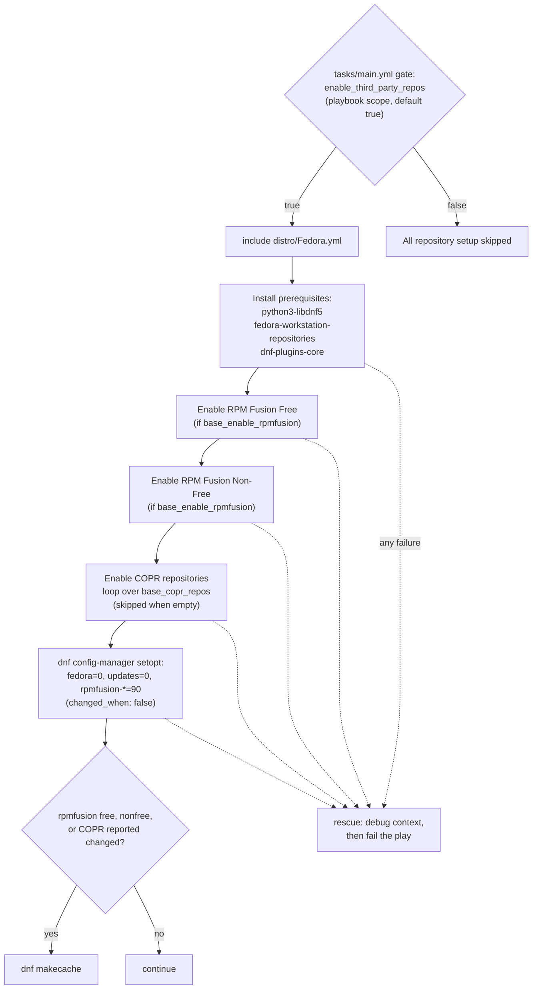
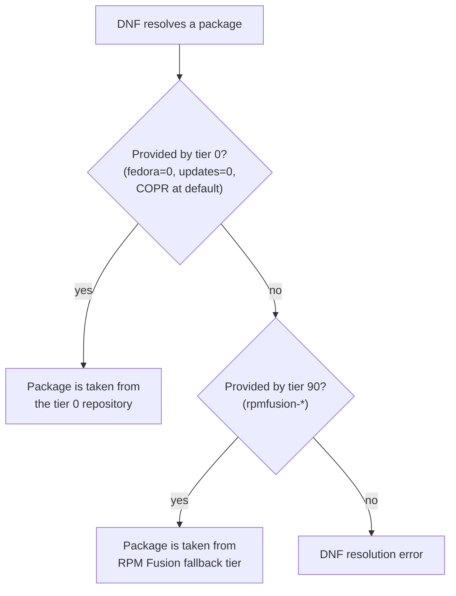

This page documents how the base role activates Fedora COPR repositories and enforces package priority tiers across the Fedora repository landscape. Both mechanisms live in a single Fedora-only task file, `tasks/distro/Fedora.yml`, and they are deliberately coupled: third-party repositories are enabled first, then their resolution weight is adjusted so that Fedora's official repositories always win package ties. You will learn the exact task anatomy, the priority model, how change detection is wired to a metadata cache refresh, the failure contract that protects downstream package installs, and one documentation-vs-code drift you should know about before customizing this role. This page follows [Third-Party Repositories: EPEL and RPM Fusion Setup](9-third-party-repositories-epel-and-rpm-fusion-setup) and precedes [Metadata Cache Refresh Strategy and Change Detection](11-metadata-cache-refresh-strategy-and-change-detection).

Sources: [tasks/distro/Fedora.yml](tasks/distro/Fedora.yml#L1-L79)

## Position in the Fedora Repository Pipeline

The COPR and priority tasks are not executed directly by `tasks/main.yml`; they live inside a distro-specific task file that is included only on Fedora (see [Supported Platforms: Fedora and AlmaLinux Targets](4-supported-platforms-fedora-and-almalinux-targets)). The include is gated by `enable_third_party_repos | default(true) | bool` — a variable that is deliberately **domain-scoped**: it is not prefixed with `base_`, does not appear in the role defaults, and is expected to be set at the playbook level. Setting it to `false` skips the entire file, including COPR enablement, RPM Fusion setup, and priority configuration.

Sources: [tasks/main.yml](tasks/main.yml#L25-L29), [defaults/main.yml](defaults/main.yml#L10-L12)

Within the included file, execution follows a strict sequence: prerequisites → RPM Fusion free → RPM Fusion non-free → COPR loop → priority setopt → conditional cache refresh. The ordering matters for two reasons. First, the prerequisite packages must exist before any module that touches repository configuration runs. Second, the priority task runs *after* every repository is enabled, so by the time `tasks/main.yml` proceeds to the base package install (`ansible.builtin.dnf` at lines 31–55), package resolution already happens under the correct tier weights. The rescue rationale in the file makes this dependency explicit: if repository setup fails, later package tasks would "resolve against these repositories, so continuing here only relocates the failure somewhere less obvious."

Sources: [tasks/distro/Fedora.yml](tasks/distro/Fedora.yml#L55-L59), [tasks/main.yml](tasks/main.yml#L31-L44)

The diagram below traces the full pipeline. Prerequisites: `distro/Fedora.yml` is a sequence of tasks wrapped in one block; dashed lines show the rescue path that catches *any* failure inside that block.



Sources: [tasks/distro/Fedora.yml](tasks/distro/Fedora.yml#L8-L78)

## Prerequisites Installed Before Any Repository Work

Before any repository is enabled, three packages are installed via `ansible.builtin.dnf` and tagged `["packages", "packages__repos"]`. The table below summarizes each package's purpose in this pipeline.

| Package | Why it is installed first |
|---|---|
| `python3-libdnf5` | Python bindings for the libdnf5 backend that the `ansible.builtin.dnf` module uses on current Fedora releases |
| `fedora-workstation-repositories` | Ships Fedora workstation's opt-in repository definitions |
| `dnf-plugins-core` | Provides the `config-manager` command and the COPR plugin machinery that downstream tasks depend on |

Note that this task runs unconditionally on every role execution — it has no `when` guard of its own — because every subsequent module call in the file depends on these components being present.

Sources: [tasks/distro/Fedora.yml](tasks/distro/Fedora.yml#L8-L15)

## COPR Enablement: The community.general.copr Loop

COPR activation is a single looped task:

```yaml
- name: Enable COPR repositories
  community.general.copr:
    name: "{{ item }}"
    state: enabled
  loop: "{{ base_copr_repos }}"
  register: base_copr_enabled
  when: base_copr_repos | length > 0
  tags: ["copr"]
```

Each list entry is an **owner/project** string — the documented example is `atim/starship` — passed directly to the `community.general.copr` module with `state: enabled`. Two design properties are worth internalizing. First, the default value is `base_copr_repos: []`, so **out of the box the role enables zero COPR repositories**; the task is skipped by the `length > 0` guard and the only way to activate COPRs is to override the variable from a playbook or inventory. Second, the task registers its result as `base_copr_enabled`; because the task is a loop, this aggregated register reports `changed` if *any* iteration changed, which is exactly the property the downstream cache-refresh condition relies on (one `dnf makecache` regardless of how many repos changed).

Sources: [tasks/distro/Fedora.yml](tasks/distro/Fedora.yml#L38-L45), [defaults/main.yml](defaults/main.yml#L14-L16)

A caution for intermediate users: `base_copr_repos` has **no schema validation**. `meta/argument_specs.yml` only declares `base_my_variable`, so the guard `base_copr_repos | length > 0` is the only check the role applies — a malformed entry (for example, a mapping instead of an `owner/project` string) surfaces as a module-level failure inside the repository block. The input-validation surface is covered in [Input Validation with argument_specs.yml](6-input-validation-with-argument_specs-yml).

Sources: [meta/argument_specs.yml](meta/argument_specs.yml#L4-L11)

| Task attribute | Value | Consequence |
|---|---|---|
| Module | `community.general.copr` | Collection-resolved module; requires the collection to be installed on the controller |
| Loop input | `base_copr_repos` | `owner/project` strings, e.g. `atim/starship` |
| Default value | `[]` | Task skipped unless overridden |
| Register | `base_copr_enabled` | Aggregated loop result; `changed` if any repo changed |
| Tag | `copr` | Selectable via `--tags` / `--skip-tags` |

Sources: [tasks/distro/Fedora.yml](tasks/distro/Fedora.yml#L38-L45)

## The Package Priority Model: Official Tier vs. RPM Fusion Fallback

Background concept first: DNF assigns every repository an integer `priority`, where a **lower number wins** package ties and the default for all repositories is `0`. When two repositories both provide a package, DNF only considers the one with the smaller priority number; when priorities are equal, normal resolution (highest version, then DNF's tiebreakers) applies. This repo-local mechanism is how the role prevents third-party repositories from silently replacing stock Fedora packages.

Sources: [tasks/distro/Fedora.yml](tasks/distro/Fedora.yml#L47-L53)

The role implements this with one `ansible.builtin.command` task that runs a single `dnf config-manager` invocation:

```
dnf config-manager setopt fedora.priority=0 updates.priority=0 rpmfusion-*.priority=90
```

This carves the repository landscape into two **priority tiers**: `fedora` and `updates` sit at tier `0` (the official tier, explicitly re-asserted at DNF's default), while all RPM Fusion repositories (`rpmfusion-*` glob) are demoted to tier `90`, a fallback tier. In practice, a package built by Fedora itself (for example, a library RPM Fusion also ships) resolves from the official repository, while RPM Fusion only supplies what the official tier does not — multimedia codecs and proprietary drivers being the classic cases. Three operational details deserve attention: the task has `changed_when: false`, so it never reports `changed` and never triggers the cache refresh; the task has **no `when` guard**, so the setopt runs even when RPM Fusion is disabled and the COPR list is empty; and unlike the commented AlmaLinux reference in this same file, the Fedora command omits the `--save` flag that persists options into repo files — if you need to know whether the tiers survive a reboot or a `dnf` upgrade on your dnf version, verify persistence against your target host's `dnf config-manager` semantics rather than assuming it.

Sources: [tasks/distro/Fedora.yml](tasks/distro/Fedora.yml#L47-L53), [tasks/distro/AlmaLinux.yml](tasks/distro/AlmaLinux.yml#L108-L121)

The resolution behavior that results from these values is shown below. Prerequisites: tier 0 contains `fedora`, `updates`, and — notably — any COPR repositories (see the caveat below the diagram).



Sources: [tasks/distro/Fedora.yml](tasks/distro/Fedora.yml#L47-L53)

**Caveat about COPR and priority:** the priority command assigns setopts to `fedora`, `updates`, and `rpmfusion-*` only. COPR repositories enabled by the loop receive **no explicit priority**, so they participate in resolution at DNF's default tier alongside the official repositories. If you enable a COPR that rebuilds a package Fedora also ships, that COPR can out-resolve `fedora`/`updates` on version; the tier model in this role constrains RPM Fusion, not COPRs. This is a verifiable consequence of the task list — no task in `tasks/distro/Fedora.yml` assigns a priority to COPR entries.

Sources: [tasks/distro/Fedora.yml](tasks/distro/Fedora.yml#L38-L53)

## Change Detection and the Coupled Metadata Refresh

The final task in the file couples repository changes to a cache rebuild. `dnf makecache` runs `changed_when: true` when *any* of the three registered repo tasks reported changed:

| Registered variable | Produced by | Triggers `dnf makecache` |
|---|---|---|
| `base_rpmfusion_free` | RPM Fusion free enable | Yes |
| `base_rpmfusion_nonfree` | RPM Fusion non-free enable | Yes |
| `base_copr_enabled` | COPR loop | Yes (aggregated: any single repo change triggers it) |
| Priority setopt command | `dnf config-manager setopt` | No — `changed_when: false` |

The priority command's exclusion from this condition is consistent with its `changed_when: false` declaration: the role treats priority adjustment as a non-event for change detection. The cache-refresh strategy — why a forced refresh is needed after repository topology changes, and how the same pattern appears in `tasks/dnf.yml` after fastestmirror edits — is analyzed in [Metadata Cache Refresh Strategy and Change Detection](11-metadata-cache-refresh-strategy-and-change-detection).

Sources: [tasks/distro/Fedora.yml](tasks/distro/Fedora.yml#L70-L78), [tasks/dnf.yml](tasks/dnf.yml#L36-L41)

## Failure Contract: Fail-Fast on Repository Setup

The entire repository configuration — prerequisites aside — is wrapped in a block whose rescue implements **Shape 1** (add context, then re-raise) from the role's failure-shape vocabulary. The rescue prints a diagnostic message that names the usual causes (network connectivity, unavailable RPM Fusion mirror) and offers an escape hatch (`Set base_enable_rpmfusion=false to skip RPM Fusion entirely`), then unconditionally calls `ansible.builtin.fail`. There is no soft-fail path: if the COPR loop or the priority setopt fails, the play stops immediately rather than letting the base package install fail later with a confusing "package not found" error.

Sources: [tasks/distro/Fedora.yml](tasks/distro/Fedora.yml#L17-L19), [tasks/distro/Fedora.yml](tasks/distro/Fedora.yml#L55-L68)

The comment block in the rescue justifies this strictness in one sentence: "every later package task resolves against these repositories, so continuing here only relocates the failure somewhere less obvious." Contrast this with the role's genuinely optional blocks (Intel graphics, zoxide), which warn and continue — the full taxonomy of failure shapes across the role, including which blocks use the conditional soft-fail form, is documented in [Failure Shape Patterns: Context, Re-Raise, and Soft-Fail (base_zoxide_required)](17-failure-shape-patterns-context-re-raise-and-soft-fail-base_zoxide_required).

Sources: [tasks/distro/Fedora.yml](tasks/distro/Fedora.yml#L56-L58)

## `base_dnf_priorities_required`: Documented Intent vs. Actual Wiring

This is the one place where the role's defaults documentation and its active code diverge, and you should know it before customizing failure behavior. `defaults/main.yml` declares `base_dnf_priorities_required: false` with a comment stating that the "DNF-priority blocks are optional: they report a warning and continue when they fail" and that setting the flag "turns its failure into a play failure." A grep across the role shows, however, that `base_dnf_priorities_required` is referenced **only inside commented-out code** — the disabled priority block in `tasks/distro/AlmaLinux.yml`, whose rescue conditionally fails with `when: base_dnf_priorities_required | bool`. The active Fedora rescue re-raises unconditionally, and no active task in the role reads the flag.

Sources: [defaults/main.yml](defaults/main.yml#L18-L24), [tasks/distro/AlmaLinux.yml](tasks/distro/AlmaLinux.yml#L123-L136)

| Aspect | What `defaults/main.yml` claims | What the active code does |
|---|---|---|
| Priority failure severity | Soft-fail by default; configurable via the flag | Unconditional play failure (Shape 1 rescue) |
| Flag consumers | "DNF-priority block" | None — only the commented AlmaLinux reference reads it |
| Practical effect of `base_dnf_priorities_required: true` | Converts a warning into a failure | No effect on Fedora runs |

The takeaway is a case of **flag drift**: the intended Shape 3 wiring exists as a preserved template in the commented AlmaLinux block (the comment there even explains the rationale — "priorities only decide which repository wins a tie… DNF still resolves packages without them"), but the Fedora implementation predates or ignores it. If you want the documented soft-fail behavior for the priority step on Fedora, you would need to restructure the rescue yourself; do not expect the flag to do it. The defaults layer is cataloged in [Defaults and Overridable Variables (defaults/main.yml)](5-defaults-and-overridable-variables-defaults-main-yml).

Sources: [tasks/distro/AlmaLinux.yml](tasks/distro/AlmaLinux.yml#L124-L136)

## Fedora vs. AlmaLinux: Two Priority Patterns in One File

The same task file family implements priority management differently per platform, which is worth seeing side by side — especially because one side is active and the other is preserved as a commented reference.

| Aspect | Fedora (active, `tasks/distro/Fedora.yml`) | AlmaLinux (commented reference, `tasks/distro/AlmaLinux.yml`) |
|---|---|---|
| Persistence mechanism | `dnf config-manager setopt` without `--save` | `dnf config-manager --save --setopt=…` (persists to repo files) |
| Repos covered | `fedora`, `updates`, `rpmfusion-*` | `baseos`, `appstream`, `crb`, `rt`, `highavailability`, `epel`, `rpmfusion-*` |
| Tier values | Official `0`, RPM Fusion `90` | Base system `1`, EPEL + RPM Fusion `20` (same tier, per the comment) |
| Failure shape | Unconditional re-raise inside the repository block (Shape 1) | Conditional fail gated by `base_dnf_priorities_required` (Shape 3) |
| Executing module | `ansible.builtin.command` | `ansible.builtin.shell` (multi-line script) |

Sources: [tasks/distro/Fedora.yml](tasks/distro/Fedora.yml#L47-L68), [tasks/distro/AlmaLinux.yml](tasks/distro/AlmaLinux.yml#L105-L136)

One more corroborating fact: the role ships a persistent repo file at `files/etc/yum.repos.d/epel.repo`, and it contains **no `priority=` directive** in any of its three sections. Combined with the active task inventory, this confirms that the Fedora `setopt` command is the role's only active priority mechanism — there is no hidden persistent-priority configuration elsewhere.

Sources: [files/etc/yum.repos.d/epel.repo](files/etc/yum.repos.d/epel.repo#L1-L13)

## Overriding `base_copr_repos` in Practice

To use this page's machinery, override the variable from your playbook and, optionally, target the relevant tags for a fast iteration loop:

```yaml
- hosts: localhost
  roles:
    - role: b08x.devworkstation.base
      vars:
        base_copr_repos:
          - atim/starship   # documented example: owner/project string
```

Because `base_copr_repos` is the only COPR input, adding a repository means appending one `owner/project` string; the module handles deduplication and reports `changed` only when it actually enables something new. For selective runs, the file's tag vocabulary is your lever: `--tags "copr"` exercises just the loop, `--tags "dnf_priorities"` just the setopt, and `--tags "repositories"` the whole block including RPM Fusion and the cache refresh — though remember the fail-fast rescue means a partial run that hits a repository error still fails the play. Note also that `base_enable_rpmfusion` and the COPR list are independent: you can run COPR-only configuration with `base_enable_rpmfusion=false`, and the priority setopt (which has no guard) still executes and demotes whatever `rpmfusion-*` repos happen to exist.

Sources: [tasks/distro/Fedora.yml](tasks/distro/Fedora.yml#L20-L53), [defaults/main.yml](defaults/main.yml#L10-L16)

## Key Takeaways

- COPR enablement is opt-in: `base_copr_repos` defaults to an empty list, the loop is guarded by a length check, and entries are plain `owner/project` strings with no schema validation.
- The priority model demotes RPM Fusion (`priority=90`) below the official tier (`fedora`/`updates` at `0`) in a single runtime `setopt`; COPR repos inherit DNF's default and are *not* demoted, so a COPR can shadow an official package by version.
- Repository changes (RPM Fusion free/non-free, any COPR) trigger exactly one `dnf makecache`; the priority command deliberately never triggers it.
- Repository setup failures are **fail-fast** (Shape 1): context, then unconditional play failure, because every later package task depends on these repositories.
- `base_dnf_priorities_required` is a drifted flag: documented as a soft-fail toggle in defaults, but referenced only in commented-out AlmaLinux code — the active Fedora rescue always re-raises.

For further reading, the natural next steps in this catalog are [Metadata Cache Refresh Strategy and Change Detection](11-metadata-cache-refresh-strategy-and-change-detection) for the cache-refresh pattern referenced above, [Failure Shape Patterns: Context, Re-Raise, and Soft-Fail (base_zoxide_required)](17-failure-shape-patterns-context-re-raise-and-soft-fail-base_zoxide_required) for the full rescue taxonomy, and [Task Orchestration: How tasks/main.yml Wires Everything](12-task-orchestration-how-tasks-main-yml-wires-everything) to see how the gated include fits into the role's overall sequence.