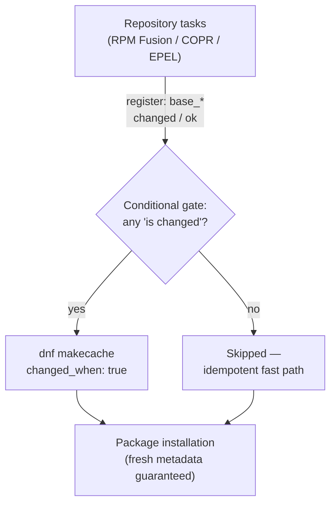

## Architectural Hypothesis

The core hypothesis of this design is that DNF metadata staleness is not a global concern but a *causal consequence* of repository mutation. Rather than unconditionally running `dnf makecache` on every play (the blunt-instrument approach), the role treats the cache as a downstream artifact: whenever a task that alters repository topology reports `changed`, the cache is explicitly invalidated and rebuilt. This converts an idempotency liability into a deterministic, event-driven refresh.

Two forces shape the implementation. First, DNF's built-in cache expiry timers are useless after adding a new repository — a newly enabled repo's metadata must be fetched before any package can be resolved from it, and DNF will not do so automatically within the same run. Second, the role must remain idempotent across repeated plays: on the second run, repository tasks report `ok`, the conditional gate evaluates false, and the expensive cache rebuild is skipped entirely. The result is a **refresh-on-mutation** pattern with zero amortized cost on converged systems.

## The Two-Layer Control Plane

The strategy is split across the distribution-agnostic and distribution-specific layers, each with its own trigger surface:

| Layer | File | Trigger Events | Refresh Command |
|---|---|---|---|
| Fedora | `tasks/distro/Fedora.yml` | RPM Fusion free/nonfree enabled, COPR repos added | `dnf makecache` |
| RHEL-family (Alma/Rocky) | `tasks/distro/AlmaLinux.yml` | EPEL installed, RPM Fusion keys/repos configured | `dnf makecache` |

Note that neither layer's trigger list is exhaustive of *all* repository activity in the role — the RHEL layer, for instance, gates on `base_epel_install`, `base_rpmfusion_keys`, and `base_rpmfusion_repos`, but not on commented-out priority configuration (see the `base_dnf_priorities_required` guards). This asymmetry is deliberate: only events that introduce new metadata sources (repositories, signing keys) invalidate the cache. Priority reordering changes resolution *behavior* but not the metadata corpus, so it does not trigger a rebuild.

## Implementation Anatomy

Each refresh task is a `command` module invocation rather than the `dnf` module — a choice with observable consequences:

```yaml
- name: Force refresh DNF metadata cache
  ansible.builtin.command:
    cmd: dnf makecache
  changed_when: true
  when: >
    (base_rpmfusion_free is changed) or
    (base_rpmfusion_nonfree is changed) or
    (base_copr_enabled is changed)
  tags: ["repositories"]
```

Source: [Fedora.yml](tasks/distro/Fedora.yml#L70-L78)

The key mechanism is the **`changed_when: true` override**. A raw `dnf makecache` run through the `command` module would always report `changed` (command modules have no native idempotency), which would defeat the conditional gate on subsequent plays — the task would appear to "change" state on every run, breaking idempotency reporting and any downstream `notify` chains. By declaring `changed_when: true` *and* binding execution to the upstream `is changed` conditions, the task achieves a compound contract:

- **Skipped** when no repository mutation occurred (the idempotent fast path).
- **Reported as changed** only when it actually executed (accurate handler/audit semantics).

The RHEL-family variant follows the identical template with its own trigger set:

```yaml
when: >
  (base_epel_install is changed) or
  (base_rpmfusion_keys is changed) or
  (base_rpmfusion_repos is changed)
```

Source: [AlmaLinux.yml](tasks/distro/AlmaLinux.yml#L138-L146)

## Why `dnf makecache` Over the DNF Module?

The Ansible `dnf` module does not expose a dedicated "refresh metadata only" operation — `update_cache` semantics are coupled to package operations. Using `command` gives the role an atomic, side-effect-free metadata synchronization step that sits *between* repository configuration and package installation in the play sequence. Its registered `changed` result also serves as a natural gate for any subsequent tasks that should only run after a successful metadata fetch.

A secondary benefit: `dnf makecache` (without `--refresh`) honors DNF's normal expiry heuristics *per repository*, but since it is only invoked immediately after repository mutation, the effective behavior is a forced fetch for all freshly added sources — exactly the guarantee needed before package resolution.

## Change-Detection Dependency Chain

The refresh depends on registered results from upstream repository tasks, forming an explicit causal chain:



**Prerequisite note**: the registered variables (`base_rpmfusion_free`, `base_copr_enabled`, `base_epel_install`, etc.) are only in scope because the repository tasks and the cache refresh live in the same distribution-specific file, included from a common entry point. The `is changed` test (rather than `is succeeded and changed`) also means the refresh fires even if a repository task merely *touched* configuration without a full state transition — matching DNF's requirement that any metadata-affecting write warrants a cache pass.

## Failure Semantics and Recovery

The refresh task sits downstream of a structured rescue block in the Fedora path. If third-party repository configuration fails (network unavailability, dead RPM Fusion mirrors), the rescue emits a diagnostic hint before failing the play:

Source: [Fedora.yml](tasks/distro/Fedora.yml#L60-L69)

The failure message explicitly routes operators to the escape hatch: setting `base_enable_rpmfusion=false` skips RPM Fusion entirely, which also eliminates the corresponding cache-refresh trigger — a clean degradation path. The RHEL family follows the same "diagnose, then fail" pattern with the additional `base_dnf_priorities_required` strictness toggle for priority-related failures (currently commented out in the source, awaiting activation). This separation between *repository establishment* failures and *cache synchronization* failures matters operationally: a cache refresh failure after successful repo setup indicates a metadata-server or mirror problem, which is a different remediation class than a repo-configuration failure.

## Tuning Interaction: Fastestmirror

An adjacent mechanism shares the same change-detection philosophy. The `tasks/dnf.yml` file registers both the fastestmirror flag and its configuration file write, and a downstream conditional reacts to *either*:

Source: [dnf.yml](tasks/dnf.yml#L19-L40)

This mirrors the cache-refresh pattern — config mutation (`.changed`) drives a follow-up action — illustrating that change-detection-gated follow-ups are the role's dominant idempotency idiom, not a cache-specific hack. Together, fastestmirror and explicit `makecache` complement each other: fastestmirror optimizes *which* mirror serves metadata and packages; the gated cache refresh guarantees metadata is *present* when new mirrors are introduced.

## Summary

The role's cache strategy rests on three verifiable properties: (1) refresh is triggered exclusively by repository-mutation events, never unconditionally; (2) `changed_when: true` preserves honest idempotency reporting despite using the non-idempotent `command` module; and (3) failure handling separates repository-establishment errors from metadata-fetch errors with distinct remediation guidance. The pattern generalizes cleanly to any config-mutation → follow-up-action pair, which is why it recurs across `dnf.yml` and both distribution files.