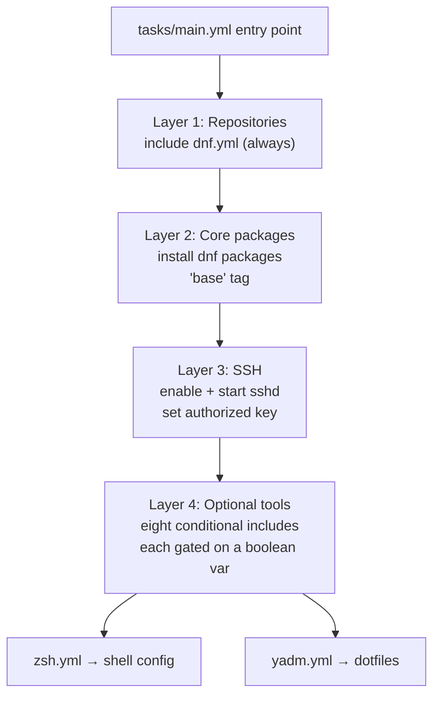
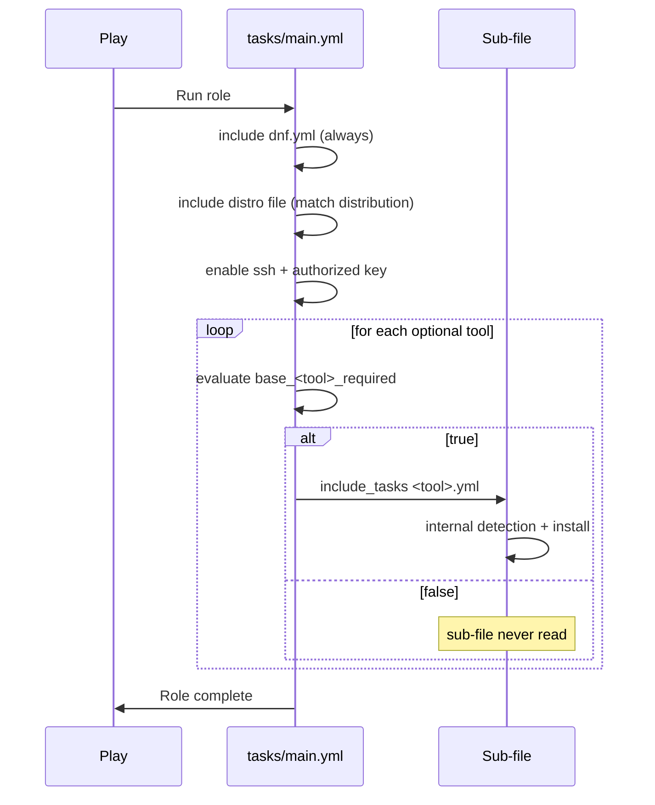

Every Ansible role has a single entry point for its work: `tasks/main.yml`. In this role, that file plays the role of a **conductor** — it doesn't install zsh, configure git, or build fzf itself. Instead, it reads a variable-driven "score," decides which sections of the playbook to perform, and delegates each section to a dedicated sub-file. Understanding this one file gives you a complete mental map of the entire role, because every other task file is reached from here. This page walks through the file top to bottom: its layered phases, how the optional-tool gates work, and the execution model Ansible follows when the file runs.

Sources: [tasks/main.yml](tasks/main.yml#L1-L113)

## The Big Picture: A Layered Assembly Line

Read top to bottom, `tasks/main.yml` is organized into four layers, each depending on the ones before it. First the package repositories are prepared, then the core system packages are installed, then the ssh service is enabled, and finally a long tail of optional developer tools is conditionally included. The ordering matters: you cannot install a package from a repository that hasn't been configured yet, and you cannot gate an optional tool on variable values that haven't been validated (validation happens earlier, in `meta/argument_specs.yml` — see [Input Validation with argument_specs.yml](6-input-validation-with-argument_specs-yml)).



Each layer's failure semantics also differ, which is deliberate: core packages use a "re-raise" failure pattern while the optional layer soft-fails. Those failure shapes are documented in detail on [Failure Shape Patterns: Context, Re-Raise, and Soft-Fail (base_zoxide_required)](17-failure-shape-patterns-context-re-raise-and-soft-fail-base_zoxide_required); here we focus on control flow.

Sources: [tasks/main.yml](tasks/main.yml#L1-L113)

## Phase 1: Repository Bootstrap

The very first task includes `dnf.yml`, which configures RPM Fusion and DNF tuning before anything else runs:

```yaml
- name: Configure DNF Repositories
  ansible.builtin.include_tasks: dnf.yml
  tags: ["dnf", "base", "repos"]
```

Notice there is **no `when` clause** — repository setup is unconditional on both Fedora and AlmaLinux, because every later phase (core packages, optional tools) depends on working package sources. The `repos` tag also makes this phase independently targetable: `ansible-playbook ... --tags repos` re-runs only repository configuration. What actually happens inside is covered on [DNF Tuning: fastestmirror and dnf-plugins-core](8-dnf-tuning-fastestmirror-and-dnf-plugins-core).

Sources: [tasks/main.yml](tasks/main.yml#L13-L19)

## Phase 2: Core Packages with a Re-Raise Failure Pattern

The next include handles distribution-specific base packages:

```yaml
- name: Install Base Packages
  ansible.builtin.include_tasks: "{{ item }}"
  loop:
    - AlmaLinux.yml
    - Fedora.yml
  when: ansible_facts['distribution'] == item | splitext | first
  tags: ["dnf", "base", "packages"]
```

The `when` condition performs an elegant piece of string surgery: it strips the `.yml` extension from the loop item (`item | splitext | first` produces `AlmaLinux` or `Fedora`) and compares it to the detected distribution. Only the file matching the current OS is ever loaded — AlmaLinux hosts execute `AlmaLinux.yml`'s package list and skip `Fedora.yml` entirely, and vice versa. This is the mechanism behind the platform support documented on [Supported Platforms: Fedora and AlmaLinux Targets](4-supported-platforms-fedora-and-almalinux-targets) and [Distro-Specific Variables: vars/Fedora.yml and vars/AlmaLinux.yml](7-distro-specific-variables-vars-fedora-yml-and-vars-almalinux-yml).

The comment block above this task explains that **base packages are this role's core deliverable**: if one of them fails to install, the failure is re-raised with added context rather than being swallowed. This contrasts sharply with the optional tools below.

Sources: [tasks/main.yml](tasks/main.yml#L25-L54)

## Phase 3: SSH Service and Access

Next come two always-run tasks: enabling and starting the `ssh` service, and writing an authorized SSH public key. These are the only non-include "leaf" tasks in the file — everything else is delegation. They guarantee that every machine managed by this role is remotely accessible once the playbook finishes, regardless of which optional tools were selected.

Sources: [tasks/main.yml](tasks/main.yml#L56-L80)

## Phase 4: The Optional-Tool Gate

The remainder of the file is a uniform block of conditional includes — this is the heart of the orchestration design:

```yaml
- name: Install Intel Hardware Tools
  ansible.builtin.include_tasks: intel.yml
  when: base_intel_required | default(false)
  tags: ["intel", "base"]

- name: Install GitFlow
  ansible.builtin.include_tasks: gitflow.yml
  when: base_gitflow_required | default(false)
  tags: ["gitflow", "base"]

- name: Install Go
  ansible.builtin.include_tasks: go.yml
  when: base_go_required | default(false)
  tags: ["go", "base"]
...
```

Every optional tool follows the same three-part contract: a **naming convention** (`base_<tool>_required`), a **safe default** (`| default(false)`, so an undefined variable simply means "skip"), and a **dedicated tag** matching the tool name. This convention is enforced by `meta/argument_specs.yml` — see [Input Validation with argument_specs.yml](6-input-validation-with-argument_specs-yml). The full variable reference lives in [Defaults and Overridable Variables (defaults/main.yml)](5-defaults-and-overridable-variables-defaults-main-yml).

The complete gate table:

| Gate variable | Include file | Tag |
|---|---|---|
| `base_intel_required` | `intel.yml` | `intel` |
| `base_gitflow_required` | `gitflow.yml` | `gitflow` |
| `base_go_required` | `go.yml` | `go` |
| `base_fzf_required` | `fzf.yml` | `fzf` |
| `base_inxi_required` | `inxi.yml` | `inxi` |
| `base_homebrew_required` | `homebrew.yml` | `homebrew` |
| `base_zsh_required` | `zsh.yml` | `zsh` |
| `base_yadm_required` | `yadm.yml` | `yadm` |

Sources: [tasks/main.yml](tasks/main.yml#L82-L113)

## `include_tasks` vs. `import_tasks`: Why Delegation Matters Here

A subtle but important design decision: the role uses `include_tasks`, not `import_tasks`. For a beginner, the difference is when the child file is processed:

| Property | `include_tasks` (used here) | `import_tasks` |
|---|---|---|
| Child tasks parsed | At **runtime**, when the include is reached | At **playbook parse time** |
| Tags on child tasks | Not pre-collected; tag selection is limited | Fully tag-aware at parse time |
| `when` behavior | Condition applies to the include; child tasks run as a unit | Condition is inherited by every child task |

The practical consequence: with `include_tasks`, the `when` gate acts like a door in front of an entire sub-file — if `base_fzf_required` is false, Ansible never reads a single task from `fzf.yml` on that host. This keeps unselected tools completely invisible in the run output and makes each tool file fully self-contained. A trade-off is that `--tags fzf` alone won't jump straight into `fzf.yml` from outside the include; you target optional tools by setting their `*_required` variable instead. If you want to add a ninth tool, the recipe is on [Adding a New Optional Tool: Task and Argument Spec Checklist](20-adding-a-new-optional-tool-task-and-argument-spec-checklist).

Sources: [tasks/main.yml](tasks/main.yml#L82-L113)

## Inside the Sub-Files: Self-Contained Units

Because each include is a full delegation, the sub-files carry their own internal logic. Two patterns are worth noticing, since they explain why the orchestrator stays so simple:

**Go** performs its own version detection. It first checks whether the installed Go version matches the desired `base_go_version`, and only then downloads, extracts, and configures the environment. The gating logic lives *inside* the sub-file, not in `main.yml`:

```yaml
- name: Install or update Go
  when: >
    base_go_version_check.rc != 0 or
    ('go' ~ base_go_version ~ ' ') not in base_go_version_check.stdout
```

So the orchestrator's contract is simply "the tool should exist" — the sub-file decides *how* to achieve it.

Sources: [tasks/go.yml](tasks/go.yml#L8-L12)

**fzf** degrades gracefully. It probes whether `fzf` is available in DNF; if yes, it installs the package; if not, it checks for a previous source build and only then clones and compiles from source. A single boolean gate in `main.yml` therefore resolves to three different installation strategies.

Sources: [tasks/fzf.yml](tasks/fzf.yml#L2-L28)

This division of labor is the key architectural insight: `main.yml` owns *selection* (which tools, in what order), while each sub-file owns *implementation* (how to detect, install, and configure one tool). Optional-tool specifics are covered further on [Optional Tooling: fzf, inxi, gitflow, Go, and yadm](14-optional-tooling-fzf-inxi-gitflow-go-and-yadm) and [Homebrew on Linux and Intel Hardware Support](15-homebrew-on-linux-and-intel-hardware-support).

## Execution Model Summary



## Where to Go Next

You now have the control-flow map of the whole role. To deepen your understanding, follow the layers you just saw:

- The always-run repository phase: [DNF Tuning: fastestmirror and dnf-plugins-core](8-dnf-tuning-fastestmirror-and-dnf-plugins-core)
- How the gate variables are declared and validated: [Input Validation with argument_specs.yml](6-input-validation-with-argument_specs-yml)
- The two failure philosophies that the layered design depends on: [Failure Shape Patterns: Context, Re-Raise, and Soft-Fail (base_zoxide_required)](17-failure-shape-patterns-context-re-raise-and-soft-fail-base_zoxide_required)
- What happens after tasks complete, via notify/handler wiring: [Handlers and Conditional Reconfiguration Flow](18-handlers-and-conditional-reconfiguration-flow)
- Or jump to practice: [Adding a New Optional Tool: Task and Argument Spec Checklist](20-adding-a-new-optional-tool-task-and-argument-spec-checklist)