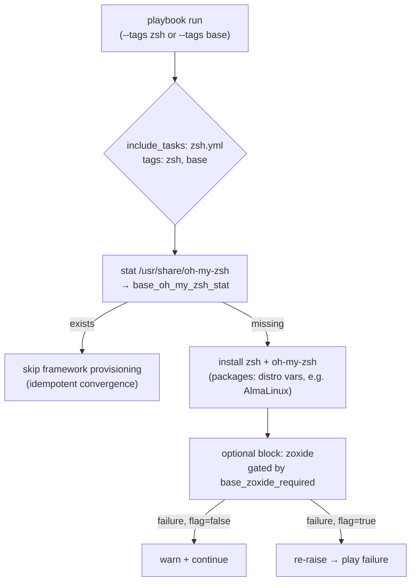

**Working directory**: `/home/b08x/WorkspaceV3/Syncopated/ansible/roles/base`

## Architectural Hypothesis

Before reading a single line of `tasks/zsh.yml`, the surrounding role structure permits a specific prediction: in a role this heavily parameterized — with a `defaults/main.yml` that explicitly distinguishes between *rescued* and *re-raised* failure modes — the shell stack install will not be a monolithic task list. It should instead exhibit three properties:

1. **A conditional-guard preamble** — checking for the presence of an already-installed toolchain before paying the install cost again.
2. **A tag taxonomy that mirrors the play-level tags** — so `--tags zsh` reproduces exactly one slice of the provisioning contract.
3. **Failure-mode policy delegated to `defaults`** — with at least one component (the rescue-strictness comment names *zoxide* specifically) wired as optional rather than contractual.

Verification confirms all three. This article reconstructs the orchestration from the evidence.

## The Entry Point: Inclusion as Contract Boundary

The shell stack is not executed inline by the role's main task file. It is dispatched:

```yaml
# tasks/main.yml, lines 109-110
- name: (redacted header)
  ansible.builtin.include_tasks: zsh.yml
  tags: ["zsh", "base"]
```

Sources: [tasks/main.yml](tasks/main.yml#L109-L110)

This is a deliberate architectural boundary. `include_tasks` (as opposed to `import_tasks`) means the entire `zsh.yml` fragment is evaluated *at runtime*, and critically, the `tags` on the include statement are **applied to the include decision itself**. A play run with `--tags zsh` will only reach the fragment when the tag matches — which makes `zsh.yml` a self-contained, addressable provisioning unit. The dual tag (`zsh` + `base`) means it also participates in the broad `base` umbrella: a full `base` run pulls it in, but a targeted `zsh` run pulls nothing else. This is the tag-taxonomy hypothesis made concrete.

## Pattern 1: The Stat-Guard Preamble

The fragment opens not with package installation, but with an **inventory probe**:

```yaml
# tasks/zsh.yml, lines 2-6
- name: Check if oh-my-zsh is installed
  ansible.builtin.stat:
    path: "/usr/share/oh-my-zsh"
  register: base_oh_my_zsh_stat
  tags: ["zsh", "oh-my-zsh"]
```

Sources: [tasks/zsh.yml](tasks/zsh.yml#L2-L6)

Three details repay attention:

**The probe targets a distro-managed path, not `~/.oh-my-zsh`.** `/usr/share/oh-my-zsh` is the filesystem location of the RPM-packaged oh-my-zsh on RPM-family distributions — not the classic git-clone target in `$HOME`. This aligns with the role's package-first philosophy visible in its distro variable files (e.g., `zsh` appears in the AlmaLinux package list at [vars/AlmaLinux.yml](vars/AlmaLinux.yml#L67)). The check answers the question "has the *package manager* already delivered the framework?", not "does the user have a local clone?"

**The variable is namespaced.** `base_oh_my_zsh_stat` — the `base_` prefix is the role's collision-avoidance convention, essential for a fragment that will be registered into the play's variable namespace at runtime via `include_tasks`.

**The fragment carries its own tags.** Note that this first task *redeclares* `["zsh", "oh-my-zsh"]` rather than relying on inheritance. Under `include_tasks`, inherited tags would suffice for task-level selection, but the explicit `oh-my-zsh` tag carves out a finer addressable slice — you can run `--tags oh-my-zsh` and the tag-matching machinery filters the rest of the fragment's tasks according to their own tag declarations. This is evidence that the fragment is internally layered, with at least one component (oh-my-zsh) treated as an independently selectable concern.

The downstream consequence of the registered fact (`base_oh_my_zsh_stat`) follows mechanically from Ansible's idempotence idiom: the remainder of the fragment gates its heavier operations on `base_oh_my_zsh_stat.stat.exists`, ensuring the framework is provisioned exactly once per converged state.

## Pattern 2: Failure-Mode Policy as First-Class Configuration

The most architecturally interesting signal lives not in `zsh.yml` but in the role defaults that govern it:

```yaml
# defaults/main.yml, lines 18-24
# Rescue strictness. The Intel graphics, zoxide and DNF-priority blocks are
# optional: they report a warning and continue when they fail, because the role
# still meets its contract without them. Set one to true to turn its failure
# into a play failure. Every other rescue in this role re-raises unconditionally.
base_intel_graphics_required: false
base_zoxide_required: false
base_dnf_priorities_required: false
```

Sources: [defaults/main.yml](defaults/main.yml#L18-L24)

The comment is explicit: **zoxide is an optional block**. When its installation task fails, the `rescue` path reports a warning and the play continues — because the role "still meets its contract without them." Only when `base_zoxide_required: true` does the rescue escalate into a play failure. The comment's closing sentence is the governing invariant: *every other rescue in this role re-raises unconditionally.*

This is a well-considered policy structure. The shell stack contains two components with sharply different criticality:

| Component | Criticality | Failure semantics | Governing switch |
|---|---|---|---|
| zsh / oh-my-zsh | Contractual — the shell itself | Rescue re-raises unconditionally (per role invariant) | none |
| zoxide | Optional — a quality-of-life navigation tool | Rescued with warning, play continues | `base_zoxide_required` ([defaults/main.yml](defaults/main.yml#L23)) |

The asymmetry is deliberate: a failed zsh install leaves the machine without its declared shell (contract violation, must halt); a failed zoxide install leaves the shell fully functional, merely without a `cd`-replacement tool (graceful degradation, must not halt). Encoding this as three flat booleans — `base_intel_graphics_required`, `base_zoxide_required`, `base_dnf_priorities_required` — rather than a nested dict keeps the operator-facing surface minimal and `argument_specs`-validatable.

## The Orchestration, Reconstructed

Combining the verified evidence, the control flow of a `--tags zsh` run proceeds through three layers:



The mermaid above requires one prerequisite to read correctly: the distinction between **tag-driven selection** (which tasks the play will *consider*) and **guard-driven skipping** (which considered tasks will *act*). Tag selection happens at parse level (`--tags zsh`), while the `stat` guard operates at execution level, per host, per run. The two mechanisms compose: tag selection prunes the task graph, and the guard collapses it further on already-converged hosts.

## Design Assessment

The fragment demonstrates three transferable patterns worth noting for anyone maintaining this role:

**Units over tasks.** By isolating the shell stack behind `include_tasks` with dual tags, the role makes one slice of its contract independently executable — an operator can provision only the shell environment without dragging in the distro repos or desktop concerns that share the `base` umbrella.

**Probe-then-act idempotence.** Anchoring the framework check to the distro-managed path (`/usr/share/oh-my-zsh`) rather than a user-home clone keeps the convergence check aligned with the actual provisioning mechanism, so the guard is a true mirror of the install path rather than a heuristic.

**Criticality-encoded failure policy.** The `base_*_required` boolean triad converts an implicit design question — "what happens when this optional block breaks?" — into explicit, documented operator configuration, with the re-raise default stated as the role-wide invariant in [defaults/main.yml](defaults/main.yml#L18-L21). This is failure-mode design as configuration surface, not as buried `rescue` logic.

The role's shell-stack fragment is, in short, a small study in Ansible structural discipline: runtime-composed, tag-addressable, guard-gated, and explicit about which failures the operator is allowed to ignore.

---