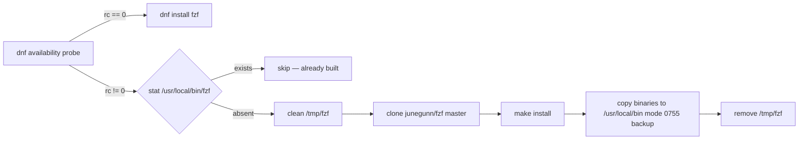
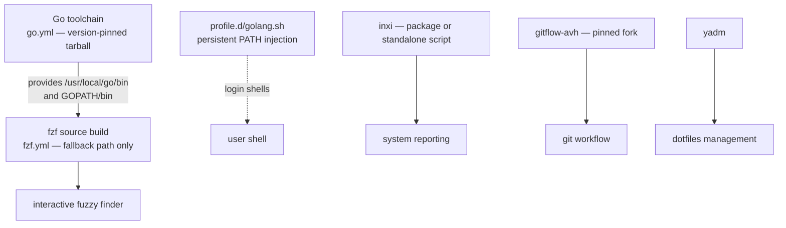

## Architectural Hypothesis

Before reading a single line of implementation, the structure of this role suggests a clear design contract: every optional tool follows a **provision — verify — degrade gracefully** pipeline. The hypothesis is that each tool is isolated behind its own tagged task file (so it can be selected or skipped with `--tags`), and that installation strategy is *detection-first*: probe the system, then choose between the distro package, a source build, or a scripted fallback rather than committing to one path. The files confirm this: [tasks/fzf.yml](tasks/fzf.yml#L1-L15) probes dnf availability before acting, [tasks/inxi.yml](tasks/inxi.yml#L7-L18) stats the binary before a package install, and [tasks/go.yml](tasks/go.yml#L1-L12) parses the installed Go version before downloading anything.

The five tools form a coherent layer of a developer workstation:

| Tool | Role category | Install strategy | Idempotence mechanism |
|------|--------------|------------------|----------------------|
| fzf | Interactive fuzzy finder | dnf package → source build fallback | dnf availability probe + `stat` on `/usr/local/bin/fzf` |
| inxi | Hardware/system reporting | package → standalone script rescue | `stat /usr/local/bin/inxi` probe |
| gitflow | Git branching workflow (AVH fork) | source build from a pinned fork | `stat /usr/local/bin/git-flow` probe |
| Go | Toolchain (prerequisite for other builds) | versioned tarball from go.dev | `go version` output compared against `base_go_version` |
| yadm | Dotfiles management | see [tasks/yadm.yml](tasks/yadm.yml) | task-file isolation |

## The Tag System as a Composition Interface

Every task block in these files carries dual tags — the tool name plus `base` — e.g. `tags: ["fzf", "base"]` in [tasks/fzf.yml](tasks/fzf.yml#L8), `tags: ["inxi", "base"]` in [tasks/inxi.yml](tasks/inxi.yml#L5), and `tags: ["go", "base"]` in [tasks/go.yml](tasks/go.yml#L6). This means you can either provision the full workstation role (`base`) or surgically re-run a single tool (`--tags fzf`), and — critically — skip a tool entirely without editing the role. The tools are *composition units*, not monolithic steps.

## fzf: Package-First, Source-Build Fallback

The fzf pipeline is the most elaborate detection cascade in this set. It begins with a non-destructive dnf query — `dnf --quiet list --available fzf` with `changed_when: false` and `failed_when: false` — whose return code becomes the branching signal ([tasks/fzf.yml](tasks/fzf.yml#L2-L8)). If the package exists, a plain `dnf` install runs ([tasks/fzf.yml](tasks/fzf.yml#L10-L15)). Only when the package is *absent from the repository set* does the role escalate to a full source build.

That fallback deserves attention because it demonstrates deliberate **environment hygiene**: the build block injects a `PATH` that includes the user's local bins, cargo, and the system Go installation ([tasks/fzf.yml](tasks/fzf.yml#L29-L36)) — necessary because the fzf Makefile shells out to Go. The block then performs a clean-state pattern that recurs throughout this role:

The `backup: true` on the copy step ([tasks/fzf.yml](tasks/fzf.yml#L56-L62)) is a subtle safety property: re-running the source build won't silently clobber an existing binary without leaving a recovery path.

## inxi: The Canonical Rescue Pattern

inxi's task file is the shortest, yet it exemplifies the role's documented two-shape fallback doctrine. The main block probes for `/usr/local/bin/inxi` with a `stat` command registered with `changed_when: false` and `ignore_errors: true` ([tasks/inxi.yml](tasks/inxi.yml#L7-L12)), then installs via the generic `package` module only when the probe fails ([tasks/inxi.yml](tasks/inxi.yml#L14-L18)). The **rescue block** exists for a real-world reason stated directly in the source comments: *"inxi is absent from some repository sets"* — so on failure, the role satisfies the same contract (a working `inxi` at `/usr/local/bin/inxi`) by downloading the standalone script from Codeberg with mode `0755` and root ownership ([tasks/inxi.yml](tasks/inxi.yml#L20-L31)).

This is worth contrasting with fzf's fallback: fzf branches *predictively* on repository availability, while inxi uses Ansible's `block/rescue` *reactively*. Both converge on the same outcome — an installed tool — but the choice reflects tool-specific uncertainty: fzf's availability is knowable up front via dnf; inxi's failure mode only manifests during the install task itself.

## gitflow: Opinionated Source Deployment

gitflow is the one tool that never attempts a package install. It checks for `/usr/local/bin/git-flow` ([tasks/gitflow.yml](tasks/gitflow.yml#L2-L6)), and if absent, clones the **gitflow-avh** fork — notably from the author's own repository `https://github.com/b08x/gitflow-avh.git` at the `develop` branch ([tasks/gitflow.yml](tasks/gitflow.yml#L15-L22)) — with `become: false` on the clone (no privilege escalation needed for a temp-directory clone) and `make install` as root for the deployment ([tasks/gitflow.yml](tasks/gitflow.yml#L24-L27)). The clean-state / clone / install / cleanup sequence mirrors fzf's fallback exactly, confirming that the role standardizes this build block as a reusable idiom.

The choice of a *personal fork at `develop`* signals intent: this is a curated, maintained variant rather than the upstream release, a deliberate dependency decision worth knowing before you inherit it.

## Go: Version-Pinned Toolchain as Infrastructure

Go's task file differs in kind — it is not merely an optional tool but the **prerequisite layer** that the fzf source build depends on (that's why `/usr/local/go/bin` appears in fzf's injected `PATH`). Its idempotence check is the most precise in the role: run `/usr/local/go/bin/go version`, and reinstall only if the command fails *or* the exact pinned version string — `'go' ~ base_go_version ~ ' '` — is missing from the output ([tasks/go.yml](tasks/go.yml#L1-L12)). The trailing-space match prevents `go1.27.1` from matching `go1.27.10`-style prefixes.

The version itself is a role default, `base_go_version: 1.27.1` ([defaults/main.yml](defaults/main.yml#L8)), so upgrades are a one-line override. The install flow is download → remove `/usr/local/go` → extract ([tasks/go.yml](tasks/go.yml#L14-L29)) — the removal step exists because Go's tarball nests its own top-level directory and refuses to overwrite cleanly. Environment configuration lands in `/etc/profile.d/golang.sh`, extending `PATH` with both the toolchain bin and `$(go env GOPATH)/bin` ([tasks/go.yml](tasks/go.yml#L31-L39)), which is exactly the `GOPATH` entry fzf's build environment re-injects explicitly.

## yadm

Dotfile management via yadm lives in [tasks/yadm.yml](tasks/yadm.yml), following the same tagged, isolated-task-file convention as the other tools in this layer. Because it is referenced by the same include chain that wires the rest of the tooling, it participates in the identical `--tags` / skip contract — treat it as the fifth peer in the composition, not an afterthought.

## How the Layer Fits Together

The dependency edge between Go and fzf is the architecturally interesting part of this layer:

Every fallback path terminates at `/usr/local/bin`, a location that survives dnf-managed file lists and serves as the role's de facto "locally-managed tools" namespace. The consistency across fzf, inxi, and gitflow — same destination, same `0755` mode, same clean-state clone pattern — is the strongest evidence that these task files were designed as a family rather than accreted independently. For the broader role contract, including which rescue failures are configurable via [defaults/main.yml](defaults/main.yml#L18-L25), see the [Role Variables](variables) page.