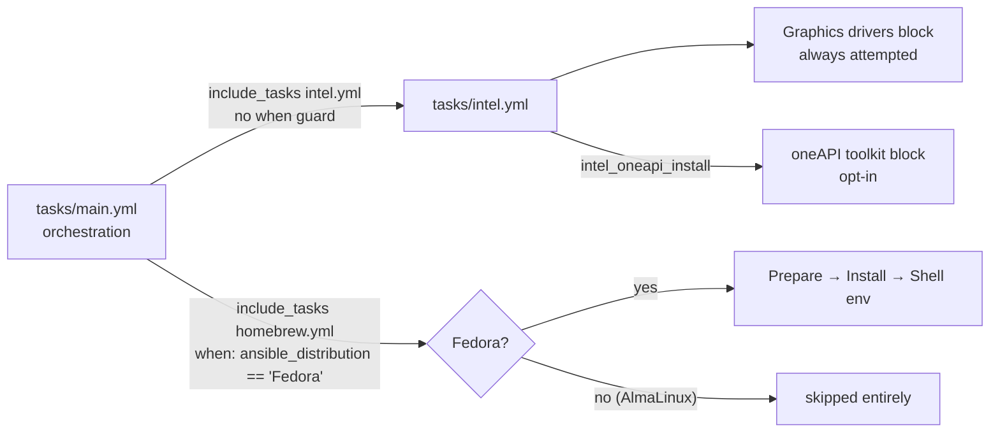
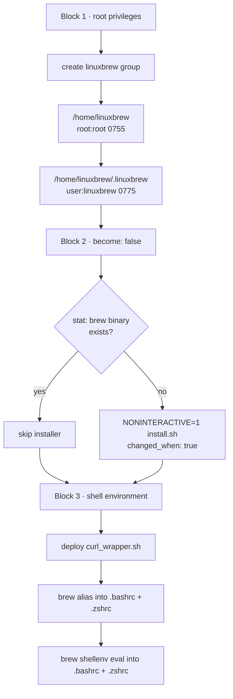
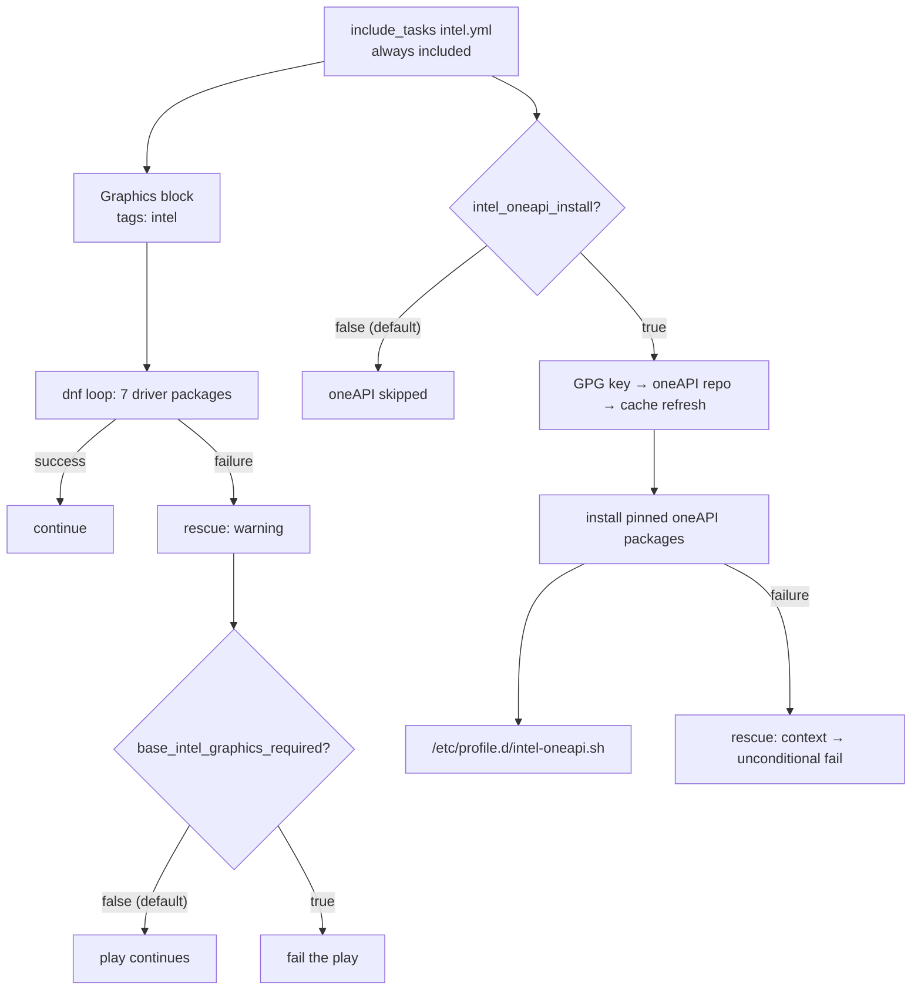

This page documents the two auxiliary installation paths that sit at the edges of the base role's toolchain: **Homebrew on Linux (Linuxbrew)**, a user-space package manager layered alongside DNF, and **Intel hardware support**, which spans graphics drivers and the opt-in oneAPI toolkit. Both are wired in as `include_tasks` branches from the orchestration entry point, but they were built under opposite assumptions — Homebrew is platform-gated and privilege-partitioned, while the Intel tasks are always attempted and manage their own failure semantics internally.

## Wiring and Gating: Two Different Inclusion Contracts

The two subsystems enter the role's execution flow with deliberately different conditions. The Intel tasks are included **unconditionally** — no `when` guard at all — while Homebrew is included only when `ansible_distribution == 'Fedora'`, which excludes AlmaLinux hosts entirely. The asymmetry is architectural rather than accidental: [tasks/intel.yml](tasks/intel.yml#L18-L31) is internally defensive (its rescue path explicitly anticipates non-Intel hardware), whereas [tasks/homebrew.yml](tasks/homebrew.yml#L2-L24) assumes Fedora semantics and has no self-defense, so the platform gate lives at the include site instead.

The unconditional Intel inclusion is safe precisely because its graphics block degrades gracefully — the rescue message states *"Expected on non-Intel hardware"*. Homebrew, by contrast, creates system-level directories and groups and would fail confusingly on a distro it was never designed for, so it is fenced off upstream. For the full execution order around these includes, see [Task Orchestration: How tasks/main.yml Wires Everything](12-task-orchestration-how-tasks-main-yml-wires-everything) and the platform matrix in [Supported Platforms: Fedora and AlmaLinux Targets](4-supported-platforms-fedora-and-almalinux-targets).

Sources: [tasks/main.yml](tasks/main.yml#L82-L84), [tasks/main.yml](tasks/main.yml#L103-L106), [tasks/intel.yml](tasks/intel.yml#L22-L26)

## Homebrew: A Three-Phase User-Space Bootstrap

[tasks/homebrew.yml](tasks/homebrew.yml#L2-L24) divides installation into three tagged blocks (all `tags: ["homebrew", "base"]`), each running under a different privilege model — a structure that mirrors Homebrew's own official deployment conventions, where root prepares the prefix and the target user runs the installer.

**Phase 1 — Prefix preparation (root privilege).** The first block builds the standard Linuxbrew directory hierarchy: a `linuxbrew` group, `/home/linuxbrew` owned by `root:root` at mode `0755`, and the actual prefix `/home/linuxbrew/.linuxbrew` owned by the target user but group-writable by `linuxbrew` at mode `0775`. This ownership split is what allows Homebrew's installer — which will run unprivileged in Phase 2 — to populate the prefix.

**Phase 2 — Installer execution (user privilege).** The second block sets `become: false` and implements the role's canonical installer idempotency guard: an `ansible.builtin.stat` check on `/home/linuxbrew/.linuxbrew/bin/brew` registers `base_brew_stat`, and the official installer runs with `NONINTERACTIVE=1` only `when: not base_brew_stat.stat.exists`. The task also declares `changed_when: true`, forcing a "changed" report every time the shell installer actually executes — an honest signal, since the `shell` module cannot infer state change. The same stat-guard pattern appears across the role's download-and-run installers; it is analyzed in depth in [Idempotency: stat Checks and creates Guards for Installers](16-idempotency-stat-checks-and-creates-guards-for-installers).

| Phase | Lines | Privilege model | Key operations | Artifacts produced |
|---|---|---|---|---|
| 1 — Prefix preparation | [L2–L24](tasks/homebrew.yml#L2-L24) | Play default (root) | Create `linuxbrew` group; `/home/linuxbrew` (`root:root`, 0755); prefix (`user.name:linuxbrew`, 0775) | Directory skeleton |
| 2 — Installer execution | [L26–L39](tasks/homebrew.yml#L26-L39) | `become: false` (connect user) | `stat` guard → conditional `NONINTERACTIVE=1` installer | `/home/linuxbrew/.linuxbrew/bin/brew` |
| 3 — Shell integration | [L41–L83](tasks/homebrew.yml#L41-L83) | Play default (root) | Deploy curl wrapper; inject alias + `shellenv` into RC files | `curl_wrapper.sh`, `.bashrc`/`.zshrc` lines |

Sources: [tasks/homebrew.yml](tasks/homebrew.yml#L2-L24), [tasks/homebrew.yml](tasks/homebrew.yml#L26-L39), [tasks/homebrew.yml](tasks/homebrew.yml#L30-L39)

## Phase 3 Artifacts and the Resource-Limited `brew` Alias

The third block writes three artifacts into the user's home directory. First, a `curl_wrapper.sh` script that wraps `/usr/bin/curl` with `--connect-timeout 15 --max-time 60`, documented in-file as a fix for GNU mirror hangs during Homebrew operations. Second, an alias injected into both `.bashrc` and `.zshrc` — guarded by the regexp `^alias brew=` so re-runs replace rather than duplicate the line. Third, the environment bootstrap line `eval "$(/home/linuxbrew/.linuxbrew/bin/brew shellenv)"`, appended to the same two RC files with `create: true`, so the files exist even if the target shell has not yet been installed.

The alias is the most opinionated line in the file. It composes four isolation mechanisms into a single command:

| Component | Value | Effect |
|---|---|---|
| `HOMEBREW_CURL_PATH` | user's `curl_wrapper.sh` | Routes all brew fetches through the timeout-guarded curl |
| `nice` | `-n 19` | Lowest CPU scheduling priority |
| `ionice` | `-c 3` | Idle I/O class — yields to every other workload |
| `taskset` | `-c 0-3` | Pins brew to the first four CPU cores only |

Together these treat `brew` as a background-grade workload on a developer workstation: even a large formula build cannot saturate the CPU, starve interactive I/O, or wander onto the higher cores. Every path in Phase 3 also demonstrates the role's defensive variable pattern — `user.home | default('/home/' + user.name)` — necessary because the `user` dictionary is supplied entirely by the calling playbook; the role defines no `user` variable of its own anywhere in `defaults/` or `vars/`.

Sources: [tasks/homebrew.yml](tasks/homebrew.yml#L44-L54), [tasks/homebrew.yml](tasks/homebrew.yml#L56-L68), [tasks/homebrew.yml](tasks/homebrew.yml#L70-L83)

## Intel: One Include, Two Opposite Failure Contracts

[tasks/intel.yml](tasks/intel.yml#L2-L31) contains two blocks with opposite failure philosophies — the clearest illustration in the role of how failure shape should match intent.

**Intel Graphics Drivers — soft-fail by default.** The first block loops a DNF install over seven packages: `intel-audio-firmware`, `intel-gmmlib`, `intel-gpu-firmware`, `intel-media-driver`, `intel-vpl-gpu-rt`, `intel-vsc-firmware`, and `libva-intel-driver` — the firmware, media-acceleration, and VA-API driver stack for Intel GPUs. It carries only the `intel` tag, and its rescue is annotated in-source as **"Shape 3 (optional)"**: it emits a warning explaining that failure is expected on non-Intel hardware, then re-raises only when the operator has set `base_intel_graphics_required: true`. That flag is one of three rescue-strictness switches declared together in `defaults/main.yml`, all defaulting to `false`.

**Intel oneAPI Toolkit — opt-in, then hard-fail.** The second block is gated entirely behind `intel_oneapi_install | default(false) | bool`. Notably, this variable has **no entry in `defaults/main.yml`** and none in `meta/argument_specs.yml` (which documents only `base_my_variable`) — its default is applied inline at the task level, making it a purely per-host opt-in that is invisible to role-level argument validation. It also carries a distinct tag (`intel_oneapi` rather than `intel`), so the heavy toolkit can be targeted independently of the driver block.

| Dimension | Graphics drivers | oneAPI toolkit |
|---|---|---|
| Activation | Always (unconditional include) | `intel_oneapi_install \| default(false)` inline |
| Tag | `intel` | `intel_oneapi` |
| On failure (default) | Warning; play continues | Context message, then unconditional fail |
| Escalation knob | `base_intel_graphics_required` (role default) | None — always hard-fails |
| In-source rescue label | "Shape 3 (optional)" | "Shape 1 (add context, then re-raise)" |

Sources: [tasks/intel.yml](tasks/intel.yml#L2-L31), [tasks/intel.yml](tasks/intel.yml#L33-L35), [defaults/main.yml](defaults/main.yml#L18-L24), [meta/argument_specs.yml](meta/argument_specs.yml#L7-L12)

## The oneAPI Repository Bootstrap and Pinned Manifest

Once enabled, the oneAPI block performs a complete third-party repository onboarding in four ordered steps: import the Intel product GPG key via `rpm_key` with `validate_certs: true`; declare a `yum_repository` named `oneAPI` pointing at `https://yum.repos.intel.com/oneapi` with `gpgcheck: true` and the same key URL; immediately run `dnf update_cache` so the freshly added repo is usable without waiting for a metadata timer (the broader cache-refresh strategy is covered in [Metadata Cache Refresh Strategy and Change Detection](11-metadata-cache-refresh-strategy-and-change-detection)); and only then install packages.

The install task is a 57-entry DNF loop — 56 unique package names, since `intel-oneapi-runtime-dpcpp-sycl-core` appears twice (harmless to DNF, but a telltale of a hand-assembled list). The manifest is heavily version-pinned, dominated by `2026.1` compilers, MKL (classic and SYCL variants), and runtimes, with outliers pinned to `2025.3`, `2026.0`, `2023.1` (TBB), `2022.13` (`libdpstd-devel`), `1.5` (TCM), and `1.1` (UMF), plus five unpinned alias names. This pinning is functionally significant: the block's own rescue comment identifies *the pinned package versions* as the usual cause of failure when Intel rotates its repository — a self-documenting maintenance warning baked into the task file.

The block concludes by deploying `/etc/profile.d/intel-oneapi.sh`, a root-owned `0755` login script that sources `/opt/intel/oneapi/setvars.sh --force` with output suppressed. This is the system-wide counterpart to Homebrew's per-user RC-file integration from Phase 3: one makes the toolchain available to every login shell on the machine, the other only to the managed user. On any failure, the rescue re-raises unconditionally — because the operator explicitly set `intel_oneapi_install`, exiting green would contradict the request. The full taxonomy behind these "shape" annotations is developed in [Failure Shape Patterns: Context, Re-Raise, and Soft-Fail (base_zoxide_required)](17-failure-shape-patterns-context-re-raise-and-soft-fail-base_zoxide_required).

Sources: [tasks/intel.yml](tasks/intel.yml#L37-L54), [tasks/intel.yml](tasks/intel.yml#L56-L117), [tasks/intel.yml](tasks/intel.yml#L107-L108), [tasks/intel.yml](tasks/intel.yml#L119-L147)

## Variable Surface and Design Synthesis

Only three variables govern these two subsystems, and each lives at a different scope:

| Variable | Defined in | Default | Controls |
|---|---|---|---|
| `user` (dict: `name`, `home`) | Calling playbook/inventory only | none within the role | Homebrew prefix ownership, wrapper and RC file destinations |
| `base_intel_graphics_required` | [defaults/main.yml](defaults/main.yml#L22) | `false` | Escalates the graphics rescue from warning to play failure |
| `intel_oneapi_install` | Inline only, [tasks/intel.yml](tasks/intel.yml#L34) | `false` via `\| default(false)` | Gates the entire oneAPI block; hard-fails on error |

Three design principles emerge from this pair of files. **First, failure shape tracks intent**: an always-on block degrades gracefully on inapplicable hardware (graphics), an opt-in block fails loudly when its explicit request cannot be honored (oneAPI), and Homebrew — which has no rescue at all — lets any failure propagate raw, on the theory that a broken prefix is never a state the role can meaningfully continue from. **Second, privilege separation follows Homebrew's own model**: root prepares the prefix, the connecting user runs the installer, and root then integrates the shell environment. **Third, defaults live at different altitudes by design**: role-level toggles belong in `defaults/main.yml`, while genuinely per-host decisions like oneAPI are inlined at the point of use — a trade-off explored further in [Input Validation with argument_specs.yml](6-input-validation-with-argument_specs-yml) and [Defaults and Overridable Variables (defaults/main.yml)](5-defaults-and-overridable-variables-defaults-main-yml).

For how these two files sit among the role's other optional tool installers, continue to [Optional Tooling: fzf, inxi, gitflow, Go, and yadm](14-optional-tooling-fzf-inxi-gitflow-go-and-yadm); for the reliability patterns their rescue blocks exemplify, see [Idempotency: stat Checks and creates Guards for Installers](16-idempotency-stat-checks-and-creates-guards-for-installers) and [Failure Shape Patterns: Context, Re-Raise, and Soft-Fail (base_zoxide_required)](17-failure-shape-patterns-context-re-raise-and-soft-fail-base_zoxide_required).