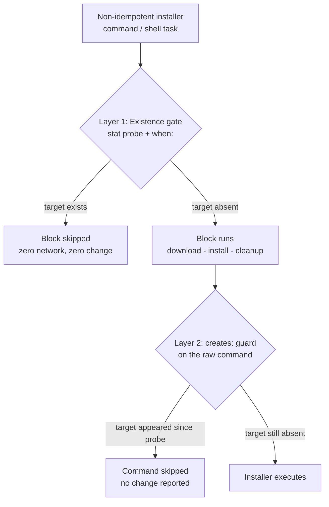
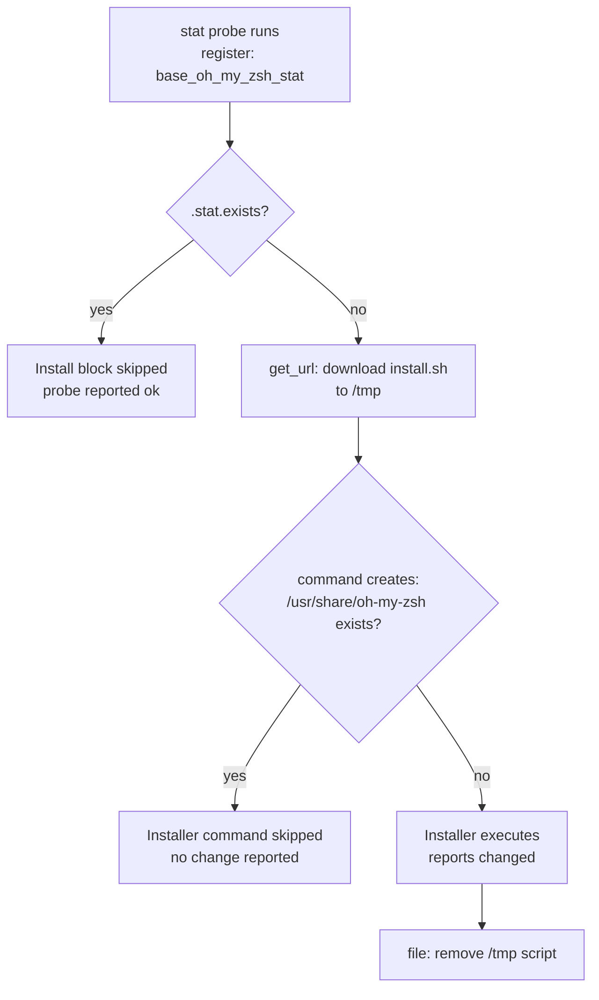

This page explains how `b08x.devworkstation.base` keeps its installer tasks idempotent — the property that running the role a second time produces no changes. Ansible's built-in modules (dnf, copy, get_url) are idempotent by design, but the toolchain tasks rely on raw `command` and `shell` installers that are not. The role tames them with three cooperating mechanisms: **existence gates** (`ansible.builtin.stat` feeding a `when:` condition), **per-task guards** (`creates:` on the raw command), and **probe hygiene** (`changed_when: false` so read-only checks never dirty the change report). All the code below lives under `tasks/`.

## Why Raw Installers Break the Run-Twice Contract

A curl-piped installer, a `make install`, or a shell script downloaded and executed is a black box to Ansible: it always reports `changed`, and re-running it may re-download, rebuild, or even corrupt an existing installation. The role's answer is architectural: every non-idempotent operation is wrapped in a two-layer defense. Layer 1 decides *whether the whole block should run at all*, usually by checking whether the tool's binary or install directory already exists. Layer 2 sits directly on the raw command as a `creates:` path check — a last line of defense that suppresses execution if the target appeared between the probe and the command.



The role consistently reports a skipped probe task as *ok*, never as *changed* — because every probe command is explicitly marked read-only. The next sections walk through each layer with the actual task files.

Sources: [tasks/zsh.yml](tasks/zsh.yml#L2-L28), [tasks/gitflow.yml](tasks/gitflow.yml#L2-L35)

## The Two-Layer Gate: stat Probe plus when Block

The reference implementation is the Oh-My-Zsh stack in `tasks/zsh.yml`. First a `stat` task probes `/usr/share/oh-my-zsh` and registers the result as `base_oh_my_zsh_stat`:

```yaml
- name: Check if oh-my-zsh is installed
  ansible.builtin.stat:
    path: "/usr/share/oh-my-zsh"
  register: base_oh_my_zsh_stat
```

Then the entire installation block is gated with `when: not base_oh_my_zsh_stat.stat.exists`. Inside the block, the raw installer command carries its own `creates: "/usr/share/oh-my-zsh"`, so even if the block is somehow entered while the directory exists, `ansible.builtin.command` will skip itself and report no change. The `stat` gate is the *cost* gate — it prevents even downloading the install script to `/tmp` on repeat runs — while `creates:` is the *safety* gate. The block also cleans up the downloaded script afterward, keeping `/tmp` free of stale artifacts.

Sources: [tasks/zsh.yml](tasks/zsh.yml#L2-L6), [tasks/zsh.yml](tasks/zsh.yml#L8-L28)

The zoxide block in the same file applies the identical shape at **user scope**: the probe path is `{{ ansible_user_dir }}/.local/bin/zoxide`, the block runs with `become: false`, and the command's `creates:` points at the same user-local binary. Same pattern, different privilege boundary — the gate expression is copied verbatim from the oh-my-zsh case, which makes the convention easy to extend to new tools.

Sources: [tasks/zsh.yml](tasks/zsh.yml#L35-L56), [defaults/main.yml](defaults/main.yml#L21-L25)

The full inventory of existence gates in the role shows both consistent and divergent applications:

| Tool | Probe | Register | Gate expression | Inner guard |
|---|---|---|---|---|
| oh-my-zsh | `stat` on `/usr/share/oh-my-zsh` | `base_oh_my_zsh_stat` | `not .stat.exists` | `creates:` on the install script |
| zoxide | `stat` on `~/.local/bin/zoxide` | `base_zoxide_stat` | `not .stat.exists` | `creates:` on the install script |
| gitflow | `stat` on `/usr/local/bin/git-flow` | `base_gitflow_bin` | `not .stat.exists` | none — block gate only |
| Homebrew | `stat` on `~/.linuxbrew/bin/brew`-prefix binary | `base_brew_stat` | `not .stat.exists` | `changed_when: true` (explicit change report) |
| fzf (source path) | `stat` on `/usr/local/bin/fzf` | `base_fzf_bin` | compound, see below | none — `make install` unguarded |

The divergences are instructive. gitflow's `make install` has no `creates:`, so within a single play run the block gate is the only protection — if the gate passes, `make install` executes unconditionally. Homebrew's installer manages an entire directory tree rather than a single file, so instead of a `creates:` guard the `shell` task declares `changed_when: true`, honestly reporting that a run of the installer is a change when it happens at all.

Sources: [tasks/zsh.yml](tasks/zsh.yml#L41-L56), [tasks/gitflow.yml](tasks/gitflow.yml#L2-L34), [tasks/homebrew.yml](tasks/homebrew.yml#L26-L39)

## What creates: Actually Guarantees

`creates:` is Ansible's built-in contract on `command`/`shell`/`script` tasks: if the named path exists at task start, the task is **skipped and reported as unchanged**. It answers the question "has this installer already produced its artifact?" for exactly one path. In the oh-my-zsh task the guard path and the probe path are deliberately the same directory:

```yaml
- name: Install oh-my-zsh
  ansible.builtin.command:
    cmd: "/tmp/oh-my-zsh-install.sh --unattended"
    creates: "/usr/share/oh-my-zsh"
```

This redundancy is intentional and cheap. The outer `stat` gate and the inner `creates:` check are evaluated microseconds apart in a healthy run, so layer 2 is nearly always a no-op — but it also makes the command task safe to reuse outside the block, and it protects against the pathological case where a previous partial run left the target behind but the play was interrupted before the block completed.



A prerequisite for reading this diagram: `register` in Ansible stores the stat module's result dictionary, and `.stat.exists` is the boolean the module computes for the probed path. The single-layer cases (gitflow, fzf source build) drop layer 2 entirely — they rely on the fact that `make install` from a fresh `/tmp` clone is deterministic, accepting the cost of a rebuild whenever the gate re-opens.

Sources: [tasks/zsh.yml](tasks/zsh.yml#L21-L28), [tasks/gitflow.yml](tasks/gitflow.yml#L9-L22)

## Probes That stat Cannot Express

A file-existence check answers only "is it there?" Three installer flows in this role need richer questions, so they replace the `stat` module with a **command probe** whose return code drives the gate.

The fzf task probes *repository capability*, not installation state. `dnf --quiet list --available fzf` runs first with both `changed_when: false` and `failed_when: false` — it is a pure question that must never fail the play. Its result *routes* execution: if `rc == 0` the package comes from dnf (idempotent module, no gate needed); if not, a second, conditionally-registered `stat` probe on `/usr/local/bin/fzf` decides whether the source build should run. This is a probe with a different job — choosing a mechanism rather than guarding one.

```yaml
when:
  - base_fzf_dnf_check.rc != 0
  - not base_fzf_bin.stat.exists | default(false)
```

The `| default(false)` is load-bearing: `base_fzf_bin` is only registered on the branch where the dnf check failed, so on the mirrored branch the variable is skipped/undefined, and the expression must tolerate that. Conditionally-registered variables always require a `default()` at consumption time — a subtle rule worth remembering when extending the role.

Sources: [tasks/fzf.yml](tasks/fzf.yml#L2-L8), [tasks/fzf.yml](tasks/fzf.yml#L16-L28)

The inxi task probes existence through the shell instead of the `stat` module: `stat /usr/local/bin/inxi` runs as a `command` with `changed_when: false` and `ignore_errors: true`, and the package install is gated on `base_inxi_check.rc != 0`. The `ignore_errors` matters because the probe *fails* (nonzero exit) precisely in the normal case where the binary is absent — that failure is the signal, not an error. The install sits inside a block with a `rescue` that downloads the standalone script from codeberg.org as a fallback; the failure-shape mechanics of that rescue are covered in [Failure Shape Patterns: Context, Re-Raise, and Soft-Fail (base_zoxide_required)](17-failure-shape-patterns-context-re-raise-and-soft-fail-base_zoxide_required).

Sources: [tasks/inxi.yml](tasks/inxi.yml#L5-L18), [tasks/inxi.yml](tasks/inxi.yml#L20-L32)

## Version-Aware Guards: the Go Reinstall Trigger

The Go task in `tasks/go.yml` uses the most sophisticated guard in the role, because the right question is not "is Go installed?" but "is the *correct version* of Go installed?". The probe runs `/usr/local/go/bin/go version` — read-only, tolerant of failure — and the gate is a compound expression:

```yaml
when: >
  base_go_version_check.rc != 0 or
  ('go' ~ base_go_version ~ ' ') not in base_go_version_check.stdout
```

The block re-opens when Go is either **absent** (`rc != 0`) or **present but not the pinned version** (the version string `go {{ base_go_version }}` with a trailing space is not found in the probe output, where `base_go_version` defaults to `1.27.1`). This distinction matters because the guarded block is *destructive*: it deletes `/usr/local/go` with `state: absent` before extracting the fresh tarball. Without the guard, the removal would run on every play — the guard is not just an optimization here, it is what makes a destructive sequence safe to include in a converged role. The accompanying `unarchive` over a freshly removed directory also avoids the failure you would get extracting over an existing tree.

Sources: [tasks/go.yml](tasks/go.yml#L1-L13), [tasks/go.yml](tasks/go.yml#L20-L28), [defaults/main.yml](defaults/main.yml#L5-L6)

Conceptually this splits idempotency into two properties: *convergence* (the target state exists) and *currency* (the target state matches the declared version). File-existence gates guarantee convergence only; the Go guard enforces both, at the price of re-running the full download-and-extract cycle whenever `base_go_version` is bumped.

## Probe Hygiene: Keeping Read-Only Commands Invisible

Every probe in the role carries flags that prevent it from polluting the run report. This is a discipline worth copying exactly: a probe that reports `changed` on a converged host breaks the "second run changes nothing" contract just as surely as a re-executing installer would.

| Flag | Effect on the task | Used for | Where |
|---|---|---|---|
| `changed_when: false` | Task can never report `changed` | All read-only probes | fzf dnf check, go version, inxi stat |
| `failed_when: false` | Nonzero exit does not fail the play | Probes whose failure is data | fzf availability, go version |
| `ignore_errors: true` | Failure recorded but play continues | Probe whose failure is the normal case | inxi existence check |
| `changed_when: true` | Raw command always reports `changed` when it runs | Honest reporting for uncheckable installers | Homebrew shell installer |

The Homebrew row is the inverse case: a `shell` task cannot express "did this change anything," so the role chooses to always report a change when the installer actually runs — conservative and truthful, since the installer runs at most once per host thanks to the `stat` gate.

Sources: [tasks/fzf.yml](tasks/fzf.yml#L2-L8), [tasks/inxi.yml](tasks/inxi.yml#L5-L12), [tasks/homebrew.yml](tasks/homebrew.yml#L35-L39)

## Choosing a Guard Mechanism: Pattern Comparison

When adding a new tool to the role (see [Adding a New Optional Tool: Task and Argument Spec Checklist](20-adding-a-new-optional-tool-task-and-argument-spec-checklist)), choose the lightest mechanism that answers the actual question:

| Mechanism | Answers | Cost | Risk if misapplied | Used by |
|---|---|---|---|---|
| Native module | "Is the state exact?" | None — built in | None | dnf packages, yadm via `get_url`, config `copy` tasks |
| `stat` + `when` gate | "Does the artifact exist?" | One cheap probe per run | Version drift invisible | oh-my-zsh, zoxide, gitflow, fzf, Homebrew |
| Command probe + `when` | "Does it exist / is it current / is it available?" | One process per run | Must silence `changed`/`failed` explicitly | go, fzf routing, inxi |
| `creates:` only | "Did this command already run?" | One filesystem check | Wrong if artifact path is wrong or user-scoped vs root mismatched | oh-my-zsh, zoxide inner guards |
| No guard | — | — | Re-execution every run | Correct only for idempotent modules (e.g. yadm's `get_url`, which skips on matching checksum) |

The yadm case is the minimal end of the spectrum: a single `get_url` task downloads the yadm script to `/usr/local/bin`, and because `get_url` compares checksums, the task is already idempotent — no gate is warranted. The Go case is the maximal end: existence, version, and a destructive re-install sequence.

Sources: [tasks/yadm.yml](tasks/yadm.yml#L2-L7), [tasks/go.yml](tasks/go.yml#L1-L13)

## Where These Guards Sit in the Run

The orchestrator in `tasks/main.yml` includes each installer task file with its own tag list, so a tagged run (`--tags go`) still executes the guard-probe pair for that tool and skips the installer if converged. Ordering is chosen so probes see realistic state — the fzf source path depends on a Go toolchain from `go.yml`, and the zsh stack runs after Homebrew. The full wiring, tag semantics, and include conditions are covered in [Task Orchestration: How tasks/main.yml Wires Everything](12-task-orchestration-how-tasks-main-yml-wires-everything); the related change-detection cascade that re-runs `dnf makecache` only when DNF config actually changed is covered in [Metadata Cache Refresh Strategy and Change Detection](11-metadata-cache-refresh-strategy-and-change-detection).

Sources: [tasks/main.yml](tasks/main.yml#L71-L100), [tasks/dnf.yml](tasks/dnf.yml#L37-L40)

## Summary

The role's idempotency strategy is a small, repeated architecture: **probe, gate, guard**. A read-only probe (`stat` module or a silenced `command`) answers a precise question — existence, version, or capability. A `when:` gate keeps the expensive or destructive block from running on a converged host. A `creates:` guard on the raw installer command catches the residue case inside the block. Flags like `changed_when: false` and `failed_when: false` keep the probes themselves invisible in the change report, and `| default(false)` keeps conditionally-registered variables safe to consume. When you extend the role, the two-layer gate on oh-my-zsh is the template to copy, the Go compound condition is the template for version pinning, and the guard/rescue pairing around zoxide shows how idempotency and failure shaping interlock — the natural next read is [Failure Shape Patterns: Context, Re-Raise, and Soft-Fail (base_zoxide_required)](17-failure-shape-patterns-context-re-raise-and-soft-fail-base_zoxide_required).