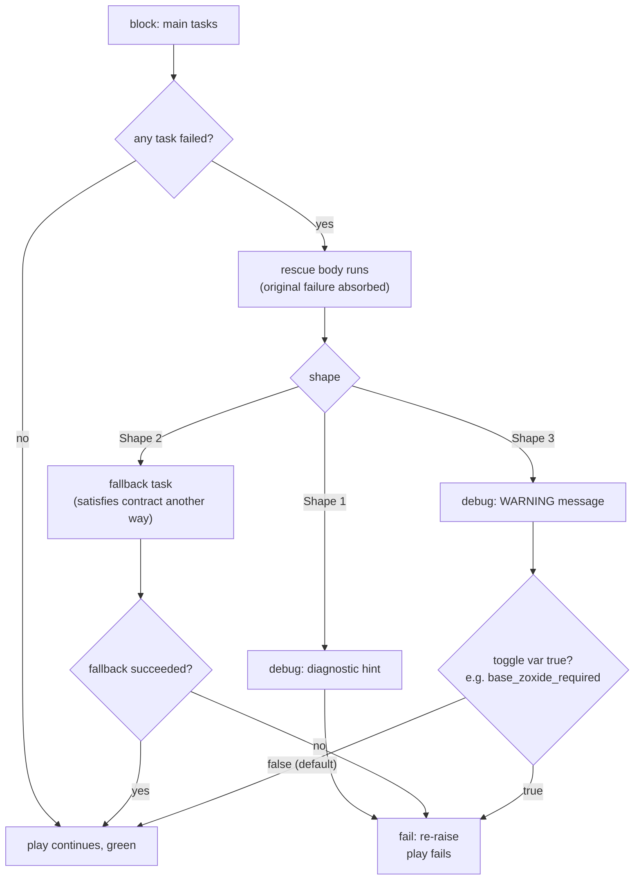
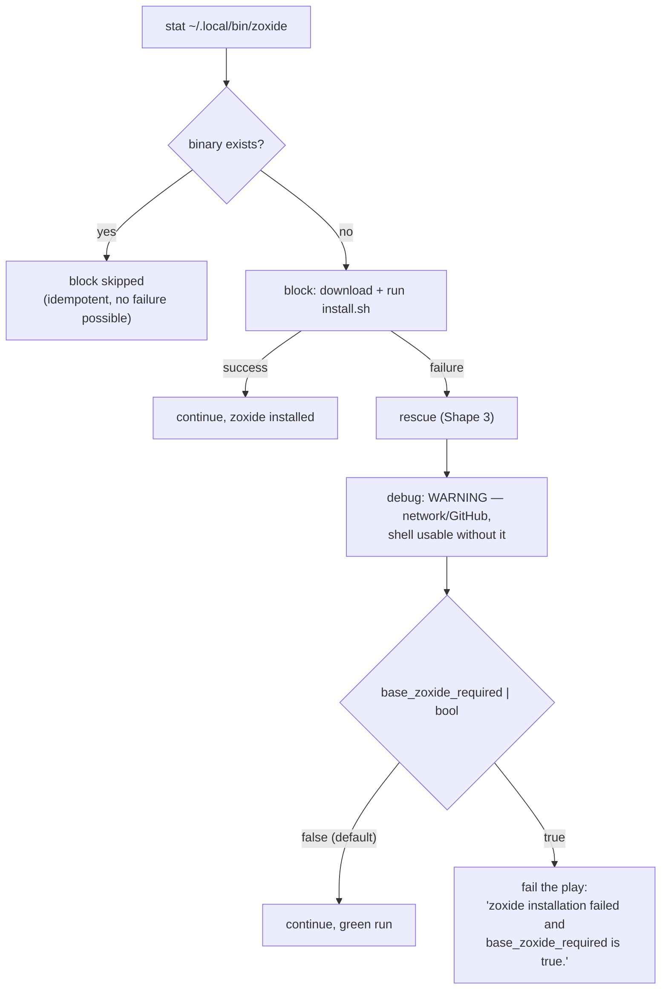

Every `block/rescue` pair in this role makes a deliberate choice about what should happen *after* an error is caught: re-raise it, absorb it with an alternative path, or soften it into a warning. This page documents the three failure shapes the role's authors labeled directly in the code comments — **Shape 1 (context, then re-raise)**, **Shape 2 (real fallback)**, and **Shape 3 (soft-fail with operator escalation)** — with the zoxide installation rescue in `tasks/zsh.yml` as the canonical Shape 3 example and its `base_zoxide_required` toggle as the escalation switch. By the end you will be able to read any rescue block in this role and know, from its shape alone, whether a red task means "the play will fail" or "the play will continue".

## Rescue Semantics: The Primitive Everything Builds On

Ansible's `block`/`rescue` construct has one property that dictates the entire design: **a rescue absorbs the original failure**. Once the rescue body starts executing, the failed task is no longer a play failure — if the rescue body completes without erroring, the host continues to the next task and the play exits green. This means an empty or trivially successful rescue turns any hard error into a silent skip, which is precisely the hazard these shapes are designed to manage. The role's authors therefore treat every rescue as a policy decision, documented in comments that name the shape and the reason for it.

The three shapes are distributed across the role as follows, each labeled in a comment at the top of its rescue body:

| Shape | Comment label | Rescue body | Default outcome | Where used |
|---|---|---|---|---|
| **1** | *"add context, then re-raise"* | `debug` diagnostic + unconditional `fail` | Play fails | Base packages, Fedora repos, AlmaLinux repos, oneAPI |
| **2** | *"real fallback"* | A replacement task satisfying the same contract | Play continues green | inxi |
| **3** | *"optional"* | `debug` warning + conditional `fail` on a toggle | Play continues green, unless toggle set | zoxide, Intel graphics, (DNF priorities — dormant) |

Sources: [tasks/main.yml](tasks/main.yml#L42-L54), [tasks/distro/Fedora.yml](tasks/distro/Fedora.yml#L55-L68), [tasks/inxi.yml](tasks/inxi.yml#L20-L31), [tasks/zsh.yml](tasks/zsh.yml#L62-L74)

The control flow that produces these outcomes is shared by all three shapes — only the content of the rescue box differs:

Sources: [tasks/main.yml](tasks/main.yml#L31-L54), [tasks/inxi.yml](tasks/inxi.yml#L4-L31), [tasks/zsh.yml](tasks/zsh.yml#L41-L74)

## Shape 1 — Add Context, Then Re-Raise (Core Contract)

Shape 1 rescues protect operations that are **part of what the role promises**. The base package install is the clearest case: the comment states that *"base packages are this role's core contract, so a failure must fail the play rather than report green"* [tasks/main.yml](tasks/main.yml#L43-L44). The rescue prints a diagnostic that would otherwise be buried — telling the operator to re-run with `-vv` and suggesting that a missing package usually means a repository in `tasks/distro/` was never enabled — and then immediately calls `ansible.builtin.fail` with no `when` condition, so the re-raise is unconditional [tasks/main.yml](tasks/main.yml#L45-L54).

The same shape guards the repository blocks on both supported distros, and the reasons cited are dependency-cascade arguments rather than mere preference. On Fedora, the comment explains that *"every later package task resolves against these repositories, so continuing here only relocates the failure somewhere less obvious"* — a soft-fail here would turn a clean, explainable repo error into a confusing package-resolution error thirty tasks later [tasks/distro/Fedora.yml](tasks/distro/Fedora.yml#L56-L58). On AlmaLinux, EPEL and CRB *"carry most of the base package set, so continuing guarantees a more confusing failure later"*, and RPM Fusion is similarly load-bearing because *"multimedia entries in base_packages resolve against RPM Fusion"* [tasks/distro/AlmaLinux.yml](tasks/distro/AlmaLinux.yml#L46-L47), [tasks/distro/AlmaLinux.yml](tasks/distro/AlmaLinux.yml#L89-L90).

A fourth Shape 1 instance covers the Intel oneAPI toolkit, with a subtler justification: the block is gated behind `intel_oneapi_install | default(false) | bool`, so it only runs when an operator explicitly requested it — *"exiting green contradicts an explicit request"* [tasks/intel.yml](tasks/intel.yml#L133-L136). The diagnostic here points at a different root cause, the pinned package versions versus `yum.repos.intel.com` availability, illustrating that Shape 1's context message is tailored to each block's most likely failure mode [tasks/intel.yml](tasks/intel.yml#L137-L146).

| Shape 1 site | Protects | Diagnostic hint offered |
|---|---|---|
| `tasks/main.yml` | `base_packages` install | Re-run with `-vv`; check `tasks/distro/` repo enablement |
| `tasks/distro/Fedora.yml` | RPM Fusion + COPR + priorities | Network/mirror reachability; `base_enable_rpmfusion=false` escape hatch |
| `tasks/distro/AlmaLinux.yml` | EPEL/CRB/RT/HA + RPM Fusion | Network/mirror reachability |
| `tasks/intel.yml` | oneAPI toolkit (opt-in) | Pinned versions vs. repo availability |

Sources: [tasks/main.yml](tasks/main.yml#L42-L54), [tasks/distro/Fedora.yml](tasks/distro/Fedora.yml#L55-L68), [tasks/distro/AlmaLinux.yml](tasks/distro/AlmaLinux.yml#L45-L56), [tasks/intel.yml](tasks/intel.yml#L133-L146)

## Shape 2 — Real Fallback (Contract Satisfied Another Way)

Shape 2 is the rarest pattern in the role and the only one where staying green is *correct*: the rescue does not suppress the failure but **satisfies the original contract through a different mechanism**. The inxi task is the sole instance. Its comment states the rationale plainly: *"inxi is absent from some repository sets, so the rescue satisfies the same contract by fetching the standalone script"* [tasks/inxi.yml](tasks/inxi.yml#L21-L22).

The mechanics are worth reading in full. The block first probes for an existing inxi with a `stat` command marked `ignore_errors: true` and `changed_when: false` — the probe itself is not allowed to trigger the rescue [tasks/inxi.yml](tasks/inxi.yml#L7-L12). Only the conditional `package: name=inxi` install can fail into the rescue, where a `get_url` downloads the standalone script from codeberg.org directly into `/usr/local/bin/inxi` with mode `0755` and a 60-second timeout [tasks/inxi.yml](tasks/inxi.yml#L23-L31). From the outside, the contract — "inxi exists on this host" — is honored either way.

Note the asymmetry with Shape 3: Shape 2's play-continues outcome is justified because the goal is still met, whereas Shape 3's play-continues outcome is justified because the goal was optional in the first place. Also note the implicit risk: if the fallback `get_url` itself fails (e.g., both the package repo and codeberg are unreachable), the rescue fails, and the play fails with that error — there is no second rescue. Shape 2 buys contract-preservation at the price of a single non-recoverable fallback.

Sources: [tasks/inxi.yml](tasks/inxi.yml#L4-L31)

## Shape 3 — Soft-Fail with Operator Escalation (`base_zoxide_required`)

Shape 3 applies to blocks whose failure does **not** breach the role's contract, so the default response is a visible warning and continued execution — but with a per-block boolean toggle the operator can set to convert the failure into a play failure. The zoxide block in `tasks/zsh.yml` is the canonical example, and the page's namesake toggle lives in its rescue.

### The zoxide block end-to-end

The sequence begins with an idempotency guard: a `stat` check on `{{ ansible_user_dir }}/.local/bin/zoxide` registers `base_zoxide_stat`, and the install block carries `when: not base_zoxide_stat.stat.exists` so the block — and therefore its rescue — is skipped entirely when zoxide is already present [tasks/zsh.yml](tasks/zsh.yml#L35-L43). This guard pairs with the block's own `creates:` attribute on the install command (discussed in [Idempotency: stat Checks and creates Guards for Installers](16-idempotency-stat-checks-and-creates-guards-for-installers)).

Inside the block, three tasks run as an unprivileged user (`become: false`): download the upstream install script, execute it, and clean it up [tasks/zsh.yml](tasks/zsh.yml#L44-L60). The user-level install location is what frames the failure mode — the rescue's warning message names *"network connectivity or GitHub availability"* as the usual causes, and correctly observes that *"the shell is usable without it"* [tasks/zsh.yml](tasks/zsh.yml#L63-L69).

The rescue itself is two tasks. The first is the soft-fail warning: an `ansible.builtin.debug` message that is the only default-visible trace of the failure. The second is the escalation valve: an `ansible.builtin.fail` gated on `when: base_zoxide_required | bool` [tasks/zsh.yml](tasks/zsh.yml#L65-L74). The shape comment makes the policy explicit: *"zoxide is a shell convenience, not part of what this role promises. Set base_zoxide_required=true to make it a hard failure"* [tasks/zsh.yml](tasks/zsh.yml#L63-L64).

Sources: [tasks/zsh.yml](tasks/zsh.yml#L35-L74)

### The toggle's home: `defaults/main.yml`

The three strictness toggles are grouped in a single commented block in `defaults/main.yml`, which doubles as the role's written failure policy: *"The Intel graphics, zoxide and DNF-priority blocks are optional: they report a warning and continue when they fail, because the role still meets its contract without them. Set one to true to turn its failure into a play failure. Every other rescue in this role re-raises unconditionally"* [defaults/main.yml](defaults/main.yml#L18-L21). All three default to `false` — soft-fail is the shipped posture [defaults/main.yml](defaults/main.yml#L22-L24).

| Toggle | Default | Gated rescue | Consumer status |
|---|---|---|---|
| `base_intel_graphics_required` | `false` | Intel graphics drivers | Active — `intel.yml` L31 |
| `base_zoxide_required` | `false` | zoxide install | Active — `zsh.yml` L74 |
| `base_dnf_priorities_required` | `false` | DNF repo priorities | **Dormant** — the priorities block is commented out |

Sources: [defaults/main.yml](defaults/main.yml#L18-L24), [tasks/intel.yml](tasks/intel.yml#L28-L31), [tasks/zsh.yml](tasks/zsh.yml#L71-L74)

Two details of the toggle design repay attention. First, the consumption sites always coerce with `| bool`, so a truthy string like `"yes"` or `1` from an inventory still escalates correctly. Second, `base_zoxide_required` is *not yet declared* in `meta/argument_specs.yml` — that scaffold currently validates only `base_my_variable` [meta/argument_specs.yml](meta/argument_specs.yml#L7-L12) — meaning an operator typo like `base_zoxide_require: true` silently does nothing rather than failing validation. The gap between defaults and spec is analyzed in [Input Validation with argument_specs.yml](6-input-validation-with-argument_specs-yml), and the sync procedure for new toggles is itemized in [Adding a New Optional Tool: Task and Argument Spec Checklist](20-adding-a-new-optional-tool-task-and-argument-spec-checklist).

### The sibling Shape 3 blocks

The Intel graphics block is the other active Shape 3 instance, and its justification differs from zoxide's in an instructive way: the block *"runs unconditionally but only applies to Intel graphics hardware"*, so on AMD or NVIDIA hosts a driver-package failure is *expected*, not exceptional — which is exactly why it defaults to soft [tasks/intel.yml](tasks/intel.yml#L19-L26). The escalation toggle `base_intel_graphics_required` is meant to be set *"on Intel hosts"* [tasks/intel.yml](tasks/intel.yml#L20-L21). This is a per-host strictness decision, unlike zoxide's which is a per-requirement decision.

The third toggle, `base_dnf_priorities_required`, currently has **no active consumer**: the DNF repository-priorities block in `tasks/distro/AlmaLinux.yml` is commented out in its entirety, including its rescue and its conditional `fail` [tasks/distro/AlmaLinux.yml#L105-L136]. The commented block still documents its would-be Shape 3 policy — *"priorities only decide which repository wins a tie. DNF still resolves packages without them"* [tasks/distro/AlmaLinux.yml#L124-L126]. Until that block is re-enabled, the variable is a declared-but-inert switch: setting it changes nothing. When auditing strictness flags, always grep for the `when:` consumer before trusting a toggle to do something.

Sources: [tasks/intel.yml](tasks/intel.yml#L18-L31), [tasks/distro/AlmaLinux.yml](tasks/distro/AlmaLinux.yml#L105-L136), [defaults/main.yml](defaults/main.yml#L18-L24)

## A Fourth Idiom: Preempting Failure Instead of Catching It

Two optional-tool tasks never enter a rescue at all because they convert *expected* nonzero exit codes into data before any failure can occur. The Go version probe runs `go version` with `failed_when: false`, so the rc and stdout land in `base_go_version_check` as ordinary facts that drive a `when` condition rather than a rescue [tasks/go.yml](tasks/go.yml#L1-L12). The fzf availability probe does the same with `dnf --quiet list --available fzf`, and its rc decides between the dnf install path and the build-from-source path [tasks/fzf.yml](tasks/fzf.yml#L1-L21). This is the "absorb-by-design" idiom: where the failure is a *question* ("is it installed?", "is it available?"), answer the question with a probe instead of catching an error later. It complements rather than replaces the three shapes — the fzf build-from-source block that follows can still fail hard, since nothing there is optional in the same way.

| Technique | Mechanism | Best for | Role examples |
|---|---|---|---|
| Shape 1 | `debug` + unconditional `fail` | Core contract steps | base packages, repos, oneAPI |
| Shape 2 | Replacement task in rescue | Contract satisfiable another way | inxi |
| Shape 3 | `debug` + `when:`-gated `fail` | Optional conveniences | zoxide, Intel graphics |
| Probe | `failed_when: false` + `when:` on results | Expected nonzero rc as data | Go, fzf availability |

Sources: [tasks/go.yml](tasks/go.yml#L1-L12), [tasks/fzf.yml](tasks/fzf.yml#L1-L21)

## Choosing a Shape When Extending the Role

The role's decision procedure, reconstructed from the comments, is a single question: **does a failure here break what the role promises?** If yes, use Shape 1 — or, if the contract can be met by a different mechanism, Shape 2. If no, use Shape 3 and add a `base_<name>_required` toggle so operators can opt into strictness. The defaults comment's closing sentence — *"Every other rescue in this role re-raises unconditionally"* — is the invariant to preserve: any *new* rescue that neither re-raises nor satisfies the contract via a fallback would silently regress the role's failure policy [defaults/main.yml](defaults/main.yml#L18-L21).

For the zsh stack specifically, the Shape 3 boundary is placed so that the interactive shell still comes up on a bad-network day: oh-my-zsh and the shell itself are the promise; zoxide is an enhancement. If your dotfiles unconditionally source zoxide's init script, your shell may print an error on each launch — in that case, `base_zoxide_required: true` is the honest configuration for your hosts, since a missing zoxide is then *your* broken contract, not the role's.

Operational summary for the zoxide toggle:

| Scenario | Set | Result |
|---|---|---|
| Laptop, flaky Wi-Fi, zoxide is a nicety | `false` (default) | WARNING in output, run continues green |
| Dotfiles hard-depend on zoxide | `true` | Play fails at the zsh stage with an explicit message |
| Zoxide already installed | either | Block and rescue both skipped (stat guard) |

Sources: [tasks/zsh.yml](tasks/zsh.yml#L35-L74), [defaults/main.yml](defaults/main.yml#L18-L24)

## Observing the Patterns in a Real Run

In `ansible-playbook` output, the shapes are distinguishable at a glance: a Shape 1 failure shows the orange `debug` diagnostic immediately followed by a red `fail` task and an aborted play; a Shape 3 failure shows the orange WARNING and then the play continuing to the next include — for the zsh stack, that means the yadm tasks still run, since `zsh.yml` is included just before `yadm.yml` in the orchestration [tasks/main.yml](tasks/main.yml#L108-L114). If you do not see your WARNING, check whether the block was skipped by the stat guard or excluded by tag selection: both zoxide tasks carry `tags: ["zsh", "zoxide"]`, so `--tags` filtering can suppress the entire block including its rescue [tasks/zsh.yml](tasks/zsh.yml#L42-L43). The residual risk to remember: a rescue body that itself errors fails the play with *that* error — which for Shape 2's codeberg fallback is the intended last line of defense, and for any hand-added rescue is a bug.

Sources: [tasks/main.yml](tasks/main.yml#L108-L114), [tasks/zsh.yml](tasks/zsh.yml#L39-L43), [tasks/inxi.yml](tasks/inxi.yml#L23-L31)

## Where to Go Next

The zoxide rescue cannot be understood without its surrounding machinery: the stat-guard idempotency contract is dissected in [Idempotency: stat Checks and creates Guards for Installers](16-idempotency-stat-checks-and-creates-guards-for-installers), the full oh-my-zsh + zoxide installation sequence in [Zsh Shell Stack: Oh-My-Zsh and Zoxide Installation](13-zsh-shell-stack-oh-my-zsh-and-zoxide-installation), and how `include_tasks` wires `zsh.yml` into the run in [Task Orchestration: How tasks/main.yml Wires Everything](12-task-orchestration-how-tasks-main-yml-wires-everything). For the config-surface side of the toggles, see [Defaults and Overridable Variables (defaults/main.yml)](5-defaults-and-overridable-variables-defaults-main-yml) and [Input Validation with argument_specs.yml](6-input-validation-with-argument_specs-yml); to see how conditional execution continues after soft failures elsewhere in the run, continue to [Handlers and Conditional Reconfiguration Flow](18-handlers-and-conditional-reconfiguration-flow). If you are about to add a block of your own, the shape-selection checklist is consolidated in [Adding a New Optional Tool: Task and Argument Spec Checklist](20-adding-a-new-optional-tool-task-and-argument-spec-checklist).