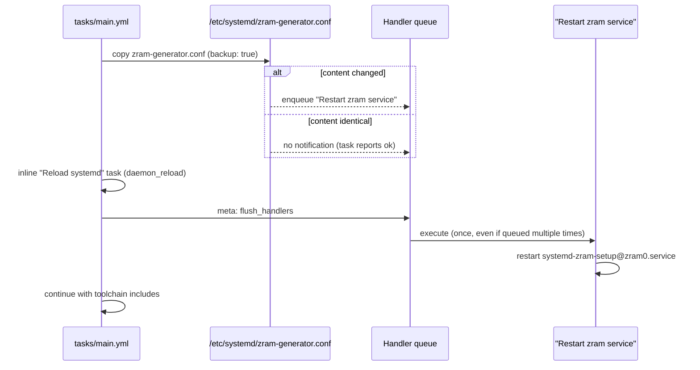

This page explains how the base role defers disruptive service actions until they are actually needed. The role's handler surface is deliberately minimal: two systemd-oriented handlers in [handlers/main.yml](handlers/main.yml#L1-L14), exactly one live notification chain, and an explicit mid-play flush point that controls *when* deferred work executes. Understanding this flow clarifies why a configuration write in the middle of the play does not immediately bounce a service — and why one of the two handlers currently never runs at all.

## The Handler Inventory: Two systemd Lifecycle Hooks

The handlers file contains two entries, both thin wrappers around `ansible.builtin.systemd`. The first, named "Daemon reload", runs `daemon_reload: true` to force systemd to re-read unit files. The second, named "Restart zram service", restarts the `systemd-zram-setup@zram0.service` unit — the unit that materializes zram swap from the zram-generator configuration. Both handlers declare a `listen` topic matching their own name, which decouples the topic that tasks notify from the handler's implementation name.

| Handler (listen topic) | Module action | Effect | Notified by |
|---|---|---|---|
| `Daemon reload` | `systemd: daemon_reload: true` | Re-reads unit files into systemd | None — dormant hook (see below) |
| `Restart zram service` | `systemd: name: systemd-zram-setup@zram0.service, state: restarted` | Tears down and re-creates zram swap with the new sizing | `Configure zram-generator` in tasks/main.yml |

Sources: [handlers/main.yml](handlers/main.yml#L4-L13)

Using `listen` topics rather than bare handler names is a forward-compatibility choice: any number of future tasks could notify the same topic, and the topic stays stable even if the implementing task is renamed. As of the current code, each topic has at most one implementer, so the indirection is cheap insurance rather than a functional necessity today.

Sources: [handlers/main.yml](handlers/main.yml#L7-L13)

## The Live Notification Chain: zram-generator.conf

The only task in the entire role that issues a `notify` is `Configure zram-generator` in the main task file. It writes `/etc/systemd/zram-generator.conf` with a `[zram0]` section whose `zram-size` is computed inline as half of `ansible_memtotal_mb`, using `zstd` compression and a swap priority of 100. Because the size is derived from the host's memory, the file's content varies per machine and must be regenerated whenever the role runs against hardware with changed memory — which is precisely the case the handler guard exists for.

Sources: [tasks/main.yml](tasks/main.yml#L62-L73)

The reconfiguration is conditional at two levels. First, the `ansible.builtin.copy` module only reports `changed` when the destination content or mode actually differs; an identical file reports `ok` and enqueues nothing. Second, the task sets `backup: true`, so when an existing file *is* overwritten, the previous version is preserved as a timestamped backup — a cheap rollback path for a swap-sizing change that can be immediately observed on a live system. The handler therefore fires exactly when, and only when, the swap configuration actually changed.

Sources: [tasks/main.yml](tasks/main.yml#L63-L73)

The full mechanics, from write to restart, look like this:



Sources: [tasks/main.yml](tasks/main.yml#L62-L80), [handlers/main.yml](handlers/main.yml#L9-L13)

## Mid-Play Flush: Ordering the Reconfiguration

By default, Ansible runs queued handlers at the *end* of the play. This role does not rely on that default. Immediately after the zram configuration write and an unconditional inline daemon reload, the task `Flush handlers meow` executes `ansible.builtin.meta: flush_handlers`, forcing any queued handler to run at that exact point in the play. This is what turns a scattered write-plus-notify into a bounded, ordered reconfiguration: the zram service restart is guaranteed to complete *before* the role proceeds to the toolchain includes — Intel graphics, gitflow, Go, fzf, inxi, Homebrew, zsh, and yadm.

Sources: [tasks/main.yml](tasks/main.yml#L79-L114)

```mermaid
flowchart TD
    A[Install base packages block] --> B[Restart sshd - unconditional task]
    B --> C["copy zram-generator.conf (backup: true)"]
    C -->|changed| D[queue "Restart zram service"]
    C -->|unchanged| E[queue stays empty]
    D --> F["inline 'Reload systemd' (daemon_reload)"]
    E --> F
    F --> G[meta: flush_handlers]
    D -. executes at flush .-> H[zram service restarted]
    G --> I[Toolchain includes: intel, gitflow, go, fzf, inxi, homebrew, zsh, yadm]
```

Sources: [tasks/main.yml](tasks/main.yml#L56-L114)

The flush point also gives the flow well-defined behavior across repeated runs, which is the essence of the "conditional" in this page's title:

| Run scenario | Copy task result | Handler queued? | `flush_handlers` behavior | zram restarted? |
|---|---|---|---|---|
| First run / memory changed | `changed` (file written) | Yes | Handler executes at the flush point | Yes |
| Repeat run, no drift | `ok` (identical content) | No | Flush is a no-op | No |

Sources: [tasks/main.yml](tasks/main.yml#L62-L80)

## The Dormant "Daemon reload" Handler

A precise audit of every `notify` site in the role yields exactly one: line 72 of tasks/main.yml. The "Daemon reload" handler is therefore currently unnotified — no task queues it, so it never executes. The role covers the daemon-reload need through a different mechanism: a plain task, `Reload systemd`, runs `daemon_reload: true` unconditionally on every play, immediately before the flush point. Both the dormant handler and the live task perform the identical module action; the task is the active path, the handler a reserved hook.

Sources: [handlers/main.yml](handlers/main.yml#L4-L7), [tasks/main.yml](tasks/main.yml#L72-L77)

This is not dead weight to be deleted blindly but a naming contract awaiting a caller: if a future task installs or modifies a systemd unit file (rather than a unit's runtime config), it should notify the `Daemon reload` listen topic instead of duplicating the inline module call. Until then, the inline task keeps systemd's view of units fresh before the flush point restarts zram — an ordering that matters because `state: restarted` on a stale systemd cache could otherwise restart against outdated unit definitions.

Sources: [tasks/main.yml](tasks/main.yml#L75-L80)

## Conditional Reconfiguration: Three Patterns Compared

The role reconfigures system state in three distinct ways, and comparing them shows why handlers were chosen for zram. The zram chain uses handler-gated reconfiguration: the disruptive action is decoupled from the write and fires only on real change. The metadata cache refresh in dnf.yml uses a register-gated task instead: two `register` variables (`base_enable_fastestmirror`, `base_configure_fastestmirror`) feed an explicit `when` condition, and the task hard-codes `changed_when: true` because `dnf makecache` is not natively idempotent. The sshd restart uses neither — it declares `state: restarted` unconditionally and reports `changed` on every run.

| Pattern | Site | Trigger condition | Action on trigger | Always runs? |
|---|---|---|---|---|
| Handler + notify | tasks/main.yml L62–73 → handlers/main.yml L9–13 | Copy reports `changed` | Restart `systemd-zram-setup@zram0` | Only on change |
| Register-gated task | tasks/dnf.yml L36–40 | `base_enable_fastestmirror.changed or base_configure_fastestmirror.changed` | `dnf makecache` (reports changed when it runs) | Only on change, but as an in-line task |
| Unconditional restart | tasks/main.yml L56–60 | None | `state: restarted` on sshd | Every run |

Sources: [tasks/main.yml](tasks/main.yml#L56-L73), [tasks/dnf.yml](tasks/dnf.yml#L36-L40)

The trade-offs are worth internalizing. The handler pattern scales best when multiple tasks might need the same reaction and when the action should be deferred to a synchronization point; its cost is indirection — you must read the flush point to know when it runs. The register-gated task pattern makes the condition explicit and local, at the cost of `changed_when: true` overriding honest change reporting. The unconditional restart pattern is simplest and safest for a service like sshd where availability must be guaranteed regardless of config drift, but it sacrifices idempotent reporting: every run claims a restart happened. Note that the sshd restart is intentionally *not* handler-mediated — it sits before the zram chain in the play and restarts every time, even on fully converged hosts. The cache-refresh mechanics themselves are covered in depth in [Metadata Cache Refresh Strategy and Change Detection](11-metadata-cache-refresh-strategy-and-change-detection).

Sources: [tasks/dnf.yml](tasks/dnf.yml#L11-L40)

## Where This Fits in the Play

The handler flow occupies a narrow but load-bearing slice of the play: packages first, then the sshd restart, then the zram write → notify → inline reload → flush sequence, and only then the toolchain. To see how the surrounding includes are wired and why the zram block sits where it does, continue to [Task Orchestration: How tasks/main.yml Wires Everything](12-task-orchestration-how-tasks-main-yml-wires-everything). For the change-detection idioms (`register` + `changed_when`, stat guards) that this page contrasts with handler-based conditionals, see [Idempotency: stat Checks and creates Guards for Installers](16-idempotency-stat-checks-and-creates-guards-for-installers).