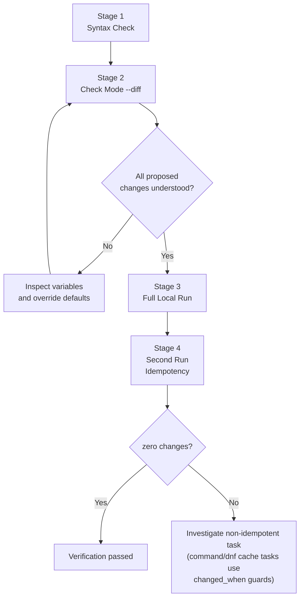
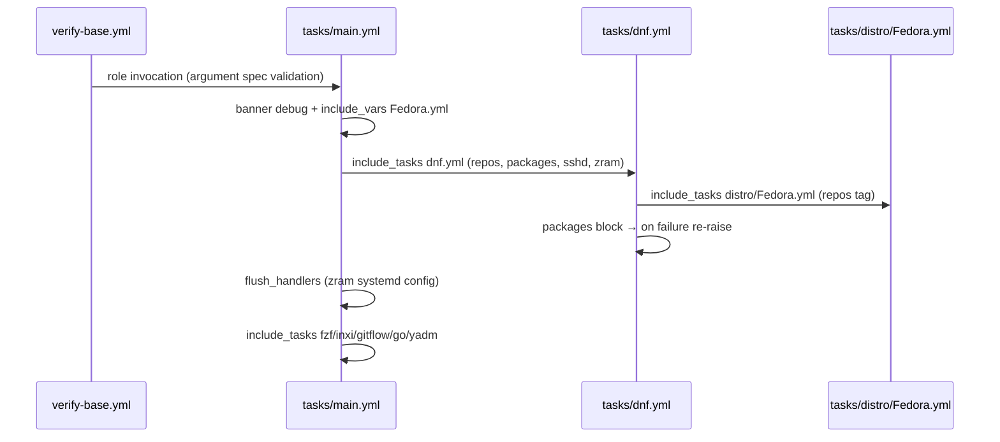

Every infrastructure role carries a silent contract: it must not only work in production, it must be *provable* in development. This role ships with a deliberately minimal testing scaffold — a single-host inventory — and this page explains how to turn that scaffold into a complete local verification loop: syntax validation, check-mode dry runs, full provisioning runs, and idempotency confirmation. By the end, you will have a repeatable procedure that exercises the role end-to-end on your own Fedora or AlmaLinux machine, before it ever touches a real workstation.

## The Intentional Minimalism of `tests/inventory`

The entire test surface of this role is two lines long:

```ini
localhost
```

That is the whole file. There is no group declaration, no connection variable, no `group_vars/` overlay — just one ungrouped host name pointing at the machine you run Ansible from. This is the classic `ansible-galaxy init` scaffold convention, and it is preserved here unchanged alongside the other untouched scaffold artifacts (the `.keep` placeholder files in `files/` and `templates/`, the boilerplate sections in the README). The role ships the *harness*, not the *playbook*: you supply the entry point, and the inventory supplies the target.

Why one host and not a matrix? Because the role's behavior is distribution-dispatched at runtime. The first real task after an `always`-tagged banner reads `{{ ansible_distribution }}.yml` — resolved to `Fedora.yml` or `AlmaLinux.yml` — and everything downstream (packages, repos, zram, tooling) branches from those facts. A localhost run on a Fedora machine therefore exercises the Fedora code path fully; on AlmaLinux, the AlmaLinux path. Testing against a "matrix" would add nothing that distribution fact-gathering already determines. What the single-host inventory *does* guarantee is that the role can be invoked with zero target-specific configuration — no SSH keys, no remote users, no network beyond loopback — because Ansible special-cases hosts named `localhost` (or `127.0.0.1`) to use the local connection by default.

Sources: [tests/inventory](tests/inventory#L1-L2), [tasks/main.yml](tasks/main.yml#L7-L11)

## What the Role Expects From Your Playbook

Since the repo contains no test playbook, the contract is defined by what the role's tasks assume at execution time. Three requirements emerge directly from the task structure:

1. **Privilege escalation.** The role's tasks themselves set no `become` — dnf package installation, third-party repository setup, sshd service management, and the zram configuration write all assume root. Your verification playbook must declare `become: true` (or you pass `--become`/`-K` at the command line), otherwise the first privileged task fails with a permission error.
2. **Fact gathering.** The distribution dispatch depends on `ansible_distribution`, so `gather_facts: true` (the default) is a hard requirement — with facts disabled, `include_vars` would look for a literally-named `.yml` and the play would abort.
3. **A supported distribution.** On any host other than Fedora or AlmaLinux, the `include_vars` lookup finds no matching file and the play fails early. That early, loud failure is by design — it is your first smoke test.

The README's Example Playbook section shows both consumption styles — static `roles:` invocation and dynamic `include_role:` — but note that its code blocks are scaffold remnants referencing a different role name (`b08x.devworkstation.run` with a fictional `run_x` parameter); adapt the structure, not the names. For a localhost verification run, the static style is the most readable.

Sources: [tasks/main.yml](tasks/main.yml#L9-L11), [tasks/main.yml](tasks/main.yml#L17-L19), [tasks/main.yml](tasks/main.yml#L25-L29), [meta/main.yml](meta/main.yml#L20), [README.md](README.md#L17-L41)

## The Verification Playbook

Create a file *outside* the role directory — at your `ansible/` project root, one level above `roles/` — so Ansible resolves the role by its directory name:

```yaml
# ansible/verify-base.yml
- name: Verify b08x.devworkstation base role locally
  hosts: localhost
  connection: local
  become: true
  gather_facts: true

  roles:
    - role: base
```

Two details are worth pausing on. First, `connection: local` is written explicitly here as belt-and-braces: Ansible auto-selects the local connection for hosts named `localhost`, but making it explicit removes any ambiguity when the inventory is reused in CI or imported into a larger play. Second, the role is referenced as `base` — its directory name under `roles/` — because that is how Ansible's role path resolution finds it in this repo's layout (`ansible/roles/base`).

The invocation then loops the harness back to its intended target:

```bash
cd ansible/
ansible-playbook -i roles/base/tests/inventory verify-base.yml
```

The relative `-i roles/base/tests/inventory` flag is the entire point of the scaffold's existence: the inventory lives *inside* the role so that it travels with it, and any playbook anywhere in the project can point at it by path.

## The Four-Stage Verification Loop

A responsible local verification is not a single command — it is a progression from cheapest signal to most expensive action. The role writes real system state (dnf configuration, `sshd` restarts, zram generator config), so the loop front-loads non-mutating checks.





Each stage, its purpose, and its expected signal:

| Stage | Command | What it proves | Cost / side effects |
|---|---|---|---|
| 1. Syntax | `ansible-playbook -i roles/base/tests/inventory verify-base.yml --syntax-check` | YAML validity, playbook structure | None — no host contact |
| 2. Dry run | `ansible-playbook -i roles/base/tests/inventory verify-base.yml --check --diff -K` | Exact root-level changes the role would make on *your* machine | None — check mode skips mutations (plain `command` tasks such as the dnf cache refresh are skipped, not executed) |
| 3. Full run | `ansible-playbook -i roles/base/tests/inventory verify-base.yml -K` | End-to-end provisioning on the local host | Real: packages installed, repos written, sshd restarted, zram config replaced (`backup: true`) |
| 4. Idempotency | Re-run the Stage 3 command | Second run converges — `changed=0` on a converged host | Minimal (cache refresh tasks are gated on file-change conditions) |

The `-K` flag prompts for your sudo password, matching the privilege requirement from Section 2. If your user has passwordless sudo, `--become` alone suffices.

Sources: [tasks/main.yml](tasks/main.yml#L31-L54), [tasks/main.yml](tasks/main.yml#L79-L80), [tasks/main.yml](tasks/main.yml#L82-L114)

## Reading the Results: What a Green Run Asserts

A successful localhost run is a *compound* assertion, and each passing stage corresponds to a specific mechanism inside the role:

- **The play gets past `include_vars`** → your `ansible_distribution` matched a shipped variable file, confirming the distribution dispatch works on your platform.
- **Package installation succeeds** → the `block/rescue` around the dnf package task resolved every package name from the distro variables; if any name failed, the rescue handler adds context and re-raises the original failure rather than swallowing it. This is the role's guarantee that a green run means "all packages genuinely present."
- **The play reaches `flush_handlers`** → zram changes flushed mid-play, before optional tooling begins.
- **Optional tooling tasks complete without failure** → the `base_intel_graphics_required`-style soft-fail guards default to `false`, so hardware-conditional blocks (Intel graphics, Homebrew CPU architecture checks) fail *softly* on the localhost and never abort the run — a first run on an unsupported machine still exits green unless you explicitly opt in.

This is where the local inventory proves its worth: because the target is the machine you control, every assertion above is directly observable (you can `dnf list installed`, restart sshd, cat the zram config) without needing a remote audit trail.

Sources: [tasks/main.yml](tasks/main.yml#L31-L54), [defaults/main.yml](defaults/main.yml#L16-L24), [meta/argument_specs.yml](meta/argument_specs.yml#L4-L11)

## Tag-Driven Partial Verification

The full run is the gold standard, but the role's tag taxonomy (`repos`, `base`, and per-tool tags) enables surgical verification when you only changed one subsystem. If you edited only the package list in `tasks/dnf.yml`, a targeted run avoids re-executing unrelated repository and tooling logic:

```bash
ansible-playbook -i roles/base/tests/inventory verify-base.yml -K --tags dnf
```

Tag-gated tasks *skip* cleanly under tag selection, and the `include_vars` banner task is tagged `always` — so even the narrowest partial run still resolves distribution variables and prints the starting banner. Use partial runs to shrink the iteration loop; use the full run (Stage 3 + 4) before considering any change "verified."

## Common Failure Modes and Their Meaning

| Symptom | Root cause | Fix |
|---|---|---|
| `Could not find or access 'Fedora.yml'` (or similar) early failure | Running on an unsupported distribution — the dispatch file does not exist | Verify on a Fedora/AlmaLinux host; see the supported-platforms page |
| Permission-denied on first dnf task | Verification playbook lacks `become` | Add `become: true` or pass `--become`/`-K` |
| Play fails at argument validation | Role entry args rejected by `argument_specs.yml` | Check the playbook's role parameters against the spec |
| Second run still reports `changed` | Cache-refresh command tasks are `changed_when: true` by design | Confirm the file-gating conditions (fastestmirror marker) — expected behavior, not a bug |

Sources: [tasks/main.yml](tasks/main.yml#L9-L19), [meta/argument_specs.yml](meta/argument_specs.yml#L1-L11)

## Reading Progression

This page assumes you already know the role's variable surface and internal structure. To complete the picture, continue with:

1. [Role Directory Anatomy: Ansible Standard Layout](3-role-directory-anatomy-ansible-standard-layout) — where `tests/` sits among the scaffold directories.
2. [Defaults and Overridable Variables (defaults/main.yml)](5-defaults-and-overridable-variables-defaults-main-yml) — the knobs you may override in your verification playbook.
3. [Idempotency and System State Convergence](16-idempotency-and-system-state-convergence) — the mechanics behind Stage 4's "zero changes" guarantee.
4. [Task Orchestration, Tags, and Handler Flush](12-task-orchestration-tags-and-handler-flush) — the tag taxonomy used for partial runs.