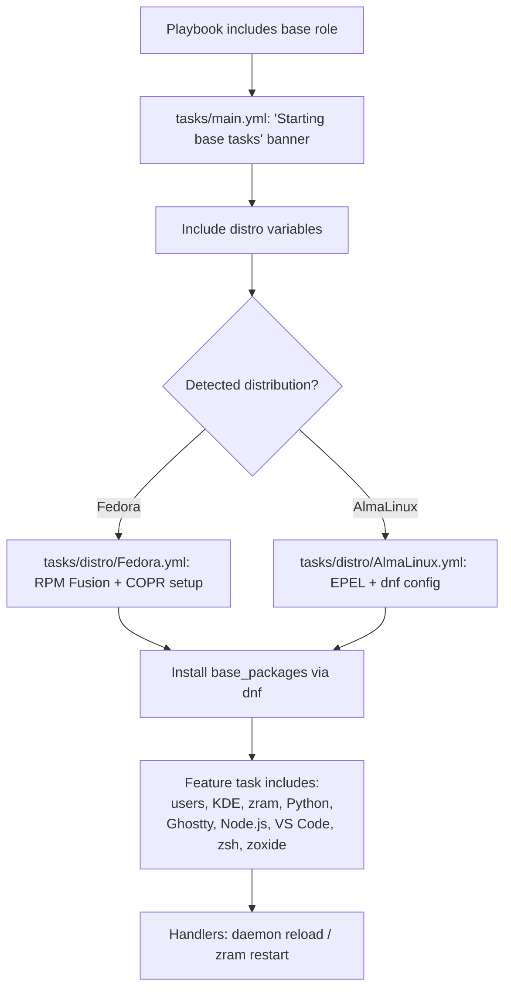

This page is your fastest path from a fresh checkout to a provisioned workstation. It covers the three things you must know before running this role: **what it requires**, **which variables control its behavior**, and **how to execute a first run safely** using tags. Everything here is verifiable in the role's own files; deeper details live in the linked catalog pages at the end.

## Requirements

The role declares a single hard dependency in its Ansible Galaxy metadata: **ansible-core 2.14.0 or newer**. There is no external Galaxy dependency to download — the role is fully self-contained, and its distribution-specific repository setup (EPEL, RPM Fusion, COPR) is handled internally by its own tasks rather than by third-party roles.

Before your first run, ensure:

| Requirement | Where it's enforced | Notes |
|---|---|---|
| ansible-core ≥ 2.14.0 | `meta/main.yml` | The only external requirement |
| Python 3 on the target host | Standard Ansible behavior | Needed for modules and the role's Python tasks |
| Root or become-capable user | Package/repository tasks | All dnf operations require privilege escalation |

Sources: [meta/main.yml](meta/main.yml#L1-L15)

## Core Variables at a Glance

The role exposes a small, deliberately flat set of overridable variables. All of them live in `defaults/main.yml` and follow the `base_` prefix convention, so they are safe to override from your playbook without clashing with other roles.

| Variable | Default | Purpose |
|---|---|---|
| `base_go_version` | `"1.27.1"` | Version of Go installed by the Go tooling tasks |
| `base_copr_repos` | `[]` (empty list) | Optional list of Fedora COPR repositories to enable |
| `base_intel_graphics_required` | `false` | When `true`, a missing Intel graphics setup becomes a hard failure instead of a soft skip |

For beginners, the key insight is the **gating pattern**: `base_copr_repos` is empty by default, meaning third-party repositories are opt-in. Only if you explicitly list repositories does the role touch third-party sources on Fedora.

Sources: [defaults/main.yml](defaults/main.yml#L1-L20)

There is also a declared-but-optional argument, `base_my_variable`, defined in the role's argument validation spec. It is a demonstration scaffold (default `"default_value"`) and is safe to ignore during a first run — it exists to show how argument validation is structured rather than to control real behavior.

Sources: [meta/argument_specs.yml](meta/argument_specs.yml#L1-L12)

## Architecture of a First Run

Understanding the execution flow before running anything prevents surprises. The role's entry point, `tasks/main.yml`, follows a linear structure: it prints a starting banner, loads distribution-specific variables, dispatches to distro-specific setup tasks, and then runs the main package installation. Sub-task files are included per-feature (users, Fedora/KDE desktop, zram, Python, Ghostty, Node.js, VS Code, zsh, zoxide).



The mermaid diagram above shows three things worth internalizing: (1) **variable loading is distribution-aware**, (2) **repository setup happens before package installation**, and (3) **handlers** fire only if notified — most of the time your first run will simply install packages and finish without triggering any service restarts.

Sources: [tasks/main.yml](tasks/main.yml#L1-L30), [handlers/main.yml](handlers/main.yml#L1-L14), [tasks/distro/AlmaLinux.yml](tasks/distro/AlmaLinux.yml#L1-L30)

## Running It: Minimal Playbook

Because this role is part of the broader `b08x.devworkstation` collection, the canonical invocation pattern follows the Ansible standard for role-based playbooks. A minimal first-run playbook looks like this:

```yaml
# playbook.yml
---
- hosts: workstations
  become: true
  roles:
    - role: b08x.devworkstation.base
```

Then execute:

```bash
ansible-playbook -i inventory playbook.yml
```

This runs **everything**: all base packages, all feature includes (users, zram, zsh, Ghostty, VS Code, Node.js, Python, zoxide), and all distro-specific repository setup. On a fresh machine this is exactly what you want.

Sources: [README.md](README.md#L1-L40)

## Running It Selectively: Tags

The role tags every task block, which lets you run only what you need — essential when iterating on one feature without re-running the full provisioning stack. The tags observable in the task files are:

| Tag | Where it appears | Effect when used with `--tags` |
|---|---|---|
| `always` | `tasks/main.yml` banner task | Runs regardless of other tag filters — cannot be skipped |
| `base` | `tasks/main.yml` core tasks | Core setup + base package installation |
| `packages` | `tasks/main.yml` dnf task | Package installation only |

Example — install just the base packages without touching desktop/zram/zsh:

```bash
ansible-playbook -i inventory playbook.yml --tags "packages"
```

Note that `always` is sticky: even with `--tags packages`, the "Starting base tasks" debug message still runs, because Ansible honors the `always` tag universally. This is intentional — it acts as a run marker so you always have confirmation the role was entered.

Sources: [tasks/main.yml](tasks/main.yml#L1-L30)

## What Happens on the Target Machine

To set expectations for your first run, here is a comparison of the two distribution paths the role supports. Both end at the same package-installation step; only the *repository preparation* differs:

| Aspect | Fedora path | AlmaLinux path |
|---|---|---|
| Repository setup | RPM Fusion (free/nonfree) + optional COPR from `base_copr_repos` | EPEL + dnf-plugins-core, with optional dnf priorities configuration |
| Failure behavior | Soft-fails (skips) optional blocks by default | Same soft-fail pattern; can be hardened via `base_intel_graphics_required` / related flags |
| Package list source | `base_packages` loaded from distro variables | `base_packages` loaded from distro variables |
| Resulting state | Packages + optional desktop/tooling features installed | Same |

Sources: [tasks/distro/Fedora.yml](tasks/distro/Fedora.yml#L1-L30), [tasks/distro/AlmaLinux.yml](tasks/distro/AlmaLinux.yml#L1-L30), [defaults/main.yml](defaults/main.yml#L1-L20)

Both paths share the same **soft-fail philosophy**: optional features (Intel graphics, zoxide, dnf priorities) skip gracefully when preconditions aren't met, and only escalate to hard failures when their `*_required` flags are explicitly set to `true`. If a task fails and you want to diagnose which package or repository caused it, re-run with `--tags packages -vv` — the role's error messages are designed to point you at the exact failing item.

Sources: [tasks/distro/AlmaLinux.yml](tasks/distro/AlmaLinux.yml#L1-L30), [tasks/main.yml](tasks/main.yml#L1-L30)

## Recommended Reading Progression

Now that you can run the role, these catalog pages go deeper in dependency order:

1. **[Overview: The b08x.devworkstation Base Role](1-overview-the-b08x-devworkstation-base-role)** — big-picture architecture and design philosophy
2. **[Role Directory Anatomy: Ansible Standard Layout](3-role-directory-anatomy-ansible-standard-layout)** — where each file you just invoked lives and why
3. **[Defaults and Overridable Variables (defaults/main.yml)](5-defaults-and-overridable-variables-defaults-main-yml)** — full variable semantics beyond this quick-start summary
4. **[Distro-Specific Variables: vars/Fedora.yml and vars/AlmaLinux.yml](7-distro-specific-variables-vars-fedora-yml-and-vars-almalinux-yml)** — how `base_packages` and per-distro lists differ
5. **[Failure Shape Patterns: Context, Re-Raise, and Soft-Fail (base_zoxide_required)](17-failure-shape-patterns-context-re-raise-and-soft-fail-base_zoxide_required)** — the three-tier failure model you'll encounter when things go wrong

Start with #1 for context, then #3 and #4 when you want to customize the run, and keep #17 handy as your troubleshooting reference.