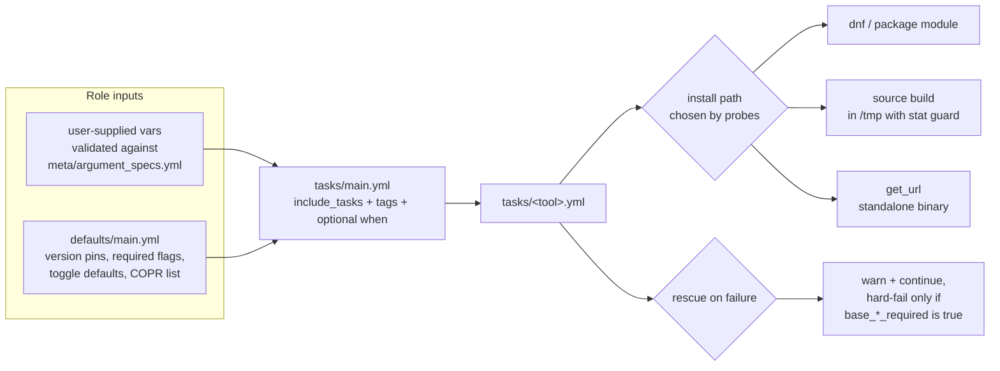
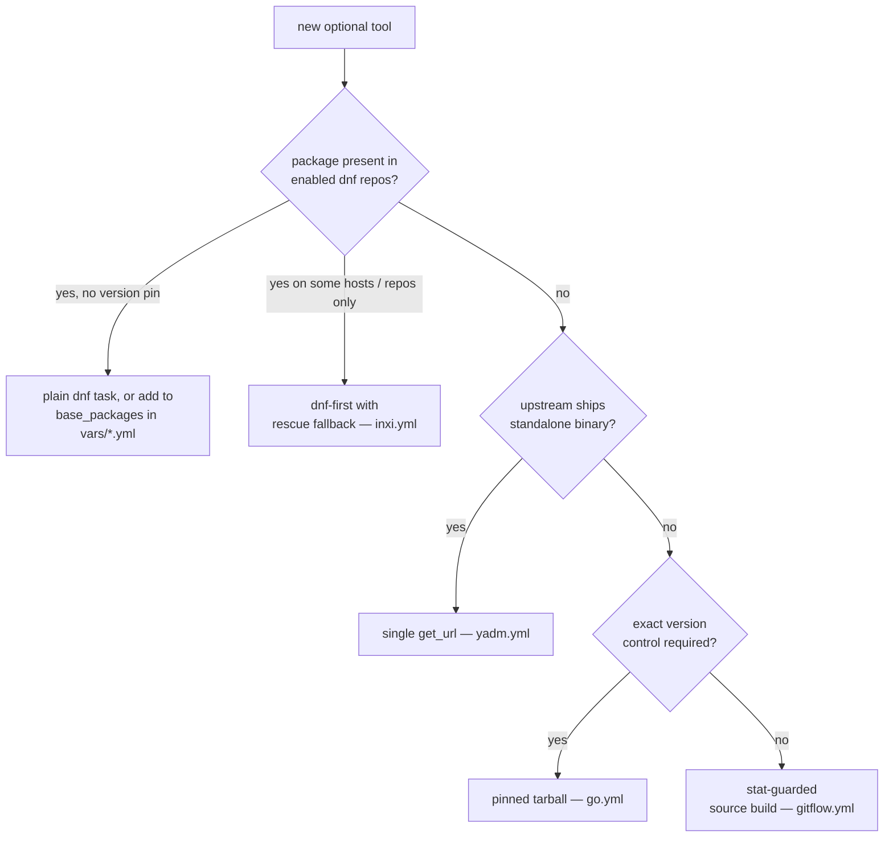
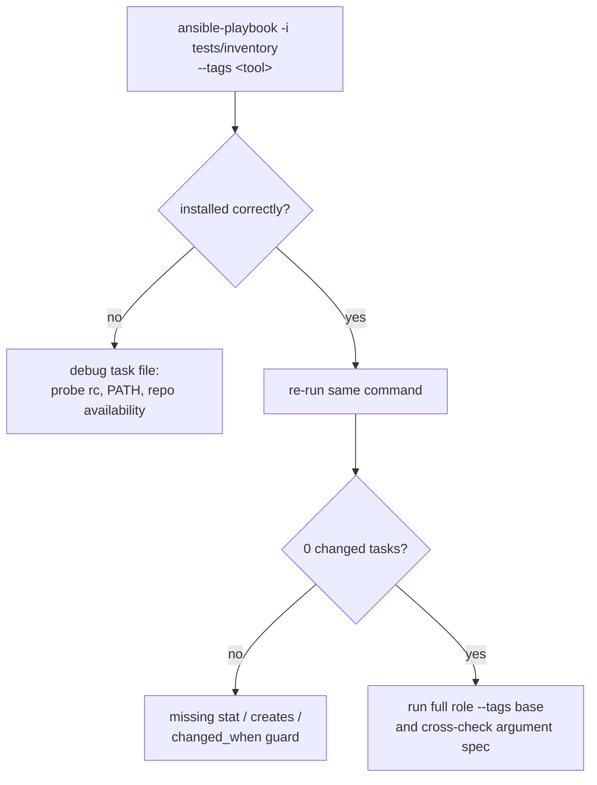

This page is the operational checklist for extending the base role with a new optional tool. It distills the conventions already embodied by `fzf`, `inxi`, `gitflow`, Go, `yadm`, zsh/zoxide, Homebrew, and the Intel stack into a repeatable seven-step procedure: choose an install strategy, author the task file with the role's idempotency primitives, wire the dispatch include, register variables in `defaults` and `meta/argument_specs.yml`, select a failure shape, handle platform special cases, and verify with targeted tag runs. Everything here is derived from the existing task files — no new conventions are invented.

Sources: [tasks/main.yml](tasks/main.yml#L86-L114)

## The Extension Surface: What a New Tool Touches

Adding an optional tool is not a single-file edit. Every existing tool in this role is a collaboration between exactly four surfaces: a dedicated task file under `tasks/`, a dispatch include inside `tasks/main.yml` (optionally gated by a `when` clause), one or more variables in `defaults/main.yml`, and — for variables users may set — an option entry in `meta/argument_specs.yml`. The dispatch layer is intentionally thin: `tasks/main.yml` does not install anything itself, it only resolves the include and applies the tool's tag pair, so the tool's logic stays fully encapsulated in its own file.



Sources: [tasks/main.yml](tasks/main.yml#L86-L114), [meta/argument_specs.yml](meta/argument_specs.yml#L4-L12), [defaults/main.yml](defaults/main.yml#L8-L24)

## Step 1: Select the Install Strategy

Before writing any YAML, decide how the tool gets onto the system. The role already contains five distinct strategies, each proven in production code, and each suited to a different availability profile. The decision tree below maps availability to the exemplar file you should pattern-match against.



The five strategies compared:

| Strategy | Exemplar file | Detection primitive | Idempotency guard | Use when |
|---|---|---|---|---|
| dnf availability probe → package, else source build | `tasks/fzf.yml` | `dnf --quiet list --available` exit code | `changed_when: false`, `failed_when: false`, then `stat` | Package exists in some repository sets but not all; source build is the universal fallback |
| Package manager attempt → standalone-script rescue | `tasks/inxi.yml` | `stat /usr/local/bin/inxi` exit code | `changed_when: false`, `ignore_errors: true` | Package is absent from certain repo sets, but upstream publishes a drop-in script |
| Stat-guarded source build | `tasks/gitflow.yml` | `stat /usr/local/bin/git-flow` | `when: not base_gitflow_bin.stat.exists` | No package anywhere; tool must be built from a git checkout |
| Version-pinned tarball | `tasks/go.yml` | `<tool> version` command output match | `changed_when: false`, `failed_when: false`, version-string comparison | Tool has no package; you must control the exact version (e.g. `base_go_version`) |
| Single `get_url` | `tasks/yadm.yml` | none — `get_url` is checksum-idempotent | module-provided | Upstream distributes a single executable script |

If the tool happens to be an ordinary distro package with no special handling, you may not need a task file at all — the AlmaLinux package list in `vars/AlmaLinux.yml` demonstrates the pure-`base_packages` route.

Sources: [tasks/fzf.yml](tasks/fzf.yml#L2-L22), [tasks/inxi.yml](tasks/inxi.yml#L4-L31), [tasks/gitflow.yml](tasks/gitflow.yml#L2-L33), [tasks/go.yml](tasks/go.yml#L1-L12), [tasks/yadm.yml](tasks/yadm.yml#L1-L8), [vars/AlmaLinux.yml](vars/AlmaLinux.yml#L2-L67)

## Step 2: Author tasks/\<tool\>.yml with the Role's Idempotency Primitives

Regardless of strategy, every conformant task file in this role applies the same four primitives. First, **probe before acting**: every install decision is driven by a registered probe — a `stat` on the binary path (gitflow, zsh, Homebrew) or a read-only command whose exit code or stdout is inspected (fzf, Go, inxi). Second, **silence the probe**: read-only checks always set `changed_when: false` and, where a missing binary is expected, `failed_when: false` or `ignore_errors: true` — without this, a clean system turns your probe into a false failure. Third, **guard the mutator**: the install block runs only `when: not <probe>.stat.exists` (or the rc-based equivalent), and `command`-based installers carry `creates:`. Fourth, **leave no debris**: source builds work in a `/tmp/<tool>` scratch directory that is explicitly removed before the clone (clean state for `git` module `update: true`) and again after installation.

Sources: [tasks/gitflow.yml](tasks/gitflow.yml#L2-L33), [tasks/fzf.yml](tasks/fzf.yml#L2-L8), [tasks/fzf.yml](tasks/fzf.yml#L38-L67), [tasks/zsh.yml](tasks/zsh.yml#L21-L54), [tasks/inxi.yml](tasks/inxi.yml#L7-L12)

Two further details distinguish the existing files. Build-type strategies inject an explicit `environment: PATH` so toolchain binaries resolve — fzf builds prepend `~/.local/bin`, `~/.cargo/bin`, `/usr/local/go/bin`, and `$(go env GOPATH)/bin` to the installer's PATH. And every task inside the file carries the tool's dual tag pair (see Step 3), so tag-scoped runs resolve the whole file, not just its first task.

Sources: [tasks/fzf.yml](tasks/fzf.yml#L29-L36), [tasks/gitflow.yml](tasks/gitflow.yml#L6-L34)

The skeleton below composes the verified primitives into a new file (here, a hypothetical `lazygit`). It is the stat-guarded source-build shape with a Shape-3 rescue, which Step 5 justifies:

```yaml
---
- name: Check whether lazygit is installed
  ansible.builtin.stat:
    path: /usr/local/bin/lazygit
  register: base_lazygit_bin
  tags: ["lazygit", "base"]

- name: Install lazygit from source
  when: not base_lazygit_bin.stat.exists
  tags: ["lazygit", "base"]
  block:
    - name: Ensure clean state for lazygit clone
      ansible.builtin.file:
        path: /tmp/lazygit
        state: absent

    # ... clone -> make install -> copy binary ...

    - name: Clean up lazygit clone
      ansible.builtin.file:
        path: /tmp/lazygit
        state: absent

  rescue:
    - name: Report lazygit installation failure
      ansible.builtin.debug:
        msg: "WARNING: failed to install lazygit; the workstation is usable without it."

    - name: Fail the play when lazygit is required
      ansible.builtin.fail:
        msg: "lazygit installation failed and base_lazygit_required is true."
      when: base_lazygit_required | bool
```

The difference between a naive addition and a role-conformant one:

| Dimension | Naive addition | Role-conformant task file |
|---|---|---|
| Dispatch | none | `include_tasks` + dual tags in `tasks/main.yml` |
| Idempotency | module defaults only | registered probe + `changed_when: false` + `stat`/`creates:` guard |
| Repository absence | hard failure mid-play | declared rescue shape (fallback install or soft-fail) |
| Configuration | hard-coded paths/versions | variables with defaults, registered in argument spec |
| Scratch state | stray `/tmp` artifacts | explicit pre/post `state: absent` cleanup |
| Verification | whole-role run required | targeted `--tags <tool>` runs |

Sources: [tasks/fzf.yml](tasks/fzf.yml#L24-L67), [tasks/zsh.yml](tasks/zsh.yml#L41-L74)

## Step 3: Wire the Dispatch Include in tasks/main.yml

Add a single include block at the bottom of `tasks/main.yml`, alongside the existing tool dispatches. The include is where two orthogonal decisions are encoded: the **tag pair** and the **gate**. The tag convention throughout this role is `["<tool>", "base"]` — a tool-specific tag for targeted runs and the shared `base` tag — applied both on the include line and on the tasks inside the included file, so `--tags <tool>` resolves the include and its body. The minimal `yadm.yml` (single task, single tag) exists but is the exception; match the majority convention.

The gate is optional and takes one of three observed forms:

| Gate | Syntax at the include site | Exemplar |
|---|---|---|
| No gate — always attempted | include only | `gitflow.yml`, `fzf.yml`, `inxi.yml`, `zsh.yml`, `yadm.yml` |
| User-toggleable, on by default | `when: base_install_<tool> \| default(true) \| bool` | `go.yml` include (`base_install_go`) |
| Distro-conditional | `when: ansible_distribution == 'Fedora'` | `homebrew.yml` include |

Note the interplay with idempotency: a variable gate and an in-file `stat` guard are not redundant. `base_install_go` decides whether Go installation is even attempted; the version-match check inside `go.yml` decides whether an existing installation needs replacing. Reserve the include-site gate for "should this tool exist on this host at all."

Sources: [tasks/main.yml](tasks/main.yml#L90-L106), [tasks/yadm.yml](tasks/yadm.yml#L1-L8)

## Step 4: Register Variables in defaults and the Argument Spec

Introduce variables only if the tool needs configurability, and mirror each one in both variable layers. In `defaults/main.yml`, follow the naming and comment conventions already present: version pins as plain scalars (`base_go_version: 1.27.1`), soft-fail toggles as booleans with an explanatory comment (`base_zoxide_required: false`), and list-valued options as empty lists with an entry-format comment (`base_copr_repos: []`). The existing comment block on rescue strictness is the model: it explains *when* a default matters, not just *what* it is.

Sources: [defaults/main.yml](defaults/main.yml#L8-L24)

Then declare each new settable variable in `meta/argument_specs.yml`. This is the step most easily skipped, because the spec currently declares only the demonstration variable `base_my_variable` — none of the newer toggles are registered yet. For a new tool, register the full set following the pattern documented in the role README, which specifies `description`, `type`, `default`, and optional `choices` per option:

```yaml
argument_specs:
  main:
    short_description: Role description.
    options:
      base_lazygit_required:
        type: bool
        description: >
          Fail the play when the lazygit installation rescue triggers,
          instead of warning and continuing.
        default: false
```

Keep the spec synchronized with `defaults/main.yml` — a `default` in the spec should equal the `defaults/main.yml` value, so role-argument validation and ordinary variable resolution agree.

Sources: [meta/argument_specs.yml](meta/argument_specs.yml#L4-L12), [README.md](README.md#L55-L69)

## Step 5: Choose the Failure Shape

Every `block` in this role's task files has a deliberate rescue posture, documented by inline comments as three shapes. Your choice should follow the same rule the comments state: does the role still meet its contract without this tool?

| Shape | Semantics | Exemplars | Default variable |
|---|---|---|---|
| Shape 1 — add context, then re-raise | Rescue explains likely causes, then hard-fails the play | `base_packages` block; third-party repository setup; Intel oneAPI | none — always fails |
| Shape 2 — real fallback | Rescue performs an alternative install satisfying the same contract | `inxi.yml` (package fails → standalone script download) | none — fallback always attempted |
| Shape 3 — optional soft-fail | Rescue warns and continues; a `base_*_required` flag upgrades the failure | zoxide in `zsh.yml`; Intel graphics in `intel.yml` | `base_zoxide_required`, `base_intel_graphics_required` (both `false`) |

The decision rule, as stated in `defaults/main.yml`: optional conveniences report a warning and continue "because the role still meets its contract without them"; anything another task depends on (packages, repositories) must re-raise. If your tool is genuinely optional, use Shape 3 and add its `base_<tool>_required: false` to defaults with a comment, and register it in the argument spec. If your rescue performs a *working alternative* install, it is Shape 2 — the fallback itself can still fail the play. If skipping the tool would silently break a later task, it is Shape 1 and has no toggle.

Sources: [defaults/main.yml](defaults/main.yml#L18-L24), [tasks/main.yml](tasks/main.yml#L42-L54), [tasks/inxi.yml](tasks/inxi.yml#L20-L31), [tasks/zsh.yml](tasks/zsh.yml#L62-L74), [tasks/intel.yml](tasks/intel.yml#L18-L31), [tasks/distro/Fedora.yml](tasks/distro/Fedora.yml#L55-L68)

## Step 6: Platform and Repository Special Cases

Four situations call for extra wiring beyond the standard skeleton. **COPR-only packages**: if the tool ships via COPR, do not create a new repo task — append `"owner/project"` entries to `base_copr_repos` in defaults; the `community.general.copr` loop in the Fedora distro tasks consumes that list and the subsequent conditional `dnf makecache` already refreshes metadata when any repo enablement changed. **Distro packages**: if the tool is a plain package on one or both targets, add it to `base_packages` in `vars/AlmaLinux.yml` (flat list) or `vars/Fedora.yml` (nested under `base:`) — match the existing shape of the file you edit. **Shell environment**: tools needing PATH setup follow `go.yml` and write a profile script to `/etc/profile.d/`. **Service reconfiguration**: only notify a handler if the tool alters service state — the handler file currently covers daemon reload and zram restart, so a new tool with service implications adds a `listen`-keyed handler there.

Sources: [defaults/main.yml](defaults/main.yml#L14-L16), [tasks/distro/Fedora.yml](tasks/distro/Fedora.yml#L38-L78), [vars/AlmaLinux.yml](vars/AlmaLinux.yml#L2-L67), [vars/Fedora.yml](vars/Fedora.yml#L2-L8), [tasks/go.yml](tasks/go.yml#L31-L39), [handlers/main.yml](handlers/main.yml#L4-L14)

## Step 7: Verify the Addition

Verification runs against the local test inventory (`tests/inventory`, a single `localhost` line) using the role's tag system. The sequence: a first targeted run exercises the install path on a clean system; an immediate second run must report zero changes, proving the probe-and-guard wiring; a tag-scoped run proves the dispatch wiring; and a forced-failure run (e.g., an unreachable URL) proves the chosen rescue shape behaves as declared.



Common failure signatures and their fixes:

| Symptom | Likely cause | Fix |
|---|---|---|
| Task reports `changed` on every run | Probe lacks `changed_when: false`, or installer lacks `stat`/`creates:` guard | Add the guard primitives from Step 2 |
| `--tags <tool>` skips the file entirely | Include line or inner tasks missing the tool tag | Apply the dual tag pair at both layers |
| dnf task fails on one distro only | Package absent from that platform's repo set | Switch to the inxi-style fallback, or add a COPR entry |
| Rescue never fires / always fires | Wrong failure shape for the tool's contract | Re-read Step 5; the role's inline shape comments are the reference |
| User-supplied toggle has no effect | Variable added to defaults but not gated at include site | Add `when: base_install_<tool> \| default(true) \| bool` |

Sources: [tests/inventory](tests/inventory#L1-L2), [tasks/main.yml](tasks/main.yml#L4-L7)

## Condensed Checklist

| # | Item | Reference pattern |
|---|---|---|
| 1 | Install strategy chosen against the decision tree | `fzf.yml` / `inxi.yml` / `gitflow.yml` / `go.yml` / `yadm.yml` |
| 2 | Probe registered with `changed_when: false` (+ `failed_when: false` where expected-absent) | `fzf.yml` dnf check |
| 3 | Mutator guarded by `when: not <stat>.exists` or rc/version match | `gitflow.yml` |
| 4 | `/tmp` scratch cleaned before and after source builds | `fzf.yml`, `gitflow.yml` |
| 5 | Build environment PATH injected explicitly | `fzf.yml` |
| 6 | Task file created as `tasks/<tool>.yml`, every task dual-tagged `["<tool>", "base"]` | `fzf.yml` et al. |
| 7 | Include added to `tasks/main.yml` with the same tag pair | tool dispatch region |
| 8 | Include gate selected (none / toggle / distro) | `go.yml`, `homebrew.yml` includes |
| 9 | Variables added to `defaults/main.yml` with explanatory comments | rescue-strictness block |
| 10 | Same variables declared in `meta/argument_specs.yml` with type/description/default | README argument-spec section |
| 11 | Failure shape chosen (1/2/3); `base_<tool>_required` added if Shape 3 | `zsh.yml` zoxide rescue |
| 12 | COPR / `base_packages` / profile.d / handler wiring done if applicable | Step 6 |
| 13 | Double-run idempotency + tag-scope + rescue verification passed | Step 7 |

## Where to Go Next

For the orchestration context that makes the dispatch region work — include ordering, tag inheritance, and the handler flush — see [Task Orchestration: How tasks/main.yml Wires Everything](12-task-orchestration-how-tasks-main-yml-wires-everything). For a guided tour of the five exemplar tool files covered in Step 1, see [Optional Tooling: fzf, inxi, gitflow, Go, and yadm](14-optional-tooling-fzf-inxi-gitflow-go-and-yadm). The idempotency primitives from Step 2 are analyzed in depth in [Idempotency: stat Checks and creates Guards for Installers](16-idempotency-stat-checks-and-creates-guards-for-installers), and the rescue taxonomy from Step 5 in [Failure Shape Patterns: Context, Re-Raise, and Soft-Fail (base_zoxide_required)](17-failure-shape-patterns-context-re-raise-and-soft-fail-base_zoxide_required). For the validation layer behind Step 4, see [Input Validation with argument_specs.yml](6-input-validation-with-argument_specs-yml), and for the full local verification workflow behind Step 7, see [Test Inventory and Local Playbook Verification](19-test-inventory-and-local-playbook-verification).