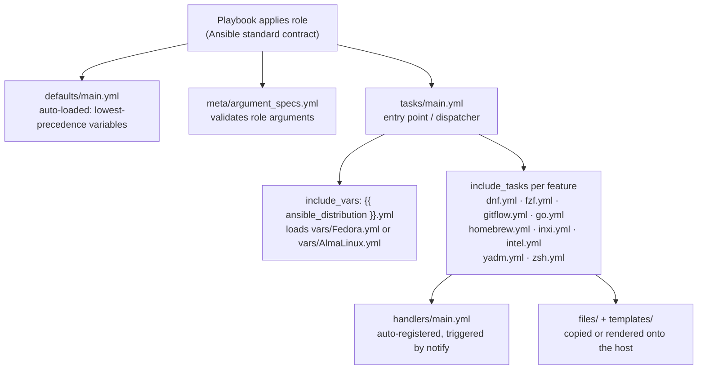

Before you change a single line of this role, you need to know where things live. Ansible roles follow a **convention-over-configuration** contract: the tool itself decides where tasks, variables, files, and metadata must be placed, and if you put something in the wrong directory, Ansible silently ignores it. This page walks through the exact directory tree of `b08x.devworkstation.base`, explains what each standard directory means, and shows how this role both follows the convention and extends it with a small set of purpose-built extras.

Sources: [README.md](README.md#L1-L78)

## The Role Directory at a Glance

Here is the complete tree of the role (excluding hidden tooling directories):

```text
base/
├── README.md
├── defaults/
│   └── main.yml
├── files/
│   └── etc/
│       └── yum.repos.d/
│           └── epel.repo
├── handlers/
│   └── main.yml
├── meta/
│   ├── argument_specs.yml
│   └── main.yml
├── tasks/
│   ├── main.yml
│   ├── dnf.yml
│   ├── fzf.yml
│   ├── gitflow.yml
│   ├── go.yml
│   ├── homebrew.yml
│   ├── inxi.yml
│   ├── intel.yml
│   ├── yadm.yml
│   ├── zsh.yml
│   └── distro/
│       ├── AlmaLinux.yml
│       └── Fedora.yml
├── templates/
│   └── .keep
├── tests/
│   └── inventory
└── vars/
    ├── AlmaLinux.yml
    ├── Fedora.yml
    └── main.yml
```

Every top-level directory here (except `distro/`, which is a role-specific subfolder inside `tasks/`) is a standard Ansible directory. When the role runs, Ansible automatically looks for `tasks/main.yml` as the entry point, automatically loads `defaults/main.yml`, and automatically registers `handlers/main.yml` — you never wire these up by hand.

Sources: [tasks/main.yml](tasks/main.yml#L1-L80), [defaults/main.yml](defaults/main.yml#L1-L24)

## How the Anatomy Works at Runtime

The mental model for a role is that `tasks/main.yml` is the **spine**, and everything else is attached to it. This role makes that model unusually explicit: `tasks/main.yml` is a thin dispatcher that pulls in the other task files, each of which owns one logical feature. The diagram below shows the flow.



Three things in this diagram are pure Ansible standard behavior: `defaults/` is loaded before the tasks run with the **lowest variable precedence**, `handlers/` is registered before play execution so tasks can `notify` them at any point, and `meta/argument_specs.yml` is checked the moment the role is instantiated. Everything else — the per-feature task files and the `distro/` subdirectory — is this role's own organizational choice built on top of the standard.

Sources: [tasks/main.yml](tasks/main.yml#L1-L80), [meta/argument_specs.yml](meta/argument_specs.yml#L1-L12), [defaults/main.yml](defaults/main.yml#L1-L24)

## Directory-by-Directory Tour

The table below summarizes each directory: what Ansible's convention promises, what this role actually puts there, and how the two relate.

| Directory | Ansible Standard Contract | Contents in This Role | Notes for Beginners |
|-----------|--------------------------|----------------------|---------------------|
| `tasks/` | `main.yml` is the role's execution entry point | `main.yml` dispatcher + 9 feature files + `distro/` subfolder | The only directory that *must* have a `main.yml` |
| `defaults/` | `main.yml` loaded automatically, lowest precedence | `main.yml` with overridable variables | Safe to override from inventory or playbook |
| `vars/` | `main.yml` loaded automatically, higher precedence | `main.yml`, plus `Fedora.yml` and `AlmaLinux.yml` (loaded manually) | Not meant to be overridden by users |
| `handlers/` | `main.yml` auto-registered; run once at end of play | `main.yml` | Triggered with `notify:` from tasks |
| `meta/` | Role metadata and argument validation | `main.yml` (galaxy_info) + `argument_specs.yml` | `argument_specs.yml` is currently a scaffold |
| `files/` | Static files available to `copy`/`script` modules | `etc/yum.repos.d/epel.repo` | Copied verbatim, no variable substitution |
| `templates/` | Jinja2 templates for the `template` module | Only `.keep` placeholder | Empty today — an extension point, not dead weight |
| `tests/` | Optional test scaffolding | `inventory` file | Conventional but not automated here |

Sources: [tasks/main.yml](tasks/main.yml#L1-L80), [defaults/main.yml](defaults/main.yml#L1-L24), [meta/main.yml](meta/main.yml#L1-L27), [meta/argument_specs.yml](meta/argument_specs.yml#L1-L12)

### tasks/ — The Dispatcher Pattern

`tasks/main.yml` is deliberately small. It opens with a tagged debug message (`tags: ["base", "always"]` at lines 4–7) and then includes variables and tasks rather than defining them inline. The key include at lines 9–10 is:

```yaml
- name: Include distribution package variables
  ansible.builtin.include_vars: "{{ ansible_distribution }}.yml"
```

Because `ansible_distribution` resolves to `Fedora` or `AlmaLinux` on the target host, this single line selects the matching file from `vars/` at runtime. The rest of `main.yml` pulls in the nine feature task files, and its error-handling notes (around lines 49–50) even point you toward `tasks/distro/` when a package fails because a repository was never enabled — the role's own documentation is embedded in its dispatcher.

Sources: [tasks/main.yml](tasks/main.yml#L4-L10), [tasks/main.yml](tasks/main.yml#L49-L50)

### defaults/ vs vars/ — The Precedence Split

Beginners most often stumble on the difference between these two directories, so it deserves its own treatment. Both are auto-loaded, but they sit at opposite ends of Ansible's variable precedence ladder:

- **`defaults/main.yml`** holds values that *users of the role are expected to change*. It has the lowest precedence of any variable source, so anything set in a playbook or inventory wins.
- **`vars/main.yml`** holds values that *the role author controls*. It sits higher in the precedence ladder and is not meant to be overridden. In this role it is nearly empty (2 lines) — a stub.
- **`vars/Fedora.yml` and `vars/AlmaLinux.yml`** are a third case: they are *not* auto-loaded at all. They exist only because `tasks/main.yml` explicitly includes them based on `ansible_distribution`, which is why the distro-specific pages in this catalog matter.

Sources: [defaults/main.yml](defaults/main.yml#L1-L24), [vars/main.yml](vars/main.yml#L1-L2), [tasks/main.yml](tasks/main.yml#L9-L10)

### meta/ — Identity and Input Validation

`meta/main.yml` is the role's ID card. It declares the collection-qualified name (`b08x.devworkstation.base`), a short description, `min_ansible_version: "2.14"`, platform support entries (Fedora among them), license, tags, and a dependency list that is currently empty. This file is what Ansible Galaxy and `ansible-galaxy role info` read; nothing in it executes during a play.

`meta/argument_specs.yml` is the more interesting sibling: it is the modern, schema-like way to validate role arguments. This role's file is currently a **scaffold** — it defines a single demonstration option `base_my_variable` of type `str` with a default of `"default_value"` (lines 8–11). Treat it as a pattern to fill in later: any variable you want strictly typed and documented should get an entry here, and Ansible will reject runs that pass invalid values.

Sources: [meta/main.yml](meta/main.yml#L1-L27), [meta/argument_specs.yml](meta/argument_specs.yml#L4-L12)

### files/ and templates/ — Payload Directories

These two directories answer the question "what content gets placed on the managed host?" The distinction is one word: **substitution**.

| Aspect | `files/` | `templates/` |
|--------|----------|--------------|
| Module used | `ansible.builtin.copy` | `ansible.builtin.template` |
| Jinja2 rendering | No — bytes copied as-is | Yes — `{{ }}` and `` evaluated |
| Naming | Any filename | Typically ends in `.j2` |
| Current contents | `etc/yum.repos.d/epel.repo` | Empty (`.keep` only) |

The single real payload in this role is `files/etc/yum.repos.d/epel.repo` — a static repository definition that mirror-preserves the EPEL repository path structure (`etc/yum.repos.d/`) so a `copy` task can drop it onto the host in the right location. The empty `templates/` directory is kept alive by its `.keep` file, which signals to Git (and to readers) that the directory is a deliberate extension point for future templated config, not an oversight.

Sources: [files/etc/yum.repos.d/epel.repo](files/etc/yum.repos.d/epel.repo), [templates/.keep](templates/.keep)

### handlers/ and tests/ — The Supporting Cast

`handlers/main.yml` follows the standard contract: tasks elsewhere in the role can `notify:` a handler, and Ansible coalesces and runs each notified handler exactly once at the end of the play. `tests/inventory` is the conventional testing scaffold — a minimal inventory file for pointing ad-hoc or test playbooks at a target host. Neither directory contains logic that runs unless something else invokes it, which is why they're often the quietest corners of a role and the easiest to forget when auditing.

Sources: [handlers/main.yml](handlers/main.yml#L1), [tests/inventory](tests/inventory#L1)

## What Is Standard vs. What Is This Role's Own Design

It is worth being explicit about the boundary between the Ansible contract and the role's architecture, because that boundary tells you where you have freedom to change things.

| Pattern | Status | Why It Matters |
|---------|--------|----------------|
| `tasks/main.yml` as entry point | **Ansible standard** | Required; renaming breaks the role |
| Auto-loading of `defaults/`, `vars/main.yml`, `handlers/` | **Ansible standard** | Implicit; no wiring needed |
| `meta/argument_specs.yml` validation | **Ansible standard (modern)** | Currently a scaffold with one demo option |
| One task file per feature (`fzf.yml`, `go.yml`, …) | **Role-specific choice** | Enables tag-based selective runs and easy pruning |
| `tasks/distro/` subdirectory | **Role-specific choice** | Groups OS-branching logic away from feature logic |
| `include_vars: "{{ ansible_distribution }}.yml"` | **Role-specific use of a standard module** | The hinge connecting distro detection to `vars/` |

The practical consequence: if you add a new tool to the workstation, you follow the established pattern — create `tasks/<tool>.yml`, add an `include_tasks` (or equivalent) in `tasks/main.yml`, and put any tunables in `defaults/main.yml`. You never need to invent new directory conventions, because the dispatcher already gives every feature a home.

Sources: [tasks/main.yml](tasks/main.yml#L1-L80), [meta/argument_specs.yml](meta/argument_specs.yml#L4-L12)

## Common Pitfalls for Beginners

Three mistakes account for most confusion in role directories like this one. First, placing a file in `files/` and trying to template it — static files are copied byte-for-byte, so variables inside them appear literally on the host; anything with `{{ }}` belongs in `templates/`. Second, editing `vars/main.yml` expecting users to override it — because `vars/` outranks inventory variables in Ansible's precedence, such overrides are silently ignored; overridable values belong in `defaults/main.yml`. Third, creating `tasks/foo.yml` and assuming it runs — it will not, unless something includes it, which is why the dispatcher in `tasks/main.yml` is the single source of truth for what the role actually does.

Sources: [files/etc/yum.repos.d/epel.repo](files/etc/yum.repos.d/epel.repo), [defaults/main.yml](defaults/main.yml#L1-L24), [tasks/main.yml](tasks/main.yml#L1-L80)

## Where to Go Next

With the skeleton in place, the natural next steps deepen two layers of the anatomy. Start with the entry point itself in [The Entry Point: tasks/main.yml and Task Flow](4-the-entry-point-tasks-main-yml-and-task-flow), then study the tunable surface in [Defaults and Overridable Variables (defaults/main.yml)](5-defaults-and-overridable-variables-defaults-main-yml) and [Distro-Specific Variables: vars/Fedora.yml and vars/AlmaLinux.yml](7-distro-specific-variables-vars-fedora-yml-and-vars-almalinux-yml) to see how the `defaults/` versus `vars/` split plays out in practice. If you want a faster path to using the role rather than dissecting it, [Quick Start: Requirements, Variables, and First Run](2-quick-start-requirements-variables-and-first-run) is the recommended detour.