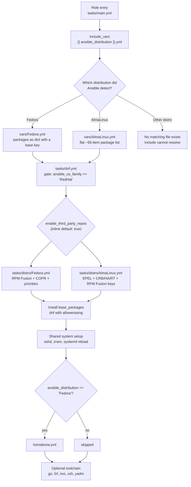

This page explains which operating systems the `b08x.devworkstation.base` role is built to configure, how it decides at runtime which platform it is running on, and exactly where the two supported targets — **Fedora** and **AlmaLinux** — diverge in behavior. By the end, you will understand the detection mechanism, the file-naming contract every supported distribution must fulfill, and the repository strategy each target follows.

## How the Role Detects Your Distribution

The role relies on facts Ansible collects about the target machine, and it uses them at two levels of granularity. The coarse level is the OS *family*: `tasks/dnf.yml` gates its DNF tuning block on `ansible_os_family == 'RedHat'`, which is true for every RPM-based distribution including both Fedora and AlmaLinux. The fine level is the *distribution* name itself: `tasks/main.yml` interpolates the `ansible_distribution` fact directly into file paths, so the exact string Ansible reports ("Fedora", "AlmaLinux") becomes a literal filename.

The first and most important interpolation happens at the very top of the role: the task `Include distribution package variables` resolves `{{ ansible_distribution }}.yml` against the `vars/` directory, loading either `vars/Fedora.yml` or `vars/AlmaLinux.yml` before anything else runs. A second interpolation later resolves `distro/{{ ansible_distribution }}.yml` against `tasks/distro/`, pulling in that distribution's repository setup tasks.

Sources: [tasks/main.yml](tasks/main.yml#L9-L11), [tasks/main.yml](tasks/main.yml#L25-L29), [tasks/dnf.yml](tasks/dnf.yml#L1-L7)

This creates a strict **naming contract**: a distribution is supported if and only if both `vars/<Distribution>.yml` and `tasks/distro/<Distribution>.yml` exist, with `<Distribution>` matching the `ansible_distribution` fact value *exactly*. Only two such pairs exist in this role. If you pointed the role at, say, a Rocky Linux host, the include path would resolve to `vars/Rocky.yml` — a file that does not exist here — so the include itself cannot resolve. This is why the supported-platform list is short and precise: it is defined by the file tree, not by a configuration setting.

Sources: [tasks/main.yml](tasks/main.yml#L9-L11)

## The Platform Routing Architecture

The diagram below shows how a single role entry point fans out into two platform-specific execution paths, then converges again on shared logic. Reading it top to bottom mirrors the actual order of `tasks/main.yml`: variables first, shared DNF tuning, distribution-specific repositories, the base package install, then system services, and finally the optional toolchain — with one last Fedora-only fork for Homebrew near the end.



Notice the two different gate styles on the same fact: the distro repository include uses string interpolation to *select* a file, while the Homebrew include uses an explicit equality comparison (`when: ansible_distribution == 'Fedora'`) to *skip* a task file on non-Fedora hosts. Interpolation routes, conditions filter.

Sources: [tasks/main.yml](tasks/main.yml#L9-L29), [tasks/main.yml](tasks/main.yml#L103-L106), [tasks/dnf.yml](tasks/dnf.yml#L1-L7)

## Platform-Relevant File Map

The platform-specific surface of the role is concentrated in a small set of files. This annotated tree shows which files participate in platform routing and what role each plays:

```
base/
├── meta/
│   └── main.yml                    # galaxy_info — platforms block commented out (see below)
├── defaults/
│   └── main.yml                    # Fedora-facing flags: base_enable_rpmfusion, base_copr_repos
├── vars/
│   ├── Fedora.yml                  # ← loaded when ansible_distribution == "Fedora"
│   └── AlmaLinux.yml               # ← loaded when ansible_distribution == "AlmaLinux"
├── tasks/
│   ├── main.yml                    # router: include_vars, distro include, conditional gates
│   ├── dnf.yml                     # shared DNF tuning (family-level RedHat gate)
│   ├── homebrew.yml                # included only on Fedora
│   └── distro/
│       ├── Fedora.yml              # ← included when ansible_distribution == "Fedora"
│       └── AlmaLinux.yml           # ← included when ansible_distribution == "AlmaLinux"
├── files/
│   └── etc/yum.repos.d/epel.repo   # AlmaLinux-only managed repo definition (EPEL 10)
└── tests/
    └── inventory                   # localhost target for local verification
```

Every file above the `distro/` level is shared by both targets; everything inside `distro/` (plus the two `vars/` variants and the EPEL repo file) is where the platforms genuinely differ. The next section compares those differences side by side.

Sources: [tasks/main.yml](tasks/main.yml#L1-L115), [vars/Fedora.yml](vars/Fedora.yml#L1-L8), [vars/AlmaLinux.yml](vars/AlmaLinux.yml#L1-L15)

## Side-by-Side: What Changes Between the Two Targets

### Repository Strategy

This is the largest divergence between the platforms. Fedora leans on its native third-party ecosystem (RPM Fusion and COPR), while the AlmaLinux path targets the enterprise add-on model (EPEL, CRB, and optional HighAvailability/RT channels). Both paths install RPM Fusion eventually — but by entirely different mechanisms, as this table shows:

| Aspect | Fedora (`tasks/distro/Fedora.yml`) | AlmaLinux (`tasks/distro/AlmaLinux.yml`) |
|---|---|---|
| Prerequisite packages | `python3-libdnf5`, `fedora-workstation-repositories`, `dnf-plugins-core` | `epel-release`, `distribution-gpg-keys`, `dnf-plugins-core` |
| EPEL | not used | installed, then **replaced** with a managed repo file from `files/` |
| Extra channels | `fedora-workstation-repositories` package | `crb`, `highavailability`, and `rt` enabled via `dnf config-manager` |
| RPM Fusion install | `dnf` module downloads release RPMs from `download1.rpmfusion.org` with `disable_gpg_check: true` | GPG keys imported via `ansible.builtin.rpm_key`, then release RPMs installed through a shell command |
| COPR repositories | looped over `base_copr_repos` via `community.general.copr` | not present |
| Repo priorities | active: `fedora`/`updates` = 0, `rpmfusion-*` = 90 | entire priorities block is commented out (reserves `base_dnf_priorities_required`) |
| Cache refresh | `dnf makecache` when RPM Fusion or COPR registrations changed | `dnf makecache` when EPEL or RPM Fusion steps changed |
| Failure handling | rescue block reports context, then re-raises unconditionally | both repository blocks do the same |

Two details in the AlmaLinux column deserve a beginner's attention. First, the role does not merely install `epel-release` — it immediately **overwrites** the stock EPEL repo file with its own copy from `files/etc/yum.repos.d/epel.repo`, taking direct control of the EPEL configuration. Second, the RPM Fusion step imports keys named `RPM-GPG-KEY-rpmfusion-*-el-10` before running a shell installer, because the release RPM cannot complete its own signature check without those keys present.

Sources: [tasks/distro/Fedora.yml](tasks/distro/Fedora.yml#L8-L53), [tasks/distro/Fedora.yml](tasks/distro/Fedora.yml#L70-L78), [tasks/distro/AlmaLinux.yml](tasks/distro/AlmaLinux.yml#L11-L56), [tasks/distro/AlmaLinux.yml](tasks/distro/AlmaLinux.yml#L58-L86), [tasks/distro/AlmaLinux.yml](tasks/distro/AlmaLinux.yml#L138-L146), [defaults/main.yml](defaults/main.yml#L8-L15)

### Package Variables

The package lists the two targets receive are dramatically different in both size and *shape*:

| Aspect | `vars/Fedora.yml` | `vars/AlmaLinux.yml` |
|---|---|---|
| Data structure | mapping — packages nested under a `base:` key | flat list |
| Entry count | 3 (`aria2`, `nodejs`, `npm`; `golang` commented out) | ~65 |
| Example entries | aria2, nodejs, npm | ffmpeg, kitty, zsh, python3-devel, uv, zram-generator |
| Extra tooling assumed present | — | the file covers compilers, kernels headers, audio stacks, and more |

The structural divergence matters as much as the size difference: the Fedora file wraps its list in a `base:` key while the AlmaLinux file is a bare list, yet the install task in `tasks/main.yml` consumes `base_packages` directly via `with_items: - "{{ base_packages }}"`. Whichever file loads, the role uses the variable as-is — so keep both shapes in mind if you ever override `base_packages` from your inventory. The distro-variables deep dive examines these files in full.

Sources: [vars/Fedora.yml](vars/Fedora.yml#L2-L7), [vars/AlmaLinux.yml](vars/AlmaLinux.yml#L2-L15), [tasks/main.yml](tasks/main.yml#L31-L40)

### Fedora-Only and Shared Includes

Most of the role's task files have no platform condition at all. Only one task file is distribution-filtered, and one is family-filtered:

| Task file | Condition | Effect |
|---|---|---|
| `tasks/dnf.yml` | `ansible_os_family == 'RedHat'` | runs on both targets |
| `tasks/distro/{{ ansible_distribution }}.yml` | `enable_third_party_repos | default(true) | bool` | routes to the matching distro file |
| `tasks/homebrew.yml` | `ansible_distribution == 'Fedora'` | skipped entirely on AlmaLinux |
| `intel.yml`, `gitflow.yml`, `go.yml`, `fzf.yml`, `inxi.yml`, `zsh.yml`, `yadm.yml` | none | runs identically on both targets |

In practice this means the toolchain layer (shells, search tools, Go, dotfile management) is platform-agnostic, and your experience of the role differs mainly in *which repositories feed the packages* and *which extra conveniences* (Homebrew) are available. For the full wiring picture, see [Task Orchestration: How tasks/main.yml Wires Everything](12-task-orchestration-how-tasks-main-yml-wires-everything).

Sources: [tasks/main.yml](tasks/main.yml#L82-L114), [tasks/dnf.yml](tasks/dnf.yml#L1-L7)

## How Each Target Resolves Its Version

An interesting pattern for newcomers: the role uses **three different techniques** to handle distribution versions, and each target showcases a different one.

1. **Ansible fact interpolation** — the Fedora RPM Fusion URLs embed `{{ ansible_distribution_major_version }}` directly, so the release RPM version follows whatever Fedora major version the host reports.
2. **RPM macro resolution at the shell level** — the AlmaLinux RPM Fusion installer runs `rpm -E %rhel` inside the command itself, letting the RPM macro engine state the Enterprise Linux major version at execution time rather than Ansible.
3. **Hardcoded pinning** — the managed `files/etc/yum.repos.d/epel.repo` fixes its `baseurl` to the EPEL **10** path on a specific mirror (`https://mirror.us.leaseweb.net/epel/10/Everything/$basearch/`), and the RPM Fusion GPG keys imported beforehand are also the `el-10` pair. The AlmaLinux path is effectively pinned to EL 10 today.

Sources: [tasks/distro/Fedora.yml](tasks/distro/Fedora.yml#L20-L36), [tasks/distro/AlmaLinux.yml](tasks/distro/AlmaLinux.yml#L61-L86), [files/etc/yum.repos.d/epel.repo](files/etc/yum.repos.d/epel.repo#L1-L10)

## Declared vs. Effective Support

Here is a subtlety worth knowing: the role's formal metadata does not actually declare any platforms. In `meta/main.yml`, the `platforms:` block of `galaxy_info` — which is what Ansible Galaxy uses to advertise supported distributions — is entirely commented out, alongside the empty `galaxy_tags` and `dependencies` lists. The only concrete declaration is `min_ansible_version: "2.14"`. This means the role's platform support is **effective, not declared**: it is defined by which `vars/` and `tasks/distro/` file pairs exist, not by metadata.

There is one more trap hiding in the routing layer. The gate `enable_third_party_repos` that controls the entire distro repository include is consumed with an inline `| default(true) | bool` in `tasks/main.yml` — it appears in neither `defaults/main.yml` nor `meta/argument_specs.yml`, which currently validate only the demo variable `base_my_variable`. So the flag works (it defaults to enabled), but it is undocumented at the formal layer. The defaults and validation deep dives cover both files in detail.

Sources: [meta/main.yml](meta/main.yml#L20-L42), [meta/main.yml](meta/main.yml#L53-L54), [tasks/main.yml](tasks/main.yml#L25-L29), [defaults/main.yml](defaults/main.yml#L1-L25), [meta/argument_specs.yml](meta/argument_specs.yml#L1-L12)

## Verifying on Your Own Machine

The bundled test inventory contains a single line: `localhost`. That is the intended starting point for confirming platform behavior on the distribution you are actually running — point a playbook at this inventory, let facts collection report your `ansible_distribution`, and watch which branch of the routing diagram your machine takes. The testing page walks through the full local verification workflow.

Sources: [tests/inventory](tests/inventory#L1-L2)

## Where to Go Next

This page gave you the platform map; the following catalog entries go deeper on each dimension:

- Understand exactly what each target's package variables define: [Distro-Specific Variables: vars/Fedora.yml and vars/AlmaLinux.yml](7-distro-specific-variables-vars-fedora-yml-and-vars-almalinux-yml)
- Trace the EPEL and RPM Fusion mechanics per platform: [Third-Party Repositories: EPEL and RPM Fusion Setup](9-third-party-repositories-epel-and-rpm-fusion-setup)
- Explore Fedora's COPR and priority model: [Fedora COPR Repositories and Package Priority Management](10-fedora-copr-repositories-and-package-priority-management)
- See the router in the context of the full task flow: [Task Orchestration: How tasks/main.yml Wires Everything](12-task-orchestration-how-tasks-main-yml-wires-everything)
- Understand the Fedora-only Homebrew include: [Homebrew on Linux and Intel Hardware Support](15-homebrew-on-linux-and-intel-hardware-support)
- Run the role locally before touching a real machine: [Test Inventory and Local Playbook Verification](19-test-inventory-and-local-playbook-verification)