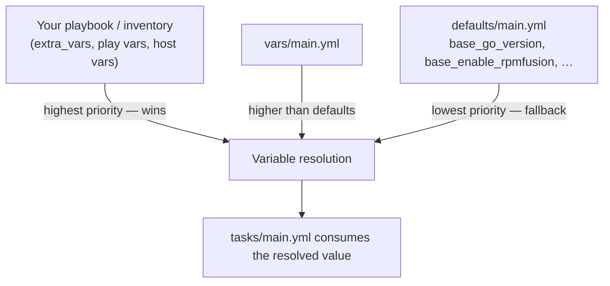

## Why this file matters

Every Ansible role has exactly one place where its **public configuration surface** lives: `defaults/main.yml`. Think of it as the role's "control panel" — the knobs an operator is meant to turn — as opposed to `vars/`, which holds values the role considers internal. This page explains what the `base` role exposes, how Ansible's variable precedence interacts with these defaults, and how to override them safely from a playbook. All findings below are drawn directly from the repository; nothing is speculative.

The file lives at [defaults/main.yml](defaults/main.yml#L1-L23) and identifies itself as *"defaults file for b08x.devworkstation.base"*. Notably, the sibling [vars/main.yml](vars/main.yml#L1-L3) contains **only its header comment** — the role deliberately keeps all named configuration in the overridable defaults layer, with no hidden constants. This is a good practice for consumer-facing roles: what you see in `defaults/` is the complete tuning surface.

## How Ansible resolves these values (beginner primer)

When the role runs, Ansible builds one final variable value per name by consulting sources in a strict priority order. Role defaults sit at the **bottom** of that ladder — they are used only when nothing else defines the variable:



Two prerequisites make this diagram concrete. First, role defaults are loaded automatically before any task runs — no `include_vars` needed. Second, the role's entry point [tasks/main.yml](tasks/main.yml#L1-L29) loads *distribution-specific* variables separately via `include_vars: "{{ ansible_distribution }}.yml"` (line 10), which is a **higher-precedence source than role defaults**. That means a distro file can legitimately override something declared in `defaults/main.yml` — useful when, say, Fedora and AlmaLinux need different repository behavior. The tasks themselves then consume the resolved values, e.g. the package list at [tasks/main.yml](tasks/main.yml#L31-L54) is installed from `"{{ base_packages }}"` (line 40).

## The overridable variables

The defaults file defines the following verified knobs:

| Variable | Default | Purpose (as evidenced in the code) |
|---|---|---|
| `base_go_version` | `1.27.1` | Go toolchain version, consumed by the Go installation task ([defaults/main.yml](defaults/main.yml#L8), [tasks/main.yml](tasks/main.yml#L87-L92)) |
| `base_enable_rpmfusion` | `true` | Controls RPM Fusion repository enablement; the accompanying comment notes that *"every other rescue in this role re-raises unconditionally"* — meaning this flag's failure path is the one deliberately softened ([defaults/main.yml](defaults/main.yml#L12)) |
| `base_zoxide_required` | `false` | Toggles whether zoxide is treated as required ([defaults/main.yml](defaults/main.yml#L23)) |
| `base_packages` | *(defined in defaults, value not captured here)* | The core package list consumed by the install task ([tasks/main.yml](tasks/main.yml#L31-L54)) |
| `base_install_go` | *(fallback `true` in task logic)* | Gate for the Go include; see the design note below ([tasks/main.yml](tasks/main.yml#L87-L92)) |

The role also ships an extensive feature/task catalog beyond these flags — fzf, inxi, gitflow, homebrew (Fedora-only), zsh, yadm, intel, and zram configuration — each reachable through its own tag (`intel`, `gitflow`, `go`, `fzf`, `inxi`, `homebrew`, `zsh`, `yadm`, `dnf`, `repos`, `packages`) per [tasks/main.yml](tasks/main.yml#L83-L114). A few of these are currently **hard-gated in code rather than via a defaults variable**: homebrew runs only `when: ansible_distribution == 'Fedora'` (line 105), and several optional tasks have no `when` clause at all, so they run unconditionally unless skipped by tag. If you want to disable one today, target its tag (`--skip-tags inxi`, for example) — or better, add a defaults flag yourself, which is exactly what this file is for.

## One design wart worth knowing about

The Go gate is written as `when: base_install_go | default(true) | bool` ([tasks/main.yml](tasks/main.yml#L92)). That `default(true)` fallback tells you the author was protecting against the variable being *undefined* — but it also means the task logic and the defaults file are not in lockstep: if `base_install_go` were added to `defaults/main.yml`, the fallback becomes redundant; if it isn't, operators must guess it exists. A stricter companion observation: [meta/argument_specs.yml](meta/argument_specs.yml#L1-L12) still contains the role-template placeholder `base_my_variable`, so argument validation has not been synchronized with the real variable set. Until that is fixed, **there is no schema enforcement** — typos in overrides will be silently accepted. Override with care.

## How to override (action guide)

Because role defaults are the lowest-precedence source, you override them from anywhere higher on the ladder. The most common pattern is a playbook-level `vars:` block:

```yaml
- hosts: workstations
  become: true
  roles:
    - role: b08x.devworkstation.base
  vars:
    base_go_version: "1.22.3"       # pin a different Go toolchain
    base_enable_rpmfusion: false    # skip RPM Fusion enablement
    base_zoxide_required: true      # make zoxide mandatory
```

For one-off command-line tweaks, `--extra-vars` (or `-e`) outranks everything and is the right tool for ephemeral experimentation: `ansible-playbook site.yml -e base_go_version=1.22.3`. Remember the two rules that bite beginners most often: (1) overrides in `vars/main.yml` would beat *your* inventory values — which is why keeping that file empty (as this role does) matters; and (2) the distro include at [tasks/main.yml](tasks/main.yml#L10) can itself override defaults, so check `vars/distro/<Distro>.yml` if your override appears to be ignored.

## Summary

The `base` role keeps its entire configuration surface in `defaults/main.yml` — version pins (`base_go_version`), feature toggles (`base_enable_rpmfusion`, `base_zoxide_required`, `base_install_go`), and the core package list (`base_packages`) — while leaving `vars/main.yml` intentionally empty. Distribution-specific variation flows through a separate, higher-precedence `include_vars` mechanism, and task-level gating is handled with tags plus `when` conditions. The main caveats for operators: the argument-spec validation scaffold is not yet wired to the real variables, and several optional tool tasks currently lack defaults-based toggles, relying on tag skipping instead.

**Related pages**: [Role Entry Point and Tag Architecture](tasks-main) · [Distribution-Specific Variables](include-vars) · [Go Toolchain Installation](go-install) · [Package Installation and Error Shaping](base-packages)