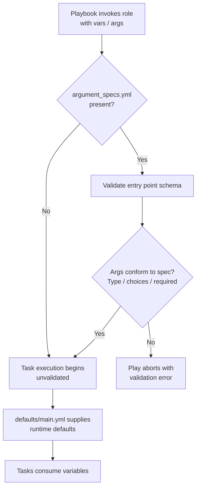

Every Ansible role has an implicit contract: a set of variables it expects to exist, with types, allowed values, and sensible defaults. When that contract lives only in someone's memory, the failure mode is familiar — a boolean arrives as a string, a list arrives where a scalar was expected, and the role breaks forty tasks deep into execution. The `meta/argument_specs.yml` file is Ansible's mechanism for making that contract machine-checkable. This page explains how the mechanism works, examines the current state of this role's spec, and — critically — analyzes where the spec and the role's real configuration surface have drifted apart.

## The Mechanism: How Role Argument Validation Works

When a playbook invokes a role, ansible-core consults `meta/argument_specs.yml` before running a single task. The file defines one or more **entry points** — `main` for the standard role invocation, plus named sub-entry points for `import_role`/`include_role` scenarios. Each entry point declares its options with a schema: type, default value, allowed choices, and required-ness. If an argument arrives that violates the schema, validation fails immediately and the play aborts with a precise error naming the offending variable — long before any `dnf` transaction or shell script has run.

There is a subtlety intermediate developers must internalize: this validation only intercepts variables **explicitly passed as role arguments** (via `vars:` on the role invocation or the `args:` keyword). Variables set through inventory, `group_vars`, or `extra-vars` flow into the role through the normal variable precedence machinery and *bypass* the spec entirely. The spec is a gate on the role's front door, not a firewall around the whole house. Its most reliable value is therefore documentation-as-code: a single, greppable declaration of the role's supported interface.

The role declares `min_ansible_version: "2.14"`, comfortably above the ansible-core 2.11 baseline where argument spec validation was introduced, so the mechanism is fully available here.



Two things this diagram makes explicit: validation runs **before** any task, and spec defaults do **not** replace `defaults/main.yml` — runtime defaults still come from the defaults directory, so the two files must be kept in sync manually. A spec default that disagrees with the actual default is a documentation lie waiting to bite a future maintainer.

Sources: [meta/main.yml](meta/main.yml#L20), [meta/argument_specs.yml](meta/argument_specs.yml#L4-L12)

## The Anatomy of an Option Definition

Each key under `entry_point.options` is one validated variable. The schema fields are few but each carries distinct semantics, and the role's existing spec demonstrates the minimal subset:

| Field | Purpose | Present in current spec |
|---|---|---|
| `type` | Enforced data type: `str`, `bool`, `int`, `list`, `dict`, `path` | ✅ `str` |
| `description` | Human-facing explanation; also feeds docs generation | ✅ |
| `default` | Documented default (kept in sync with `defaults/main.yml` by convention) | ✅ |
| `choices` | Whitelist of allowed values | ❌ absent |
| `required` | Marks the option as mandatory (validation fails if absent) | ❌ absent |
| `elements` | For `type: list`, the type of each element (`str`, `int`, …) | ❌ absent |

The current spec declares exactly one option — `base_my_variable`, a demonstration string defaulting to `"default_value"` — which is verifiably the `ansible-galaxy init` scaffold. It validates type and documents a default, but exercises none of the richer schema features.

Sources: [meta/argument_specs.yml](meta/argument_specs.yml#L8-L11), [defaults/main.yml](defaults/main.yml#L4-L6)

## Reality Check: The Spec Versus the Live Configuration Surface

Here is where this role becomes instructive in the other direction — as a cautionary case study. The role's *actual* tunable interface has grown considerably, while the spec has remained a stub. The README itself contains a generic argument-spec example, signaling that the pattern was understood but never applied to the real variables.

**Variables defined in defaults but absent from the spec:**

| Variable | Type in practice | Consumed where |
|---|---|---|
| `base_go_version` | version string | [tasks/go.yml](tasks/go.yml#L11-L17) |
| `base_enable_rpmfusion` | boolean | [tasks/distro/Fedora.yml](tasks/distro/Fedora.yml#L26-L35) |
| `base_copr_repos` | list of `owner/project` strings | [tasks/distro/Fedora.yml](tasks/distro/Fedora.yml#L42-L44) |
| `base_intel_graphics_required` | boolean (failure-strictness flag) | [tasks/intel.yml](tasks/intel.yml#L30-L31) |
| `base_zoxide_required` | boolean (failure-strictness flag) | [tasks/zsh.yml](tasks/zsh.yml#L73-L74) |
| `base_dnf_priorities_required` | boolean, referenced only in commented code | [tasks/distro/AlmaLinux.yml](tasks/distro/AlmaLinux.yml#L126-L136) |

**Variables consumed by tasks but defined in neither the spec nor defaults:** `base_packages` (supplied per-distro from `vars/` — see [Deep Dive: Distro-Specific Variables](7-distro-specific-variables-vars-fedora-yml-and-vars-almalinux-yml)), `base_install_go` (handled inline with `default(true)` in [tasks/main.yml](tasks/main.yml#L92)), and `enable_third_party_repos` (also inline-defaulted in [tasks/main.yml](tasks/main.yml#L25-L29)). The last of these is doubly inconsistent: it lacks the role's `base_` namespace prefix, breaking the naming convention every other knob follows.

The consequence is concrete: a user passing `base_enable_rpmfusion: "yes-please"` or `base_copr_repos: "atim/starship"` (a string instead of a list) receives no validation error. The boolean coercion may silently do the wrong thing, and the list-shaped string will surface as a confusing loop error deep inside the RPM Fusion tasks — precisely the late, opaque failure class argument specs exist to eliminate.

Sources: [defaults/main.yml](defaults/main.yml#L8-L24), [tasks/main.yml](tasks/main.yml#L92), [README.md](README.md#L55-L71)

## Closing the Gap: A Target Spec for This Role

The fix is mechanical, and writing it out doubles as a template for the checklist in [Adding a New Optional Tool: Task and Argument Spec Checklist](20-adding-a-new-optional-tool-task-and-argument-spec-checklist). Every defaults-defined variable above maps directly to a spec option:

```yaml
---
argument_specs:
  main:
    short_description: Base workstation provisioning role.
    options:
      base_my_variable:
        type: str
        description: A simple string argument for demonstration.
        default: "default_value"
      base_go_version:
        type: str
        description: Go toolchain version to install.
        default: "1.27.1"
      base_enable_rpmfusion:
        type: bool
        description: Whether to enable RPM Fusion repositories (Fedora/AlmaLinux).
        default: true
      base_copr_repos:
        type: list
        elements: str
        description: COPR repositories to enable, as "owner/project" pairs.
        default: []
      base_intel_graphics_required:
        type: bool
        description: Treat Intel graphics driver failures as play failures.
        default: false
      base_zoxide_required:
        type: bool
        description: Treat zoxide installation failure as a play failure.
        default: false
      base_dnf_priorities_required:
        type: bool
        description: Treat DNF priority configuration failure as a play failure.
        default: false
```

Three design decisions in this target spec deserve commentary. First, `base_copr_repos` uses `elements: str` so that a malformed single-string entry is rejected at the gate with a clear message. Second, the `*_required` booleans — the soft-fail strictness toggles examined in [Failure Shape Patterns: Context, Re-Raise, and Soft-Fail (base_zoxide_required)](17-failure-shape-patterns-context-re-raise-and-soft-fail-base_zoxide_required) — are declared as `bool` because they are consumed via `| bool` filters and would otherwise accept arbitrary truthy strings silently. Third, the inline-defaulted toggles `base_install_go` and `enable_third_party_repos` should be promoted into `defaults/main.yml` *and* the spec together, with `enable_third_party_repos` renamed to `base_enable_third_party_repos` to restore namespace consistency.

The relationship between the three configuration layers is worth visualizing, because the spec sits at the boundary rather than in the data path:

```mermaid
flowchart LR
    U[User role invocation<br>vars / args] -->|validated here| S[argument_specs.yml<br>type / choices / required gate]
    S -->|pass| D[defaults/main.yml<br>runtime defaults]
    S -->|fail| X[Play aborts]
    D --> T[Tasks consume variables]
    V[vars/distro files<br>base_packages] --> T
    T -.->|inline default\(\)<br>bypasses spec| T
```

The dashed edge is the current defect: variables defaulted inline inside task files with `default(true)` skip both the defaults layer and the validation layer, making them invisible in the role's documented interface.

Sources: [defaults/main.yml](defaults/main.yml#L10-L24), [tasks/main.yml](tasks/main.yml#L25-L29)

## The Cost-Benefit Ledger

To close the loop, a sober assessment of what the mechanism buys and what it costs, specific to a role of this shape:

| Consideration | Assessment for this role |
|---|---|
| Failure detection point | Moves variable misuse from mid-play (after DNF/repository mutations) to pre-task validation |
| Documentation | Spec becomes the authoritative, machine-readable interface statement — currently the README's generic example fills that role poorly |
| Coverage limitation | Inventory-sourced and extra-var-sourced variables bypass the gate; spec complements, not replaces, disciplined naming |
| Maintenance cost | Every new option requires a paired edit in `defaults/main.yml` and `argument_specs.yml` — the checklist in [page 20](20-adding-a-new-optional-tool-task-and-argument-spec-checklist) exists to enforce exactly this pairing |
| Current state | Spec is scaffold-only; the gap between it and the live surface is the role's main validation debt |

The verdict for a workstation role consumed interactively is that the cost is near-zero and the payoff concentrates in the worst failure class this codebase has: silent misconfiguration of repository and failure-strictness flags.

## Where to Go Next

The spec cannot be understood in isolation from the defaults it must mirror — start with [Defaults and Overridable Variables (defaults/main.yml)](5-defaults-and-overridable-variables-defaults-main-yml), then see how the unspec'd `base_packages` variable flows in from [Distro-Specific Variables: vars/Fedora.yml and vars/AlmaLinux.yml](7-distro-specific-variables-vars-fedora-yml-and-vars-almalinux-yml). The soft-fail booleans this page proposes to spec'd are analyzed behaviorally in [Failure Shape Patterns: Context, Re-Raise, and Soft-Fail (base_zoxide_required)](17-failure-shape-patterns-context-re-raise-and-soft-fail-base_zoxide_required), and the concrete procedure for keeping spec and defaults in sync when extending the role lives in [Adding a New Optional Tool: Task and Argument Spec Checklist](20-adding-a-new-optional-tool-task-and-argument-spec-checklist).