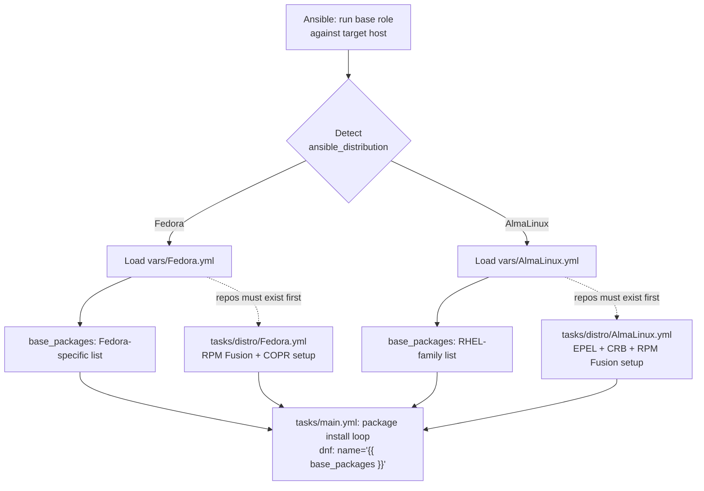

## Purpose and Scope

This page documents the **distribution-specific variable layer** of the `base` role — the two files, `vars/Fedora.yml` and `vars/AlmaLinux.yml`, that encode the packages and settings which genuinely differ between a Fedora workstation and an AlmaLinux (RHEL-family) workstation. It explains what these files contain, how they are selected at runtime, how their values are consumed by the role's tasks, and — critically — the implicit contract between these variables and the distribution-specific task files in `tasks/distro/`. Repository setup mechanics themselves (RPM Fusion, EPEL, CRB, COPR) are covered in their own page and only referenced here insofar as they constrain the variable values.

Sources: [vars/Fedora.yml](vars/Fedora.yml#L1-L2), [vars/AlmaLinux.yml](vars/AlmaLinux.yml#L1-L2)

## Architectural Hypothesis

The design problem these files solve is a classic Ansible layering question: a role must install a common set of workstation packages on multiple distributions, but the *availability* and *identity* of those packages diverges sharply between Fedora and RHEL-family systems. Fedora ships current multimedia and development tooling in official repositories plus RPM Fusion; AlmaLinux requires EPEL and CRB to approximate the same surface. Hardcoding one list in `defaults/main.yml` would force either a Fedora-only role or a large, unreadable conditional.

The pattern chosen here is **one variable file per supported distribution, each exposing the same variable contract** — most importantly the list `base_packages`. The task layer then has exactly one consumption point (the package-install loop in `tasks/main.yml`) and never needs a distribution conditional; the branching happens once, at variable selection, not at every task.



The dashed edges carry the essential coupling: **a `base_packages` entry is only resolvable if the distribution task file has configured the repository that provides it.** This is why the distro task files fail hard on repository setup errors rather than continuing — the comment in the AlmaLinux task file makes the rationale explicit: continuing after a repository failure would only relocate the failure to a later, less obvious package-install error.

Sources: [tasks/main.yml](tasks/main.yml#L40-L48), [tasks/distro/Fedora.yml](tasks/distro/Fedora.yml#L55-L68), [tasks/distro/AlmaLinux.yml](tasks/distro/AlmaLinux.yml#L89-L99)

## The Shared Contract: `base_packages`

Both variable files are built around a single primary key, `base_packages`, defined at the top of each file:

- [vars/Fedora.yml](vars/Fedora.yml#L2) — `base_packages:` is the file's first data key.
- [vars/AlmaLinux.yml](vars/AlmaLinux.yml#L2) — identical structure for the RHEL family.

The role's package installation task consumes this key exactly once, inside a `dnf` loop in [tasks/main.yml](tasks/main.yml#L40):

```yaml
- "{{ base_packages }}"
```

and registers a clear failure message when any entry cannot be resolved ([tasks/main.yml](tasks/main.yml#L48): *"Failed to install one or more packages from base_packages"*). This single-consumer design is the load-bearing property of the whole pattern: to add, remove, or fork a package between distributions, you edit **one variable file**, and you never touch the task logic.

The two lists are not parallel copies. They intentionally diverge in *content* while agreeing in *shape* (a flat list of package names resolvable by `dnf`). The comment inside the AlmaLinux task file confirms one known divergence: AlmaLinux's `base_packages` contains **multimedia entries** whose resolution depends on RPM Fusion being configured first ([tasks/distro/AlmaLinux.yml](tasks/distro/AlmaLinux.yml#L89)). For the authoritative, current package lists, read the two files directly — they are the single source of truth for their respective distributions, and this page deliberately documents the *mechanism* rather than duplicating a package inventory that will drift.

## Comparison: Fedora vs. AlmaLinux Variable Layer

Because the exact package inventories live in the files, the most useful comparison is structural — how each distribution's variable layer relates to its repository setup and task file:

| Dimension | `vars/Fedora.yml` | `vars/AlmaLinux.yml` |
|---|---|---|
| Primary key | `base_packages` (flat dnf-resolvable list) | `base_packages` (flat dnf-resolvable list) |
| Repository prerequisites | RPM Fusion (free/non-free), COPR repos, `fedora-workstation-repositories` | EPEL (managed repo config), CRB/PowerTools, RPM Fusion |
| Distro task file | [tasks/distro/Fedora.yml](tasks/distro/Fedora.yml#L1-L6) | [tasks/distro/AlmaLinux.yml](tasks/distro/AlmaLinux.yml#L1-L5) |
| Repo priority strategy | Official Fedora repos at priority 0, `rpmfusion-*` at priority 90 so base packages win ties | Priority setup largely commented out; behavior governed by repository ordering, with an optional hard-failure toggle |
| Known cross-coupling | Multimedia packages rely on RPM Fusion being enabled (`base_enable_rpmfusion`) | Multimedia entries in `base_packages` explicitly depend on RPM Fusion setup succeeding |
| Failure behavior of repos | Hard fail with guidance to set `base_enable_rpmfusion=false` to skip | Hard fail, `fail` task re-raises with context |
| Typical edit workflow | Edit one file, no task changes | Edit one file, no task changes |

Sources: [tasks/distro/Fedora.yml](tasks/distro/Fedora.yml#L8-L53), [tasks/distro/AlmaLinux.yml](tasks/distro/AlmaLinux.yml#L11-L56), [tasks/distro/AlmaLinux.yml](tasks/distro/AlmaLinux.yml#L109-L136)

## The Implicit Contract with `tasks/distro/`

The variable files cannot be understood in isolation. Every entry in `base_packages` makes an assumption about which repositories the distro task file has enabled. This produces a two-phase ordering contract inside the role:

1. **Phase 1 — Repositories**: the distribution task file (`tasks/distro/Fedora.yml` or `tasks/distro/AlmaLinux.yml`) configures third-party repositories and, on failure, **aborts the play** rather than continuing. Both files document this decision in their comments ("continuing here only relocates the failure somewhere less obvious").
2. **Phase 2 — Packages**: `tasks/main.yml` installs `base_packages` in one `dnf` transaction, now guaranteed that every needed repository exists.

On Fedora, this contract is reinforced by the priority configuration: `dnf config-manager setopt fedora.priority=0 updates.priority=0 rpmfusion-*.priority=90` ensures that when a package name exists in both official and RPM Fusion repositories, the official build wins — meaning `base_packages` entries are interpreted as "the Fedora-official package where available" without needing any per-package disambiguation in the variable file ([tasks/distro/Fedora.yml](tasks/distro/Fedora.yml#L47-L53)).

On AlmaLinux, the same class of ambiguity (EPEL or RPM Fusion shadowing a base package) is handled differently: the priority machinery exists but is commented out, with the comments explaining that priorities "only decide which repository wins a tie," and an opt-in `base_dnf_priorities_required` toggle can turn repository-shadowing risk into a hard failure ([tasks/distro/AlmaLinux.yml](tasks/distro/AlmaLinux.yml#L109-L136)).

## Editing Guidance (Before/After)

Adding a new package is a one-file edit per distribution. The before/after is deliberately trivial — that is the pattern's value:

| Scenario | Before | After |
|---|---|---|
| Add a package available on both distros | Append to `base_packages` in `vars/Fedora.yml` **and** `vars/AlmaLinux.yml` | Two symmetric one-line additions; no task changes |
| Add a Fedora-only package (e.g., something only in a COPR repo) | Append to `base_packages` in `vars/Fedora.yml` only | Add the COPR name to `base_copr_repos` if not already enabled, then add the package |
| Add a package from RPM Fusion | Append to `base_packages` in the relevant file(s) | Ensure `base_enable_rpmfusion` is true in the deployment; the distro task file guarantees repo availability or aborts |
| Remove a package | Delete the entry from the relevant list(s) | No task changes; idempotent `dnf` module does not uninstall, so see the package task page for removal semantics |

The one trap to internalize: **variables and repositories move together.** A package name added to `base_packages` without the corresponding repository being enabled will fail cleanly (the role aborts with the message at [tasks/main.yml](tasks/main.yml#L48)), but understanding *why* it failed requires knowing the Phase-1/Phase-2 ordering described above.

## Key Takeaways

- `vars/Fedora.yml` and `vars/AlmaLinux.yml` implement a **per-distribution variable layer with a shared contract**: the `base_packages` list, consumed exactly once by the package-install loop in `tasks/main.yml`.
- All distribution branching is pushed into variable selection and the `tasks/distro/` files; the task layer contains no `when: ansible_distribution` conditionals around package installation.
- The variable values are **coupled to repository configuration** by design, and both distro task files enforce that coupling with hard failures rather than degraded installs.
- The two files are the single source of truth for their distribution's package inventory — read them for exact contents; this page documents the architecture they participate in.

## Suggested Reading Progression

- Revisit how these files fit in the role layout: [Role Directory Anatomy: Ansible Standard Layout](3-role-directory-anatomy-ansible-standard-layout)
- See how variables are exposed to users in [Quick Start: Requirements, Variables, and First Run](2-quick-start-requirements-variables-and-first-run)
- Ground the whole design in [Overview: The b08x.devworkstation Base Role](1-overview-the-b08x-devworkstation-base-role)