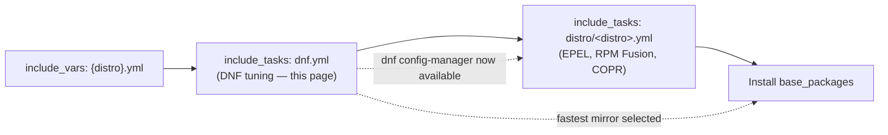
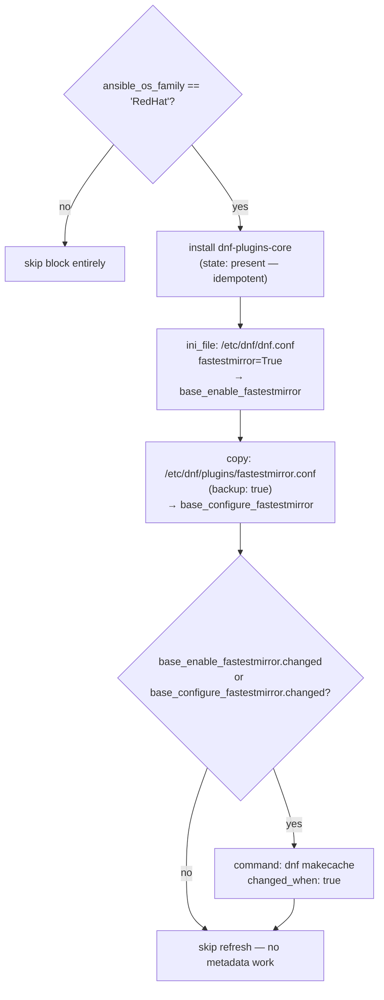

This page explains how the role optimizes DNF download performance on Red Hat-family systems before any packages are installed. The entire tuning surface lives in a single include file — `tasks/dnf.yml` — which installs the plugin tooling that later repository tasks depend on, switches on DNF's `fastestmirror` behavior in **two** configuration files, and refreshes the metadata cache only when something actually changed. By the end you will know what each task writes to disk, why the cache refresh is change-gated, and how the tag surface lets you re-run only this tuning.

Sources: [tasks/dnf.yml](tasks/dnf.yml#L1-L41)

## Where the Tuning Block Runs: Orchestration Context

`tasks/main.yml` includes `dnf.yml` immediately after loading distribution package variables and before any third-party repository configuration. The section header above the include literally labels it *"DNF Performance Optimization"*, and its tags (`["dnf", "base", "repos"]`) make the whole pipeline selectable with `--tags dnf`. This ordering is load-bearing: `dnf.yml` executes **before** `tasks/distro/<distro>.yml` and **before** the `base_packages` install block, so mirror selection is already active when the role's heaviest download work begins.

Sources: [tasks/main.yml](tasks/main.yml#L13-L19)

To read the diagram below: it shows the execution order of `tasks/main.yml` around the tuning include. The dashed edges mark the two guarantees `dnf.yml` creates for later phases — the `dnf config-manager` subcommand being available, and mirrors being pre-timed.

Because the include carries tags of its own, this block participates in selective runs: `--tags dnf`, `--tags mirrors`, or `--tags repo` all route here, while `--tags repos` pulls in both the tuning block and the distribution repository tasks that follow it.

Sources: [tasks/main.yml](tasks/main.yml#L17-L19), [tasks/dnf.yml](tasks/dnf.yml#L2-L5)

## The Four-Task Pipeline

The whole file is a single block named **`Configure DNF and fastestmirror`**, guarded by `when: ansible_os_family == 'RedHat'` so it is skipped cleanly on non-RHEL-family hosts, and tagged `["mirrors", "repo"]`. Inside, the tasks form a strict sequence: bootstrap a dependency, then write two configuration files, then optionally refresh the cache.

Sources: [tasks/dnf.yml](tasks/dnf.yml#L2-L5)

**Step 1 — install `dnf-plugins-core`.** The first task uses `ansible.builtin.dnf` with `name: dnf-plugins-core, state: present`. It is unconditional inside the block because everything downstream of it (the plugin configuration in Step 3, and `dnf config-manager` in the distro tasks) requires the package to exist.

Sources: [tasks/dnf.yml](tasks/dnf.yml#L6-L9)

**Step 2 — enable `fastestmirror` in `dnf.conf`.** The second task uses `community.general.ini_file` to set `fastestmirror=True` in the `[main]` section of `/etc/dnf/dnf.conf`. Two details are deliberate: `no_extra_spaces: true` writes the option compactly (`fastestmirror=True`, no whitespace around the `=`), and `mode: "0644"` pins file permissions. The result is registered as `base_enable_fastestmirror` for later gating.

Sources: [tasks/dnf.yml](tasks/dnf.yml#L11-L19)

**Step 3 — write the plugin tuning file.** The third task uses `ansible.builtin.copy` with inline `content` to create `/etc/dnf/plugins/fastestmirror.conf` containing a six-option `[main]` section (detailed below). It also sets `mode: "0644"` and — uniquely among the tasks in this file — `backup: true`, so a pre-existing plugin configuration is preserved before being replaced. The result is registered as `base_configure_fastestmirror`.

Sources: [tasks/dnf.yml](tasks/dnf.yml#L21-L34)

**Step 4 — change-gated cache refresh.** The final task runs `dnf makecache` via `ansible.builtin.command` with `changed_when: true`, and its `when` condition checks the two registered results from Steps 2 and 3: the cache is rebuilt only if at least one of them reports `changed`. This means a steady-state re-run performs no cache work at all, while a configuration-changing run immediately re-populates metadata against the (possibly new) fastest mirror.

Sources: [tasks/dnf.yml](tasks/dnf.yml#L36-L40)

## Two Configuration Surfaces for Mirror Speed

A defining pattern of this file is that fastestmirror is configured in **two layers**, and each layer uses a different Ansible mechanism. The table maps them:

| Surface | File | Mechanism | Registered var | Notes |
|---|---|---|---|---|
| Core DNF option | `/etc/dnf/dnf.conf` → `[main]` → `fastestmirror=True` | `community.general.ini_file` (surgical option edit) | `base_enable_fastestmirror` | flips on DNF's fastest-mirror selection |
| Plugin tuning | `/etc/dnf/plugins/fastestmirror.conf` → `[main]` (6 options) | `ansible.builtin.copy` (whole-file replace) | `base_configure_fastestmirror` | controls *how* mirrors are probed and cached |

This split is intentional in shape: `ini_file` edits a single key inside a file the user may own, while `copy` asserts the *entire* desired content of a plugin-specific file the role fully owns. The plugin file is where timing behavior is tuned — probe timeout, timing-cache location and age, and concurrency — while the `dnf.conf` boolean is what actually activates fastest-mirror selection for DNF as a whole.

Sources: [tasks/dnf.yml](tasks/dnf.yml#L11-L34)

## fastestmirror.conf Parameter Reference

The inline content written in Step 3 sets six options. Their values, exactly as written by the role:

| Option | Value | Role in mirror selection |
|---|---|---|
| `enabled` | `1` | activates the fastestmirror plugin |
| `verbose` | `true` | logs mirror timing details for visibility |
| `socket_timeout` | `3` | seconds before a stalled mirror probe is abandoned |
| `hostfilepath` | `timedhosts.txt` | file where per-mirror timing results are cached |
| `maxhostfileage` | `10` | days after which cached timings expire and mirrors are re-probed |
| `maxthreads` | `15` | maximum concurrent mirror probes during a timing sweep |

The short `socket_timeout` combined with `maxthreads` of 15 makes the probing phase quick and parallel; `maxhostfileage` bounds how stale the timing cache can become before a fresh sweep is forced. Together they mean that after the first post-change `dnf makecache`, subsequent downloads reliably start from the fastest known mirror.

Sources: [tasks/dnf.yml](tasks/dnf.yml#L21-L34)

## dnf-plugins-core: The Keystone Dependency

The `dnf-plugins-core` package installed in Step 1 is more than a plugin host — it provides the **`dnf config-manager`** subcommand that both distribution repository task files rely on later. On AlmaLinux, `dnf config-manager --set-enabled` activates the CRB, HighAvailability, and RT repositories; on Fedora, `dnf config-manager setopt` stamps priority values onto repositories. Without Step 1 running first, those downstream shell invocations would fail with an unknown-subcommand error.

Sources: [tasks/distro/AlmaLinux.yml](tasks/distro/AlmaLinux.yml#L35-L43), [tasks/distro/Fedora.yml](tasks/distro/Fedora.yml#L47-L53)

Notably, the package is installed at **three** sites across the role — an apparently redundant but deliberate idempotency strategy:

| Install site | Guard | What it enables downstream |
|---|---|---|
| `tasks/dnf.yml` (Step 1) | RedHat family, unconditional | all `config-manager` users; earliest guarantee |
| `tasks/distro/Fedora.yml` prerequisites (with `python3-libdnf5`, `fedora-workstation-repositories`) | Fedora include | COPR management and priority `setopt` |
| `tasks/distro/AlmaLinux.yml` EPEL loop (with `epel-release`, `distribution-gpg-keys`) | AlmaLinux repository block | CRB / HA / RT enablement |

Because `state: present` is idempotent, the extra installs cost only an `ok` status on repeat runs, while guaranteeing the plugin is present before the first `config-manager` call regardless of which distro path executes. The Fedora prerequisite task also installs `python3-libdnf5` alongside `dnf-plugins-core` — the plugin-backend support package for Fedora's DNF tooling.

Sources: [tasks/distro/Fedora.yml](tasks/distro/Fedora.yml#L8-L15), [tasks/distro/AlmaLinux.yml](tasks/distro/AlmaLinux.yml#L14-L23)

The COPR and priority mechanics these tasks implement are covered in detail on their own pages — see [Fedora COPR Repositories and Package Priority Management](10-fedora-copr-repositories-and-package-priority-management) and [Third-Party Repositories: EPEL and RPM Fusion Setup](9-third-party-repositories-epel-and-rpm-fusion-setup).

## Idempotency and Change-Gated Cache Refresh

The pipeline's reliability rests on a simple propagation chain: two tasks register their results, and one task consumes them. The flowchart shows the decision structure — everything above the diamond always runs (on RHEL-family hosts); only the diamond's "yes" branch touches the network.

Three details deserve attention. First, the gate uses registered **change flags** rather than a handler: the refresh is a conditional inline task, not a notified handler, which keeps the makecache execution point immediately adjacent to the configuration tasks that trigger it (the role's separate handler flow is covered in [Handlers and Conditional Reconfiguration Flow](18-handlers-and-conditional-reconfiguration-flow)). Second, `changed_when: true` makes the command task honest about its nature — it always reports `changed` when it runs, which is exactly when a cache rebuild is intended. Third, `backup: true` on the `copy` task means a replaced `fastestmirror.conf` leaves a rollback copy on disk, while the `ini_file` task relies on surgical single-option editing as its own safety mechanism.

Sources: [tasks/dnf.yml](tasks/dnf.yml#L11-L40)

This is one of three `dnf makecache` sites in the role — the same change-gated pattern reappears after repository changes in both distro task files. A consolidated comparison of all three refresh triggers is the subject of [Metadata Cache Refresh Strategy and Change Detection](11-metadata-cache-refresh-strategy-and-change-detection).

Sources: [tasks/distro/Fedora.yml](tasks/distro/Fedora.yml#L70-L78), [tasks/distro/AlmaLinux.yml](tasks/distro/AlmaLinux.yml#L138-L146)

## First Run vs. Steady State

The practical effect of the gating design is visible when comparing a fresh host with a converged one:

| Task | First run | Converged re-run |
|---|---|---|
| Install `dnf-plugins-core` | `changed` (package installed) | `ok` (already present) |
| Set `fastestmirror=True` in `dnf.conf` | `changed` (option written) | `ok` (option unchanged) |
| Write `fastestmirror.conf` | `changed` (file created, prior backed up) | `ok` (content identical) |
| `dnf makecache` | runs (change detected) | **skipped** (no change detected) |

This is the signature of a well-formed idempotent block: all mutation work converges to `ok`, and the expensive network-bound cache rebuild is skipped entirely unless a configuration file actually moved.

Sources: [tasks/dnf.yml](tasks/dnf.yml#L6-L40)

## Targeting Just the Tuning: Tag Surface

The block exposes two tag layers you can use for selective execution:

| Tag | Attached to | Effect |
|---|---|---|
| `dnf` | the `include_tasks` in `tasks/main.yml` | selects the tuning include and its tasks |
| `base`, `repos` | the same include | also drags in neighboring role phases (`repos` additionally selects distro repository tasks) |
| `mirrors` | the inner block in `tasks/dnf.yml` | targets the tuning pipeline directly |
| `repo` | the inner block in `tasks/dnf.yml` | same as `mirrors`, and also matches other repo-tagged tasks role-wide |

So `ansible-playbook ... --tags mirrors` re-runs exactly these four tasks — useful for verifying mirror tuning on an already-provisioned host without touching repositories or packages.

Sources: [tasks/dnf.yml](tasks/dnf.yml#L2-L5), [tasks/main.yml](tasks/main.yml#L17-L19)

## Next Steps

The tuning block is the foundation the repository pages build on. Continue with [Third-Party Repositories: EPEL and RPM Fusion Setup](9-third-party-repositories-epel-and-rpm-fusion-setup) to see the AlmaLinux repository block that consumes `dnf-plugins-core`, then [Fedora COPR Repositories and Package Priority Management](10-fedora-copr-repositories-and-package-priority-management) for the `config-manager setopt` priority machinery. For a consolidated view of all three `dnf makecache` sites and their change-detection triggers, see [Metadata Cache Refresh Strategy and Change Detection](11-metadata-cache-refresh-strategy-and-change-detection), and for how `dnf.yml` fits into the full execution order, see [Task Orchestration: How tasks/main.yml Wires Everything](12-task-orchestration-how-tasks-main-yml-wires-everything).