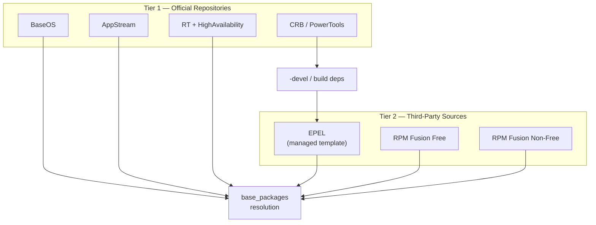
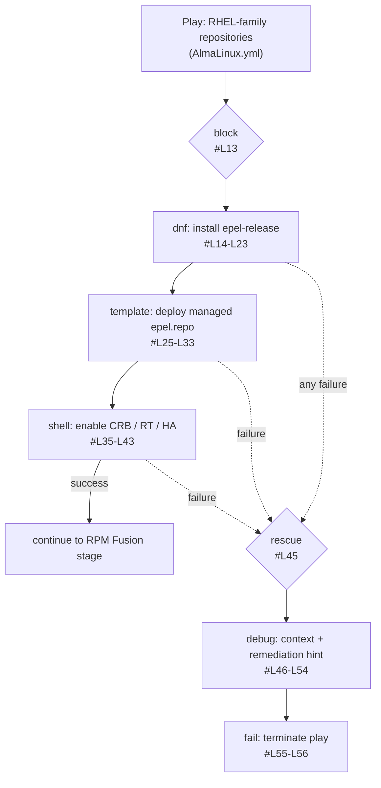
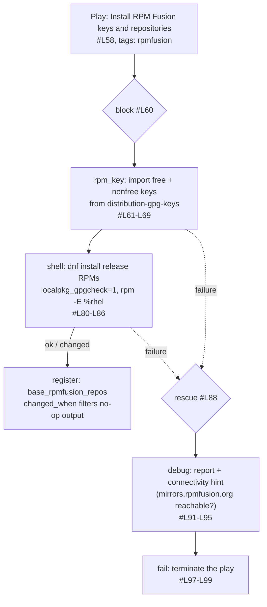
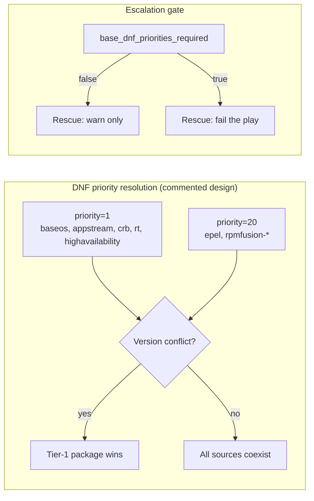

Every enterprise Linux host starts with a clean, conservative package universe: BaseOS and AppStream ship what Red Hat certifies, and nothing else. The moment a workstation needs multimedia codecs, a desktop needs fonts that were never certified, or a server needs a utility that lives only in EPEL, that universe must be deliberately — and *carefully* — expanded. This page documents how the `base` role performs that expansion on RHEL-family hosts: the two-stage setup in [tasks/distro/AlmaLinux.yml](tasks/distro/AlmaLinux.yml#L4), the managed EPEL repository template, and the DNF priority strategy that keeps third-party sources from shadowing the base distribution.

The design hypothesis is simple: third-party repositories are a *dependency*, not a convenience. EPEL and CRB carry the resolution chain for most of `base_packages` (the task header at [tasks/distro/AlmaLinux.yml](tasks/distro/AlmaLinux.yml#L4) states this explicitly), and RPM Fusion is a hard prerequisite for the role's multimedia entries. If either setup fails, the role treats it as a fatal condition and stops — with a structured, context-rich error message — rather than letting a later package task fail with a confusing "nothing provides..." error.

Sources: [AlmaLinux.yml](tasks/distro/AlmaLinux.yml#L1-L10)

## Repository Stack Architecture

The role organizes repositories into two tiers. The first tier contains the official AlmaLinux repositories — BaseOS, AppStream, CRB (formerly PowerTools), and the RT/HighAvailability pair. The second tier contains the third-party sources: EPEL for community packages and RPM Fusion Free/Non-Free for multimedia and restricted drivers. CRB sits between the tiers functionally: it is an *official* repository, but its purpose is to supply build-time dependencies that EPEL packages expect, which is why it is enabled in the same block as EPEL.



This layering is not cosmetic — it directly determines whether a `dnf install` succeeds. A package in `base_packages` whose dependencies chain into EPEL will fail unless EPEL *and* CRB are both enabled; a multimedia package will fail unless RPM Fusion is present. The role's rescue blocks encode exactly these failure modes, as shown in the next sections.

Sources: [AlmaLinux.yml](tasks/distro/AlmaLinux.yml#L35-L46), [AlmaLinux.yml](tasks/distro/AlmaLinux.yml#L88-L90)

## Stage 1: EPEL, CRB, and the Official Extension Repositories

The first play in [tasks/distro/AlmaLinux.yml](tasks/distro/AlmaLinux.yml#L13-L56) runs as a `block` with three sequential tasks. The first installs `epel-release` from the distribution's own repositories — the bootstrap step, using only fully trusted sources. The second replaces the stock EPEL repo file that `epel-release` drops into `/etc/yum.repos.d/` with the role's managed template, ensuring the repository's behavior (enablement, GPG policy, priority) is declaratively controlled rather than left to whatever the upstream RPM ships. The third enables CRB and the additional extension repositories, with the tag set `["highavailability", "crb", "rt"]` recording the full coverage of that step.

| # | Task | Module | Purpose | Tags | Lines |
|---|------|--------|---------|------|-------|
| 1 | Install EPEL repository | `ansible.builtin.dnf` | Bootstrap `epel-release` from official repos | `epel` | [#L14-L23](tasks/distro/AlmaLinux.yml#L14-L23) |
| 2 | Replace stock EPEL repo | `ansible.builtin.template` | Deploy managed `/etc/yum.repos.d/epel.repo` | `epel`, `repositories` | [#L25-L33](tasks/distro/AlmaLinux.yml#L25-L33) |
| 3 | Enable PowerTools/CRB and additional repos | `ansible.builtin.shell` | Turn on CRB, RT, HighAvailability | `highavailability`, `crb`, `rt` | [#L35-L43](tasks/distro/AlmaLinux.yml#L35-L43) |

The `rescue` block (beginning at [tasks/distro/AlmaLinux.yml](tasks/distro/AlmaLinux.yml#L45)) follows the role's "Shape 1" error pattern: add context, then re-raise. The inline comment at [#L46](tasks/distro/AlmaLinux.yml#L46) records *why* this is fatal — EPEL and CRB carry most of the base package set — and the rescue emits a debug message pointing at the failing operation before a hard `fail` task terminates the play with "RHEL-family repository configuration failed" ([#L55-L56](tasks/distro/AlmaLinux.yml#L55-L56)). There is no silent degradation path: a host without EPEL is treated as a host the role cannot configure correctly.



Sources: [AlmaLinux.yml](tasks/distro/AlmaLinux.yml#L13-L56)

## Stage 2: RPM Fusion Keys and Release Packages

The second play ([tasks/distro/AlmaLinux.yml](tasks/distro/AlmaLinux.yml#L58-L99), tagged `rpmfusion`) handles the trickier case. RPM Fusion's release packages are not signed with a key that the distribution's DNF configuration already trusts, so installing them blind would either fail or — worse — require disabling verification. The role solves this in two explicit steps.

First, both GPG keys are imported with the `rpm_key` module before any RPM Fusion RPM touches the system ([#L61-L69](tasks/distro/AlmaLinux.yml#L61-L69)). Notably, the keys are *not* fetched from the network: they come from the locally installed `distribution-gpg-keys` package (`/usr/share/distribution-gpg-keys/rpmfusion/RPM-GPG-KEY-rpmfusion-free-el-10` and the nonfree counterpart), which anchors trust in the distribution's own keyring rather than in a live download.

Second, the release packages themselves are installed via a shell task ([#L80-L86](tasks/distro/AlmaLinux.yml#L80-L86)) that combines two deliberate choices:

```shell
dnf --setopt=localpkg_gpgcheck=1 install -y \
    https://mirrors.rpmfusion.org/free/el/rpmfusion-free-release-$(rpm -E %rhel).noarch.rpm \
    https://mirrors.rpmfusion.org/nonfree/el/rpmfusion-nonfree-release-$(rpm -E %rhel).noarch.rpm
```

`localpkg_gpgcheck=1` forces DNF to verify the locally downloaded RPMs against the keys imported in step one — closing the trust gap that a plain URL install would otherwise create. The `$(rpm -E %rhel)` expression resolves the target EL major version at execution time, so the same task logic remains valid across distribution versions without hardcoding "10" into the URL. Finally, `changed_when` ([#L86](tasks/distro/AlmaLinux.yml#L86)) inspects DNF's stdout for `"Nothing to do"` and `"already installed"`, so idempotent re-runs report `ok` instead of spurious `changed` states.

The repository file also documents the alternative approach: a commented-out block ([#L71-L79](tasks/distro/AlmaLinux.yml#L71-L79)) shows the pure-module variant using `ansible.builtin.dnf` with a loop over the release URLs. The comparison below explains why the shell form won.

| Aspect | `dnf` module variant (commented) | `shell` variant (active) |
|---|---|---|
| Location | [#L71-L79](tasks/distro/AlmaLinux.yml#L71-L79) | [#L80-L86](tasks/distro/AlmaLinux.yml#L80-L86) |
| GPG verification of the release RPM | Requires `sslverify: false` to work around the chicken-and-egg problem | Cleanly enforced via `localpkg_gpgcheck=1` after keys are pre-imported |
| Version flexibility | URL must be templated with the EL version at authoring time | `rpm -E %rhel` resolves the version on the target host |
| Idempotency reporting | Module-native change detection | Simulated via `changed_when` output parsing |
| Ansible-idiomatic? | Yes, but at the cost of weakened verification | Less idiomatic, but strictly more secure end-to-end |

The trade-off table captures the central engineering decision: the module variant's `sslverify: false` workaround would defeat the very GPG policy the role just established, so the shell approach — with keys imported first and `localpkg_gpgcheck` switched on — is the only variant that satisfies both trust and flexibility requirements.

Sources: [AlmaLinux.yml](tasks/distro/AlmaLinux.yml#L58-L99)

## Failure Semantics: Why RPM Fusion Failure Is Fatal

The RPM Fusion rescue block ([tasks/distro/AlmaLinux.yml](tasks/distro/AlmaLinux.yml#L88-L99)) follows the same Shape 1 pattern as Stage 1, but the justification comment differs in an important way: multimedia entries in `base_packages` resolve *against RPM Fusion* and will fail to install without it ([#L89-L90](tasks/distro/AlmaLinux.yml#L89-L90)). In other words, skipping the failure here would not produce a partially-configured host — it would produce a host that fails later with a dependency error whose root cause is far away from the actual problem. Failing early, at the point of causation, is the entire point of the block/rescue structure:



The debug message even includes the most common operational failure — mirror reachability — so the on-call engineer gets an actionable hint rather than a stack trace.

Sources: [AlmaLinux.yml](tasks/distro/AlmaLinux.yml#L88-L99)

## The Managed EPEL Repository Template

After `epel-release` installs the stock configuration, the role immediately overwrites `/etc/yum.repos.d/epel.repo` with its own managed template ([tasks/distro/AlmaLinux.yml](tasks/distro/AlmaLinux.yml#L25-L33), sourced from `templates/etc/yum.repos.d/epel.repo`). This is the pattern that makes the repository stack auditable: instead of three different machines having three slightly different EPEL configurations — each drifting with whatever defaults the upstream RPM shipped this quarter — every host receives a byte-identical, version-controlled definition that Ansible will converge on every run. Any change to EPEL's enablement, GPG policy, or priority is a one-line diff in the role, not a manual `dnf config-manager` operation on a live host.

Sources: [AlmaLinux.yml](tasks/distro/AlmaLinux.yml#L25-L33), [epel.repo](templates/etc/yum.repos.d/epel.repo#L1-L59)

## The DNF Priority Strategy (Designed, Currently Disabled)

The most architecturally interesting part of the file is *not executed*. A fully specified priority-configuration block exists in commented form at [tasks/distro/AlmaLinux.yml](tasks/distro/AlmaLinux.yml#L105-L136), and it encodes the intended long-term policy for resolving package-version conflicts between tiers:

| Repository | Priority | Tier Rationale |
|---|---|---|
| `baseos`, `appstream` | 1 | Base system packages must never be shadowed |
| `crb`, `rt`, `highavailability` | 1 | Official extension tier — same trust level as base |
| `epel` | 20 | Third-party tier — loses any version tie against tier 1 |
| `rpmfusion-*` | 20 | Must sit at the *same* tier as EPEL (per the inline comment at [#L117](tasks/distro/AlmaLinux.yml#L117)) |

The rescue block for this section is equally instructive: the comment at [#L123-L126](tasks/distro/AlmaLinux.yml#L123-L126) notes that priorities only decide *which repository wins a tie* — DNF functions correctly without them, using its default ordering — but without them EPEL or RPM Fusion may shadow a base package. The failure therefore starts as a warning, and only becomes a hard failure when the host variable `base_dnf_priorities_required` is set to true ([#L134-L136](tasks/distro/AlmaLinux.yml#L134-L136)). This is the role's "Shape 3" rescue pattern: an *optional* hardening step whose severity is configurable per host.



Today the block is disabled and the play instead ends with a conditional `command` task ([tasks/distro/AlmaLinux.yml](tasks/distro/AlmaLinux.yml#L139-L145)) that runs only when the EPEL install, the RPM Fusion key import, or the RPM Fusion release install actually changed state — the three registered results `base_epel_install`, `base_rpmfusion_keys`, and `base_rpmfusion_repos` feed the `when` condition at [#L143-L145](tasks/distro/AlmaLinux.yml#L143-L145). This keeps repository state and DNF's caches synchronized without running a DNF operation on every idempotent pass.

Sources: [AlmaLinux.yml](tasks/distro/AlmaLinux.yml#L105-L145)

## Operator Reference

The following table consolidates the configuration surface an operator interacts with on this page's subject matter:

| Knob | Type | Effect | Defined At |
|---|---|---|---|
| `tags: ["epel"]` | Ansible tag | Run only the EPEL bootstrap and template tasks | [#L23](tasks/distro/AlmaLinux.yml#L23), [#L33](tasks/distro/AlmaLinux.yml#L33) |
| `tags: ["rpmfusion"]` | Ansible tag | Run only the RPM Fusion key/release tasks | [#L59](tasks/distro/AlmaLinux.yml#L59), [#L69](tasks/distro/AlmaLinux.yml#L69) |
| `tags: ["highavailability", "crb", "rt"]` | Ansible tag | Run only the CRB/RT/HA enablement task | [#L43](tasks/distro/AlmaLinux.yml#L43) |
| `base_dnf_priorities_required` | Host variable (bool) | Escalate priority-setup failure from warning to fatal (when the priority block is re-enabled) | [#L136](tasks/distro/AlmaLinux.yml#L136) |
| `templates/etc/yum.repos.d/epel.repo` | Managed template | Overrides stock EPEL configuration on every run | [#L25-L33](tasks/distro/AlmaLinux.yml#L25-L33) |

When troubleshooting a failed run on a RHEL-family host, the diagnostic sequence mirrors the dependency chain itself: confirm the official repositories resolve first (the Stage 1 rescue message points there), then check EPEL/CRB reachability, and finally check `mirrors.rpmfusion.org` connectivity — the RPM Fusion rescue message at [#L91-L95](tasks/distro/AlmaLinux.yml#L91-L95) already names this as the most likely failure.

Sources: [AlmaLinux.yml](tasks/distro/AlmaLinux.yml#L91-L95), [AlmaLinux.yml](tasks/distro/AlmaLinux.yml#L25-L33)

## Suggested Reading Progression

This page sits within the base-role catalog in a dependency-first sequence. If you are reading the catalog cover to cover, the recommended order is:

1. [Ansible Base Role Overview](base-role-overview) — the role's structure, entry points, and how distro-specific task files are selected. Read first: this page assumes you know where [tasks/distro/AlmaLinux.yml](tasks/distro/AlmaLinux.yml#L1-L10) sits in the execution order.
2. [Package Management with base_packages](base-packages) — the package list that *consumes* the repositories configured here; it explains why EPEL and RPM Fusion failures are fatal upstream.
3. [This page — Third-Party Repositories: EPEL and RPM Fusion Setup](third-party-repositories) — the tier-2 repository stack and its trust model.
4. [Block/Rescue Error Handling Patterns](base-error-handling) — a catalog-wide treatment of the "Shape 1" (context, then re-raise) and "Shape 3" (optional hard failure) rescue patterns referenced throughout this page.
5. [DNF Configuration and Optimization](base-dnf-configuration) — the priority-tier strategy and DNF performance tuning, including the currently-disabled block at [#L105-L136](tasks/distro/AlmaLinux.yml#L105-L136).