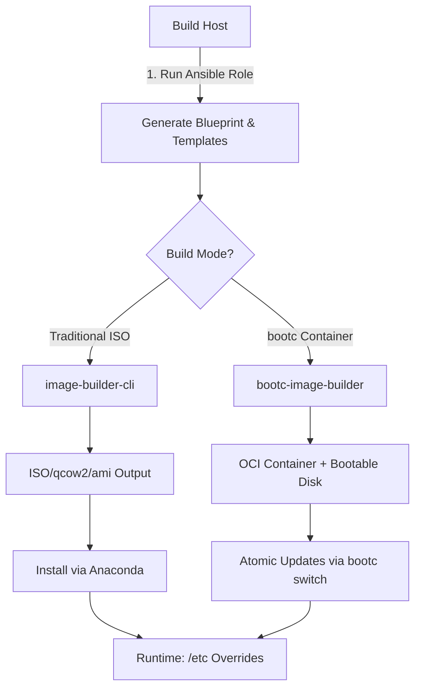

The **OSBuild Ansible role** is a comprehensive, modular system for automating the creation of custom workstation images for **Fedora**, **AlmaLinux**, and **Rocky Linux**. It enables developers, system administrators, and DevOps engineers to generate **immutable**, **reproducible**, and **highly customized** operating system images with minimal manual intervention. This role supports both **traditional ISO-based installations** and **modern container-based (bootc) deployments**, making it versatile for a wide range of use cases, from bare-metal workstations to cloud-native infrastructure.

## Purpose and Scope

The primary purpose of the OSBuild role is to **automate the end-to-end workflow** for building custom Linux images. It achieves this by:
- **Abstracting complexity**: Hiding the intricacies of `image-builder-cli` and `bootc-image-builder` behind a declarative, component-based interface.
- **Ensuring reproducibility**: Generating images from version-controlled blueprints and templates.
- **Supporting immutability**: Implementing the **Ansible Role Inversion Pattern** to compile configurations at build time, ensuring that the deployed image is the exact desired state.
- **Enabling flexibility**: Allowing users to select from a **modular component system** to tailor images to specific needs (e.g., GNOME, Sway, NVIDIA GPU support, Intel oneAPI, container tooling).

**Key Use Cases**:
| Use Case | Description | Build Mode |
|----------|-------------|------------|
| **Custom Workstation Deployment** | Pre-configured images for developers with specific toolchains (e.g., NVIDIA CUDA, Intel oneAPI). | Traditional ISO or bootc |
| **Immutable Infrastructure** | Atomic, versioned OS images for GitOps workflows. | bootc |
| **CI/CD Pipeline Integration** | Automated image builds with validated configurations. | Both |
| **GPU-Accelerated Environments** | Images with NVIDIA drivers, CUDA, and Container Device Interface (CDI) for GPU passthrough. | Both |
| **Desktop Environment Customization** | Images with GNOME, Sway, or other window managers pre-configured. | Both |

Sources: [README.md](README.md#L1-L50), [meta/main.yml](meta/main.yml#L1-L33)

---

## Architectural Overview

The OSBuild role is designed around **three core architectural principles**:
1. **Component-Based Modularity**: Users select from a library of pre-defined components (e.g., `nvidia`, `gnome`, `development`), each of which contributes packages, services, kernel arguments, and repository sources to the final image.
2. **Build-Time Configuration Compilation**: Ansible runs **during the image build process** (not post-deployment) to compile configurations into `/usr/etc` (vendor defaults), ensuring immutability.
3. **Dual Build Mode Support**: The role dynamically adapts to either **traditional ISO builds** (using `image-builder-cli`) or **container-based builds** (using `bootc-image-builder`).

### Ansible Role Inversion Pattern
The role implements an **inverted pattern** for bootc-based images, where:
- **Ansible executes inside the Containerfile** during the build process.
- **Configurations target `/usr/etc`** (immutable vendor layer) instead of `/etc` (mutable runtime overrides).
- **Runtime state is a merge** of `/usr/etc` (vendor defaults) and `/etc` (local overrides).



**Key Benefits**:
- ✅ **Immutable Infrastructure**: Configurations are baked into the image.
- ✅ **Declarative State**: The image **is** the desired state.
- ✅ **Testable in CI**: Validate configurations before deployment.
- ✅ **Atomic Upgrades**: `bootc switch` updates the entire OS atomically.
- ✅ **No Configuration Drift**: Runtime state cannot diverge from the image.

Sources: [README.md](README.md#L20-L80), [tasks/select_build_mode.yml](tasks/select_build_mode.yml#L1-L33), [templates/Containerfile.bootc.j2](templates/Containerfile.bootc.j2#L1-L50)

---

## Build Modes: Traditional vs. Bootc

The OSBuild role supports **two distinct build modes**, each tailored to different deployment scenarios:

| **Aspect**               | **Traditional (image-builder-cli)**                          | **Bootc (Container-based)**                                  |
|--------------------------|-------------------------------------------------------------|-------------------------------------------------------------|
| **Output**               | ISO, qcow2, AMI, VHD, VMDK                                   | OCI container image + bootable disk                         |
| **Update Mechanism**     | DNF package updates                                         | Atomic container updates (`bootc switch`)                   |
| **Configuration Layer**  | `/etc` (mutable)                                             | `/usr/etc` (vendor) + `/etc` (runtime overrides)             |
| **Ansible Execution**    | Post-deployment (on target system)                          | **Build-time** (inside Containerfile)                       |
| **Use Case**             | Bare-metal installations, traditional deployments          | Immutable infrastructure, GitOps, cloud-native environments |
| **First-Boot Automation**| Kickstart files for Anaconda installer                     | Embedded Ansible playbooks in Containerfile                 |
| **GPU Support**          | NVIDIA drivers, CUDA, CDI via RPM Fusion                     | NVIDIA drivers, CUDA, CDI via bootc repos                   |

**When to Use Each Mode**:
- **Traditional ISO**:
  - You need a **bootable ISO** for bare-metal or virtual machine installation.
  - You prefer **package-based updates** (DNF).
  - You require **maximum runtime flexibility** (e.g., modifying `/etc` post-install).
- **Bootc Container**:
  - You want **atomic, image-based OS updates**.
  - You are implementing **GitOps workflows**.
  - You need **guaranteed configuration consistency** (no drift).
  - You want to **test the exact runtime state in CI**.

Sources: [README.md](README.md#L80-L120), [tasks/build.yml](tasks/build.yml#L1-L50), [tasks/bootc.yml](tasks/bootc.yml#L1-L50)

---
## Project Structure

The OSBuild role is organized into **logical directories** that separate concerns for maintainability and clarity:

```mermaid
graph TD
    A[/roles/osbuild] --> B[defaults/main.yml]
    A --> C[meta/main.yml]
    A --> D[tasks/]
    A --> E[templates/]
    A --> F[files/]
    A --> G[vars/]
    A --> H[tests/]

    D --> D1[main.yml]
    D --> D2[build.yml]
    D --> D3[bootc.yml]
    D --> D4[blueprint.yml]
    D --> D5[select_build_mode.yml]
    D --> D6[sources.yml]
    D --> D7[install.yml]
    D --> D8[validate_components.yml]

    E --> E1[blueprint.toml.j2]
    E --> E2[Containerfile.bootc.j2]
    E --> E3[build.sh.j2]
    E --> E4[iso.toml.j2]
    E --> E5[disk.toml.j2]

    F --> F1[kickstart/]
    F --> F2[firstboot/]
    F --> F3[bootc/]

    G --> G1[AlmaLinux.yml]
    G --> G2[Fedora.yml]
    G --> G3[Rocky.yml]
    G --> G4[packages.yml]
```

**Directory Descriptions**:
| Directory | Purpose |
|-----------|---------|
| **`defaults/`** | Default variables, including component definitions and backward compatibility layers. |
| **`meta/`** | Role metadata (e.g., supported platforms, dependencies). |
| **`tasks/`** | Ansible tasks for infrastructure setup, repository configuration, and build execution. |
| **`templates/`** | Jinja2 templates for blueprints, Containerfiles, and build scripts. |
| **`files/`** | Static files (e.g., Kickstart configurations, first-boot scripts). |
| **`vars/`** | Distribution-specific variables (e.g., package lists for Fedora, AlmaLinux, Rocky). |
| **`tests/`** | Validation scripts and test suites for components, blueprints, and build modes. |

Sources: [Directory Structure](.), [defaults/main.yml](defaults/main.yml#L1-L200)

---
## Core Features

The OSBuild role provides a **rich set of features** out of the box, enabled through its modular component system:

| **Feature**               | **Description**                                                                 | **Component**          |
|---------------------------|---------------------------------------------------------------------------------|------------------------|
| **Dual Desktop Environments** | GNOME 49 + Sway window manager with pre-configured settings.                     | `gnome`, `sway`        |
| **NVIDIA GPU Support**   | Proprietary drivers, CUDA toolkit, and Container Device Interface (CDI) for GPU passthrough. | `nvidia`               |
| **Intel oneAPI**          | Intel oneAPI BaseKit + HPCKit (adds ~15GB to ISO).                              | `oneapi`               |
| **Container Tooling**     | Podman, Docker CE, Buildah, Skopeo, and GPU-accelerated containers.              | `container-tools`      |
| **Development Tools**     | GCC, Python, Node.js, CMake, Git, and Ansible collections.                       | `development`          |
| **Virtualization**        | libvirt, QEMU/KVM, and Vagrant for virtualization support.                      | `virtualization`       |
| **First-Boot Automation** | Embedded Ansible playbooks for post-install configuration.                      | Built-in               |
| **Kickstart Integration** | Automated installations via Kickstart files.                                  | `anaconda`             |
| **Secure Boot Support**   | Compatible with Secure Boot (configurable per component).                      | Varies                 |

Sources: [README.md](README.md#L120-L150), [defaults/main.yml](defaults/main.yml#L200-L300)

---
## Getting Started: Next Steps

This overview provides a high-level understanding of the OSBuild role's purpose, architecture, and capabilities. To proceed, explore the following pages based on your needs:

- **[Quick Start: Setting Up and Running Your First Image Build](2-quick-start-setting-up-and-running-your-first-image-build)**
  Begin here if you want to **immediately start building images** with default configurations.

- **[Configuring Build Host Requirements and Dependencies](3-configuring-build-host-requirements-and-dependencies)**
  Learn how to **prepare your build host** (e.g., Fedora 43) with the necessary tools and permissions.

- **[Selecting Target Distribution and Architecture](4-selecting-target-distribution-and-architecture)**
  Understand how to **choose and configure** the target distribution (Fedora, AlmaLinux, Rocky) and architecture (x86_64, aarch64).

- **[Understanding Traditional ISO vs. Bootc Container Build Modes](5-understanding-traditional-iso-vs-bootc-container-build-modes)**
  Dive deeper into the **differences between build modes** and their implications for deployment.

- **[Architectural Overview: Component-Based Design Philosophy](7-architectural-overview-component-based-design-philosophy)**
  Explore the **design principles** behind the role's modularity and extensibility.