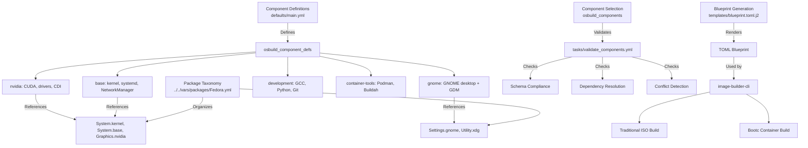
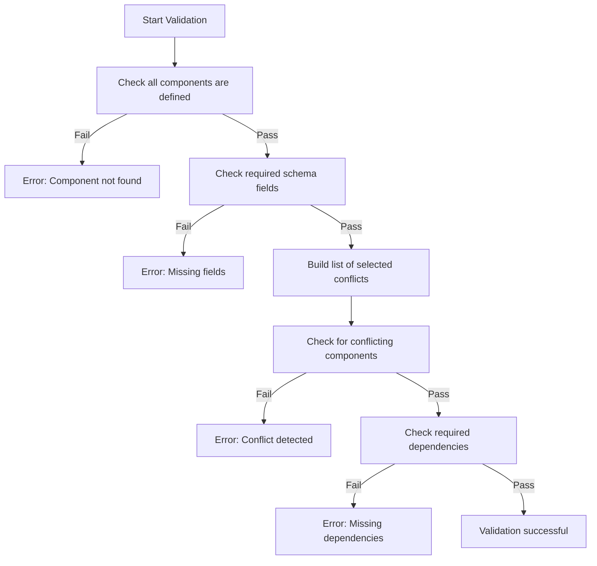
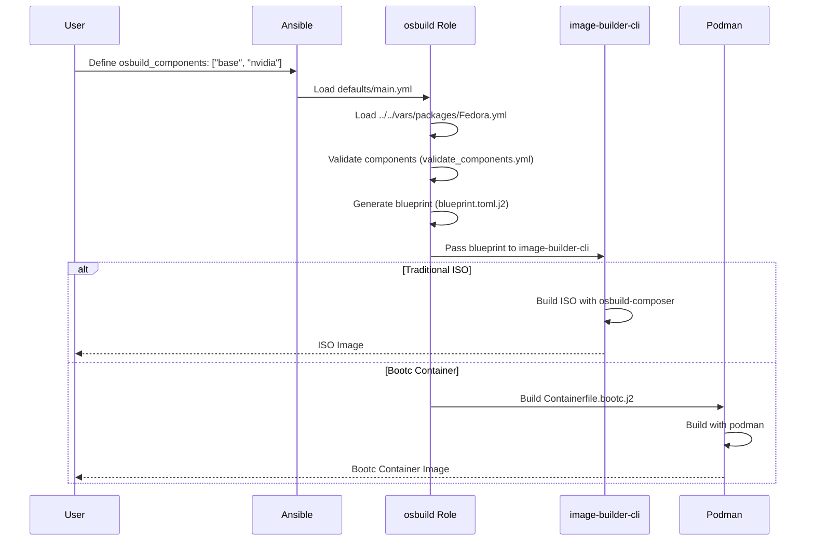

The **Component System** in the `osbuild` Ansible role enables modular, reusable, and composable definitions for packages, configurations, and dependencies. This system allows developers to **selectively include or exclude** pre-defined components (e.g., `base`, `gnome`, `nvidia`, `development`) to customize image builds for both **traditional ISO** and **bootc container** modes. Each component encapsulates packages, services, kernel arguments, repository sources, and other artifacts, ensuring consistency and reducing duplication across builds.

## Architectural Overview

The component system follows a **hierarchical and declarative** design:
- **Components** are defined in `defaults/main.yml` under `osbuild_component_defs`.
- **Packages** are organized in a **taxonomy** (`../../vars/packages/<Distribution>.yml`) and referenced by components via Jinja2 expressions.
- **Validation** ensures schema compliance, dependency resolution, and conflict detection.
- **Blueprint Generation** dynamically compiles selected components into a TOML blueprint for `image-builder-cli`.

The following **Mermaid diagram** illustrates the component system's architecture and its integration with the build process:



Sources: [defaults/main.yml](defaults/main.yml#L200-L400), [tasks/validate_components.yml](tasks/validate_components.yml#L1-L69), [templates/blueprint.toml.j2](templates/blueprint.toml.j2#L1-L133), [../../vars/packages/Fedora.yml](../../vars/packages/Fedora.yml#L1-L200)

---

## Component Schema and Fields

Each component in `osbuild_component_defs` adheres to a **strict schema** with the following fields:

| **Field**               | **Type**               | **Description**                                                                                     | **Example**                                                                                     |
|-------------------------|------------------------|-----------------------------------------------------------------------------------------------------|-------------------------------------------------------------------------------------------------|
| `label`                 | String                 | Human-readable name for the component.                                                             | `"NVIDIA GPU Stack"`                                                                             |
| `packages`              | List or Jinja2         | List of packages to install, or a Jinja2 expression resolving to a list.                          | `{{ system_packages.Graphics.nvidia }}`                                                          |
| `blueprint_groups`      | List or Jinja2         | DNF group names to include in the blueprint.                                                        | `["development-tools", "c-development"]`                                                         |
| `services`              | List or Jinja2         | Systemd services to enable.                                                                         | `["nvidia-persistenced", "nvidia-cdi-refresh"]`                                                  |
| `kernel_args`           | List or Jinja2         | Kernel command-line arguments to append.                                                           | `["rd.driver.blacklist=nouveau", "nvidia-drm.modeset=1"]`                                         |
| `sources`               | List or Jinja2         | Repository sources required by the component.                                                       | `{{ _nvidia_sources }}`                                                                          |
| `files`                 | List                   | Custom file payloads to inject into the image.                                                     | `[{ path: "/etc/custom.conf", content: "..." }]`                                                |
| `flatpaks`              | List or Jinja2         | Flatpak application IDs to install.                                                               | `{{ system_flatpaks.development }}`                                                              |
| `copr_repos`            | List or Jinja2         | COPR repository names to enable.                                                                  | `{{ system_copr_repos.audio }}`                                                                  |
| `bootc_repos`           | List or Jinja2         | Shell commands to add repositories in bootc builds.                                                 | `{{ _nvidia_bootc_repos }}`                                                                      |
| `requires`              | List                   | Components this component depends on.                                                              | `["base"]`                                                                                       |
| `conflicts`             | List                   | Components this component conflicts with.                                                          | `["sway"]` (for `desktop` component)                                                             |
| `size_impact`           | Enum                   | Estimated ISO size impact: `none`, `small`, `medium`, `large`.                                      | `"large"`                                                                                       |
| `build_time_impact`     | Enum                   | Estimated build time impact: `none`, `low`, `medium`, `high`.                                       | `"medium"`                                                                                      |
| `secure_boot_compatible`| Boolean                | Whether the component is compatible with Secure Boot.                                              | `false` (for NVIDIA)                                                                             |
| `bootc_only`            | Boolean                | If `true`, the component only applies to bootc builds.                                              | `false`                                                                                         |
| `blueprint_only`        | Boolean                | If `true`, the component only applies to traditional ISO builds.                                    | `true` (for `anaconda`)                                                                          |

Sources: [defaults/main.yml](defaults/main.yml#L200-L220), [tests/validate_schema.py](tests/validate_schema.py#L20-L40)

---

## Component Taxonomy and Package Organization

Packages are **hierarchically organized** in distribution-specific files (e.g., `../../vars/packages/Fedora.yml`). The taxonomy follows the **XDG Desktop Entry Specification** categories (e.g., `System`, `Settings`, `Graphics`, `AudioVideo`, `Development`, `Utility`) and further divides them into **subcategories**. For example:

- **`System.kernel`**: `kernel`, `kernel-devel`, `kernel-headers`, `kernel-modules`
- **`System.base`**: `bash`, `coreutils`, `bind-utils`, `tar`, `rsync`
- **`Graphics.nvidia`**: `cuda`, `nvidia-driver`, `nvidia-container-toolkit`, `dkms`
- **`Settings.gnome`**: `gnome-shell`, `gnome-terminal`, `nautilus`, `gdm`
- **`Development.compilers`**: `gcc`, `gcc-c++`, `cmake`, `make`

Components reference these **package lists** via Jinja2 expressions. For example, the `nvidia` component defines its packages as:
```yaml
packages: "{{ system_packages.Graphics.nvidia }}"
```

This **decouples** component definitions from hardcoded package lists, enabling **reusability** across distributions (Fedora, AlmaLinux, Rocky) and **easy updates** when package names change.

Sources: [../../vars/packages/Fedora.yml](../../vars/packages/Fedora.yml#L1-L200), [defaults/main.yml](defaults/main.yml#L220-L250)

---

## Dependency and Conflict Resolution

The component system enforces **dependency** and **conflict** rules to ensure valid configurations. These rules are validated in `tasks/validate_components.yml`:

1. **Dependency Resolution**:
   - If component `A` **requires** component `B`, the system ensures `B` is included in `osbuild_components`.
   - Example: The `gnome` component requires `base`. If `gnome` is selected but `base` is not, validation fails.

2. **Conflict Detection**:
   - If component `A` **conflicts** with component `B`, the system ensures they are not both selected.
   - Example: The `desktop` component (alias for `gnome`) conflicts with `sway`. Selecting both triggers a validation error.

3. **Validation Workflow**:
   - The `validate_components.yml` task iterates through `osbuild_components` and checks:
     - All components are defined in `osbuild_component_defs`.
     - All required schema fields are present.
     - No conflicting components are selected together.
     - All dependencies are satisfied.

The following **Mermaid flowchart** illustrates the validation process:



Sources: [tasks/validate_components.yml](tasks/validate_components.yml#L1-L69)

---

## Blueprint Generation: Dynamic TOML Templating

The **blueprint** for `image-builder-cli` is dynamically generated from selected components using the `blueprint.toml.j2` Jinja2 template. The template:

1. **Aggregates Packages**:
   - Iterates through `osbuild_components` and includes all packages from each component's `packages` field.
   - Example: If `nvidia` is selected, all packages in `system_packages.Graphics.nvidia` are added to the blueprint.

2. **Aggregates Groups**:
   - Includes DNF groups from each component's `blueprint_groups` field.

3. **Aggregates Services**:
   - Combines all `services` from selected components and enables them in the blueprint.

4. **Aggregates Kernel Arguments**:
   - Combines all `kernel_args` from selected components and appends them to the kernel command line.

5. **Injects Custom Files**:
   - Includes files defined in each component's `files` field (e.g., NVIDIA CDI scripts).

6. **Handles Build-Specific Customizations**:
   - For `nvidia` components, injects **NVIDIA CDI** scripts for GPU passthrough in containers.
   - For `bootc` builds, includes repository setup commands.

The following **example** shows how the `nvidia` component contributes to the blueprint:
```toml
# Packages from nvidia component
[[packages]]
name = "cuda"
version = "*"

[[packages]]
name = "nvidia-driver"
version = "*"

# Kernel arguments from nvidia component
[customizations.kernel]
append = "rd.driver.blacklist=nouveau modprobe.blacklist=nouveau nvidia-drm.modeset=1 DRACUT_NO_XATTR=1"

# Services from nvidia component
[customizations.services]
enabled = [
  "nvidia-cdi-refresh",
  "nvidia-persistenced"
]

# Files from nvidia component (NVIDIA CDI)
[[customizations.files]]
path = "/usr/local/bin/nvidia-cdi-generate.sh"
mode = "0755"
data = '''
#!/bin/bash
# NVIDIA CDI setup script
'''
```

Sources: [templates/blueprint.toml.j2](templates/blueprint.toml.j2#L1-L133), [defaults/main.yml](defaults/main.yml#L250-L300)

---

## Component Lifecycle: From Selection to Build

The **lifecycle** of a component spans from selection to final image build:

1. **Component Selection**:
   - Users define `osbuild_components` in their inventory or playbook (e.g., `["base", "gnome", "nvidia"]`).
   - Defaults are provided in `defaults/main.yml`.

2. **Validation**:
   - `tasks/validate_components.yml` ensures the selection is valid (no conflicts, all dependencies satisfied).

3. **Package Taxonomy Loading**:
   - The role loads the **distribution-specific package taxonomy** (e.g., `../../vars/packages/Fedora.yml`).

4. **Blueprint Generation**:
   - The `blueprint.toml.j2` template renders the blueprint, aggregating packages, services, kernel args, and files from all selected components.

5. **Build Execution**:
   - For **traditional ISO builds**, the blueprint is passed to `image-builder-cli`.
   - For **bootc container builds**, the blueprint is used to generate a `Containerfile` and built with `podman`.

The following **Mermaid sequence diagram** illustrates this lifecycle:



Sources: [tasks/main.yml](tasks/main.yml#L1-L200), [tasks/blueprint.yml](tasks/blueprint.yml#L1-L130)

---
## Component Aliases and Backward Compatibility

The system includes **aliases** for backward compatibility with legacy configurations. These aliases duplicate their target definitions but may include **overrides** (e.g., additional conflicts or flatpaks). Examples:

| **Alias**      | **Target**       | **Overrides**                                                                                     |
|----------------|------------------|---------------------------------------------------------------------------------------------------|
| `core`         | `base`           | None (pure alias)                                                                                 |
| `desktop`      | `gnome`          | Conflicts with `sway`, includes additional flatpaks (`system_flatpaks.system`, `system_flatpaks.productivity`) |
| `audio`        | Standalone       | Includes audio production tools (PipeWire, ALSA, applications)                                   |
| `virtualization`| Standalone      | Includes libvirt, QEMU, and virtualization tools                                                |

Sources: [defaults/main.yml](defaults/main.yml#L400-L500)

---
## Build Mode Integration

Components integrate with **both build modes** (traditional ISO and bootc container) through conditional logic:

1. **Traditional ISO Builds**:
   - Components like `anaconda` are marked as `blueprint_only: true` (only applicable to ISO builds).
   - The `blueprint.toml.j2` template generates a TOML file for `image-builder-cli`.

2. **Bootc Container Builds**:
   - Components can define `bootc_repos` (shell commands to add repositories in bootc builds).
   - The `Containerfile.bootc.j2` template includes logic for bootc-specific customizations (e.g., NVIDIA CDI setup).
   - Components marked as `bootc_only: true` are only applied in this mode.

The following **table** summarizes build mode compatibility for key components:

| **Component**       | **Traditional ISO** | **Bootc Container** | **Notes**                                                                                     |
|--------------------|---------------------|---------------------|-----------------------------------------------------------------------------------------------|
| `base`             | ✅ Yes              | ✅ Yes              | Core system for both modes.                                                                   |
| `anaconda`         | ✅ Yes              | ❌ No               | Installer is ISO-only (`blueprint_only: true`).                                               |
| `gnome`            | ✅ Yes              | ✅ Yes              | Desktop environment works in both modes.                                                     |
| `sway`             | ✅ Yes              | ✅ Yes              | Wayland-based desktop.                                                                       |
| `nvidia`           | ✅ Yes              | ✅ Yes              | Includes `bootc_repos` for NVIDIA repositories in container builds.                           |
| `development`      | ✅ Yes              | ✅ Yes              | Tools like GCC, Python, and Git are included in both modes.                                   |
| `container-tools`  | ✅ Yes              | ✅ Yes              | Podman, Buildah, and Skopeo are included in both modes.                                       |
| `oneapi`           | ✅ Yes              | ✅ Yes              | Intel oneAPI adds ~15GB to ISO size.                                                          |
| `cockpit`          | ✅ Yes              | ✅ Yes              | Web-based management.                                                                        |

Sources: [defaults/main.yml](defaults/main.yml#L200-L500), [templates/Containerfile.bootc.j2](templates/Containerfile.bootc.j2#L1-L50)

---
## Testing and Validation

The component system includes **automated validation** to ensure correctness:

1. **Schema Validation**:
   - The `tests/validate_schema.py` script checks that all components in `osbuild_component_defs` adhere to the required schema.
   - It verifies:
     - All required fields are present.
     - List fields are either literal lists or Jinja2 expressions.
     - Enums (`size_impact`, `build_time_impact`) use valid values.
     - Boolean fields (`secure_boot_compatible`, `bootc_only`, `blueprint_only`) are properly typed.

2. **Component Validation**:
   - The `tasks/validate_components.yml` task validates:
     - All selected components are defined.
     - No conflicts exist between selected components.
     - All dependencies are satisfied.

3. **Blueprint Validation**:
   - The `tasks/blueprint.yml` task optionally validates the generated TOML blueprint syntax using `python3-tomli`.

Sources: [tests/validate_schema.py](tests/validate_schema.py#L1-L124), [tasks/validate_components.yml](tasks/validate_components.yml#L1-L69), [tasks/blueprint.yml](tasks/blueprint.yml#L100-L130)

---
## Next Steps

To deepen your understanding of the **Component System**, explore the following pages:
- **[Component Definitions: Schema, Dependencies, and Conflicts](15-component-definitions-schema-dependencies-and-conflicts)**: Dive deeper into the schema, dependency resolution, and conflict detection mechanisms.
- **[Blueprint Generation: Dynamic TOML Templating with Jinja2](13-blueprint-generation-dynamic-toml-templating-with-jinja2)**: Learn how the blueprint is dynamically generated from components.
- **[Traditional ISO Build Workflow with image-builder-cli](11-traditional-iso-build-workflow-with-image-builder-cli)**: Understand how components integrate with traditional ISO builds.
- **[Bootc Container Image Build Process and Multi-Stage Containerfile](12-bootc-container-image-build-process-and-multi-stage-containerfile)**: Explore how components are used in bootc container builds.
- **[Test Suite Structure and Validation Scripts](22-test-suite-structure-and-validation-scripts)**: Review the test suite for component validation.