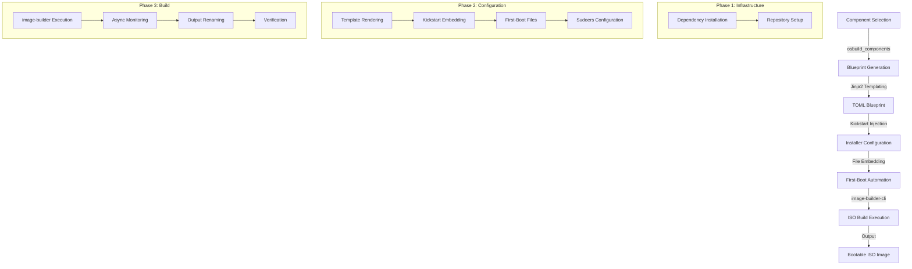

This page details the end-to-end workflow for building traditional ISO images using the `image-builder-cli` tool within the osbuild Ansible role. It covers the architectural flow, component integration, blueprint generation, and execution mechanics for creating installable ISO media with embedded Anaconda installer configurations.

---

## Architectural Overview

The traditional ISO build workflow follows a **three-phase pipeline** that transforms component selections into a bootable ISO image. The process is orchestrated by Ansible tasks that dynamically generate TOML blueprints, inject custom configurations, and execute `image-builder-cli` with precise parameters.



The workflow supports **two operational modes**:
- **Generate-Only Mode** (`osbuild_only_generate: true`): Creates blueprint and build script without executing the build
- **Full Build Mode** (`osbuild_only_generate: false`): Executes the complete build pipeline

Sources: [tasks/main.yml](tasks/main.yml#L1-L264), [tasks/select_build_mode.yml](tasks/select_build_mode.yml#L1-L33)

---

## Phase 1: Infrastructure Setup

### Dependency Resolution
The workflow begins with **automatic dependency installation** for `image-builder-cli` and its prerequisites. The `install.yml` task file handles:
- Package installation (`image-builder`, `osbuild`, `lorax`)
- Repository configuration for target distributions
- Build host validation (RedHat family only)

**Distribution-Specific Variables** are loaded from:
- `vars/Fedora.yml` for Fedora targets
- `vars/AlmaLinux.yml` for AlmaLinux targets
- `vars/Rocky.yml` for Rocky Linux targets

```yaml
# Example: Distribution-specific repository configuration
- name: Load distribution-specific repository variables
  ansible.builtin.include_vars:
    file: "vars/{{ ansible_distribution }}.yml"
```

Sources: [tasks/main.yml](tasks/main.yml#L40-L45), [tasks/install.yml](tasks/install.yml)

---

## Phase 2: Blueprint Generation

### Dynamic TOML Templating
The **blueprint.toml.j2** template serves as the foundation for ISO builds, dynamically generating a complete `image-builder-cli` compatible blueprint from component selections. The template includes:

| Section | Purpose | Source |
|---------|---------|--------|
| `name`, `description`, `version` | Blueprint metadata | Component aggregation |
| `[[groups]]` | DNF package groups | Component definitions |
| `[[packages]]` | Individual packages | Component + extra packages |
| `[customizations.kernel]` | Kernel arguments | NVIDIA, other components |
| `[customizations.services]` | Enabled services | Component services |
| `[customizations.timezone]` | Timezone settings | `osbuild_timezone` |
| `[customizations.locale]` | Locale configuration | `osbuild_locale` |
| `[customizations.installer.modules]` | Anaconda modules | Hardcoded for ISO builds |

**Component Integration Example**:
```toml
# Generated from nvidia component
[customizations.kernel]
append = "rd.driver.blacklist=nouveau modprobe.blacklist=nouveau nvidia-drm.modeset=1 DRACUT_NO_XATTR=1"

[customizations.services]
enabled = [
  "nvidia-cdi-refresh",
  "nvidia-persistenced"
]
```

Sources: [templates/blueprint.toml.j2](templates/blueprint.toml.j2#L1-L133), [defaults/main.yml](defaults/main.yml#L200-L399)

---

### Kickstart Integration
The workflow embeds **Anaconda installer automation** through kickstart files. The process:

1. **Template Selection**: Uses `syncopated.ks` or `syncopated-interactive.ks` based on `osbuild_kickstart_partitioning`
2. **Dynamic Injection**: The `kickstart.toml.j2` template wraps the kickstart file in TOML format
3. **Conflict Detection**: Validates that the blueprint doesn't contain conflicting settings

**Kickstart Features**:
- **Automatic Disk Selection**: Identifies target disk (excludes install media, USB, removable)
- **Partitioning Logic**: Creates LVM layout with `/`, `/usr`, `/var`, `/home`
- **Minimum Requirements**: Enforces 40GB disk space
- **NVMe Priority**: Prefers NVMe disks over others

```toml
[customizations.installer.kickstart]
contents = '''
lang en_US.UTF-8
keyboard us
timezone America/New_York --utc
# [Rest of kickstart file]
'''
```

**Validation Rules**:
- Blueprint must not contain `[[customizations.user]]` or `[[customizations.group]]`
- Kickstart file must not contain `'''` (TOML literal string delimiter)
- Partitioning mode must be `auto` or `interactive`

Sources: [templates/kickstart.toml.j2](templates/kickstart.toml.j2#L1-L12), [files/kickstart/syncopated.ks](files/kickstart/syncopated.ks#L1-L120), [tasks/blueprint.yml](tasks/blueprint.yml#L40-L80)

---

### First-Boot Automation
The workflow injects **first-login splash screens** and **automated setup** through:

1. **First-Boot Files**:
   - `syncopated-firstboot`: Main setup script
   - `syncopated-firstboot-launcher`: Launcher for the first-boot experience
   - `syncopated-firstboot.desktop`: Autostart desktop entry

2. **TOML Embedding**:
```toml
[[customizations.files]]
path = "/usr/local/bin/syncopated-firstboot"
mode = "0755"
data = '''
[Content of syncopated-firstboot script]
'''
```

3. **Validation**: Ensures files don't contain `'''` which would break TOML parsing

Sources: [templates/firstboot-files.toml.j2](templates/firstboot-files.toml.j2#L1-L11), [tasks/blueprint.yml](tasks/blueprint.yml#L20-L40)

---

### Sudoers Configuration
For development environments, the workflow can inject **passwordless sudo** for the `wheel` group:

```toml
[[customizations.files]]
path = "/etc/sudoers.d/90-wheel-nopasswd"
mode = "0440"
data = '''
%wheel ALL=(ALL) NOPASSWD: ALL
'''
```

This is controlled by the `osbuild_kickstart_sudoers` variable.

Sources: [templates/kickstart-sudoers.toml.j2](templates/kickstart-sudoers.toml.j2#L1-L10), [tasks/blueprint.yml](tasks/blueprint.yml#L110-L120)

---

## Phase 3: Build Execution

### Command Construction
The `build.yml` task file constructs and executes the `image-builder-cli` command with:

**Required Parameters**:
- `--distro`: Target distribution (e.g., `fedora-43`, `almalinux-10.2`)
- `--blueprint`: Generated TOML blueprint file
- `--image-type`: ISO type (`minimal-installer` for Fedora, `image-installer` for EL)

**Optional Parameters**:
- `--extra-repo`: Additional repositories (NVIDIA CUDA, RPM Fusion, etc.)
- `--arch`: Target architecture (default: `x86_64`)

**Example Command**:
```bash
sudo image-builder build minimal-installer \
  --distro fedora-43 \
  --blueprint custom.toml \
  --extra-repo "https://developer.download.nvidia.com/compute/cuda/repos/fedora43/x86_64"
```

Sources: [tasks/build.yml](tasks/build.yml#L20-L40)

---

### Asynchronous Execution
The build process runs asynchronously with:

- **Timeout**: Configurable via `osbuild_build_timeout` (default: 3600 seconds)
- **Polling**: Checks status every 30 seconds
- **Error Handling**: Captures stdout/stderr to log files

```yaml
- name: Run image-builder with repository sources
  ansible.builtin.shell: >
    image-builder build {{ osbuild_image_type }}
    --distro {{ osbuild_distro }}
    --blueprint {{ osbuild_blueprint_name }}.toml \
    {{ extra_repo_flags }}
  args:
    chdir: "{{ osbuild_output_dir }}"
    executable: /bin/bash
  register: image_build_exec
  become: true
  async: "{{ osbuild_build_timeout }}"
  poll: 30
  changed_when: false
```

Sources: [tasks/build.yml](tasks/build.yml#L30-L50)

---

### Output Handling
Upon successful completion:

1. **File Discovery**: Finds the newest generated image file (`*.iso`, `*.qcow2`, etc.)
2. **Renaming**: Copies the image to a friendly name (`osbuild_output_filename`)
3. **Verification**: Asserts that the image file exists
4. **Summary Display**: Shows build statistics including file size

**Output Filename Pattern**:
```
{osbuild_blueprint_name}-{osbuild_distro}-{osbuild_image_type}-{timestamp}.{extension}
```

Sources: [tasks/build.yml](tasks/build.yml#L60-L90)

---

## Build Modes and Workflow Selection

### Mode Resolution
The workflow supports three distinct build modes, resolved by `select_build_mode.yml`:

| Mode | `osbuild_build_bootc` | `osbuild_only_generate` | Description |
|------|----------------------|------------------------|-------------|
| `bootc_image` | `true` | Any | Builds bootc container images |
| `generate_only` | `false` | `true` | Generates blueprint and build script only |
| `traditional_iso` | `false` | `false` | Full ISO build execution |

**Mode Selection Logic**:
```yaml
osbuild_resolved_build_mode: >-
  {{
    osbuild_build_bootc
    | ternary('bootc_image',
      osbuild_only_generate
      | ternary('generate_only', 'traditional_iso')
    )
  }}
```

Sources: [tasks/select_build_mode.yml](tasks/select_build_mode.yml#L1-L33)

---

### Generate-Only Mode
When `osbuild_only_generate: true`, the workflow:

1. Creates the blueprint TOML file
2. Generates a **standalone build script** (`build-{blueprint}.sh`)
3. Displays instructions for manual execution

**Build Script Features**:
- Self-contained with all parameters
- Executable directly on the build host
- Handles image renaming and permissions
- For container types: loads into podman

```bash
# Example generated script
sudo image-builder build minimal-installer \
  --distro fedora-43 \
  --arch x86_64 \
  --blueprint custom.toml \
  --extra-repo "https://developer.download.nvidia.com/..."

# Post-build: rename and set permissions
sudo cp "$image" custom-fedora-43-minimal-installer.iso
sudo chown "$(id -u):$(id -g)" custom-fedora-43-minimal-installer.iso
```

Sources: [templates/image-builder-build.sh.j2](templates/image-builder-build.sh.j2#L1-L40), [tasks/main.yml](tasks/main.yml#L120-L140)

---

## Component System Integration

### Component Definitions
Each component in `osbuild_components` contributes to the ISO build through a **schema-defined structure**:

| Field | Type | Purpose | Example |
|-------|------|---------|---------|
| `packages` | List | Packages to install | `["nvidia-driver", "cuda"]` |
| `blueprint_groups` | List | DNF groups | `["development-tools"]` |
| `services` | List | Services to enable | `["nvidia-persistenced"]` |
| `kernel_args` | List | Kernel parameters | `["rd.driver.blacklist=nouveau"]` |
| `sources` | List | Repository sources | `["rpmfusion-nonfree"]` |
| `files` | List | Custom files | See first-boot files |
| `requires` | List | Dependencies | `["base"]` |
| `conflicts` | List | Incompatible components | `[]` |

**NVIDIA Component Example**:
```yaml
nvidia:
  label: "NVIDIA GPU Stack"
  packages: "{{ system_packages.Graphics.nvidia }}"
  services:
    - nvidia-cdi-refresh
    - nvidia-persistenced
  kernel_args:
    - "rd.driver.blacklist=nouveau"
    - "modprobe.blacklist=nouveau"
    - "nvidia-drm.modeset=1"
  sources: "{{ _nvidia_sources }}"
  requires:
    - base
  size_impact: "large"
  build_time_impact: "medium"
```

Sources: [defaults/main.yml](defaults/main.yml#L220-L260)

---

### Component Validation
The workflow validates component selections through `validate_components.yml`:

1. **Dependency Resolution**: Ensures all `requires` are satisfied
2. **Conflict Detection**: Prevents incompatible component combinations
3. **Schema Validation**: Verifies component definitions match expected structure

**Validation Example**:
```yaml
- name: Validate component selection
  ansible.builtin.import_tasks: validate_components.yml
```

Sources: [tasks/validate_components.yml](tasks/validate_components.yml), [tasks/main.yml](tasks/main.yml#L55-L60)

---

## Configuration Reference

### Key Variables for Traditional ISO Builds

| Variable | Type | Default | Description |
|----------|------|---------|-------------|
| `osbuild_blueprint_name` | String | `"custom"` | Name for the blueprint and output files |
| `osbuild_distro` | String | `"fedora-43"` | Target distribution version |
| `osbuild_image_type` | String | `minimal-installer` (Fedora) / `image-installer` (EL) | ISO image type |
| `osbuild_output_dir` | String | `"/var/lib/image-builder"` | Build output directory |
| `osbuild_output_filename` | String | Derived | Final image filename pattern |
| `osbuild_components` | List | `["base", "anaconda", "gnome"]` | Selected components |
| `osbuild_extra_repo_urls` | List | `[]` | Additional repositories |
| `osbuild_build_timeout` | Integer | `3600` | Build timeout in seconds |
| `osbuild_build_retries` | Integer | `0` | Number of retry attempts |
| `osbuild_verbose` | Boolean | `false` | Show detailed build commands |
| `osbuild_keep_logs` | Boolean | `true` | Preserve build failure logs |
| `osbuild_firstboot_enabled` | Boolean | `true` | Inject first-boot files |
| `osbuild_kickstart_enabled` | Boolean | `true` | Inject kickstart configuration |
| `osbuild_kickstart_partitioning` | String | `"auto"` | `auto` or `interactive` |
| `osbuild_kickstart_sudoers` | Boolean | `true` | Enable passwordless sudo for wheel |
| `osbuild_timezone` | String | `"America/New_York"` | System timezone |
| `osbuild_locale` | String | `"en_US.UTF-8"` | System locale |
| `osbuild_keyboard` | String | `"us"` | Keyboard layout |

Sources: [defaults/main.yml](defaults/main.yml#L1-L200)

---

### Distribution-Specific Settings

**Fedora**:
- Image type: `minimal-installer`
- NVIDIA repositories: `cuda-fedora{version}-{arch}`
- Example: `fedora-43`, `fedora-44`

**AlmaLinux/Rocky**:
- Image type: `image-installer` or `network-installer`
- NVIDIA repositories: `cuda-el{major_version}-x86_64`
- Example: `almalinux-10.2`, `rocky-10.2`

**Repository Mapping**:
```yaml
_nvidia_sources: >-
  {{ _is_fedora | ternary(
    [
      'rpmfusion-nonfree-nvidia-driver',
      'cuda-fedora' + _distro_version + '-' + osbuild_arch,
      'nvidia-container-toolkit',
    ],
    [
      'rpmfusion-nonfree-nvidia-driver',
      'cuda-el' + _distro_major_version + '-x86_64',
      'nvidia-container-toolkit',
    ]
  ) }}
```

Sources: [defaults/main.yml](defaults/main.yml#L50-L120)

---

## Error Handling and Recovery

### Build Failure Management
The workflow implements **comprehensive error handling**:

1. **Status Tracking**: Uses `build_status` fact (`RUNNING`, `FINISHED`, `FAILED`)
2. **Log Capture**: Saves stdout/stderr to timestamped files in `osbuild_log_dir`
3. **Retry Logic**: Supports configurable retry attempts with delays
4. **Finalization**: Re-raises failures with clear messages

**Failure Report Example**:
```log
Build Failure Report
====================
Timestamp: 2024-01-15T10:30:00+00:00
Blueprint: custom
Image Type: minimal-installer
Distribution: fedora-43
Status: FAILED

STDOUT:
[image-builder output]

STDERR:
[Error messages]
```

**Retry Configuration**:
```yaml
- name: Build retry logic
  when: osbuild_build_retries | int > 0 and build_status != "FINISHED"
  block:
    - name: Wait before retry
      ansible.builtin.pause:
        seconds: 60
    - name: Retry build
      ansible.builtin.import_tasks: build.yml
  rescue:
    - name: All retries exhausted
      ansible.builtin.fail:
        msg: "Build failed after {{ osbuild_build_retries }} retries"
```

Sources: [tasks/build.yml](tasks/build.yml#L55-L75), [tasks/main.yml](tasks/main.yml#L200-L220)

---

## Verification and Testing

### Post-Build Verification
The workflow provides **automated verification steps**:

1. **File Existence Check**: Asserts that the image file was created
2. **Size Calculation**: Displays image size in GB
3. **Integrity Verification**: Suggests `sha256sum` for manual verification

**Verification Commands**:
```bash
# Check image integrity
sha256sum /var/lib/image-builder/custom-fedora-43-minimal-installer.iso

# Test in virtual machine
virt-install --name test-custom \
  --memory 4096 --vcpus 2 \
  --disk size=40 \
  --cdrom /var/lib/image-builder/custom-fedora-43-minimal-installer.iso \
  --os-variant fedora43

# Flash to USB
sudo dd if=/var/lib/image-builder/custom-fedora-43-minimal-installer.iso \
  of=/dev/sdX bs=4M status=progress oflag=sync
```

Sources: [tasks/main.yml](tasks/main.yml#L220-L240)

---

### Test Suite Integration
The role includes **comprehensive test coverage** for traditional ISO builds:

| Test File | Purpose |
|-----------|---------|
| `tests/validate_build_modes.yml` | Validates build mode resolution |
| `tests/validate_kickstart_injection.yml` | Tests kickstart embedding |
| `tests/validate_firstboot_injection.yml` | Tests first-boot file injection |
| `tests/kickstart/check_kickstart.py` | Validates kickstart syntax |
| `tests/firstboot/check_injection.py` | Verifies first-boot file injection |

Sources: [tests/validate_build_modes.yml](tests/validate_build_modes.yml), [tests/validate_kickstart_injection.yml](tests/validate_kickstart_injection.yml)

---

## Performance Considerations

### Build Time Optimization
| Factor | Impact | Mitigation |
|--------|--------|------------|
| Component Selection | `size_impact` and `build_time_impact` | Choose components wisely |
| NVIDIA Stack | Large (~2GB+) | Only include when needed |
| Intel oneAPI | Very Large (~15GB) | Consider separate builds |
| Extra Repositories | Medium | Use only required repos |
| Build Retries | High | Set `osbuild_build_retries` appropriately |

**Recommended Component Combinations**:
| Use Case | Recommended Components | Estimated ISO Size |
|----------|------------------------|-------------------|
| Minimal Workstation | `base`, `anaconda`, `gnome` | 2-3 GB |
| Development Workstation | `base`, `anaconda`, `gnome`, `development` | 4-5 GB |
| GPU Workstation | `base`, `anaconda`, `gnome`, `nvidia` | 6-8 GB |
| Full Featured | All components | 15-20 GB |

Sources: [defaults/main.yml](defaults/main.yml#L200-L400)

---

## Migration Notes

### From osbuild-composer to image-builder-cli
The workflow maintains **backward compatibility** with `osbuild-composer` era configurations:

| Legacy Variable | New Equivalent | Status |
|----------------|----------------|--------|
| `osbuild_compose_type` | `osbuild_image_type` | Deprecated, retained |
| `osbuild_composer_repo` | `osbuild_extra_repo_urls` | Deprecated, retained |
| `composer_cli` | `image-builder` | Replaced |

**Migration Path**:
1. Update playbooks to use `image-builder` instead of `composer-cli`
2. Replace `osbuild_image_type` values:
   - `iso` → `minimal-installer` (Fedora) or `image-installer` (EL)
   - `qcow2` → `qcow2`
3. Review component definitions for new schema

For detailed migration guidance, see: [Migration from osbuild-composer to image-builder-cli](25-migration-from-osbuild-composer-to-image-builder-cli)

Sources: [defaults/main.yml](defaults/main.yml#L10-L30), [ARCHITECTURAL_REVIEW.md](docs/ARCHITECTURAL_REVIEW.md)

---

## Next Steps

### Recommended Reading Progression

1. **Prerequisites**:
   - [Configuring Build Host Requirements and Dependencies](3-configuring-build-host-requirements-and-dependencies)
   - [Selecting Target Distribution and Architecture](4-selecting-target-distribution-and-architecture)

2. **Build Mode Comparison**:
   - [Understanding Traditional ISO vs. Bootc Container Build Modes](5-understanding-traditional-iso-vs-bootc-container-build-modes)
   - [Choosing the Right Build Mode for Your Use Case](6-choosing-the-right-build-mode-for-your-use-case)

3. **Advanced Configuration**:
   - [Blueprint Generation: Dynamic TOML Templating with Jinja2](13-blueprint-generation-dynamic-toml-templating-with-jinja2)
   - [Kickstart Integration for Automated Installations](19-kickstart-integration-for-automated-installations)
   - [First-Boot Automation with Embedded Ansible Playbooks](17-first-boot-automation-with-embedded-ansible-playbooks)

4. **Component Management**:
   - [Component Definitions: Schema, Dependencies, and Conflicts](15-component-definitions-schema-dependencies-and-conflicts)
   - [Component System: Modular Package and Configuration Management](10-component-system-modular-package-and-configuration-management)

5. **Troubleshooting**:
   - [Build Failure Handling and Log Management](21-build-failure-handling-and-log-management)
   - [Test Suite Structure and Validation Scripts](22-test-suite-structure-and-validation-scripts)

---
**Note**: For bootc container image builds, see: [Bootc Container Image Build Process and Multi-Stage Containerfile](12-bootc-container-image-build-process-and-multi-stage-containerfile)