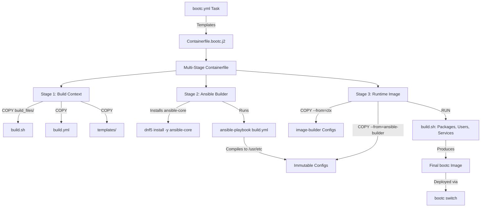
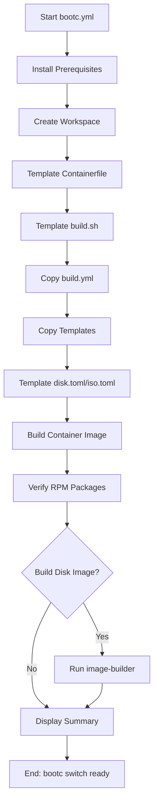

This page details the **bootc container image build process** and the **multi-stage Containerfile** architecture used in the Syncopated Ansible role. It explains how the role leverages `bootc-image-builder` to create immutable, atomic OS images for container-native deployments, with a focus on the **Ansible Role Inversion Pattern** and **build-time configuration compilation**.

---

## Architectural Overview: Multi-Stage Containerfile Design

The bootc build process uses a **multi-stage Containerfile** to separate build-time dependencies from the final runtime image. This ensures the produced container image remains minimal while enabling complex build-time operations like Ansible playbook execution and repository setup.

### Core Principles
- **Immutable Infrastructure**: Configurations are compiled into `/usr/etc` (vendor defaults) at build time, not modified at runtime.
- **Atomic Upgrades**: `bootc switch` deploys new images atomically, eliminating configuration drift.
- **Build-Time Ansible**: Ansible runs **inside the Containerfile** during build, not post-deployment.
- **Multi-Stage Optimization**: Build tools (e.g., `ansible-core`) are discarded in the final image.

### Mermaid Architecture Diagram


### Multi-Stage Breakdown
| Stage | Purpose | Key Operations | Output |
|-------|---------|----------------|--------|
| **ctx** | Build context | Copies `build_files/`, templates, and configs | Intermediate layer with build artifacts |
| **ansible-builder** | Build-time Ansible | Installs `ansible-core`, runs `build.yml` to compile configs into `/usr/etc` | Immutable vendor configs (`/usr/etc/`, `/usr/lib/systemd/`) |
| **Runtime** | Final image | Copies compiled configs from `ansible-builder`, runs `build.sh` for packages/users | Minimal, production-ready bootc image |

Sources: [templates/Containerfile.bootc.j2](templates/Containerfile.bootc.j2#L1-L128), [tasks/bootc.yml](tasks/bootc.yml#L1-L134)

---

## Build Process Workflow

The bootc build process is orchestrated by the [`bootc.yml`](tasks/bootc.yml) task file, which performs the following steps:

### 1. Prerequisite Installation
Installs `podman`, `buildah`, `skopeo`, and `jq` on the build host to support container image building and management.

### 2. Workspace Setup
Creates a dedicated workspace (`osbuild_bootc_workspace`, default: `/tmp/bootc-workspace`) to store:
- The templated `Containerfile`
- Build scripts (`build.sh`)
- Ansible playbooks (`build.yml`)
- Configuration files (`disk.toml`, `iso.toml`)

### 3. Template Generation
- **Containerfile**: Rendered from [`Containerfile.bootc.j2`](templates/Containerfile.bootc.j2) with Jinja2 variables (e.g., `osbuild_bootc_base_image`, `osbuild_components`).
- **build.sh**: Generated from [`build.sh.j2`](templates/build.sh.j2) to handle package installation, user setup, and service configuration.
- **build.yml**: Copied from [`files/bootc/build.yml`](files/bootc/build.yml) to compile build-time configurations.
- **Disk/ISO Configs**: Templated from [`disk.toml.j2`](templates/disk.toml.j2) and [`iso.toml.j2`](templates/iso.toml.j2) for `image-builder` compatibility.

### 4. Container Image Build
Uses the `containers.podman.podman_image` module to build the OCI image from the workspace:
```yaml
containers.podman.podman_image:
  name: "{{ osbuild_bootc_image_name }}"  # e.g., quay.io/syncopated/custom
  tag: "{{ osbuild_bootc_image_tag }}"      # e.g., latest
  path: "{{ osbuild_bootc_workspace }}"    # /tmp/bootc-workspace
  build:
    format: oci
    extra_args: "--pull=newer --network=host"
```

### 5. Verification
- Lists installed RPM packages in the built container via `podman run --rm <image> rpm -qa`.
- Displays the package count for validation.

### 6. Optional Disk Image Build
If `osbuild_bootc_build_disk_image: true`, the role invokes `image-builder` to create a bootable disk image (QCOW2, RAW, or ISO) from the container:
```bash
image-builder build <type> \
  --bootc-ref {{ osbuild_bootc_image_name }}:{{ osbuild_bootc_image_tag }} \
  
  --bootc-installer-payload-ref {{ osbuild_bootc_image_name }}:{{ osbuild_bootc_image_tag }} \
  
  --bootc-default-fs {{ osbuild_bootc_rootfs }} \
  --output-dir {{ osbuild_bootc_output_dir }}
```

### Mermaid Flowchart


Sources: [tasks/bootc.yml](tasks/bootc.yml#L1-L134)

---
## Ansible Role Inversion Pattern in bootc

The **Ansible Role Inversion Pattern** is a core architectural concept in the bootc build process. Unlike traditional Ansible usage (where playbooks run post-deployment to modify `/etc`), this pattern **runs Ansible at build time** to compile configurations into **immutable vendor defaults** (`/usr/etc`).

### Key Concepts
- **Traditional Ansible**: Modifies `/etc` on live systems → **mutable state, configuration drift**.
- **Inverted Ansible**: Compiles configs into `/usr/etc` during build → **immutable image, atomic upgrades**.

### Implementation in bootc
1. **build.yml Playbook**: Runs inside the `ansible-builder` stage of the Containerfile.
   - Targets `/usr/etc` (vendor defaults) and `/usr/lib/systemd/system` (vendor units).
   - Compiles configurations for:
     - Hostname (`/usr/etc/hostname`)
     - OS release (`/usr/etc/os-release`)
     - Kernel command line (`/usr/etc/kernel/cmdline.d/`)
     - Systemd services (e.g., NVIDIA CDI)
     - Fstab (optional)

2. **Runtime Overrides**: At boot, systemd merges `/usr/etc` (vendor) with `/etc` (local). Files in `/etc` take precedence, allowing runtime customization without modifying the image.

### Example: NVIDIA CDI Service
The NVIDIA component (`nvidia` in `osbuild_components`) triggers:
- Templating of the `nvidia-cdi-refresh.service` systemd unit into `/usr/lib/systemd/system/` (vendor unit).
- Enabling the service in the Containerfile.
- Kernel command line arguments (e.g., `rd.driver.blacklist=nouveau`) in `/usr/etc/kernel/cmdline.d/10-nvidia.conf`.

Sources: [files/bootc/build.yml](files/bootc/build.yml#L1-L137), [templates/Containerfile.bootc.j2](templates/Containerfile.bootc.j2#L40-L70)

---
## Containerfile Deep Dive

The [`Containerfile.bootc.j2`](templates/Containerfile.bootc.j2) template is the heart of the bootc build process. Below is a detailed breakdown of its stages and key features.

### Stage 1: Build Context (`ctx`)
```dockerfile
FROM scratch AS ctx
COPY build_files /
```
- **Purpose**: Stores build artifacts (e.g., `build.sh`, `build.yml`, `disk.toml`) for use in later stages.
- **Why `scratch`?**: Minimal base to avoid pulling unnecessary layers.

### Stage 2: Ansible Builder (`ansible-builder`)
```dockerfile
FROM {{ osbuild_bootc_base_image }} AS ansible-builder
RUN dnf5 install -y --nodocs ansible-core && dnf5 clean all
COPY --from=ctx /build.yml /tmp/ansible/build.yml
COPY templates/ /tmp/ansible/templates/
RUN cd /tmp/ansible && ansible-playbook build.yml -e '...' -v
```
- **Purpose**: Executes Ansible at build time to compile configurations into `/usr/etc`.
- **Key Operations**:
  - Installs `ansible-core` (discarded in final image).
  - Copies the build-time playbook (`build.yml`) and templates.
  - Runs the playbook with component definitions and blueprint metadata as extra vars.
- **Output**: Immutable configurations in `/usr/etc` and `/usr/lib/systemd/system`.

### Stage 3: Runtime Image
```dockerfile
FROM {{ osbuild_bootc_base_image }}
COPY --from=ansible-builder /usr/etc /usr/etc
COPY --from=ansible-builder /usr/lib/systemd /usr/lib/systemd
COPY --from=ctx /disk.toml /usr/lib/image-builder/bootc/config.toml
COPY --from=ctx /iso.toml /usr/lib/image-builder/bootc/iso.toml
```
- **Purpose**: Constructs the final, minimal runtime image.
- **Key Operations**:
  - Copies compiled configurations from `ansible-builder`.
  - Copies `image-builder` configs for disk/ISO builds.
  - Runs `build.sh` (mounted via `--mount=type=bind`) to install packages, configure users, and enable services.
  - Sets immutable metadata (e.g., `LABEL`, `WORKDIR`).

### Advanced Features
1. **Immutable `/opt`**:
   ```dockerfile
   RUN rm -rf /opt && mkdir -p /opt
   ```
   - Prevents packages from writing to `/opt` during installation (which would be wiped on `bootc deploy`).

2. **NVIDIA CDI Setup**:
   - Generates the CDI script (`/usr/local/bin/nvidia-cdi-generate.sh`) from the [`nvidia-cdi.sh.j2`](templates/snippets/nvidia-cdi.sh.j2) snippet.
   - Enables the `nvidia-cdi-refresh.service` (templated by Ansible).

3. **Build Caching**:
   - Uses `--mount=type=cache` for `/var/cache` and `/var/log` to speed up rebuilds.

4. **Metadata**:
   - Labels the image with blueprint metadata (e.g., `org.opencontainers.image.title`).
   - Marks the image as bootc-compatible (`com.redhat.bootc.build=true`).

Sources: [templates/Containerfile.bootc.j2](templates/Containerfile.bootc.j2#L1-L128)

---
## build.sh: Component-Driven Package Installation

The [`build.sh.j2`](templates/build.sh.j2) script handles **package installation**, **user configuration**, and **service management** during the Containerfile build. It is executed in the runtime stage via:
```dockerfile
RUN --mount=type=bind,from=ctx,source=/,target=/ctx /ctx/build.sh
```

### Key Features
1. **Repository Bootstrap**:
   - Installs third-party repository release RPMs (e.g., RPM Fusion, NVIDIA CUDA) **before** package installation.
   - Dynamically resolves repositories from `osbuild_component_defs` (e.g., `nvidia.bootc_repos`).

2. **Component-Driven Package Installation**:
   - Iterates over `osbuild_components` and installs packages defined in each component's `packages` list.
   - Skips components marked with `blueprint_only: true` (e.g., `anaconda` for ISO builds).

3. **Flatpak Installation**:
   - Installs system Flatpaks (e.g., from `system_flatpaks.development`) if defined in components.

4. **User Configuration**:
   - Creates the user (`osbuild_user_name`) with a fallback shell (`/bin/bash`).
   - Sets the password (if `osbuild_user_password` is provided).
   - Configures the preferred shell (e.g., `/usr/bin/zsh` if available).
   - Adds the user to specified groups (`osbuild_user_groups`).
   - Sets up passwordless sudo (`/etc/sudoers.d/99-user`).
   - Injects SSH keys (if `osbuild_user_ssh_key` is provided).

5. **Service Management**:
   - Enables Podman socket (if `osbuild_bootc_enable_podman_socket: true`).
   - Enables component-defined services (e.g., `nvidia-persistenced` for the `nvidia` component).
   - Sets the default target to `graphical.target` if a display manager (GDM, LightDM, SDDM) is detected.

### Example: NVIDIA Component Handling
If the `nvidia` component is included:
1. **Repositories**: Adds RPM Fusion NVIDIA, CUDA, and NVIDIA Container Toolkit repos.
2. **Packages**: Installs NVIDIA drivers, CUDA, and related tools from `system_packages.Graphics.nvidia`.
3. **Kernel Args**: Configures `rd.driver.blacklist=nouveau` (handled by Ansible in `build.yml`).
4. **Services**: Enables `nvidia-persistenced` and `nvidia-cdi-refresh`.

Sources: [templates/build.sh.j2](templates/build.sh.j2#L1-L218)

---
## Disk and ISO Configuration

The bootc role supports building **bootable disk images** (QCOW2, RAW, ISO) from the container image using `image-builder`. This requires two configuration files:

### disk.toml
Generated from [`disk.toml.j2`](templates/disk.toml.j2), this file defines filesystem customizations for disk images:
```toml
[[customizations.filesystem]]
mountpoint = "/"
minsize = "{{ osbuild_bootc_root_size | default('20 GiB') }}"


[[customizations.filesystem]]
mountpoint = "/home"
minsize = "{{ osbuild_bootc_home_size }}"

```
- **Purpose**: Configures partition sizes for the root (`/`) and home (`/home`) filesystems.
- **Note**: `/var` cannot be mounted as a standalone partition in `bootc-image-builder` (only subdirectories like `/var/data` are supported).

### iso.toml
Generated from [`iso.toml.j2`](templates/iso.toml.j2), this file configures the Anaconda installer for ISO builds:
```toml
[customizations.installer.kickstart]
contents = """
# Kickstart for bootc installer
"""

[customizations.installer.modules]
enable = [
  "org.fedoraproject.Anaconda.Modules.Storage",
  "org.fedoraproject.Anaconda.Modules.Network",
  # ...
]
disable = ["org.fedoraproject.Anaconda.Modules.Subscription"]
```
- **Purpose**: Customizes the Anaconda installer modules and kickstart configuration for ISO-based installations.

### Disk Image Build Command
If `osbuild_bootc_build_disk_image: true`, the role runs:
```bash
image-builder build <type> \
  --bootc-ref {{ osbuild_bootc_image_name }}:{{ osbuild_bootc_image_tag }} \
  
  --bootc-installer-payload-ref {{ osbuild_bootc_image_name }}:{{ osbuild_bootc_image_tag }} \
  
  --bootc-default-fs {{ osbuild_bootc_rootfs }} \
  --output-dir {{ osbuild_bootc_output_dir }} \
  --progress verbose
```

Sources: [templates/disk.toml.j2](templates/disk.toml.j2#L1-L27), [templates/iso.toml.j2](templates/iso.toml.j2#L1-L32), [tasks/bootc.yml](tasks/bootc.yml#L80-L100)

---
## Configuration Variables

The bootc build process is controlled by the following key variables (defined in [`defaults/main.yml`](defaults/main.yml#L800-L862)):

| Variable | Description | Default |
|----------|-------------|---------|
| `osbuild_build_bootc` | Enable bootc container image build mode | `false` |
| `osbuild_bootc_image_name` | Container image name (without tag) | `quay.io/syncopated/{{ osbuild_blueprint_name }}` |
| `osbuild_bootc_image_tag` | Container image tag | `latest` |
| `osbuild_bootc_base_image` | Base image for bootc builds | `quay.io/fedora/fedora-bootc:43` |
| `osbuild_bootc_workspace` | Workspace directory | `/tmp/bootc-workspace` |
| `osbuild_bootc_build_disk_image` | Build disk image from container | `false` |
| `osbuild_bootc_image_type` | Disk image type | `qcow2` |
| `osbuild_bootc_rootfs` | Root filesystem type | `btrfs` |
| `osbuild_bootc_output_dir` | Output directory for disk images | `{{ osbuild_output_dir }}/bootc` |
| `osbuild_bootc_build_timeout` | Build timeout (seconds) | `7200` (2 hours) |
| `osbuild_bootc_enable_podman_socket` | Enable Podman socket in image | `true` |
| `osbuild_components` | List of components to include | `['base', 'anaconda', 'gnome', ...]` |
| `osbuild_include_fstab` | Include fstab in `/usr/etc` | `false` |
| `osbuild_kernel_cmdline_snippets` | Kernel command line snippets | `[]` |

### Component-Specific Variables
Each component in `osbuild_component_defs` can define:
- `bootc_repos`: Shell commands to add repositories during bootc builds (e.g., NVIDIA CUDA repo setup).
- `blueprint_only`: If `true`, the component is skipped for bootc builds (e.g., `anaconda`).

Example (NVIDIA component):
```yaml
nvidia:
  bootc_repos: "{{ _nvidia_bootc_repos }}"  # Dynamic repo setup
  blueprint_only: false
  packages: "{{ system_packages.Graphics.nvidia }}"
```

Sources: [defaults/main.yml](defaults/main.yml#L800-L862)

---
## Build Modes and Selection

The role supports **three build modes**, resolved by [`select_build_mode.yml`](tasks/select_build_mode.yml):

| Mode | `osbuild_build_bootc` | `osbuild_only_generate` | Description |
|------|----------------------|------------------------|-------------|
| **bootc_image** | `true` | `-` | Build a bootc container image (and optionally a disk image). |
| **generate_only** | `false` | `true` | Generate build scripts and blueprint without running `image-builder` (traditional ISO path). |
| **traditional_iso** | `false` | `false` | Build a traditional ISO image using `image-builder-cli`. |

### Mode Resolution Logic
```yaml
osbuild_resolved_build_mode: >-
  {
    osbuild_build_bootc
    | ternary('bootc_image',
      osbuild_only_generate
      | ternary('generate_only', 'traditional_iso')
    )
  }
```

Sources: [tasks/select_build_mode.yml](tasks/select_build_mode.yml#L1-L33)

---
## Comparison: bootc vs. Traditional ISO Builds

| Feature | bootc Container Image | Traditional ISO |
|---------|----------------------|-----------------|
| **Build Tool** | `podman` + `bootc-image-builder` | `image-builder-cli` |
| **Output** | OCI container image + optional disk image | ISO installer image |
| **Configuration** | Immutable (`/usr/etc`) | Mutable (`/etc`) |
| **Deployment** | `bootc switch` (atomic) | Installer (manual) |
| **Upgrade** | Atomic (new image = new OS) | Package-based (dnf) |
| **Use Case** | Container-native OS, edge devices | Traditional bare-metal installations |
| **Ansible Role** | Runs at build time (in Containerfile) | Runs post-install (on live system) |
| **Component Support** | All except `blueprint_only: true` | All |
| **NVIDIA CDI** | Supported (via `build.yml` and `Containerfile`) | Supported (via kickstart) |

Sources: [tasks/bootc.yml](tasks/bootc.yml#L1-L134), [tasks/build.yml](tasks/build.yml#L1-L200)

---
## Next Steps

- To understand the **traditional ISO build workflow**, see [Traditional ISO Build Workflow with image-builder-cli](11-traditional-iso-build-workflow-with-image-builder-cli).
- To explore the **blueprint generation** process, see [Blueprint Generation: Dynamic TOML Templating with Jinja2](13-blueprint-generation-dynamic-toml-templating-with-jinja2).
- To learn about **component definitions**, see [Component Definitions: Schema, Dependencies, and Conflicts](15-component-definitions-schema-dependencies-and-conflicts).
- To dive into **NVIDIA-specific optimizations**, see [NVIDIA CDI Setup for GPU Container Passthrough](18-nvidia-cdi-setup-for-gpu-container-passthrough).

---
## Summary

The **bootc container image build process** in the Syncopated Ansible role represents a modern, immutable approach to OS image construction. By leveraging **multi-stage Containerfiles**, **build-time Ansible execution**, and **component-driven configuration**, it enables atomic, reproducible deployments for container-native and edge use cases. The **Ansible Role Inversion Pattern** ensures that configurations are compiled into the image itself, eliminating drift and enabling declarative, testable infrastructure.