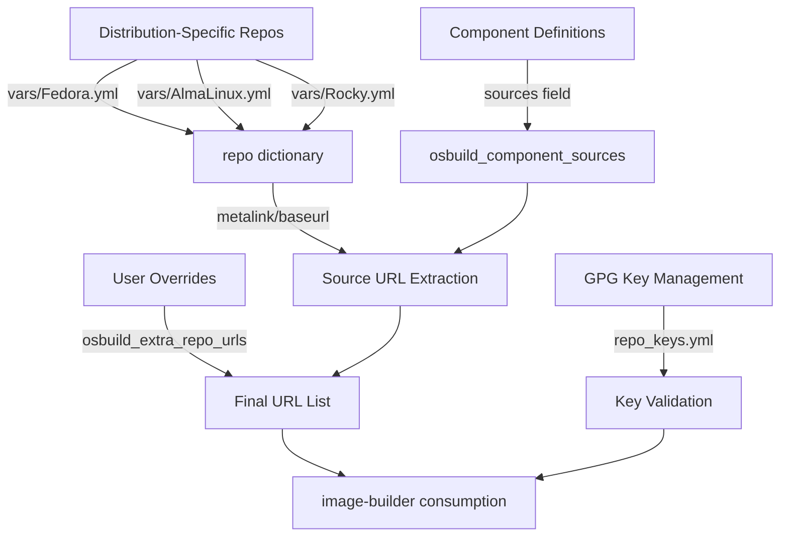
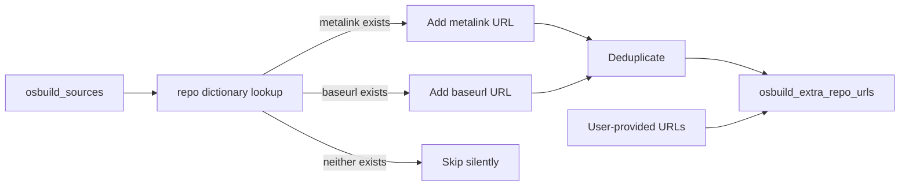
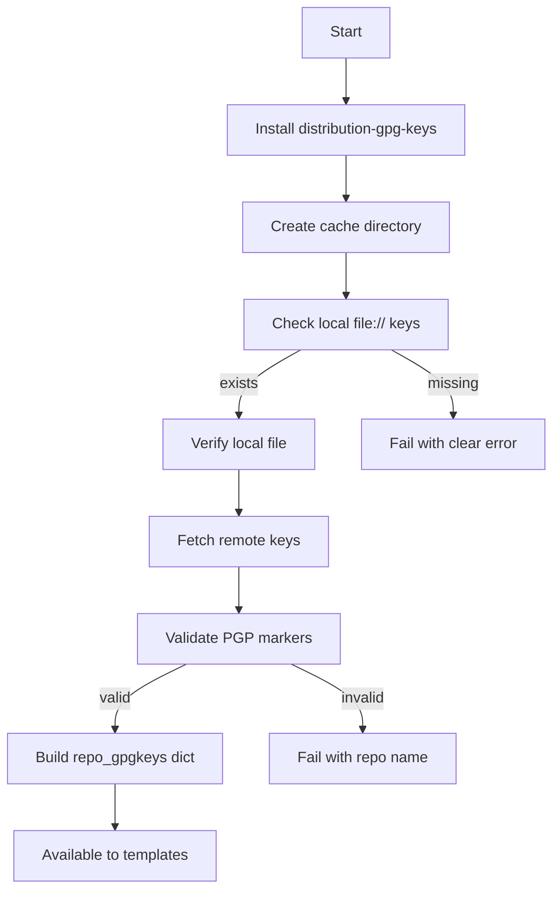

This page details how the osbuild role dynamically aggregates repository sources from components and manages GPG key verification for secure package installation. The system supports both traditional ISO builds and bootc container workflows, with distribution-specific repository definitions and a robust key validation pipeline.

---

## **Architectural Overview: Source Aggregation Pipeline**

The repository source configuration follows a **three-tier aggregation model** that combines distribution defaults, component requirements, and user overrides. This ensures that all required repositories are available during image builds while maintaining security through GPG key verification.



**Core Components**:
- **Distribution repositories**: Defined in `vars/{Distribution}.yml` with `metalink`/`baseurl` and `gpgkey_url` fields
- **Component sources**: Each component in `osbuild_component_defs` declares required repositories via the `sources` field
- **Aggregation logic**: Combines distribution defaults + component sources + user overrides in `tasks/sources.yml`
- **Key verification**: Centralized GPG key fetching and validation in `tasks/repo_keys.yml`

Sources: [tasks/sources.yml](tasks/sources.yml#L1-L33), [tasks/repo_keys.yml](tasks/repo_keys.yml#L1-L116), [defaults/main.yml](defaults/main.yml#L600-L620)

---

## **Repository Definition Schema**

Each repository in the distribution-specific files (`vars/Fedora.yml`, `vars/AlmaLinux.yml`, `vars/Rocky.yml`) follows a standardized schema with these fields:

| Field | Type | Purpose | Example |
|-------|------|---------|---------|
| `metalink` | string | Mirror list URL for repository discovery | `"https://mirrors.fedoraproject.org/metalink?repo=fedora-43&arch=x86_64"` |
| `baseurl` | string | Direct repository base URL | `"https://developer.download.nvidia.com/compute/cuda/repos/fedora43/x86_64"` |
| `gpgkey_url` | string | URL to GPG public key (file:// or https://) | `"file:///usr/share/distribution-gpg-keys/fedora/RPM-GPG-KEY-fedora-43-primary"` |
| `check_gpg` | boolean | Enable/disable GPG verification | `true` |

**Key URL Strategies**:
1. **Bundled keys**: Prefer `file://` URLs pointing to `/usr/share/distribution-gpg-keys/` (installed via `distribution-gpg-keys` package)
2. **Remote keys**: Use `https://` URLs for repositories without bundled keys (fetched at build time)
3. **No verification**: Omit `gpgkey_url` and set `check_gpg: false` for unsigned repositories

Sources: [vars/Fedora.yml](vars/Fedora.yml#L1-L79), [vars/AlmaLinux.yml](vars/AlmaLinux.yml#L1-L68), [vars/Rocky.yml](vars/Rocky.yml#L1-L90)

---

## **Source Aggregation Workflow**

The aggregation process in `tasks/sources.yml` implements a **non-destructive union** pattern that preserves user-provided repositories while adding component requirements:



**Algorithm**:
1. Initialize with existing `osbuild_extra_repo_urls` (user overrides)
2. For each source in `osbuild_sources`:
   - If source exists in `repo` dictionary:
     - Prefer `metalink` if defined, else use `baseurl`
     - Append to URL list
3. Deduplicate the final list

**Distribution-Specific Sources**:
- **Fedora**: RPM Fusion (free/nonfree), VS Code, Google Chrome, Docker CE
- **AlmaLinux/Rocky**: EPEL, RPM Fusion EL updates, VS Code, Google Chrome, Docker CE

Sources: [tasks/sources.yml](tasks/sources.yml#L5-L20), [defaults/main.yml](defaults/main.yml#L603-L618)

---

## **GPG Key Management Pipeline**

The GPG key management system in `tasks/repo_keys.yml` implements a **secure, idempotent, parallel fetch-and-validate** pattern:



**Key Features**:
| Feature | Implementation | Benefit |
|---------|----------------|---------|
| **HTTPS Validation** | `validate_certs: true` | Prevents MITM attacks |
| **Timeout** | `timeout: 30` | Avoids hanging on slow networks |
| **Idempotency** | `force: false` (default) | Skips re-download if cached |
| **Parallelism** | Ansible forks (10) | Faster key fetching |
| **Content Validation** | PGP marker check | Ensures valid key format |
| **Fail-Fast** | Immediate abort on error | Clear failure messages |

**Cache Directory**: `osbuild_gpgkey_cache_dir` (default: `/var/lib/osbuild-composer/gpgkeys`)

Sources: [tasks/repo_keys.yml](tasks/repo_keys.yml#L1-L116), [defaults/main.yml](defaults/main.yml#L795-L796)

---

## **Component-Specific Source Integration**

Components declare their required repositories via the `sources` field in `osbuild_component_defs`. The system automatically aggregates these with distribution defaults:

**Example: NVIDIA Component Sources**
```yaml
nvidia:
  sources: "{{ _nvidia_sources }}"
  # _nvidia_sources resolves to:
  # Fedora: ['rpmfusion-nonfree-nvidia-driver', 'cuda-fedora43-x86_64', 'nvidia-container-toolkit']
  # AlmaLinux/Rocky: ['rpmfusion-nonfree-nvidia-driver', 'cuda-el10-x86_64', 'nvidia-container-toolkit']
```

**Aggregation Logic** (in `tasks/main.yml`):
```yaml
osbuild_component_sources: >
  
  
  
  
  
  
  {{ ns.sources | unique | list }}
```

**Final Source List**:
```yaml
osbuild_sources: >-
  {{ (ansible_distribution == 'Fedora') | ternary(osbuild_distro_sources_fedora,
  osbuild_distro_sources_el) + (osbuild_component_sources | default([])) }}
```

Sources: [tasks/main.yml](tasks/main.yml#L60-L70), [defaults/main.yml](defaults/main.yml#L603-L620), [defaults/main.yml](defaults/main.yml#L260-L270)

---

## **Distribution-Specific Repository Patterns**

### **Fedora Repository Topology**
| Repository | Type | Key Strategy | Notes |
|------------|------|--------------|-------|
| `fedora` | metalink | Bundled (`distribution-gpg-keys`) | Primary OS repo |
| `updates` | metalink | Bundled | Updates for Fedora 43 |
| `rpmfusion-free` | baseurl | Bundled | Free software |
| `rpmfusion-nonfree` | baseurl | Bundled | Non-free software |
| `rpmfusion-nonfree-nvidia-driver` | baseurl | Bundled | NVIDIA drivers |
| `cuda-fedora43-x86_64` | baseurl | Remote | NVIDIA CUDA |
| `nvidia-container-toolkit` | baseurl | Remote | Container toolkit |
| `docker-ce-stable` | baseurl | Bundled | Docker CE |
| `vscode` | baseurl | Bundled | VS Code |
| `google-chrome` | baseurl | Bundled | Chrome browser |
| `antigravity-rpm` | baseurl | **No GPG check** | Unsigned repository |

### **AlmaLinux/Rocky Repository Topology**
| Repository | Type | Key Strategy | Notes |
|------------|------|--------------|-------|
| `almalinux-baseos`/`rocky-baseos` | metalink/baseurl | Bundled | Primary OS repo |
| `almalinux-appstream`/`rocky-appstream` | metalink/baseurl | Bundled | Application stream |
| `almalinux-crb`/`rocky-crb` | metalink/baseurl | Bundled | CodeReady Builder |
| `epel` | baseurl | Bundled | Extra Packages for Enterprise Linux |
| `rpmfusion-free-updates` | baseurl | Bundled | RPM Fusion free updates |
| `rpmfusion-nonfree-updates` | baseurl | Bundled | RPM Fusion non-free updates |
| `cuda-el{9,10}-x86_64` | baseurl | Remote | NVIDIA CUDA (RHEL-compatible) |
| `nvidia-container-toolkit` | baseurl | Remote | Container toolkit |
| `docker-ce-stable` | baseurl | Remote | Docker CE |

**Key Differences**:
- AlmaLinux/Rocky use **major-version-only** paths for EPEL and RPM Fusion (e.g., `/epel/10/`, not `/epel/10.2/`)
- NVIDIA CUDA repositories use **RHEL-compatible** paths (`rhel9`, `rhel10`)
- Rocky Linux has **version-specific CUDA keys** (RHEL9 uses `D42D0685.pub`, RHEL10 uses `CDF6BA43.pub`)

Sources: [vars/Fedora.yml](vars/Fedora.yml#L1-L79), [vars/AlmaLinux.yml](vars/AlmaLinux.yml#L1-L68), [vars/Rocky.yml](vars/Rocky.yml#L1-L90)

---
## **Bootc-Specific Repository Handling**

For bootc container builds, repositories are injected via shell commands in the `Containerfile`. Each component can define `bootc_repos` as a list of shell commands:

**Example: NVIDIA bootc Repositories**
```yaml
nvidia:
  bootc_repos: "{{ _nvidia_bootc_repos }}"
  # _nvidia_bootc_repos resolves to shell commands that:
  # 1. Create /etc/yum.repos.d/rpmfusion-nonfree-nvidia-driver.repo
  # 2. Create /etc/yum.repos.d/nvidia-cuda.repo
  # 3. Create /etc/yum.repos.d/nvidia-container-toolkit.repo
```

**Key Differences from Traditional ISO**:
- **Shell-based**: Repositories are created via `cat > /etc/yum.repos.d/...` commands
- **Embedded in Containerfile**: Added during container build, not during image composition
- **Same GPG keys**: Uses identical keys to traditional ISO builds

Sources: [defaults/main.yml](defaults/main.yml#L100-L150), [defaults/main.yml](defaults/main.yml#L260-L270)

---
## **Validation and Error Handling**

### **GPG Key Validation**
The system performs **multi-stage validation** for GPG keys:

1. **Local File Check**: For `file://` URLs, verifies file existence before attempting fetch
2. **Content Validation**: Ensures fetched keys contain both `-----BEGIN PGP PUBLIC KEY BLOCK-----` and `-----END PGP PUBLIC KEY BLOCK-----` markers
3. **HTTPS Validation**: Enforces certificate validation for remote fetches
4. **Timeout Protection**: 30-second timeout per key fetch

**Error Messages**:
- Missing local key: `"gpgkey for '{repo_name}' points at {url}, which does not exist on this host"`
- Invalid PGP content: `"Fetched gpgkey for '{repo_name}' is malformed or missing PGP markers"`

### **Repository URL Validation**
- **Silent Skip**: Sources absent from `repo` dictionary are skipped (documented pitfall)
- **Explicit URLs**: User-provided `osbuild_extra_repo_urls` bypass the `repo` dictionary entirely

Sources: [tasks/repo_keys.yml](tasks/repo_keys.yml#L25-L50), [tasks/repo_keys.yml](tasks/repo_keys.yml#L85-L95), [tasks/sources.yml](tasks/sources.yml#L8-L12)

---
## **Performance Considerations**

| Operation | Parallelism | Caching | Timeout |
|-----------|-------------|---------|---------|
| GPG Key Fetch | 10 forks (Ansible default) | Yes (file-based) | 30s |
| Repository URL Resolution | Sequential | No | N/A |
| PGP Validation | Sequential | No | N/A |

**Optimization Tips**:
1. **Pre-install `distribution-gpg-keys`**: Reduces remote fetches for bundled keys
2. **Use `file://` URLs**: For keys available in `distribution-gpg-keys` package
3. **Minimize custom repos**: Each additional repository increases build time

Sources: [tasks/repo_keys.yml](tasks/repo_keys.yml#L10-L15), [tasks/repo_keys.yml](tasks/repo_keys.yml#L60-L70)

---
## **Security Considerations**

### **GPG Key Security Model**
1. **Chain of Trust**: Bundled keys (`distribution-gpg-keys` package) are signed by the distribution's release key
2. **Runtime Verification**: Remote keys are fetched over HTTPS with certificate validation
3. **Content Integrity**: PGP markers ensure keys are valid before use
4. **Minimal Privileges**: GPG key files are stored with `0644` permissions

### **Repository Security**
- **GPG Check Enforcement**: All repositories with `check_gpg: true` require valid signatures
- **Unsigned Repositories**: Explicitly marked with `check_gpg: false` (e.g., `antigravity-rpm`)
- **HTTPS Everywhere**: All remote repositories use HTTPS (except RPM Fusion, which uses HTTP)

**Security Recommendations**:
1. **Audit Repository Definitions**: Regularly verify `gpgkey_url` values in `vars/{Distribution}.yml`
2. **Monitor Key Rotations**: Update `gpgkey_url` when distributions rotate their keys
3. **Use HTTPS**: Prefer HTTPS for all repository URLs when possible

Sources: [tasks/repo_keys.yml](tasks/repo_keys.yml#L60-L80), [vars/Fedora.yml](vars/Fedora.yml#L70-L75)

---
## **Customization Guide**

### **Adding a New Repository**
1. **Define in Distribution File** (`vars/{Distribution}.yml`):
   ```yaml
   repo:
     my-new-repo:
       baseurl: "https://example.com/repo/"
       gpgkey_url: "https://example.com/repo/GPG-KEY"
       check_gpg: true
   ```
2. **Add to Component** (in `defaults/main.yml`):
   ```yaml
   my_component:
     sources: ["my-new-repo"]
   ```
3. **Or Override at Runtime**:
   ```bash
   ansible-playbook -e "osbuild_extra_repo_urls=['https://example.com/repo/']"
   ```

### **Disabling GPG Check for a Repository**
```yaml
repo:
  my-unsigned-repo:
    baseurl: "https://example.com/unsigned-repo/"
    check_gpg: false
    # gpgkey_url omitted
```

### **Using Local GPG Keys**
```yaml
repo:
  my-local-repo:
    baseurl: "https://example.com/repo/"
    gpgkey_url: "file:///path/to/local/GPG-KEY"
    check_gpg: true
```

Sources: [vars/Fedora.yml](vars/Fedora.yml#L1-L79), [defaults/main.yml](defaults/main.yml#L200-L300)

---
## **Troubleshooting**

| Symptom | Cause | Solution |
|---------|-------|----------|
| **GPG key fetch fails** | Network issue or invalid URL | Verify URL with `curl -sSL -o /dev/null -w "%{http_code}\n" <url>` |
| **Missing local GPG key** | `distribution-gpg-keys` not installed | Install package: `dnf install distribution-gpg-keys` |
| **PGP marker validation fails** | Corrupted key file | Re-fetch the key and verify its content |
| **Repository URL not included** | Source not in `repo` dictionary | Add to `osbuild_extra_repo_urls` or define in distribution file |
| **Duplicate URLs** | Same repository defined in multiple places | The system deduplicates automatically |

**Debug Commands**:
```bash
# Verify a GPG key URL
curl -sSL <gpgkey_url> | grep -c "-----END PGP PUBLIC KEY BLOCK-----"

# Check if local key exists
ls -la /usr/share/distribution-gpg-keys/{distribution}/

# Test repository accessibility
curl -sSL -o /dev/null -w "%{http_code}\n" <baseurl>
```

Sources: [tasks/repo_keys.yml](tasks/repo_keys.yml#L10-L15), [tasks/sources.yml](tasks/sources.yml#L25-L33)

---
## **Integration with Build Process**

The repository source configuration integrates with both build modes:

### **Traditional ISO Build**
1. **Blueprint Generation**: Repository URLs are included in the `[[sources]]` section of the blueprint TOML
2. **image-builder Consumption**: `image-builder` uses the blueprint to fetch packages from configured repositories

### **Bootc Container Build**
1. **Containerfile Generation**: Repository shell commands are embedded in the `Containerfile`
2. **Container Build**: `bootc-image-builder` executes the shell commands to configure repositories in the container

**Blueprint TOML Example**:
```toml
[[sources]]
name = "rpmfusion-nonfree-nvidia-driver"
url = "http://download1.rpmfusion.org/nonfree/fedora/nvidia-driver/43/x86_64/"
gpgkey = "file:///usr/share/distribution-gpg-keys/rpmfusion/RPM-GPG-KEY-rpmfusion-nonfree-fedora-2020"
check_gpg = true
```

Sources: [templates/blueprint.toml.j2](templates/blueprint.toml.j2), [tasks/build.yml](tasks/build.yml)

---
## **Next Steps**

- **For repository customization**: See [Fedora-Specific Configuration and Repository Management](23-fedora-specific-configuration-and-repository-management) or [AlmaLinux and Rocky Linux Support and Differences](24-almalinux-and-rocky-linux-support-and-differences)
- **For component definition details**: See [Component Definitions: Schema, Dependencies, and Conflicts](15-component-definitions-schema-dependencies-and-conflicts)
- **For build process integration**: See [Traditional ISO Build Workflow with image-builder-cli](11-traditional-iso-build-workflow-with-image-builder-cli) or [Bootc Container Image Build Process and Multi-Stage Containerfile](12-bootc-container-image-build-process-and-multi-stage-containerfile)