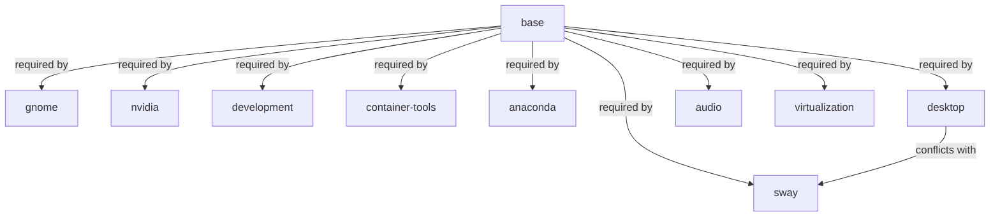

This page provides a **comprehensive technical breakdown** of the component system in the OSBuild role, focusing on how components are **defined**, how their **dependencies** are resolved, and how **conflicts** are detected and managed. It serves as the foundational reference for developers customizing or extending the role's modular architecture.

---

## Overview of Component Architecture

The OSBuild role employs a **component-based design** to modularize the construction of custom OS images. Each component encapsulates a logical unit of functionality (e.g., `gnome`, `nvidia`, `development`) and declares its **packages**, **dependencies**, **conflicts**, and **metadata** in a structured schema. This abstraction enables:
- **Reusability**: Components can be mixed and matched to create tailored images.
- **Validation**: Schema, dependency, and conflict checks ensure consistency.
- **Extensibility**: New components can be added without modifying core logic.

The component system is **dual-path compatible**, supporting both **traditional ISO builds** (via `image-builder-cli`) and **bootc container builds**.

**Core Files**:
- **Definitions**: [`defaults/main.yml`](defaults/main.yml#L200-L866)
- **Validation**: [`tasks/validate_components.yml`](tasks/validate_components.yml#L1-L69)
- **Schema Validation Script**: [`tests/validate_schema.py`](tests/validate_schema.py#L1-L124)
- **Blueprint Generation**: [`templates/blueprint.toml.j2`](templates/blueprint.toml.j2#L1-L133)

---

## Component Schema

### Required Fields
Every component **must** define the following fields in `osbuild_component_defs` (located in [`defaults/main.yml`](defaults/main.yml#L200-L866)). These fields are validated by both the Ansible task [`validate_components.yml`](tasks/validate_components.yml#L10-L25) and the Python script [`validate_schema.py`](tests/validate_schema.py#L20-L36).

| Field | Type | Description | Example |
|-------|------|-------------|---------|
| `label` | string | Human-readable name for the component. | `"GNOME Desktop"` |
| `packages` | list or Jinja2 expression | List of packages to install. Jinja2 expressions (e.g., `{{ system_packages.Settings.gnome }}`) are resolved at runtime. | `["gnome-shell", "gdm"]` or `{{ system_packages.Settings.gnome }}` |
| `blueprint_groups` | list or Jinja2 expression | DNF group names to include in the blueprint. | `["development-tools", "c-development"]` |
| `services` | list or Jinja2 expression | Systemd services to enable. | `["gdm", "NetworkManager"]` |
| `kernel_args` | list | Kernel command-line arguments to append. | `["rd.driver.blacklist=nouveau", "nvidia-drm.modeset=1"]` |
| `sources` | list or Jinja2 expression | Repository sources required by the component. | `["rpmfusion-nonfree-nvidia-driver", "cuda-fedora43-x86_64"]` |
| `files` | list | Custom file payloads to inject into the image. | `[{"path": "/etc/example.conf", "content": "..."}]` |
| `flatpaks` | list or Jinja2 expression | Flatpak application IDs to install. | `["org.gnome.Calculator"]` |
| `copr_repos` | list or Jinja2 expression | COPR repository names to enable. | `["copr:user:repo"]` |
| `bootc_repos` | list or Jinja2 expression | Shell commands to add repositories in bootc builds. | See [`defaults/main.yml#L100-L150`](defaults/main.yml#L100-L150) for NVIDIA bootc repos. |
| `requires` | list | Components this component depends on. | `["base"]` |
| `conflicts` | list | Components this component conflicts with. | `["sway"]` |
| `size_impact` | enum | Estimated impact on image size. Valid values: `none`, `small`, `medium`, `large`. | `"medium"` |
| `build_time_impact` | enum | Estimated impact on build time. Valid values: `none`, `low`, `medium`, `high`. | `"low"` |
| `secure_boot_compatible` | boolean | Whether the component is compatible with Secure Boot. | `true` |
| `bootc_only` | boolean | If `true`, the component is only applicable to bootc builds. | `false` |
| `blueprint_only` | boolean | If `true`, the component is only applicable to traditional ISO builds. | `true` (for `anaconda`) |

**Schema Validation**:
- The Python script [`validate_schema.py`](tests/validate_schema.py#L1-L124) enforces:
  - Presence of all required fields.
  - Correct types for each field (e.g., `size_impact` must be one of `none`, `small`, `medium`, `large`).
  - List fields must be either a literal list or a Jinja2 expression resolving to a list.
- The Ansible task [`validate_components.yml`](tasks/validate_components.yml#L10-L25) performs runtime assertions for required fields.

---

## Component Dependencies

### Dependency Declaration
Dependencies are declared in the `requires` field of each component. For example:
```yaml
gnome:
  requires:
    - base
```
This means the `gnome` component **cannot** be used without also including the `base` component.

**Dependency Resolution**:
- The Ansible task [`validate_components.yml`](tasks/validate_components.yml#L45-L52) checks that all dependencies of selected components are satisfied:
  ```yaml
  - name: Check required dependencies are satisfied
    ansible.builtin.assert:
      that: >-
        (osbuild_component_defs[item].requires | default([])) | difference(osbuild_components) | length == 0
      fail_msg: >-
        Component '{{ item }}' requires {{ osbuild_component_defs[item].requires | join(', ') }}
        but missing: {{ (osbuild_component_defs[item].requires | default([])) | difference(osbuild_components) | join(', ') }}.
        Add the missing components to osbuild_components.
  ```
- If a dependency is missing, the task fails with a descriptive error message.

**Dependency Graph**:
The following **Mermaid diagram** illustrates the dependency relationships between core components:

**Key Observations**:
- `base` is the **foundational dependency** for almost all components.
- Components like `anaconda` (ISO installer) are **blueprint-only** and cannot be used in bootc builds.
- The `desktop` component (an alias for `gnome`) **conflicts with** `sway`.

---

## Component Conflicts

### Conflict Declaration
Conflicts are declared in the `conflicts` field of each component. For example:
```yaml
desktop:
  conflicts:
    - sway
```
This means the `desktop` and `sway` components **cannot** be used together in the same build.

**Conflict Detection**:
- The Ansible task [`validate_components.yml`](tasks/validate_components.yml#L27-L42) aggregates all conflicts from selected components and checks if any conflicting component is also selected:
  ```yaml
  - name: Build list of selected component conflicts
    ansible.builtin.set_fact:
      _selected_conflicts: >-
        {{
          _selected_conflicts | default([]) +
          (osbuild_component_defs[item].conflicts | default([]))
        }}
    loop: "{{ osbuild_components }}"

  - name: Check for conflicting components selected together
    ansible.builtin.assert:
      that: item not in osbuild_components
      fail_msg: >
        Conflict detected: '{{ item }}' is listed as a conflict by one of the
        selected components but is also in osbuild_components.
        Remove '{{ item }}' or the component that conflicts with it.
    loop: "{{ _selected_conflicts | default([]) | unique }}"
  ```
- If a conflict is detected, the task fails with a clear error message.

**Conflict Resolution**:
- Conflicts **must be manually resolved** by removing one of the conflicting components from the `osbuild_components` list in [`defaults/main.yml`](defaults/main.yml#L230-L240).

---

## Component Metadata and Constraints

### Size and Build Time Impact
Components declare their **estimated impact** on the final image and build process using the `size_impact` and `build_time_impact` fields. These are validated against the following enums:
- `size_impact`: `none`, `small`, `medium`, `large`
- `build_time_impact`: `none`, `low`, `medium`, `high`

**Example Impacts**:
| Component | Size Impact | Build Time Impact | Rationale |
|-----------|-------------|-------------------|-----------|
| `base` | `small` | `none` | Minimal packages (kernel, systemd, etc.). |
| `gnome` | `medium` | `low` | Desktop environment adds moderate size. |
| `nvidia` | `large` | `medium` | GPU drivers and CUDA stack are large. |
| `oneapi` | `large` | `high` | Intel oneAPI adds ~15GB to the ISO. |
| `development` | `medium` | `medium` | Compilers, languages, and tools. |

**Validation**:
- The Python script [`validate_schema.py`](tests/validate_schema.py#L70-L85) ensures these fields use valid enum values.

---

### Build Mode Constraints
Components can be restricted to specific build modes using the `bootc_only` and `blueprint_only` fields:
- `bootc_only: true`: The component is **only** applicable to bootc container builds.
- `blueprint_only: true`: The component is **only** applicable to traditional ISO builds (e.g., `anaconda`).

**Example**:
```yaml
anaconda:
  blueprint_only: true
```
This ensures the `anaconda` installer is **not** included in bootc builds, as it is irrelevant for container-based images.

---
## Component Definitions in Practice

### Example: NVIDIA Component
The `nvidia` component in [`defaults/main.yml`](defaults/main.yml#L260-L280) demonstrates a **complex component** with:
- **Packages**: Dynamically resolved from `system_packages.Graphics.nvidia`.
- **Services**: `nvidia-cdi-refresh` and `nvidia-persistenced`.
- **Kernel Arguments**: Blacklists `nouveau` and enables NVIDIA DRM modesetting.
- **Sources**: Dynamically resolved from `_nvidia_sources` (Fedora vs. EL distros).
- **Bootc Repos**: Shell commands to add NVIDIA repositories in bootc builds.
- **Dependencies**: Requires `base`.
- **Conflicts**: None.
- **Metadata**:
  - `size_impact: "large"`
  - `build_time_impact: "medium"`
  - `secure_boot_compatible: false` (NVIDIA drivers often conflict with Secure Boot).

**Source**:
```yaml
nvidia:
  label: "NVIDIA GPU Stack"
  packages: "{{ system_packages.Graphics.nvidia }}"
  blueprint_groups: []
  services:
    - nvidia-cdi-refresh
    - nvidia-persistenced
  kernel_args:
    - "rd.driver.blacklist=nouveau"
    - "modprobe.blacklist=nouveau"
    - "nvidia-drm.modeset=1"
    - "DRACUT_NO_XATTR=1"
  sources: "{{ _nvidia_sources }}"
  files: []
  flatpaks: []
  copr_repos: []
  bootc_repos: "{{ _nvidia_bootc_repos }}"
  requires:
    - base
  conflicts: []
  size_impact: "large"
  build_time_impact: "medium"
  secure_boot_compatible: false
  bootc_only: false
  blueprint_only: false
```
Sources: [`defaults/main.yml`](defaults/main.yml#L260-L280)

---
### Example: Desktop vs. Sway Conflict
The `desktop` component (an alias for `gnome`) **conflicts with** `sway`:
```yaml
desktop:
  label: "GNOME Desktop (alias for 'gnome')"
  conflicts:
    - sway
```
This ensures users **cannot** select both a traditional desktop (GNOME) and a tiling window manager (Sway) in the same build, as they serve overlapping purposes.

**Source**: [`defaults/main.yml`](defaults/main.yml#L450-L470)

---
## Component Aliases and Backward Compatibility

### Aliases
Some components are **aliases** for others, providing backward compatibility or preset configurations. For example:
- `core`: Alias for `base`.
- `desktop`: Alias for `gnome` with additional flatpaks and conflicts.

**Example: `desktop` Alias**:
```yaml
desktop:
  label: "GNOME Desktop (alias for 'gnome')"
  packages: "{{ system_packages.Settings.gnome + system_packages.Utility.xdg }}"
  blueprint_groups: []
  services:
    - gdm
  kernel_args: []
  sources: []
  files: []
  flatpaks: "{{ system_flatpaks.system + system_flatpaks.productivity }}"
  copr_repos: []
  bootc_repos: []
  requires:
    - base
  conflicts:
    - sway
  size_impact: "medium"
  build_time_impact: "low"
  secure_boot_compatible: true
  bootc_only: false
  blueprint_only: false
```
**Key Differences from `gnome`**:
- Includes additional flatpaks (`system_flatpaks.system + system_flatpaks.productivity`).
- Explicitly conflicts with `sway`.

**Source**: [`defaults/main.yml`](defaults/main.yml#L450-L470)

---
### Backward Compatibility
Legacy variables (e.g., `osbuild_use_nvidia`) are derived from `osbuild_components` for compatibility with existing playbooks:
```yaml
osbuild_use_nvidia: "{{ 'nvidia' in osbuild_components }}"
osbuild_use_sway: "{{ 'sway' in osbuild_components }}"
```
**Source**: [`defaults/main.yml`](defaults/main.yml#L50-L55)

---
## Validation Workflow

The validation process ensures that:
1. **All selected components are defined** in `osbuild_component_defs`.
2. **All required schema fields** are present for each component.
3. **Dependencies** of selected components are satisfied.
4. **Conflicts** between selected components are detected.

### Step-by-Step Validation
1. **Check Component Existence**:
   - The task [`validate_components.yml`](tasks/validate_components.yml#L3-L9) verifies that all components in `osbuild_components` exist in `osbuild_component_defs`.

2. **Check Required Fields**:
   - The task [`validate_components.yml`](tasks/validate_components.yml#L10-L25) asserts that all required fields are defined for each component.

3. **Aggregate Conflicts**:
   - The task [`validate_components.yml`](tasks/validate_components.yml#L27-L34) builds a list of all conflicts from selected components.

4. **Check for Conflicts**:
   - The task [`validate_components.yml`](tasks/validate_components.yml#L36-L42) ensures no conflicting components are selected together.

5. **Check Dependencies**:
   - The task [`validate_components.yml`](tasks/validate_components.yml#L45-L52) ensures all dependencies are satisfied.

6. **Display Validation Summary**:
   - The task [`validate_components.yml`](tasks/validate_components.yml#L54-L65) outputs a summary of validated components and their metadata.

**Example Validation Output**:
```
✓ Validated 7 components: base, gnome, sway, nvidia, development, container-tools, anaconda
Size impacts: small, medium, small, large, medium, small, medium
Build time impacts: none, low, low, medium, medium, low, low
```
**Source**: [`tasks/validate_components.yml`](tasks/validate_components.yml#L54-L65)

---
## Integration with Blueprint Generation

Components are **dynamically compiled** into the blueprint TOML file (`templates/blueprint.toml.j2`) during the build process. The template:
1. Iterates over `osbuild_components` and includes:
   - Packages (`[[packages]]`).
   - Groups (`[[groups]]`).
   - Kernel arguments (`[customizations.kernel]`).
   - Services (`[customizations.services]`).
   - Files (`[[customizations.files]]`).
2. Resolves Jinja2 expressions (e.g., `{{ system_packages.Settings.gnome }}`) to their runtime values.

**Example: Kernel Arguments**:
If the `nvidia` component is selected, its `kernel_args` are appended to the blueprint:
```toml
[customizations.kernel]
append = "rd.driver.blacklist=nouveau modprobe.blacklist=nouveau nvidia-drm.modeset=1 DRACUT_NO_XATTR=1"
```
**Source**: [`templates/blueprint.toml.j2`](templates/blueprint.toml.j2#L40-L50)

---
## Component Comparison Table

The following table compares **key components** in terms of their dependencies, conflicts, and metadata:

| Component | Requires | Conflicts | Size Impact | Build Time Impact | Secure Boot | Bootc Only | Blueprint Only | Purpose |
|-----------|----------|-----------|-------------|-------------------|-------------|------------|----------------|---------|
| `base` | [] | [] | small | none | ✅ | ❌ | ❌ | Core system (kernel, systemd, etc.) |
| `anaconda` | [`base`] | [] | medium | low | ✅ | ❌ | ✅ | Anaconda installer (ISO only) |
| `gnome` | [`base`] | [] | medium | low | ✅ | ❌ | ❌ | GNOME desktop environment |
| `sway` | [`base`] | [] | small | low | ✅ | ❌ | ❌ | Sway tiling window manager |
| `desktop` | [`base`] | [`sway`] | medium | low | ✅ | ❌ | ❌ | GNOME desktop + productivity tools |
| `nvidia` | [`base`] | [] | large | medium | ❌ | ❌ | ❌ | NVIDIA GPU drivers + CUDA |
| `development` | [`base`] | [] | medium | medium | ✅ | ❌ | ❌ | Compilers, languages, tools |
| `container-tools` | [`base`] | [] | small | low | ✅ | ❌ | ❌ | Podman, Buildah, Skopeo |
| `oneapi` | [`base`] | [] | large | high | ✅ | ❌ | ❌ | Intel oneAPI BaseKit + HPCKit |
| `cli-tools` | [`base`] | [] | small | none | ✅ | ❌ | ❌ | Modern CLI utilities |
| `cockpit` | [`base`] | [] | small | none | ✅ | ❌ | ❌ | Cockpit web-based management |
| `audio` | [`base`] | [] | medium | medium | ✅ | ❌ | ❌ | Audio production tools |
| `virtualization` | [`base`] | [] | medium | medium | ✅ | ❌ | ❌ | Virtualization stack (libvirt, QEMU) |

**Sources**:
- Component definitions: [`defaults/main.yml`](defaults/main.yml#L200-L866)
- Validation logic: [`tasks/validate_components.yml`](tasks/validate_components.yml#L1-L69)

---
## Best Practices for Extending Components

### Adding a New Component
1. **Define the Component**:
   - Add the component to `osbuild_component_defs` in [`defaults/main.yml`](defaults/main.yml#L200-L866).
   - Include all required fields (see [Component Schema](#component-schema)).

2. **Declare Dependencies**:
   - Use the `requires` field to specify dependencies (e.g., `requires: [base]`).

3. **Declare Conflicts**:
   - Use the `conflicts` field to specify conflicts (e.g., `conflicts: [sway]`).

4. **Set Metadata**:
   - Define `size_impact`, `build_time_impact`, `secure_boot_compatible`, `bootc_only`, and `blueprint_only`.

5. **Validate**:
   - Run the validation script:
     ```bash
     python3 tests/validate_schema.py
     ```
   - Or run the Ansible validation task:
     ```bash
     ansible-playbook tasks/validate_components.yml
     ```

6. **Test**:
   - Include the component in `osbuild_components` and test the build:
     ```bash
     ansible-playbook playbooks/osbuild.yml
     ```

### Example: Adding a `kubernetes` Component
```yaml
kubernetes:
  label: "Kubernetes Tools"
  packages: "{{ system_packages.System.kubernetes }}"
  blueprint_groups: []
  services: []
  kernel_args: []
  sources:
    - kubernetes
  files: []
  flatpaks: []
  copr_repos: []
  bootc_repos: []
  requires:
    - base
    - container-tools
  conflicts: []
  size_impact: "medium"
  build_time_impact: "medium"
  secure_boot_compatible: true
  bootc_only: false
  blueprint_only: false
```
**Source**: Hypothetical example (not in current codebase).

---
## Common Pitfalls and Debugging

### Missing Dependencies
**Error**:
```
Component 'gnome' requires base but missing: base.
Add the missing components to osbuild_components.
```
**Solution**:
- Add `base` to `osbuild_components` in [`defaults/main.yml`](defaults/main.yml#L230-L240).

**Source**: [`tasks/validate_components.yml`](tasks/validate_components.yml#L45-L52)

---
### Conflicting Components
**Error**:
```
Conflict detected: 'sway' is listed as a conflict by one of the selected components but is also in osbuild_components.
Remove 'sway' or the component that conflicts with it.
```
**Solution**:
- Remove either `sway` or the conflicting component (e.g., `desktop`) from `osbuild_components`.

**Source**: [`tasks/validate_components.yml`](tasks/validate_components.yml#L36-L42)

---
### Invalid Schema Field
**Error**:
```
FAIL my_component: size_impact='huge' not in {'none', 'small', 'medium', 'large'}
```
**Solution**:
- Use a valid enum value for `size_impact` (`none`, `small`, `medium`, `large`).

**Source**: [`tests/validate_schema.py`](tests/validate_schema.py#L70-L85)

---
## Cross-References

### Related Pages
- **Build Workflows**:
  - [Traditional ISO Build Workflow with image-builder-cli](11-traditional-iso-build-workflow-with-image-builder-cli)
  - [Bootc Container Image Build Process and Multi-Stage Containerfile](12-bootc-container-image-build-process-and-multi-stage-containerfile)
- **Validation**:
  - [Component Validation: Schema, Dependency, and Conflict Checking](20-component-validation-schema-dependency-and-conflict-checking)
- **Configuration Management**:
  - [Repository Source Configuration and GPG Key Management](14-repository-source-configuration-and-gpg-key-management)
- **Advanced Features**:
  - [NVIDIA CDI Setup for GPU Container Passthrough](18-nvidia-cdi-setup-for-gpu-container-passthrough)

### Next Steps
- To **customize your build**, proceed to:
  - [Selecting Target Distribution and Architecture](4-selecting-target-distribution-and-architecture)
  - [Choosing the Right Build Mode for Your Use Case](6-choosing-the-right-build-mode-for-your-use-case)
- To **validate your configuration**, see:
  - [Component Validation: Schema, Dependency, and Conflict Checking](20-component-validation-schema-dependency-and-conflict-checking)