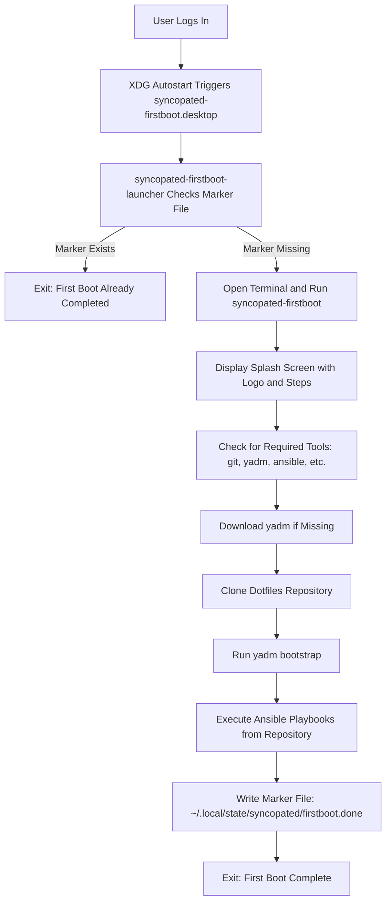

This page explains how the **osbuild** role embeds and executes Ansible playbooks during the first boot of a newly deployed system. The workflow leverages **yadm** (a dotfiles manager) to clone a repository and run `yadm bootstrap`, which can execute Ansible playbooks to configure the system. This approach ensures **idempotent**, **user-specific** first-boot automation without modifying the base image.

---

## Overview of First-Boot Automation

The **First-Boot Automation** feature embeds scripts and configurations into the image that trigger **only once** during the first graphical login. The core components are:
- **`syncopated-firstboot`**: A Bash script that orchestrates the first-boot process, including cloning a dotfiles repository and running `yadm bootstrap`.
- **`syncopated-firstboot-launcher`**: A minimal launcher that opens a terminal and runs `syncopated-firstboot` if the first-boot marker file does not exist.
- **`syncopated-firstboot.desktop`**: An XDG autostart entry that ensures the launcher runs automatically on user login.

The **Ansible playbooks** themselves are **not embedded directly** in the image. Instead, the `syncopated-firstboot` script clones a **dotfiles repository** (default: `https://github.com/b08x/dots.git`) and executes `yadm bootstrap`, which can run Ansible playbooks from the repository. This design allows for **flexible**, **user-customizable** first-boot automation while keeping the image build process **static and reproducible**.

Sources: [files/firstboot/syncopated-firstboot](files/firstboot/syncopated-firstboot#L1-L391), [files/firstboot/syncopated-firstboot-launcher](files/firstboot/syncopated-firstboot-launcher#L1-L30), [files/firstboot/syncopated-firstboot.desktop](files/firstboot/syncopated-firstboot.desktop#L1-L10)

---

## Architecture and Workflow

The first-boot automation workflow is **triggered by the XDG autostart mechanism** and executes in the following sequence:



### Key Features
| Feature | Description | Implementation |
|---------|-------------|----------------|
| **Idempotency** | Ensures the first-boot process runs only once per user. | Marker file (`~/.local/state/syncopated/firstboot.done`) |
| **User-Specific** | Runs in the context of the logged-in user, not root. | XDG autostart and user-level scripts |
| **Flexible Automation** | Allows customization via dotfiles repository. | `yadm bootstrap` executes Ansible playbooks from the repository |
| **Fallback Handling** | Gracefully handles missing tools (e.g., `yadm`, `ansible`). | Dynamic download of `yadm` and tool availability checks |
| **Cross-Distribution** | Works on Fedora, AlmaLinux, and Rocky Linux. | OS-agnostic scripts with dynamic `os-release` parsing |

Sources: [tasks/blueprint.yml](tasks/blueprint.yml#L25-L51), [files/firstboot/syncopated-firstboot](files/firstboot/syncopated-firstboot#L12-L18)

---

## Embedded Files and Injection Mechanism

The first-boot files are **injected into the image during the blueprint generation phase** of the build process. This is handled by the `Inject first-login splash files` task in `tasks/blueprint.yml`. The files are embedded as **TOML literal strings** in the `[[customizations.files]]` section of the blueprint.

### Injected Files
| File | Path in Image | Mode | Purpose |
|------|---------------|------|---------|
| `syncopated-firstboot` | `/usr/local/bin/syncopated-firstboot` | `0755` | Main script for first-boot automation |
| `syncopated-firstboot-launcher` | `/usr/local/bin/syncopated-firstboot-launcher` | `0755` | Launcher that opens a terminal and runs the main script |
| `syncopated-firstboot.desktop` | `/etc/xdg/autostart/syncopated-firstboot.desktop` | `0644` | XDG autostart entry to trigger the launcher on login |

### Injection Process
1. The `tasks/blueprint.yml` task **`Inject first-login splash files`** (lines 29–51) appends the firstboot files to the blueprint TOML.
2. The template `firstboot-files.toml.j2` renders the TOML snippet for embedding:
   ```toml
   [[customizations.files]]
   path = "/usr/local/bin/syncopated-firstboot"
   mode = "0755"
   data = '''
   <contents of syncopated-firstboot>'''
   ```
3. The injection is **conditional** on the `osbuild_firstboot_enabled` variable (default: `true`).
4. The task validates that the files **do not contain `'''`** (TOML literal string delimiter) to avoid breaking the TOML syntax.

Sources: [tasks/blueprint.yml](tasks/blueprint.yml#L29-L51), [templates/firstboot-files.toml.j2](templates/firstboot-files.toml.j2#L1-L11), [defaults/main.yml](defaults/main.yml#L742)

---

## Ansible Playbook Execution

The **Ansible playbooks** are **not bundled in the image** or this role. Instead, the `syncopated-firstboot` script:
1. **Clones a dotfiles repository** (default: `https://github.com/b08x/dots.git`) using `yadm`.
2. **Runs `yadm bootstrap`**, which can execute Ansible playbooks from the repository.

### How It Works
- The `syncopated-firstboot` script checks for the presence of `ansible` in its `CHECK_TOOLS` list (line 18):
  ```bash
  read -r -a CHECK_TOOLS <<<"${SYNCOPATED_CHECK_TOOLS:-git yadm gum ansible podman zsh flatpak nvidia-smi}"
  ```
- If `ansible` is missing, the script will **fail gracefully** and prompt the user to install it.
- The `yadm bootstrap` step (executed in the `bootstrap` function of the script) runs the playbooks defined in the dotfiles repository.

### Customization
To use a **custom dotfiles repository** with your own Ansible playbooks:
1. Set the `SYNCOPATED_DOTFILES_URL` environment variable or override the default in the script.
2. Ensure the repository contains a `bootstrap` script or playbook that `yadm bootstrap` can execute.

Sources: [files/firstboot/syncopated-firstboot](files/firstboot/syncopated-firstboot#L18), [files/firstboot/syncopated-firstboot](files/firstboot/syncopated-firstboot#L200-L250)

---

## Idempotency and State Management

The first-boot process is **idempotent** and runs only once per user. This is achieved through:
1. **Marker File**: The script creates a marker file at `~/.local/state/syncopated/firstboot.done` after successful completion.
2. **Launcher Check**: The `syncopated-firstboot-launcher` checks for the existence of the marker file before running the script:
   ```bash
   [[ -e $marker ]] && exit 0
   ```
3. **Locking**: The script uses `flock` to prevent concurrent executions (lines 189–195 of `syncopated-firstboot`).

Sources: [files/firstboot/syncopated-firstboot-launcher](files/firstboot/syncopated-firstboot-launcher#L12), [files/firstboot/syncopated-firstboot](files/firstboot/syncopated-firstboot#L197-L199)

---

## Configuration and Customization

### Enabling/Disabling First-Boot Automation
The first-boot injection is controlled by the `osbuild_firstboot_enabled` variable in `defaults/main.yml`:
```yaml
osbuild_firstboot_enabled: true  # Default: enabled
```
To disable first-boot automation, override this variable in your playbook or inventory:
```yaml
- hosts: build_host
  vars:
    osbuild_firstboot_enabled: false
```

### Customizing the Dotfiles Repository
To use a **custom dotfiles repository**, override the `SYNCOPATED_DOTFILES_URL` environment variable or modify the `DOTFILES_URL` variable in the `syncopated-firstboot` script:
```bash
export SYNCOPATED_DOTFILES_URL="https://github.com/your-username/your-dots.git"
```

### Customizing the First-Boot Script
To modify the first-boot behavior:
1. Edit the `files/firstboot/syncopated-firstboot` script.
2. Ensure the script **does not contain `'''`** (TOML literal string delimiter) to avoid breaking the blueprint TOML syntax.

Sources: [defaults/main.yml](defaults/main.yml#L742), [files/firstboot/syncopated-firstboot](files/firstboot/syncopated-firstboot#L17)

---

## Validation and Testing

The role includes **comprehensive tests** to ensure the first-boot injection and execution work correctly.

### Injection Validation
The `tests/firstboot/check_injection.py` script validates that:
1. The firstboot files are correctly injected into the blueprint TOML.
2. The `data` field in the TOML matches the source files byte-for-byte.
3. The blueprint TOML is syntactically valid.

Example usage:
```bash
python3 tests/firstboot/check_injection.py OUTPUT_DIR files/firstboot EXPECTED_COUNT
```

### Behavioral Testing
The `tests/firstboot/firstboot.bats` file tests the **runtime behavior** of the firstboot scripts, including:
- OS release banner display.
- Splash content rendering.
- Terminal launcher behavior.
- `yadm` download and execution.
- GitHub unreachable scenarios.
- Custom dotfiles URL handling.

Sources: [tests/firstboot/check_injection.py](tests/firstboot/check_injection.py#L1-L47), [tests/firstboot/firstboot.bats](tests/firstboot/firstboot.bats#L1-L419)

---
## Integration with Build Modes

The first-boot automation works **seamlessly with both build modes** supported by the osbuild role:
1. **Traditional ISO Builds**: The firstboot files are injected into the blueprint TOML and included in the ISO image.
2. **Bootc Container Builds**: The firstboot files are injected into the blueprint TOML and included in the container image.

The injection logic is **build-mode-agnostic** and is handled during the **blueprint generation phase** (`tasks/blueprint.yml`).

Sources: [tasks/main.yml](tasks/main.yml#L123-L139), [tasks/main.yml](tasks/main.yml#L178-L196)

---
## Next Steps

- To understand how the **blueprint generation** works in detail, see [Blueprint Generation: Dynamic TOML Templating with Jinja2](13-blueprint-generation-dynamic-toml-templating-with-jinja2).
- To explore how **kickstart integration** complements first-boot automation, see [Kickstart Integration for Automated Installations](19-kickstart-integration-for-automated-installations).
- To learn about **component validation**, see [Component Validation: Schema, Dependency, and Conflict Checking](20-component-validation-schema-dependency-and-conflict-checking).