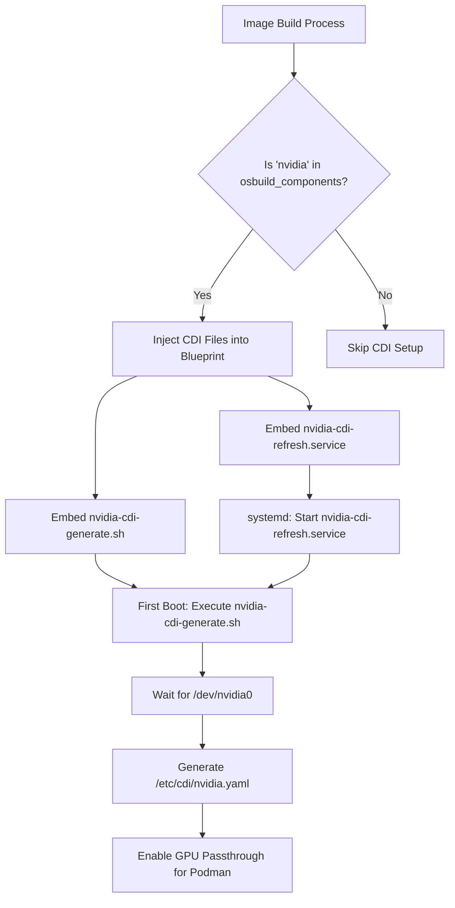

This page details how the **NVIDIA Container Device Interface (CDI)** is configured in the OSBuild role to enable GPU passthrough for containerized workloads (e.g., Podman). The setup ensures that NVIDIA GPUs are accessible inside containers without requiring privileged access, leveraging the `nvidia-ctk` toolkit and a first-boot initialization process.

---

## Overview of NVIDIA CDI in This Role
The **NVIDIA CDI** implementation in this role is designed to:
1. **Generate CDI specifications** dynamically during first boot, ensuring compatibility with the host's NVIDIA GPU configuration.
2. **Integrate with systemd** to refresh CDI configurations automatically.
3. **Embed required files** (scripts and services) into the image blueprint for both traditional ISO and bootc builds.
4. **Depend on the `nvidia` component**, which includes NVIDIA drivers, CUDA toolkit, and container runtime support.

The CDI setup is **conditionally included** when the `nvidia` component is selected in `osbuild_components`. This ensures that only systems with NVIDIA GPUs or explicit requirements include the CDI configuration.

Sources: [defaults/main.yml](defaults/main.yml#L280-L300), [templates/blueprint.toml.j2](templates/blueprint.toml.j2#L115-L133)

---

## Architecture and Workflow

### Mermaid Diagram: CDI Setup Flow


### Key Components
| Component | Purpose | Location |
|-----------|---------|----------|
| **`nvidia-cdi-generate.sh`** | Script to generate CDI spec after NVIDIA device nodes appear | [`templates/snippets/nvidia-cdi.sh.j2`](templates/snippets/nvidia-cdi.sh.j2) |
| **`nvidia-cdi-refresh.service`** | Systemd service to trigger CDI spec generation at boot | [`templates/systemd/nvidia-cdi-refresh.service.j2`](templates/systemd/nvidia-cdi-refresh.service.j2) |
| **`nvidia` Component** | Defines packages, services, and kernel args for NVIDIA support | [`defaults/main.yml`](defaults/main.yml#L280-L300) |
| **Blueprint Injection** | Conditionally embeds CDI files into the image blueprint | [`templates/blueprint.toml.j2`](templates/blueprint.toml.j2#L115-L133) |

Sources: [templates/snippets/nvidia-cdi.sh.j2](templates/snippets/nvidia-cdi.sh.j2#L1-L29), [templates/systemd/nvidia-cdi-refresh.service.j2](templates/systemd/nvidia-cdi-refresh.service.j2#L1-L18), [templates/blueprint.toml.j2](templates/blueprint.toml.j2#L115-L133)

---

## Implementation Details

### 1. CDI Generation Script (`nvidia-cdi-generate.sh`)
The script performs the following actions:
1. **Waits for NVIDIA device nodes** (e.g., `/dev/nvidia0`) to appear, with a **30-second timeout**.
2. **Generates the CDI specification** using `nvidia-ctk cdi generate` and saves it to `/etc/cdi/nvidia.yaml`.
3. **Fails gracefully** if no NVIDIA devices are detected, logging potential issues (e.g., driver not loaded, no GPU present).

#### Script Logic
```bash
#!/bin/bash
set -euo pipefail
timeout=30
while [ $timeout -gt 0 ]; do
  if [ -e /dev/nvidia0 ]; then
    mkdir -p /etc/cdi
    nvidia-ctk cdi generate --output=/etc/cdi/nvidia.yaml
    exit 0
  fi
  sleep 1
  ((timeout--))
done
echo "ERROR: NVIDIA device not found after 30 seconds" >&2
exit 1
```

Sources: [templates/snippets/nvidia-cdi.sh.j2](templates/snippets/nvidia-cdi.sh.j2#L1-L29)

---

### 2. Systemd Service (`nvidia-cdi-refresh.service`)
The service ensures the CDI specification is generated at boot and refreshed as needed. Key attributes:
- **Type**: `oneshot` (runs once and exits).
- **Dependencies**: Requires `network-online.target` and the existence of `/usr/bin/nvidia-ctk` and `/usr/local/bin/nvidia-cdi-generate.sh`.
- **Behavior**: Logs output to the journal and remains active after execution (`RemainAfterExit=true`).

#### Service Definition
```ini
[Unit]
Description=Generate NVIDIA CDI specification for Podman
Wants=network-online.target
After=network-online.target
ConditionPathExists=/usr/bin/nvidia-ctk
ConditionPathExists=/usr/local/bin/nvidia-cdi-generate.sh

[Service]
Type=oneshot
ExecStart=/usr/local/bin/nvidia-cdi-generate.sh
RemainAfterExit=true
StandardOutput=journal
StandardError=journal

[Install]
WantedBy=multi-user.target
```

Sources: [templates/systemd/nvidia-cdi-refresh.service.j2](templates/systemd/nvidia-cdi-refresh.service.j2#L1-L18)

---

### 3. Component Integration
The `nvidia` component in `osbuild_components` triggers the CDI setup. It includes:
- **Packages**: Defined by `system_packages.Graphics.nvidia` (e.g., NVIDIA drivers, CUDA toolkit, `nvidia-container-toolkit`).
- **Services**: `nvidia-cdi-refresh` and `nvidia-persistenced`.
- **Kernel Arguments**: Blacklists `nouveau`, enables `nvidia-drm.modeset=1`, and sets `DRACUT_NO_XATTR=1` for SELinux compatibility.
- **Repositories**: NVIDIA CUDA and container toolkit repos for Fedora/EL.

#### Component Definition
```yaml
nvidia:
  label: "NVIDIA GPU Stack"
  packages: "{{ system_packages.Graphics.nvidia }}"
  services:
    - nvidia-cdi-refresh
    - nvidia-persistenced
  kernel_args:
    - "rd.driver.blacklist=nouveau"
    - "modprobe.blacklist=nouveau"
    - "nvidia-drm.modeset=1"
    - "DRACUT_NO_XATTR=1"
  sources: "{{ _nvidia_sources }}"
  bootc_repos: "{{ _nvidia_bootc_repos }}"
  requires: [base]
```

Sources: [defaults/main.yml](defaults/main.yml#L280-L300)

---
### 4. Blueprint Injection
The CDI files are **conditionally injected** into the blueprint if the `nvidia` component is selected. This is handled in the [`blueprint.toml.j2`](templates/blueprint.toml.j2) template:
```toml

[[customizations.files]]
path = "/usr/local/bin/nvidia-cdi-generate.sh"
mode = "0755"
data = '''
'''

[[customizations.files]]
path = "/etc/systemd/system/nvidia-cdi-refresh.service"
data = '''
'''

```

Sources: [templates/blueprint.toml.j2](templates/blueprint.toml.j2#L115-L133)

---
## Dependencies and Requirements

### Runtime Dependencies
| Dependency | Purpose | Source |
|------------|---------|--------|
| **`nvidia-ctk`** | NVIDIA Container Toolkit for CDI spec generation | Installed via `nvidia-container-toolkit` repo |
| **NVIDIA Drivers** | Required for `/dev/nvidia0` to appear | Installed via RPM Fusion or NVIDIA repos |
| **Podman** | Container runtime for GPU passthrough | Included in `container-tools` component |
| **systemd** | Service management for `nvidia-cdi-refresh` | Part of `base` component |

### Kernel Requirements
The following kernel arguments are **automatically applied** when the `nvidia` component is selected:
- `rd.driver.blacklist=nouveau`: Blacklists the open-source Nouveau driver.
- `modprobe.blacklist=nouveau`: Prevents Nouveau from loading.
- `nvidia-drm.modeset=1`: Enables NVIDIA DRM kernel mode setting.
- `DRACUT_NO_XATTR=1`: Workaround for SELinux xattr loss in SquashFS.

Sources: [defaults/main.yml](defaults/main.yml#L280-L300), [defaults/main.yml](defaults/main.yml#L721-L723)

---
## Usage

### Enabling NVIDIA CDI
To include NVIDIA CDI in your image:
1. **Add the `nvidia` component** to `osbuild_components`:
   ```yaml
   osbuild_components:
     - base
     - nvidia
     - container-tools
   ```
2. **Build the image** using the OSBuild role. The CDI files will be automatically injected into the blueprint.

### Verification
After booting the image:
1. Check if the CDI spec was generated:
   ```bash
   cat /etc/cdi/nvidia.yaml
   ```
2. Verify the service is active:
   ```bash
   systemctl status nvidia-cdi-refresh.service
   ```
3. Test GPU passthrough in a container:
   ```bash
   podman run --rm --gpus all nvidia/cuda:latest nvidia-smi
   ```

Sources: [templates/snippets/nvidia-cdi.sh.j2](templates/snippets/nvidia-cdi.sh.j2#L1-L29), [templates/systemd/nvidia-cdi-refresh.service.j2](templates/systemd/nvidia-cdi-refresh.service.j2#L1-L18)

---
## Troubleshooting

### Common Issues
| Issue | Cause | Solution |
|-------|-------|----------|
| **CDI spec not generated** | NVIDIA device nodes missing | Verify NVIDIA drivers are loaded (`lsmod | grep nvidia`). Check `dmesg` for errors. |
| **`nvidia-ctk` not found** | Package not installed | Ensure `nvidia-container-toolkit` repo is enabled and the package is included in `system_packages.Graphics.nvidia`. |
| **Service fails to start** | Missing dependencies | Check `journalctl -u nvidia-cdi-refresh.service` for errors. Ensure `/usr/local/bin/nvidia-cdi-generate.sh` exists. |
| **Permission denied** | Script or service lacks permissions | Verify file permissions (`chmod 755 /usr/local/bin/nvidia-cdi-generate.sh`). |

### Debugging Steps
1. **Check device nodes**:
   ```bash
   ls -l /dev/nvidia*
   ```
2. **Test CDI generation manually**:
   ```bash
   /usr/local/bin/nvidia-cdi-generate.sh
   ```
3. **Inspect service logs**:
   ```bash
   journalctl -u nvidia-cdi-refresh.service -b
   ```

Sources: [templates/snippets/nvidia-cdi.sh.j2](templates/snippets/nvidia-cdi.sh.j2#L20-L29)

---
## Relationship to Other Features

### Integration with Bootc
The NVIDIA CDI setup is **fully compatible** with bootc builds. The same blueprint injection logic applies, and the CDI files are embedded in the container image. For bootc, the `nvidia` component also includes **bootc-specific repositories** (e.g., `nvidia-container-toolkit` for Fedora/EL).

Sources: [defaults/main.yml](defaults/main.yml#L97-L162)

### Interaction with First-Boot Automation
The CDI setup **does not conflict** with the first-boot automation (e.g., `syncopated-firstboot`). The CDI script runs independently via systemd, while the first-boot splash handles user-specific setup (e.g., dotfiles).

Sources: [tasks/blueprint.yml](tasks/blueprint.yml#L30-L50), [templates/firstboot-files.toml.j2](templates/firstboot-files.toml.j2#L1-L11)

---
## Next Steps
- To understand how the `nvidia` component fits into the broader build process, see:
  - [Component System: Modular Package and Configuration Management](10-component-system-modular-package-and-configuration-management)
  - [Kernel Configuration and NVIDIA-Specific Optimizations](16-kernel-configuration-and-nvidia-specific-optimizations)
- For details on how blueprints are generated, see:
  - [Blueprint Generation: Dynamic TOML Templating with Jinja2](13-blueprint-generation-dynamic-toml-templating-with-jinja2)
- To explore how services are managed in the image, see:
  - [First-Boot Automation with Embedded Ansible Playbooks](17-first-boot-automation-with-embedded-ansible-playbooks)