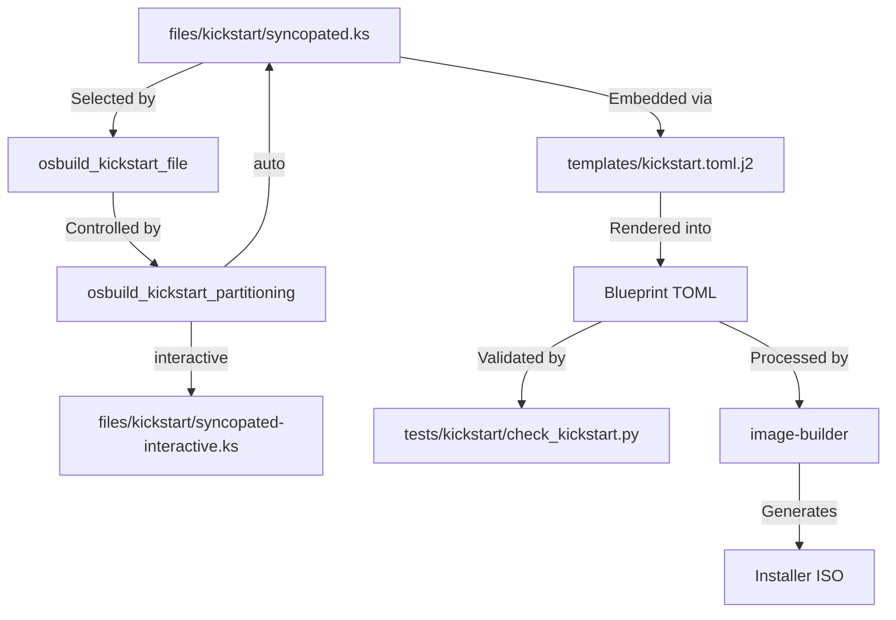
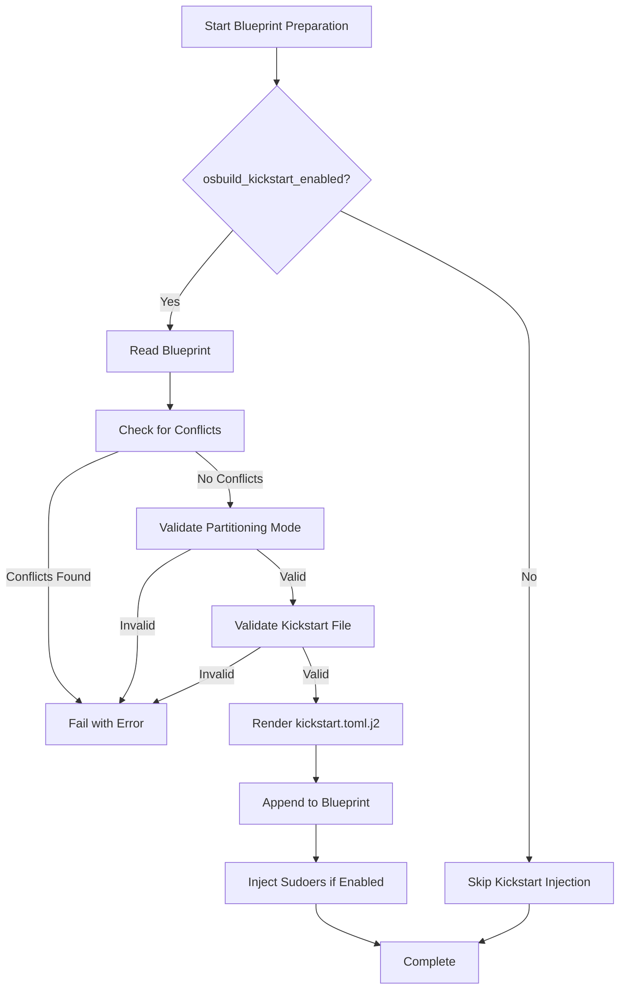
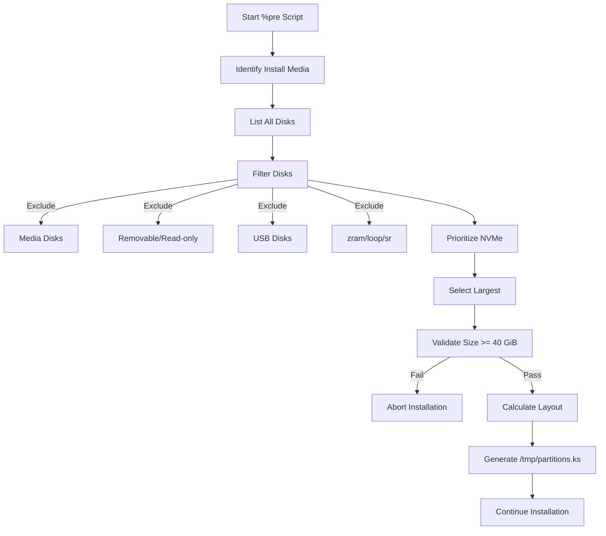

This documentation explains how the OSBuild role integrates Kickstart files for automated installer workflows, enabling unattended system deployments while maintaining flexibility for interactive scenarios. The implementation centers on embedding Kickstart configurations into image-builder blueprints via TOML templating, with validation to prevent conflicts with other customization options.

## Architectural Overview

The Kickstart integration follows a **single-source embedding pattern** where Kickstart files are stored once in `files/kickstart/` and dynamically injected into blueprints during the preparation phase. This design ensures consistency across all builds while allowing runtime customization of locale, keyboard, and timezone settings.



The system supports two partitioning modes: **auto** (automated disk selection and layout via `%pre` script) and **interactive** (manual disk selection in Anaconda GUI). The auto mode uses a sophisticated disk selection algorithm that prioritizes NVMe drives and excludes install media, removable, read-only, and USB disks.

Sources: [tasks/blueprint.yml](tasks/blueprint.yml#L60-L110), [templates/kickstart.toml.j2](templates/kickstart.toml.j2#L1-L12), [defaults/main.yml](defaults/main.yml#L750-L760)

## Core Components

### Kickstart File Variants

| File | Purpose | Partitioning | Anaconda Behavior |
|------|---------|-------------|-------------------|
| `syncopated.ks` | Automated installation | Auto-detected disk with LVM layout | Requires only root password and user creation |
| `syncopated-interactive.ks` | Semi-automated installation | Manual selection in GUI | Requires disk selection, root password, and user creation |

Both files share common configuration:
- Graphical installer mode
- Firstboot disabled
- Network configuration via DHCP
- Automatic reboot after installation

The auto-mode Kickstart (`syncopated.ks`) includes a `%pre` script that:
1. Identifies and excludes install media disks
2. Selects the best target disk (NVMe preferred, largest among equals)
3. Validates minimum disk size (40 GiB)
4. Calculates partition sizes (10% for `/`, 40% for `/usr` and `/var`, rest for `/home`)
5. Generates a partition layout file (`/tmp/partitions.ks`) with LVM configuration

Sources: [files/kickstart/syncopated.ks](files/kickstart/syncopated.ks#L1-L120), [files/kickstart/syncopated-interactive.ks](files/kickstart/syncopated-interactive.ks#L1-L18)

### Configuration Variables

| Variable | Type | Default | Description |
|----------|------|---------|-------------|
| `osbuild_kickstart_enabled` | Boolean | `true` | Master switch for Kickstart injection |
| `osbuild_kickstart_partitioning` | String | `auto` | Partitioning mode: `auto` or `interactive` |
| `osbuild_kickstart_file` | String | Dynamic | Path to selected Kickstart file |
| `osbuild_kickstart_sudoers` | Boolean | `true` | Inject passwordless sudo for wheel group |
| `osbuild_locale` | String | `en_US.UTF-8` | System locale for Kickstart |
| `osbuild_keyboard` | String | `us` | Keyboard layout for Kickstart |
| `osbuild_timezone` | String | `America/New_York` | Timezone for Kickstart |

Sources: [defaults/main.yml](defaults/main.yml#L750-L765)

## Integration Workflow

### Blueprint Injection Process

The Kickstart integration occurs in `tasks/blueprint.yml` through a multi-stage validation and injection process:

1. **Conflict Detection**: The blueprint is scanned for settings that conflict with Kickstart:
   - `[[customizations.user]]`
   - `[[customizations.group]]`
   - `unattended` flag
   - `sudo-nopasswd` flag

2. **Mode Validation**: Ensures `osbuild_kickstart_partitioning` is either `auto` or `interactive`

3. **Content Validation**: Verifies the Kickstart file doesn't contain TOML literal string delimiters (`'''`) that would break embedding

4. **Template Rendering**: The `kickstart.toml.j2` template combines:
   - Dynamic locale, keyboard, and timezone settings
   - The selected Kickstart file content
   - TOML literal string formatting

5. **Blueprint Augmentation**: The rendered Kickstart is appended to the blueprint with clear markers (`# BEGIN syncopated-kickstart` and `# END syncopated-kickstart`)

6. **Sudoers Injection**: Optional passwordless sudo configuration for wheel group



Sources: [tasks/blueprint.yml](tasks/blueprint.yml#L60-L110), [templates/kickstart.toml.j2](templates/kickstart.toml.j2#L1-L12)

### Template Structure

The `kickstart.toml.j2` template embeds the Kickstart file using Ansible's `lookup` function with `rstrip=false` to preserve trailing newlines:

```toml
[customizations.installer.kickstart]
contents = '''
lang {{ osbuild_locale }}
keyboard {{ osbuild_keyboard }}
timezone {{ osbuild_timezone }} --utc
{{ lookup('ansible.builtin.file', osbuild_kickstart_file, rstrip=false) }}'''
```

This ensures the final blueprint contains a complete, valid Kickstart configuration that image-builder can process.

Sources: [templates/kickstart.toml.j2](templates/kickstart.toml.j2#L1-L12)

## Validation System

### Test Architecture

The validation system (`tests/validate_kickstart_injection.yml`) verifies:
1. **Idempotency**: Running the injection twice doesn't create duplicate entries
2. **Mode Compliance**: Enabled mode includes Kickstart, disabled mode excludes it
3. **Content Accuracy**: The embedded Kickstart matches the source file byte-for-byte (after locale/keyboard/timezone rendering)
4. **Conflict Prevention**: Blueprints with conflicting settings are rejected
5. **TOML Validity**: All generated blueprints parse as valid TOML

The validation playbook:
- Tests both static and templated blueprints
- Runs each test case twice to verify idempotency
- Uses `check_kickstart.py` for content verification
- Optionally validates Kickstart syntax using `ksvalidator`

### Validation Script

The `check_kickstart.py` script performs comprehensive checks:
- Verifies TOML parsing
- Confirms Anaconda Users module is enabled
- Validates sudoers file presence and content
- Checks Kickstart block markers
- Compares embedded content with expected source
- Optionally runs `ksvalidator` on the extracted Kickstart

Sources: [tests/validate_kickstart_injection.yml](tests/validate_kickstart_injection.yml#L1-L154), [tests/kickstart/check_kickstart.py](tests/kickstart/check_kickstart.py#L1-L84)

## Disk Selection Algorithm

The auto-partitioning mode employs a sophisticated disk selection algorithm in the `%pre` script:

1. **Media Exclusion**:
   - Identifies install media disks from `/run/install/repo` and `/run/install/isodir` mount points
   - Checks `inst.stage2=hd:LABEL=...` boot argument for media labels
   - Excludes all identified media disks from consideration

2. **Disk Filtering**:
   - Excludes zram, loop, and optical (sr*) devices
   - Excludes removable (RM=1) and read-only (RO=1) devices
   - Excludes USB (TRAN=usb) devices

3. **Disk Prioritization**:
   - NVMe disks are prioritized over other disk types
   - Among disks of the same type, the largest disk is selected
   - Minimum disk size requirement: 40 GiB (40960 MiB)

4. **Partition Layout**:
   - 10% of available space for `/` (minimum 16 GiB)
   - 40% of remaining space for `/usr`
   - 40% of remaining space for `/var`
   - Remaining space for `/home`
   - Uses LVM with volume group `vg00`
   - 2 GiB `/boot` partition (XFS)
   - GPT partition table



Sources: [files/kickstart/syncopated.ks](files/kickstart/syncopated.ks#L20-L100)

## Configuration Conflicts

The system explicitly prevents configurations that would conflict with Kickstart automation:

| Conflict Type | Detection Method | Resolution |
|---------------|------------------|------------|
| User Customization | Regex: `^\s*\[\[customizations\.user\]\]` | Remove user sections or disable Kickstart |
| Group Customization | Regex: `^\s*\[\[customizations\.group\]\]` | Remove group sections or disable Kickstart |
| Unattended Mode | Regex: `^\s*unattended` | Remove unattended flag or disable Kickstart |
| Sudo NoPassword | Regex: `^\s*sudo-nopasswd` | Remove sudo-nopasswd or use `osbuild_kickstart_sudoers` |

The validation occurs before injection, providing clear error messages that identify the conflicting settings.

Sources: [tasks/blueprint.yml](tasks/blueprint.yml#L70-L85)

## Usage Patterns

### Enabling/Disabling Kickstart

```yaml
# Enable Kickstart (default)
- hosts: build_host
  vars:
    osbuild_kickstart_enabled: true
    osbuild_kickstart_partitioning: auto
  roles:
    - osbuild

# Disable Kickstart
- hosts: build_host
  vars:
    osbuild_kickstart_enabled: false
  roles:
    - osbuild
```

### Selecting Partitioning Mode

```yaml
# Automatic disk selection and partitioning
- hosts: build_host
  vars:
    osbuild_kickstart_partitioning: auto

# Interactive disk selection in Anaconda GUI
- hosts: build_host
  vars:
    osbuild_kickstart_partitioning: interactive
```

### Customizing Locale Settings

```yaml
- hosts: build_host
  vars:
    osbuild_locale: "de_DE.UTF-8"
    osbuild_keyboard: "de"
    osbuild_timezone: "Europe/Berlin"
  roles:
    - osbuild
```

Sources: [defaults/main.yml](defaults/main.yml#L750-L765)

## Error Handling

The system provides comprehensive error handling:

1. **Disk Selection Failures**:
   - No suitable disk found: Aborts with clear error message
   - Disk too small: Reports required vs. available space
   - Multiple valid disks: Selects based on priority rules

2. **Configuration Conflicts**:
   - Detects conflicting settings before injection
   - Provides specific error messages identifying the conflict
   - Suggests resolution (remove conflict or disable Kickstart)

3. **Validation Failures**:
   - TOML parsing errors are caught and reported
   - Kickstart content mismatches are identified
   - Missing or duplicate markers are detected

4. **Build Failures**:
   - Kickstart-related failures are logged to `osbuild_log_dir`
   - Error messages include the blueprint name and specific issue

Sources: [files/kickstart/syncopated.ks](files/kickstart/syncopated.ks#L25-L30), [tasks/blueprint.yml](tasks/blueprint.yml#L70-L85), [tasks/build.yml](tasks/build.yml#L50-L70)

## Performance Considerations

The Kickstart integration has minimal performance impact:
- **Blueprint Preparation**: The injection process adds <1 second to blueprint generation
- **Build Time**: No impact on image build time (Kickstart processing occurs during installation)
- **Disk Space**: The embedded Kickstart adds <10 KB to the blueprint file
- **Memory**: No additional memory requirements during build

The `%pre` script in auto mode executes quickly, typically completing disk selection and layout generation in under 5 seconds on modern hardware.

Sources: [tasks/blueprint.yml](tasks/blueprint.yml#L60-L110)

## Security Implications

The Kickstart integration includes several security considerations:

1. **Password Handling**:
   - Root password and user creation are explicitly left to Anaconda
   - No passwords are embedded in the Kickstart or blueprint

2. **Sudo Configuration**:
   - Passwordless sudo for wheel group is optional (`osbuild_kickstart_sudoers`)
   - When enabled, creates `/etc/sudoers.d/90-wheel-nopasswd` with mode 0440
   - Content: `%wheel ALL=(ALL) NOPASSWD: ALL`

3. **Disk Wiping**:
   - Auto mode uses `zerombr` and `clearpart --all --initlabel` to wipe the target disk
   - This ensures a clean installation but destroys all existing data

4. **Network Configuration**:
   - Uses DHCP by default (`network --bootproto=dhcp`)
   - Can be customized by modifying the Kickstart files

Sources: [files/kickstart/syncopated.ks](files/kickstart/syncopated.ks#L10-L15), [templates/kickstart-sudoers.toml.j2](templates/kickstart-sudoers.toml.j2), [tasks/blueprint.yml](tasks/blueprint.yml#L115-L125)

## Customization Guide

### Adding Custom Kickstart Files

1. Create a new Kickstart file in `files/kickstart/`
2. Ensure it doesn't contain `'''` (TOML literal string delimiter)
3. Update `osbuild_kickstart_file` to point to your new file
4. Verify with the validation playbook

### Modifying Partition Layout

Edit `files/kickstart/syncopated.ks` to change:
- Minimum disk size (`MIN_MIB`)
- Buffer space (`BUFFER_MIB`)
- Root partition minimum (`ROOT_MIN_MIB`)
- Partition size ratios in the calculation logic
- LVM volume group name and logical volume names

### Extending %pre Script

The `%pre` script supports environment variable overrides:
- `SYNC_PRE_OUT`: Output file path for partition layout (default: `/tmp/partitions.ks`)
- `SYNC_PRE_TTY`: TTY device for error messages (default: `/dev/tty1`)
- `SYNC_PRE_CMDLINE`: Path to kernel command line (default: `/proc/cmdline`)

Sources: [files/kickstart/syncopated.ks](files/kickstart/syncopated.ks#L20-L25)

## Troubleshooting

| Issue | Diagnosis | Solution |
|-------|-----------|----------|
| Kickstart not embedded | Check `osbuild_kickstart_enabled` is true | Set `osbuild_kickstart_enabled: true` |
| Blueprint has conflicts | Validation fails with conflict error | Remove conflicting settings or disable Kickstart |
| Disk not detected | `%pre` script fails with "no installable disk found" | Check disk type, ensure not excluded by filters |
| Disk too small | `%pre` script fails with size requirement | Use larger disk or reduce `MIN_MIB` |
| TOML parsing error | Validation fails with TOML error | Check for `'''` in Kickstart file |
| Duplicate Kickstart | Validation fails with marker count | Check idempotency, ensure not running injection twice |

For detailed troubleshooting, examine:
- Build logs in `osbuild_log_dir`
- `%pre` script log at `/tmp/syncopated-pre.log` (during installation)
- Validation output from `check_kickstart.py`

Sources: [tests/kickstart/check_kickstart.py](tests/kickstart/check_kickstart.py#L1-L84), [files/kickstart/syncopated.ks](files/kickstart/syncopated.ks#L25-L30)

## Next Steps

For a deeper understanding of how Kickstart integrates with the broader build system:
- Explore the [Blueprint Generation: Dynamic TOML Templating with Jinja2](13-blueprint-generation-dynamic-toml-templating-with-jinja2) to see how other customizations are injected
- Review [First-Boot Automation with Embedded Ansible Playbooks](17-first-boot-automation-with-embedded-ansible-playbooks) for post-installation automation
- Examine [Traditional ISO Build Workflow with image-builder-cli](11-traditional-iso-build-workflow-with-image-builder-cli) for the complete build process
- Investigate [Component Definitions: Schema, Dependencies, and Conflicts](15-component-definitions-schema-dependencies-and-conflicts) to understand how components interact with Kickstart