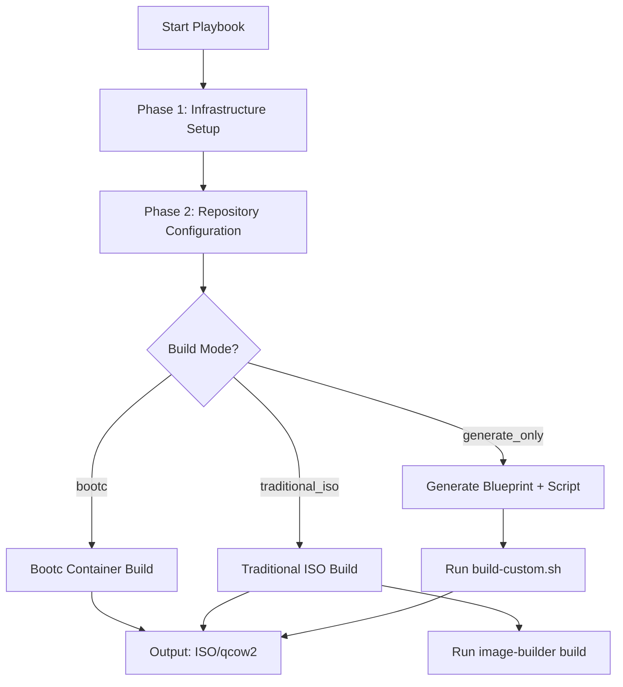

This guide walks you through the fastest path to building your first custom workstation image using the **osbuild** Ansible role. It assumes a Fedora 43 build host and targets a minimal ISO output with default components (GNOME, Sway, NVIDIA, development tools, and container tooling). For advanced configurations, see [Configuring Build Host Requirements and Dependencies](3-configuring-build-host-requirements-and-dependencies) and [Selecting Target Distribution and Architecture](4-selecting-target-distribution-and-architecture).

---

## Prerequisites: What You Need Before Starting

Before running the role, ensure your environment meets these **minimum requirements**:

| Requirement | Value | Purpose |
|-------------|-------|---------|
| **Build Host OS** | Fedora 43 (recommended), AlmaLinux 10.2, or Rocky 10.2 | Required for `image-builder-cli` compatibility |
| **Disk Space** | 50GB free (80GB+ if including Intel oneAPI) | ISO generation and temporary build artifacts |
| **Memory** | 4GB RAM (8GB recommended) | Build process and dependency resolution |
| **Privileges** | Sudo access | Package installation and service management |
| **Ansible** | 2.9+ with Python 3.6+ | Role execution and templating |
| **Network** | Internet connectivity | Repository access and package downloads |

The role automatically validates these requirements during execution. If your build host is Fedora 43, the role will use the `minimal-installer` image type by default. For AlmaLinux or Rocky, it defaults to `image-installer`.
Sources: [defaults/main.yml](defaults/main.yml#L14-L44) [tasks/install.yml](tasks/install.yml#L6-L15)

---

## Step 1: Install the Role in Your Ansible Project

The role is designed to be **cloned directly into your Ansible project's `roles/` directory**. This ensures all templates, files, and dependencies are resolved correctly.

```bash
# From your Ansible project root:
cd /path/to/your/ansible/project
git clone https://github.com/yourusername/ansible-role-osbuild.git roles/osbuild
```

If you prefer **Ansible Galaxy** (future support), you can install it as:
```bash
ansible-galaxy install b08x.osbuild
```
Sources: [README.md](README.md#L80-L88)

---

## Step 2: Create a Minimal Playbook

Create a playbook named `build_image.yml` with the following content. This playbook targets your build host (typically `localhost` if building on the same machine) and invokes the role with **default settings**:

```yaml
---
- name: Build custom workstation image
  hosts: localhost
  connection: local
  roles:
    - role: osbuild
```

The role will:
1. Validate your build host environment.
2. Install `image-builder-cli` and dependencies.
3. Generate a **blueprint TOML file** and a **build script** in `/var/tmp/osbuild-images/`.
4. **Not** automatically run the build (default: `osbuild_only_generate: true`).

Sources: [tasks/main.yml](tasks/main.yml#L1-L50) [tasks/select_build_mode.yml](tasks/select_build_mode.yml#L1-L33)

---

## Step 3: Run the Playbook to Generate Build Artifacts

Execute the playbook to **generate the blueprint and build script** without running the full build:

```bash
ansible-playbook build_image.yml
```

### Expected Output
The role will:
1. Display a **banner** with your configuration (blueprint name, distribution, build mode).
2. Validate required variables (e.g., `osbuild_blueprint_name`, `osbuild_distro`).
3. Create the output directory (`/var/tmp/osbuild-images/` by default).
4. Generate two files:
   - **Blueprint**: `/var/tmp/osbuild-images/custom.toml` (default blueprint name: `custom`).
   - **Build Script**: `/var/tmp/osbuild-images/build-custom.sh`.

```plaintext
╔════════════════════════════════════════════════════════════════╗
║              IMAGE BUILD CONFIGURATION GENERATED               ║
╚════════════════════════════════════════════════════════════════╝

Blueprint:    /var/tmp/osbuild-images/custom.toml
Build script: /var/tmp/osbuild-images/build-custom.sh

To build the image, run on <hostname>:

  bash /var/tmp/osbuild-images/build-custom.sh
```
Sources: [tasks/main.yml](tasks/main.yml#L80-L100) [templates/blueprint.toml.j2](templates/blueprint.toml.j2#L1-L100) [templates/image-builder-build.sh.j2](templates/image-builder-build.sh.j2#L1-L40)

---

## Step 4: Inspect the Generated Blueprint (Optional)

The generated blueprint (`custom.toml`) is a **TOML file** dynamically created from the `blueprint.toml.j2` template. It includes:
- **Package groups** (e.g., `gnome-desktop`, `sway`).
- **Individual packages** (e.g., `nvidia-driver`, `cuda-toolkit`).
- **Kernel arguments** (e.g., `rd.driver.blacklist=nouveau` for NVIDIA).
- **Services** (e.g., `gdm`, `NetworkManager`).
- **Timezone and locale** (default: `UTC`, `en_US.UTF-8`).
- **Installer modules** (e.g., `org.fedoraproject.Anaconda.Modules.Users`).

To inspect the blueprint:
```bash
cat /var/tmp/osbuild-images/custom.toml
```
Sources: [templates/blueprint.toml.j2](templates/blueprint.toml.j2#L1-L133) [tasks/blueprint.yml](tasks/blueprint.yml#L1-L50)

---

## Step 5: Run the Build Script to Create Your Image

Execute the generated build script to **compile your ISO**:

```bash
bash /var/tmp/osbuild-images/build-custom.sh
```

### What the Script Does
The script:
1. Runs `image-builder build` with your blueprint and distribution settings.
2. Copies the newest generated image (e.g., `.iso`, `.qcow2`) to `/var/tmp/osbuild-images/custom.iso` (default output filename).
3. Displays the final image size.

```plaintext
Starting build for blueprint: custom
Image type: minimal-installer
Distribution: fedora-43
Timeout: 14400 seconds
Output directory: /var/tmp/osbuild-images

# ... Build logs from image-builder ...

/var/tmp/osbuild-images/custom.iso: 4.2GiB
```
Sources: [templates/image-builder-build.sh.j2](templates/image-builder-build.sh.j2#L1-L40) [tasks/build.yml](tasks/build.yml#L1-L50)

---

## Step 6: Verify Your Image

After the build completes, verify the output:
```bash
ls -lh /var/tmp/osbuild-images/
```
You should see:
- `custom.toml` (blueprint)
- `build-custom.sh` (build script)
- `custom.iso` (or another format, depending on `osbuild_image_type`)

To validate the ISO:
```bash
# Check file integrity
sha256sum /var/tmp/osbuild-images/custom.iso

# Test booting in QEMU (optional)
qemu-system-x86_64 -cdrom /var/tmp/osbuild-images/custom.iso -m 4G
```
Sources: [tasks/build.yml](tasks/build.yml#L50-L100)

---

## Alternative: Build Directly in the Playbook

If you prefer to **run the build directly in the playbook** (instead of generating a script), override the `osbuild_only_generate` variable:

```bash
ansible-playbook build_image.yml -e "osbuild_only_generate=false"
```

This will:
1. Generate the blueprint.
2. Run `image-builder build` **inside the playbook**.
3. Copy the final image to `osbuild_output_dir` (default: `/var/tmp/osbuild-images/`).

> **Note**: This approach is useful for automation but may be harder to debug if the build fails. The default (`osbuild_only_generate: true`) is recommended for first-time users.
Sources: [tasks/main.yml](tasks/main.yml#L47-L50) [tasks/build.yml](tasks/build.yml#L1-L139)

---

## Troubleshooting Your First Build

| Issue | Likely Cause | Solution |
|-------|--------------|----------|
| **Disk space error** | Insufficient free space | Free up space or set `osbuild_output_dir` to a larger partition. |
| **Missing `image-builder-cli`** | Package not installed | The role installs it automatically. If it fails, run `sudo dnf install image-builder-cli`. |
| **Blueprint validation error** | Invalid TOML syntax | Check the blueprint with `python3 -c "import tomllib; tomllib.load(open('custom.toml', 'rb'))"`. |
| **Build timeout** | Slow network or large components | Increase `osbuild_build_timeout` (default: 4 hours). |
| **GPG key errors** | Missing repository keys | The role fetches keys automatically. If it fails, check `osbuild_log_dir` for details. |

For detailed troubleshooting, see [Build Failure Handling and Log Management](21-build-failure-handling-and-log-management).
Sources: [tasks/install.yml](tasks/install.yml#L6-L15) [tasks/build.yml](tasks/build.yml#L50-L100)

---

## Next Steps: Customize Your Build

Once you’ve successfully built a default image, explore these customizations:

| Goal | How-To | Documentation |
|------|--------|---------------|
| **Change distribution** | Override `osbuild_distro` (e.g., `almalinux-10.2`) | [Selecting Target Distribution and Architecture](4-selecting-target-distribution-and-architecture) |
| **Add/remove components** | Modify `osbuild_components` (e.g., add `oneapi`) | [Component System: Modular Package and Configuration Management](10-component-system-modular-package-and-configuration-management) |
| **Switch to bootc** | Set `osbuild_build_bootc: true` | [Understanding Traditional ISO vs. Bootc Container Build Modes](5-understanding-traditional-iso-vs-bootc-container-build-modes) |
| **Customize packages** | Extend `osbuild_extra_packages` | [Component Definitions: Schema, Dependencies, and Conflicts](15-component-definitions-schema-dependencies-and-conflicts) |
| **Change output format** | Set `osbuild_image_type` (e.g., `qcow2`) | [Traditional ISO Build Workflow with image-builder-cli](11-traditional-iso-build-workflow-with-image-builder-cli) |

Sources: [defaults/main.yml](defaults/main.yml#L185-L200) [tasks/select_build_mode.yml](tasks/select_build_mode.yml#L1-L33)

---
## Architecture Overview: How the Role Works

The osbuild role follows a **phased workflow** to transform your configuration into a bootable image:



### Key Files and Their Roles
| File | Purpose | Location |
|------|---------|----------|
| `blueprint.toml.j2` | Jinja2 template for dynamic blueprint generation | `templates/blueprint.toml.j2` |
| `image-builder-build.sh.j2` | Build script template for manual execution | `templates/image-builder-build.sh.j2` |
| `build.yml` | Executes `image-builder build` with async/polling | `tasks/build.yml` |
| `select_build_mode.yml` | Resolves `osbuild_build_bootc` and `osbuild_only_generate` | `tasks/select_build_mode.yml` |
| `defaults/main.yml` | Default variables (distro, components, paths) | `defaults/main.yml` |

Sources: [tasks/main.yml](tasks/main.yml#L1-L264) [tasks/build.yml](tasks/build.yml#L1-L139)

---
## Quick Start Summary: The 30-Second Version

1. **Clone the role**:
   ```bash
   git clone https://github.com/yourusername/ansible-role-osbuild.git roles/osbuild
   ```
2. **Create a playbook** (`build_image.yml`):
   ```yaml
   - hosts: localhost
     roles: [osbuild]
   ```
3. **Run the playbook**:
   ```bash
   ansible-playbook build_image.yml
   ```
4. **Build the image**:
   ```bash
   bash /var/tmp/osbuild-images/build-custom.sh
   ```
5. **Find your ISO** at `/var/tmp/osbuild-images/custom.iso`.

---
## Where to Go Next

- **Dive deeper into build modes**: [Understanding Traditional ISO vs. Bootc Container Build Modes](5-understanding-traditional-iso-vs-bootc-container-build-modes)
- **Customize your image**: [Component System: Modular Package and Configuration Management](10-component-system-modular-package-and-configuration-management)
- **Troubleshoot issues**: [Build Failure Handling and Log Management](21-build-failure-handling-and-log-management)