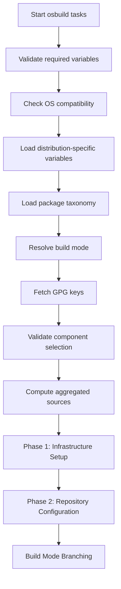

This page details the **component validation system** in the `osbuild` role, which ensures the integrity, compatibility, and correctness of modular components during image builds. It covers **schema validation**, **dependency resolution**, and **conflict detection** to prevent invalid configurations before build execution.

---

## Overview of Component Validation

The `osbuild` role employs a **three-layer validation system** to guarantee that selected components are:
1. **Defined**: All components must exist in the `osbuild_component_defs` registry.
2. **Schema-Compliant**: Components must include all required fields with valid values.
3. **Conflict-Free**: No two selected components may conflict with each other.
4. **Dependency-Satisfied**: All dependencies for selected components must also be included.

This validation runs **early in the workflow** (via `tasks/validate_components.yml`) to fail fast and provide actionable feedback before resource-intensive build processes begin.

**Architectural Position**:
Component validation is a **cross-cutting concern** that integrates with:
- The **component system** (defined in `defaults/main.yml`).
- The **build workflow** (orchestrated in `tasks/main.yml`).
- The **testing suite** (via `tests/validate_schema.py`).

Sources: [tasks/validate_components.yml](tasks/validate_components.yml#L1-L69), [tasks/main.yml](tasks/main.yml#L77-L80)

---

## Schema Validation

### Required Fields
Every component in `osbuild_component_defs` **must** define the following fields to pass schema validation:

| Field | Type | Description | Example |
|-------|------|-------------|---------|
| `label` | string | Human-readable name for the component. | `"NVIDIA GPU Stack"` |
| `packages` | list or Jinja2 expression | List of packages to install. | `["nvidia-driver", "cuda-toolkit"]` or `{{ system_packages.Graphics.nvidia }}` |
| `blueprint_groups` | list or Jinja2 expression | DNF group names to include. | `["development-tools"]` |
| `services` | list or Jinja2 expression | Systemd services to enable. | `["nvidia-persistenced"]` |
| `kernel_args` | list | Kernel command-line arguments. | `["rd.driver.blacklist=nouveau"]` |
| `sources` | list or Jinja2 expression | Repository sources required. | `["nvidia-container-toolkit"]` |
| `files` | list | Custom file payloads. | `[]` |
| `flatpaks` | list or Jinja2 expression | Flatpak application IDs. | `[]` |
| `copr_repos` | list or Jinja2 expression | COPR repository names. | `[]` |
| `bootc_repos` | list or Jinja2 expression | Shell commands to add repos in bootc builds. | `[]` |
| `requires` | list | Component dependencies. | `["base"]` |
| `conflicts` | list | Components that cannot coexist. | `["sway"]` |
| `size_impact` | string | Estimated ISO size impact. Must be one of: `"none"`, `"small"`, `"medium"`, `"large"`. | `"large"` |
| `build_time_impact` | string | Estimated build time impact. Must be one of: `"none"`, `"low"`, `"medium"`, `"high"`. | `"medium"` |
| `secure_boot_compatible` | boolean | Whether the component supports Secure Boot. | `false` |
| `bootc_only` | boolean | If `true`, the component is only applicable to bootc builds. | `false` |
| `blueprint_only` | boolean | If `true`, the component is only applicable to traditional ISO builds. | `true` |

**Validation Rules**:
- **List Fields**: Must be either a literal list or a Jinja2 expression resolving to a list (e.g., `{{ system_packages.Graphics.nvidia }}`).
- **Enumerated Fields**: `size_impact` and `build_time_impact` must use predefined values.
- **Boolean Fields**: `secure_boot_compatible`, `bootc_only`, and `blueprint_only` must be boolean.

Sources: [defaults/main.yml](defaults/main.yml#L200-L216), [tests/validate_schema.py](tests/validate_schema.py#L22-L54)

---

### Schema Validation Workflow
The validation process is **automated** and executed in two contexts:

1. **Runtime Validation** (Ansible):
   - Performed by `tasks/validate_components.yml` during playbook execution.
   - Validates **selected components** (`osbuild_components`) against the schema.

2. **Static Validation** (Python):
   - Performed by `tests/validate_schema.py` for **all components** in `osbuild_component_defs`.
   - Ensures **every component** in the registry adheres to the schema, even if not selected.

**Example Static Validation Output**:
```plaintext
Total components: 14

PASS: All 14 components validated successfully!

Component          Requires                        Conflicts               Size     Build    SB  BO  BPO Svc Src
----------------------------------------------------------------------------------------------------------------------
anaconda           ['base']                        []                      medium  low     Y   N   Y   0   0
base               []                              []                      small   none    Y   N   N   4   0
cli-tools          ['base']                        []                      small   none    Y   N   N   0   0
cockpit            ['base']                        []                      small   none    Y   N   N   1   0
container-tools    ['base']                        []                      small   low     Y   N   N   0   1
desktop            ['base']                        ['sway']                medium  low     Y   N   N   1   0
development        ['base']                        []                      medium  medium  Y   N   N   0   0
gnome              ['base']                        []                      medium  low     Y   N   N   1   0
nvidia             ['base']                        []                      large   medium  N   N   N   2   3
oneapi             ['base']                        []                      large   high    Y   N   N   0   1
sway               ['base']                        []                      small   low     Y   N   N   0   0
```

Sources: [tests/validate_schema.py](tests/validate_schema.py#L59-L118), [tasks/validate_components.yml](tasks/validate_components.yml#L13-L26)

---

## Dependency Resolution

### Dependency Model
Dependencies are **explicitly declared** in each component's `requires` field. The validation system ensures that:
- If component **A** depends on component **B**, then **B** must also be selected when **A** is selected.
- Dependencies are **transitive**: If **A** depends on **B**, and **B** depends on **C**, then selecting **A** requires both **B** and **C**.

**Example**:
- The `gnome` component depends on `base`:
  ```yaml
  gnome:
    requires:
      - base
  ```
  If `gnome` is selected, `base` **must** also be in `osbuild_components`.

### Validation Logic
The dependency check is implemented in `tasks/validate_components.yml`:
```yaml
- name: Check required dependencies are satisfied
  ansible.builtin.assert:
    that: >-
      (osbuild_component_defs[item].requires | default([])) | difference(osbuild_components) | length == 0
    fail_msg: >-
      Component '{{ item }}' requires {{ osbuild_component_defs[item].requires | join(', ') }}
      but missing: {{ (osbuild_component_defs[item].requires | default([])) | difference(osbuild_components) | join(', ') }}.
      Add the missing components to osbuild_components.
  loop: "{{ osbuild_components }}"
```
**Behavior**:
- For each selected component, the system checks if all its dependencies are also selected.
- If any dependency is missing, the playbook **fails immediately** with a descriptive error message.

Sources: [tasks/validate_components.yml](tasks/validate_components.yml#L51-L61), [defaults/main.yml](defaults/main.yml#L234-L235)

---

## Conflict Detection

### Conflict Model
Conflicts are **explicitly declared** in each component's `conflicts` field. The validation system ensures that:
- If component **A** conflicts with component **B**, then **A** and **B** cannot both be selected.
- Conflicts are **symmetric**: If **A** conflicts with **B**, then **B** also conflicts with **A** (though this need not be explicitly declared).

**Example**:
- The `desktop` component (alias for `gnome`) conflicts with `sway`:
  ```yaml
  desktop:
    conflicts:
      - sway
  ```
  Selecting both `desktop` and `sway` will trigger a validation error.

### Validation Logic
The conflict check is implemented in `tasks/validate_components.yml`:
```yaml
- name: Build list of selected component conflicts
  ansible.builtin.set_fact:
    _selected_conflicts: >-
      {{
        _selected_conflicts | default([]) +
        (osbuild_component_defs[item].conflicts | default([]))
      }}
  loop: "{{ osbuild_components }}"

- name: Check for conflicting components selected together
  ansible.builtin.assert:
    that: item not in osbuild_components
    fail_msg: >
      Conflict detected: '{{ item }}' is listed as a conflict by one of the
      selected components but is also in osbuild_components.
      Remove '{{ item }}' or the component that conflicts with it.
  loop: "{{ _selected_conflicts | default([]) | unique }}"
  when: _selected_conflicts | default([]) | length > 0
```
**Behavior**:
1. The system **aggregates all conflicts** from selected components into `_selected_conflicts`.
2. It then checks if any of these conflicting components are **also selected**.
3. If a conflict is detected, the playbook **fails immediately** with a clear error message.

Sources: [tasks/validate_components.yml](tasks/validate_components.yml#L28-L48), [defaults/main.yml](defaults/main.yml#L494-L495)

---

## Validation Workflow Integration

The component validation system is **integrated into the main workflow** via `tasks/main.yml`:



**Key Points**:
- Validation runs **after** variable loading but **before** any build-specific tasks.
- The `validate_components.yml` task is tagged with `always`, ensuring it runs regardless of other tags.
- If validation fails, the playbook **stops immediately**, preventing wasted resources on invalid builds.

Sources: [tasks/main.yml](tasks/main.yml#L77-L80)

---

## Example Validation Scenarios

### Scenario 1: Missing Dependency
**Configuration**:
```yaml
osbuild_components:
  - gnome
```
**Error**:
```plaintext
Component 'gnome' requires base but missing: base.
Add the missing components to osbuild_components.
```
**Fix**:
```yaml
osbuild_components:
  - base
  - gnome
```

Sources: [tasks/validate_components.yml](tasks/validate_components.yml#L51-L61)

---

### Scenario 2: Conflict Detected
**Configuration**:
```yaml
osbuild_components:
  - desktop
  - sway
```
**Error**:
```plaintext
Conflict detected: 'sway' is listed as a conflict by one of the selected components but is also in osbuild_components.
Remove 'sway' or the component that conflicts with it.
```
**Fix**:
```yaml
osbuild_components:
  - desktop
```
or
```yaml
osbuild_components:
  - sway
```

Sources: [tasks/validate_components.yml](tasks/validate_components.yml#L39-L48)

---
### Scenario 3: Undefined Component
**Configuration**:
```yaml
osbuild_components:
  - base
  - nonexistent
```
**Error**:
```plaintext
Component 'nonexistent' not found in osbuild_component_defs (available: base, anaconda, gnome, sway, nvidia, development, container-tools, oneapi, cli-tools, cockpit, desktop, audio, virtualization, core).
```
**Fix**:
```yaml
osbuild_components:
  - base
```

Sources: [tasks/validate_components.yml](tasks/validate_components.yml#L5-L11)

---
### Scenario 4: Schema Violation
**Component Definition**:
```yaml
invalid_component:
  label: "Invalid Component"
  # Missing required fields: packages, requires, conflicts, etc.
```
**Error** (from `tests/validate_schema.py`):
```plaintext
FAIL invalid_component: missing ['packages', 'requires', 'conflicts', 'size_impact', 'build_time_impact', 'secure_boot_compatible', 'bootc_only', 'blueprint_only']
```
**Fix**:
Add all required fields to the component definition.

Sources: [tests/validate_schema.py](tests/validate_schema.py#L60-L64)

---

## Testing and Automation

### Static Schema Validation
The `tests/validate_schema.py` script provides **offline validation** of all component definitions. It:
- Validates **all components** in `osbuild_component_defs`, not just selected ones.
- Checks for **missing fields**, **invalid types**, and **invalid enumerated values**.
- Outputs a **detailed report** of all validation errors or a summary table for successful validation.

**Usage**:
```bash
python3 tests/validate_schema.py
```

Sources: [tests/validate_schema.py](tests/validate_schema.py#L1-L123)

---
### Runtime Validation
Runtime validation is performed by Ansible during playbook execution. It:
- Validates **only the selected components** (`osbuild_components`).
- Provides **immediate feedback** with actionable error messages.
- Integrates seamlessly with the **build workflow**.

**Usage**:
```bash
ansible-playbook -i inventory playbook.yml
```

Sources: [tasks/validate_components.yml](tasks/validate_components.yml#L1-L69)

---
## Component Definitions Reference

The following table summarizes the **current component definitions** and their validation-relevant fields:

| Component | Dependencies | Conflicts | Size Impact | Build Time Impact | Secure Boot | bootc Only | Blueprint Only |
|-----------|--------------|-----------|-------------|-------------------|-------------|------------|----------------|
| `base` | [] | [] | small | none | ✅ | ❌ | ❌ |
| `anaconda` | `base` | [] | medium | low | ✅ | ❌ | ✅ |
| `gnome` | `base` | [] | medium | low | ✅ | ❌ | ❌ |
| `sway` | `base` | [] | small | low | ✅ | ❌ | ❌ |
| `nvidia` | `base` | [] | large | medium | ❌ | ❌ | ❌ |
| `development` | `base` | [] | medium | medium | ✅ | ❌ | ❌ |
| `container-tools` | `base` | [] | small | low | ✅ | ❌ | ❌ |
| `oneapi` | `base` | [] | large | high | ✅ | ❌ | ❌ |
| `cli-tools` | `base` | [] | small | none | ✅ | ❌ | ❌ |
| `cockpit` | `base` | [] | small | none | ✅ | ❌ | ❌ |
| `desktop` (alias) | `base` | `sway` | medium | low | ✅ | ❌ | ❌ |
| `audio` | `base` | [] | medium | medium | ✅ | ❌ | ❌ |
| `virtualization` | `base` | [] | medium | medium | ✅ | ❌ | ❌ |
| `core` (alias) | [] | [] | small | none | ✅ | ❌ | ❌ |

Sources: [defaults/main.yml](defaults/main.yml#L218-L542)

---
## Best Practices

1. **Always Validate Early**:
   Run `tests/validate_schema.py` **before** committing changes to `defaults/main.yml` to catch schema violations early.

2. **Test Component Combinations**:
   Use `tasks/validate_components.yml` in isolation to test new component combinations:
   ```bash
   ansible-playbook -i inventory validate.yml --tags "validate_components"
   ```

3. **Document Conflicts and Dependencies**:
   Clearly document **why** a conflict or dependency exists in the component's definition (e.g., `nvidia` conflicts with `secure_boot_compatible: true`).

4. **Use Jinja2 for Dynamic Lists**:
   For fields like `packages` or `sources`, use Jinja2 expressions to reference distribution-specific variables (e.g., `{{ system_packages.Graphics.nvidia }}`).

5. **Leverage Aliases for Backward Compatibility**:
   Use component aliases (e.g., `core` for `base`) to maintain backward compatibility with existing playbooks.

Sources: [defaults/main.yml](defaults/main.yml#L447-L477)

---
## Next Steps

- To understand how components are **defined and structured**, see [Component Definitions: Schema, Dependencies, and Conflicts](15-component-definitions-schema-dependencies-and-conflicts).
- To explore how **blueprints are generated** from validated components, see [Blueprint Generation: Dynamic TOML Templating with Jinja2](13-blueprint-generation-dynamic-toml-templating-with-jinja2).
- To dive into **build workflows**, see [Traditional ISO Build Workflow with image-builder-cli](11-traditional-iso-build-workflow-with-image-builder-cli) or [Bootc Container Image Build Process and Multi-Stage Containerfile](12-bootc-container-image-build-process-and-multi-stage-containerfile).
- To learn about **testing the validation system itself**, see [Test Suite Structure and Validation Scripts](22-test-suite-structure-and-validation-scripts).