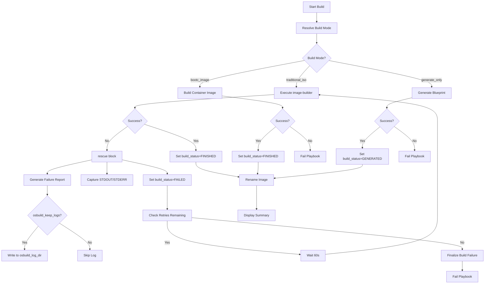

This page explains how the **osbuild role** detects, classifies, and recovers from build failures, as well as how logs are generated, stored, and analyzed for debugging. It focuses on the **failure detection mechanisms**, **log management workflows**, and **recovery strategies** integrated into the role's architecture.

---

## Failure Detection and Classification

The osbuild role employs a **multi-layered failure detection system** to identify and classify build failures during the execution of `image-builder`. Failures are categorized into **transient** (retryable) and **permanent** (non-retryable) based on their root cause and recovery potential.

### Transient Failures
Transient failures are temporary issues, such as network timeouts or resource contention, which may resolve on retry. These are handled via the **retry mechanism** in `tasks/main.yml` (lines 200-210). The role attempts to rebuild the image up to `osbuild_build_retries` times (default: **1 retry**). Each retry is spaced by a **60-second pause** to allow temporary conditions to clear.
If all retries are exhausted, the role transitions to the **permanent failure** path.

Sources: [tasks/main.yml](tasks/main.yml#L200-L210)

### Permanent Failures
Permanent failures are issues that cannot be resolved by retrying, such as:
- Invalid blueprint configurations (e.g., missing required fields).
- Dependency resolution errors (e.g., conflicting packages).
- Template rendering failures (e.g., Jinja2 syntax errors).
- `image-builder` command failures (e.g., unsupported image types or distributions).

These failures are captured in a **`rescue` block** within `tasks/build.yml` (lines 60-85). The role:
1. Sets `build_status` to `"FAILED"`.
2. Captures **STDOUT and STDERR** from the failed `image-builder` command.
3. Generates a **failure report** with contextual metadata (timestamp, blueprint name, image type, distribution).
4. Writes the report to a timestamped log file in `osbuild_log_dir` (if `osbuild_keep_logs` is `true`).

Sources: [tasks/build.yml](tasks/build.yml#L60-L85)

---
## Log Generation and Storage

### Log Structure
Failure logs are structured as **human-readable reports** with the following sections:
- **Header**: Timestamp, blueprint name, image type, distribution, and status (`FAILED`).
- **STDOUT**: Standard output from the `image-builder` command.
- **STDERR**: Standard error from the `image-builder` command.

Example log filename: `build-failure-<epoch>.log` (e.g., `build-failure-1712345678.log`).

Sources: [tasks/build.yml](tasks/build.yml#L70-L85)

### Log Storage
Logs are stored in the directory specified by `osbuild_log_dir` (default: **`/var/tmp/osbuild-logs`**). The role ensures logs are retained only if `osbuild_keep_logs` is set to `true` (default: **`true`**).
Log files are created with:
- **Permissions**: `0644` (readable by all, writable by owner).
- **Backup**: Enabled (`backup: true`), ensuring existing logs are not overwritten.

Sources: [defaults/main.yml](defaults/main.yml#L775-L781), [tasks/build.yml](tasks/build.yml#L70-L85)

---
## Error Propagation

The osbuild role propagates errors to users through **Ansible-native mechanisms** and **custom messages** to ensure clarity and actionability.

### Ansible Task Failures
- The `rescue` block in `tasks/build.yml` (lines 60-85) ensures the playbook fails explicitly after logging the error.
- The `Finalize build failure` task (lines 120-125) in `tasks/build.yml` provides a **user-friendly error message** with the path to the failure logs:
  ```
  Image build failed.
  Check logs at /var/tmp/osbuild-logs/build-failure-*.log for details.
  ```

Sources: [tasks/build.yml](tasks/build.yml#L120-L125)

### Retry Exhaustion
If all retries are exhausted, the role fails with a **custom message** in `tasks/main.yml` (lines 208-210):
```
Build failed after {{ osbuild_build_retries }} retries.
```

Sources: [tasks/main.yml](tasks/main.yml#L208-L210)

---
## Recovery and Debugging Workflows

### Automatic Recovery
| Mechanism | Configuration Variable | Default Value | Description |
|-----------|------------------------|---------------|-------------|
| **Retry Attempts** | `osbuild_build_retries` | `1` | Number of times to retry a failed build. |
| **Retry Delay** | Hardcoded | `60` seconds | Pause between retry attempts. |
| **Build Timeout** | `osbuild_build_timeout` | `14400` (4 hours) | Maximum duration for `image-builder` execution. |
| **Poll Interval** | `osbuild_poll_interval` | `30` seconds | Interval for checking build status. |

Sources: [defaults/main.yml](defaults/main.yml#L575-L595), [tasks/main.yml](tasks/main.yml#L200-L210)

### Manual Debugging
1. **Check Logs**:
   - Navigate to `osbuild_log_dir` (default: `/var/tmp/osbuild-logs`).
   - Open the latest `build-failure-*.log` file for details on the failure (STDOUT/STDERR, blueprint context).

2. **Enable Verbose Output**:
   - Set `osbuild_verbose: true` to display the full `image-builder` command and its arguments before execution.
   - Useful for debugging template rendering or command construction issues.

   Sources: [defaults/main.yml](defaults/main.yml#L795-L797), [tasks/build.yml](tasks/build.yml#L25-L35)

3. **Validate Blueprint**:
   - Use the `validate_components.yml` task to check for:
     - Missing or invalid components.
     - Schema violations (e.g., missing required fields).
     - Dependency conflicts (e.g., incompatible components).

   Sources: [tasks/validate_components.yml](tasks/validate_components.yml#L1-L56)

4. **Test Build Modes**:
   - Use the `tests/validate_build_modes.yml` playbook to verify that build mode resolution works as expected.
   - Ensures the role correctly handles `bootc_image`, `generate_only`, and `traditional_iso` modes.

   Sources: [tests/validate_build_modes.yml](tests/validate_build_modes.yml#L1-L82)

---
## Configuration Variables for Failure Handling

| Variable | Type | Default | Description |
|----------|------|---------|-------------|
| `osbuild_keep_logs` | Boolean | `true` | Enable/disable log retention on build failure. |
| `osbuild_log_dir` | String | `/var/tmp/osbuild-logs` | Directory for storing failure logs. |
| `osbuild_build_timeout` | Integer | `14400` | Timeout (in seconds) for `image-builder` execution. |
| `osbuild_build_retries` | Integer | `1` | Number of retry attempts on failure. |
| `osbuild_poll_interval` | Integer | `30` | Poll interval (in seconds) for async build status checks. |
| `osbuild_verbose` | Boolean | `false` | Enable verbose debug output for build commands. |

Sources: [defaults/main.yml](defaults/main.yml#L575-L781)

---
## Failure Handling in Build Modes

The osbuild role supports **three build modes**, each with distinct failure handling behaviors:

| Build Mode | Failure Handling | Log Behavior | Retry Behavior |
|------------|------------------|--------------|----------------|
| **`traditional_iso`** | Captures `image-builder` failures in `rescue` block. | Writes failure logs to `osbuild_log_dir`. | Retries up to `osbuild_build_retries` times. |
| **`bootc_image`** | Relies on `podman_image` module failures (Ansible-native). | Logs are handled by Ansible's `debug` module. | No automatic retries (Podman errors are fatal). |
| **`generate_only`** | Fails if blueprint generation or template rendering fails. | Logs are written to `osbuild_log_dir` if `osbuild_keep_logs` is `true`. | No retries (generation is deterministic). |

Sources: [tasks/main.yml](tasks/main.yml#L150-L200), [tasks/build.yml](tasks/build.yml#L1-L139), [tasks/bootc.yml](tasks/bootc.yml#L1-L50)

---
## Mermaid: Failure Handling Workflow



---
## Next Steps

- To understand how **build modes** are selected and their implications, refer to:
  [Understanding Traditional ISO vs. Bootc Container Build Modes](5-understanding-traditional-iso-vs-bootc-container-build-modes)
  [Choosing the Right Build Mode for Your Use Case](6-choosing-the-right-build-mode-for-your-use-case)

- To explore **blueprint generation** and its role in failure handling, see:
  [Blueprint Generation: Dynamic TOML Templating with Jinja2](13-blueprint-generation-dynamic-toml-templating-with-jinja2)

- To validate **component definitions** and avoid conflicts, refer to:
  [Component Validation: Schema, Dependency, and Conflict Checking](20-component-validation-schema-dependency-and-conflict-checking)

- To dive deeper into **testing and validation**, check:
  [Test Suite Structure and Validation Scripts](22-test-suite-structure-and-validation-scripts)