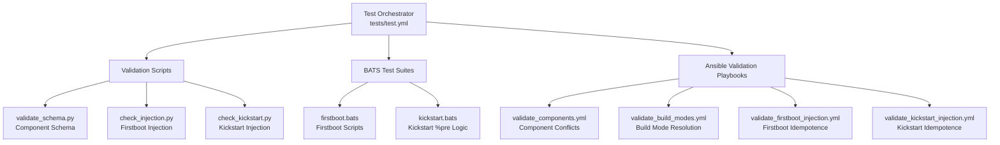

This page details the **multi-layered test and validation framework** for the `osbuild` Ansible role, designed to ensure correctness, idempotence, and compliance with architectural constraints. The framework combines **Python validation scripts**, **BATS (Bash Automated Testing System) suites**, and **Ansible playbooks** to cover schema validation, injection logic, and build mode resolution.

---

## Test Suite Architecture Overview

The test suite is organized into **three primary layers**, each addressing distinct validation concerns:

1. **Validation Scripts (Python)**: Enforce schema compliance, injection correctness, and syntactic validity.
2. **BATS Test Suites**: Validate runtime behavior of firstboot and kickstart scripts using stubbed environments.
3. **Ansible Validation Playbooks**: Verify build mode resolution, component conflicts, and idempotence.



Sources: [tests/test.yml](tests/test.yml#L1-L8), [tests/validate_schema.py](tests/validate_schema.py#L1-L124), [tests/validate_build_modes.yml](tests/validate_build_modes.yml#L1-L82)

---

## Layer 1: Validation Scripts (Python)

### 1.1 Schema Validation (`validate_schema.py`)
**Purpose**: Ensures all **component definitions** in `defaults/main.yml` adhere to the required schema, including:
- **Required fields**: `label`, `packages`, `blueprint_groups`, `services`, `kernel_args`, `sources`, `files`, `flatpaks`, `copr_repos`, `bootc_repos`, `requires`, `conflicts`, `size_impact`, `build_time_impact`, `secure_boot_compatible`, `bootc_only`, `blueprint_only`.
- **List fields**: Validates that fields like `blueprint_groups` or `services` are either **literal lists** or **Jinja2 expressions** resolving to lists at runtime.
- **Enumerated values**: Validates `size_impact` (e.g., `none`, `small`, `medium`, `large`) and `build_time_impact` (e.g., `none`, `low`, `medium`, `high`).
- **Boolean fields**: Validates `secure_boot_compatible`, `bootc_only`, and `blueprint_only`.

**Output**: A tabular summary of all components, their dependencies, conflicts, and impacts if validation passes.

```bash
# Example output (success)
PASS: All 14 components validated successfully!

Component             Requires                          Conflicts               Size     Build    SB  BO  BPO Svc Src
----------------------------------------------------------------------------------------------------------------------
base                  []                                []                     small    low     Y   N   N   0   0
nvidia                [base]                            [workstation]          large    high    Y   N   N   2   1
```

Sources: [tests/validate_schema.py](tests/validate_schema.py#L1-L124)

---

### 1.2 Firstboot Injection Validation (`check_injection.py`)
**Purpose**: Validates that **firstboot files** (e.g., `syncopated-firstboot`, `syncopated-firstboot-launcher`, `syncopated-firstboot.desktop`) are correctly injected into generated blueprints.
- **Input**: A directory of generated TOML blueprints, the source directory for firstboot files, and the expected number of blueprints.
- **Checks**:
  - Each blueprint is valid TOML.
  - Each firstboot file path appears **exactly once** in the blueprint’s `customizations.files` section.
  - The `data` field of each injected file is **byte-identical** to the source file.
  - No legacy `custom-first-boot` entries remain.

**Usage**:
```bash
python3 tests/firstboot/check_injection.py OUTPUT_DIR FIRSTBOOT_SRC_DIR EXPECTED_COUNT
```

Sources: [tests/firstboot/check_injection.py](tests/firstboot/check_injection.py#L1-L47)

---

### 1.3 Kickstart Injection Validation (`check_kickstart.py`)
**Purpose**: Validates that **kickstart files** are correctly injected into blueprints, with support for **enabled/disabled modes** and optional `ksvalidator` integration.
- **Input**: A directory of generated TOML blueprints, the source kickstart file, the expected number of blueprints, the mode (`enabled`/`disabled`), and locale/keyboard/timezone settings.
- **Checks**:
  - Each blueprint is valid TOML.
  - No `user`, `group`, `unattended`, or `sudo-nopasswd` settings are present (conflicts with Anaconda Users module).
  - The Anaconda Users module (`org.fedoraproject.Anaconda.Modules.Users`) is **enabled**.
  - The sudoers drop-in (`/etc/sudoers.d/90-wheel-nopasswd`) is present **exactly once** with correct mode (`0440`) and data (`%wheel ALL=(ALL) NOPASSWD: ALL`).
  - For **enabled mode**:
    - The kickstart block is present **exactly once**.
    - The kickstart `contents` match the rendered header (locale, keyboard, timezone) + source file **byte-for-byte**.
    - If `ksvalidator` is provided, the kickstart is validated against the specified distribution (e.g., `RHEL9`, `RHEL10`, `F43`).
  - For **disabled mode**: No kickstart block or contents are present.

**Usage**:
```bash
python3 tests/kickstart/check_kickstart.py OUTPUT_DIR KS_SRC EXPECTED_COUNT MODE LOCALE KEYBOARD TIMEZONE [KSVALIDATOR]
```

Sources: [tests/kickstart/check_kickstart.py](tests/kickstart/check_kickstart.py#L1-L84)

---

## Layer 2: BATS Test Suites

### 2.1 Firstboot Script Tests (`firstboot.bats`)
**Purpose**: Validates the **runtime behavior** of firstboot scripts (`syncopated-firstboot`, `syncopated-firstboot-launcher`) using **stubbed commands** (e.g., `gum`, `yadm`, `curl`, `git`).
- **Test Environment**:
  - Each test runs in an isolated environment with a **curated `PATH`**, where stubbed commands are prioritized over system binaries.
  - Stubbed commands log their invocations to `$STUB_LOG` for validation.
- **Key Test Cases**:
  - **OS Release Banner**: Verifies the script displays the `NAME` and `VERSION_ID` from `/etc/os-release`.
  - **Splash Content**: Validates the logo, double-border banner, and step list (yadm clone, bootstrap, system, done).
  - **No Gum Fallback**: Ensures the script completes with plain prompts if `gum` is unavailable.
  - **Launcher Behavior**: Confirms the launcher opens a terminal (e.g., `ptyxis`, `xdg-terminal-exec`) **without `sudo`**.
  - **Yadm Download**: Validates that `yadm` is downloaded to `~/.local/bin/yadm` if missing, and uses the installed version if available.
  - **GitHub Unreachable**: Tests retry/skip logic when GitHub is unreachable (e.g., `curl` fails with exit code 6).
  - **Pre-filled URL**: Ensures the URL prompt is pre-filled with the default repository (`b08x/dots`).

**Stubbed Commands**:
| Command          | Purpose                                                                 |
|------------------|-------------------------------------------------------------------------|
| `gum`            | Simulates user input (e.g., menu selections, text input).              |
| `yadm`           | Simulates `yadm clone` and `yadm bootstrap` operations.                 |
| `curl`           | Simulates HTTP requests (e.g., downloading `yadm`).                   |
| `git`            | Simulates Git operations (e.g., cloning repositories).                |
| `sudo`           | Simulates `sudo` invocations (e.g., for validation).                   |
| `systemctl`      | Simulates systemd service management.                                |
| `nm-online`      | Simulates network connectivity checks.                               |
| `xdg-terminal-exec` | Simulates terminal emulator launches.                              |

Sources: [tests/firstboot/firstboot.bats](tests/firstboot/firstboot.bats#L1-L419), [tests/firstboot/stubs/](tests/firstboot/stubs/)

---

### 2.2 Kickstart `%pre` Tests (`kickstart.bats`)
**Purpose**: Validates the **disk selection logic** in the `%pre` section of the kickstart file (`syncopated.ks`), which dynamically selects the target disk for installation.
- **Test Environment**:
  - Uses stubbed `lsblk`, `findmnt`, and `blkid` commands to simulate disk configurations.
  - The `%pre` script is extracted from `syncopated.ks` and executed in isolation.
- **Key Test Cases**:
  - **NVMe Priority**: NVMe disks are preferred over SATA disks, even if the SATA disk is larger.
  - **Largest NVMe**: Among multiple NVMe disks, the largest is selected.
  - **USB Exclusion**: USB disks are excluded, even if not flagged as removable.
  - **Removable/Read-Only Exclusion**: Disks flagged as removable (`RM=1`) or read-only (`RO=1`) are excluded.
  - **Device Type Exclusion**: `zram`, `loop`, and optical (`rom`) devices are never considered.
  - **Install Media Exclusion**: The disk behind `/run/install/repo` (installation media) is excluded.
  - **Minimum Size**: A 30 GiB target disk aborts with an error (minimum 40 GiB required).
  - **No Candidates**: If no valid disk is found, the script aborts with a readable error.
  - **Partition Layout**: Validates the generated partition layout for disks of varying sizes (e.g., 60 GiB, 1 TiB).
  - **ksvalidator Integration**: If `ksvalidator` is available, the generated kickstart is validated against supported distributions (e.g., `RHEL9`, `RHEL10`, `F43`).

**Stubbed Commands**:
| Command   | Purpose                                                                 |
|-----------|-------------------------------------------------------------------------|
| `lsblk`   | Simulates disk listing (e.g., `NAME`, `SIZE`, `TYPE`, `TRAN`, `RM`, `RO`). |
| `findmnt` | Simulates mount point listing (e.g., `/run/install/repo`).           |
| `blkid`   | Simulates filesystem label listing (e.g., `LABEL=Rocky-10-2-x86_64`). |

Sources: [tests/kickstart/kickstart.bats](tests/kickstart/kickstart.bats#L1-L188), [tests/kickstart/stubs/](tests/kickstart/stubs/)

---

## Layer 3: Ansible Validation Playbooks

### 3.1 Component Validation (`validate_components.yml`)
**Purpose**: Validates **component definitions** for schema compliance, dependency resolution, and conflict detection.
- **Checks**:
  - All selected components are defined in `osbuild_component_defs`.
  - All components have **required schema fields** (e.g., `label`, `packages`, `requires`, `conflicts`).
  - **Conflict Detection**: Ensures no selected component conflicts with another selected component.
  - **Dependency Resolution**: Ensures all required dependencies for selected components are also selected.
- **Output**: A summary of validated components, their size impacts, and build time impacts.

Sources: [tasks/validate_components.yml](tasks/validate_components.yml#L1-L69)

---
### 3.2 Build Mode Validation (`validate_build_modes.yml`)
**Purpose**: Validates the **build mode resolution logic** in `tasks/select_build_mode.yml`.
- **Test Cases**:
  - **Bootc Image Mode**: Validates that `osbuild_build_bootc: true` resolves to `bootc_image` mode.
  - **Generate Only Mode**: Validates that `osbuild_only_generate: true` (with `osbuild_build_bootc: false`) resolves to `generate_only` mode.
  - **Traditional ISO Mode**: Validates that `osbuild_build_bootc: false` and `osbuild_only_generate: false` resolves to `traditional_iso` mode.
  - **Priority**: Validates that `osbuild_build_bootc` takes priority over `osbuild_only_generate` (i.e., `bootc_image` wins if both are `true`).
- **Execution**: Runs against isolated hosts (`host1`–`host4`) from `tests/inventory`.

Sources: [tests/validate_build_modes.yml](tests/validate_build_modes.yml#L1-L82), [tests/inventory](tests/inventory#L1-L9)

---
### 3.3 Firstboot Injection Validation (`validate_firstboot_injection.yml`)
**Purpose**: Validates the **idempotence** and correctness of firstboot file injection into blueprints.
- **Workflow**:
  1. Resets a temporary output directory.
  2. Finds all **static workstation blueprints** (e.g., `files/*/workstation/*.toml`).
  3. Prepares each static blueprint **twice** (to test idempotence) using `tasks/blueprint.yml`.
  4. Prepares a **templated blueprint** twice.
  5. Runs `check_injection.py` to validate:
     - All blueprints are valid TOML.
     - Firstboot files are injected **exactly once** and are **byte-identical** to their sources.
     - No legacy `custom-first-boot` entries remain.
- **Output**: A summary of validation results for each blueprint.

Sources: [tests/validate_firstboot_injection.yml](tests/validate_firstboot_injection.yml#L1-L83)

---
### 3.4 Kickstart Injection Validation (`validate_kickstart_injection.yml`)
**Purpose**: Validates the **idempotence** and correctness of kickstart injection into blueprints.
- **Workflow**:
  1. Resets temporary output directories for **enabled**, **disabled**, and **conflict** test cases.
  2. Finds all **static workstation blueprints**.
  3. Prepares each static blueprint **twice** with `osbuild_kickstart_enabled: true` (idempotence test).
  4. Prepares each static blueprint **once** with `osbuild_kickstart_enabled: false`.
  5. Prepares a **templated blueprint** twice with kickstart enabled and once with it disabled.
  6. Runs `check_kickstart.py` to validate:
     - All blueprints are valid TOML.
     - Kickstart blocks are present/absent as expected.
     - Kickstart contents match the rendered header + source file.
     - Optional `ksvalidator` integration for distribution-specific validation.
  7. **Conflict Test**: Attempts to prepare a blueprint with a `[[customizations.user]]` section (which conflicts with the kickstart) and confirms the task fails with the expected error.

Sources: [tests/validate_kickstart_injection.yml](tests/validate_kickstart_injection.yml#L1-L154)

---
## Test Execution Workflow

### Local Development
1. **Schema Validation**:
   ```bash
   python3 tests/validate_schema.py
   ```
2. **Firstboot Injection**:
   ```bash
   ansible-playbook tests/validate_firstboot_injection.yml
   ```
3. **Kickstart Injection**:
   ```bash
   ansible-playbook tests/validate_kickstart_injection.yml
   # With ksvalidator:
   ansible-playbook tests/validate_kickstart_injection.yml -e ksvalidator=$(which ksvalidator)
   ```
4. **Build Mode Validation**:
   ```bash
   ansible-playbook tests/validate_build_modes.yml -i tests/inventory
   ```
5. **BATS Tests**:
   ```bash
   bats tests/firstboot/firstboot.bats
   bats tests/kickstart/kickstart.bats
   ```

### CI/CD Integration
- The **test orchestrator** (`tests/test.yml`) can be used to run the role in a controlled environment:
  ```bash
  ansible-playbook tests/test.yml
  ```
- For **full validation**, combine all layers:
  ```bash
  python3 tests/validate_schema.py && \
  ansible-playbook tests/validate_build_modes.yml -i tests/inventory && \
  ansible-playbook tests/validate_firstboot_injection.yml && \
  ansible-playbook tests/validate_kickstart_injection.yml && \
  bats tests/firstboot/firstboot.bats && \
  bats tests/kickstart/kickstart.bats
  ```

---
## Test File Structure
| File/Directory               | Purpose                                                                                     |
|------------------------------|---------------------------------------------------------------------------------------------|
| `tests/test.yml`             | Test orchestrator for the `osbuild` role.                                                   |
| `tests/inventory`            | Ansible inventory for validation playbooks (hosts: `localhost`, `host1`–`host4`).          |
| `tests/validate_schema.py`  | Validates component schema compliance.                                                     |
| `tests/validate_build_modes.yml` | Validates build mode resolution logic.                                                |
| `tests/validate_firstboot_injection.yml` | Validates firstboot file injection into blueprints.                                  |
| `tests/validate_kickstart_injection.yml` | Validates kickstart injection into blueprints (with conflict detection).              |
| `tests/firstboot/`           | Firstboot-specific tests.                                                                 |
| `tests/firstboot/check_injection.py` | Python script to validate firstboot injection.                                         |
| `tests/firstboot/firstboot.bats` | BATS tests for firstboot scripts.                                                       |
| `tests/firstboot/stubs/`     | Stubbed commands for firstboot tests (e.g., `gum`, `yadm`, `curl`).                       |
| `tests/kickstart/`           | Kickstart-specific tests.                                                                 |
| `tests/kickstart/check_kickstart.py` | Python script to validate kickstart injection.                                         |
| `tests/kickstart/kickstart.bats` | BATS tests for kickstart `%pre` logic.                                                   |
| `tests/kickstart/stubs/`     | Stubbed commands for kickstart tests (e.g., `lsblk`, `findmnt`, `blkid`).                 |

Sources: [tests/](tests/)

---
## Next Steps
- To understand how **build modes** (ISO vs. Bootc) are resolved, see [Understanding Traditional ISO vs. Bootc Container Build Modes](5-understanding-traditional-iso-vs-bootc-container-build-modes).
- To explore the **blueprint generation** process, see [Blueprint Generation: Dynamic TOML Templating with Jinja2](13-blueprint-generation-dynamic-toml-templating-with-jinja2).
- To learn about **component definitions** and their schema, see [Component Definitions: Schema, Dependencies, and Conflicts](15-component-definitions-schema-dependencies-and-conflicts).