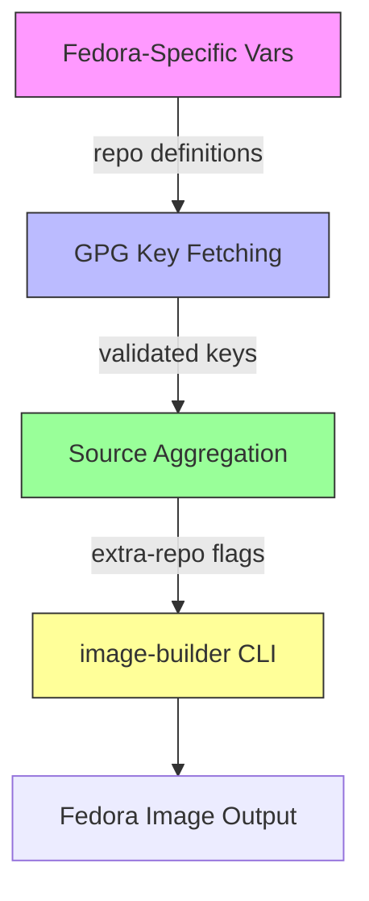

This page details how Fedora-specific configurations, repository definitions, and GPG key management are handled in the **osbuild** Ansible role. It focuses on the architectural patterns, file structures, and workflows that enable Fedora-based image builds, including repository source management, key validation, and integration with the `image-builder` toolchain.

---

## Overview of Fedora-Specific Architecture
The Fedora-specific configuration in this role is designed to **dynamically generate repository definitions**, **validate GPG keys**, and **integrate with `image-builder`** for creating custom Fedora images. The architecture follows a **modular pattern** where:
- **Repository definitions** are centralized in `vars/Fedora.yml`.
- **GPG key management** is handled by `tasks/repo_keys.yml`.
- **Source aggregation** is performed in `tasks/sources.yml`.
- **Build-time repository injection** is coordinated via `tasks/build.yml`.

The workflow ensures that:
1. Repository metadata (e.g., `metalink`, `baseurl`, `gpgkey_url`) is **distribution-aware**.
2. GPG keys are **fetched at build time** (or validated if locally bundled).
3. Repository sources are **dynamically aggregated** based on selected components.
4. The `image-builder` CLI consumes these sources to create the final image.



Sources: [vars/Fedora.yml](vars/Fedora.yml#L1-L79), [tasks/repo_keys.yml](tasks/repo_keys.yml#L1-L116), [tasks/sources.yml](tasks/sources.yml#L1-L33), [tasks/build.yml](tasks/build.yml#L1-L139)

---

## Repository Definitions in `vars/Fedora.yml`
The `vars/Fedora.yml` file serves as the **single source of truth** for Fedora repository configurations. It defines:
- **Core Fedora repositories** (e.g., `fedora`, `updates`).
- **Third-party repositories** (e.g., RPM Fusion, NVIDIA CUDA, Docker CE, VSCode).
- **GPG key strategies** for each repository:
  - **Bundled keys**: Prefer `file://` URLs pointing to `/usr/share/distribution-gpg-keys/` (installed via the `distribution-gpg-keys` package).
  - **Remote keys**: Use `https://` URLs for repositories whose keys are not bundled.
  - **No GPG check**: Omit `gpgkey_url` for repositories with `check_gpg: false` (e.g., `antigravity-rpm`).

### Key Repository Types
| Repository Type               | Purpose                                                                 | GPG Key Strategy                          | Example Repositories                          |
|-------------------------------|-------------------------------------------------------------------------|-------------------------------------------|-----------------------------------------------|
| **Core Fedora**               | Base OS packages and updates                                           | Bundled (`file:///usr/share/...`)          | `fedora`, `updates`                            |
| **RPM Fusion**                | Additional free/nonfree packages (e.g., multimedia, NVIDIA drivers)   | Bundled (`file:///usr/share/...`)          | `rpmfusion-free`, `rpmfusion-nonfree`         |
| **NVIDIA**                    | CUDA and container toolkit for GPU support                             | Remote (`https://`)                       | `cuda-fedora43-x86_64`, `nvidia-container-toolkit` |
| **Third-Party**               | Proprietary or community-maintained packages                          | Mixed (bundled/remote)                    | `docker-ce-stable`, `vscode`, `google-chrome`  |
| **Custom/Experimental**       | Unsigned or internally managed repositories                           | No GPG check (`check_gpg: false`)          | `antigravity-rpm`                             |

Sources: [vars/Fedora.yml](vars/Fedora.yml#L1-L79)

---

## GPG Key Management Workflow
The **GPG key validation and fetching** process is handled by `tasks/repo_keys.yml`. This task ensures that:
1. **Local keys are verified** (if using `file://` URLs).
2. **Remote keys are fetched** (if using `https://` URLs).
3. **Key integrity is validated** (must contain `-----BEGIN PGP PUBLIC KEY BLOCK-----` and `-----END PGP PUBLIC KEY BLOCK-----`).
4. **Keys are cached** in `osbuild_gpgkey_cache_dir` for idempotency.

### Workflow Steps
1. **Install `distribution-gpg-keys`**:
   Ensures bundled keys (e.g., Fedora, RPM Fusion) are available locally.
   ```yaml
   ansible.builtin.dnf:
     name: distribution-gpg-keys
     state: present
   ```

2. **Verify Local GPG Key Files**:
   Checks if `file://` URLs point to existing files before fetching.
   ```yaml
   ansible.builtin.stat:
     path: "{{ item.value.gpgkey_url | urlsplit('path') }}"
   ```

3. **Fetch Remote GPG Keys**:
   Uses `ansible.builtin.get_url` to download keys with:
   - **HTTPS validation** (default `validate_certs: true`).
   - **30-second timeout** per fetch.
   - **Idempotency** (`force: false` by default).

4. **Validate Key Content**:
   Uses `ansible.builtin.assert` to verify that fetched keys contain valid PGP markers.

5. **Build In-Memory `repo_gpgkeys` Fact**:
   Aggregates all fetched keys into a dictionary for use in templates (e.g., `blueprint.toml.j2`).

### Example: Fedora 43 GPG Key Handling
- **Bundled Keys**:
  - `file:///usr/share/distribution-gpg-keys/fedora/RPM-GPG-KEY-fedora-43-primary`
  - `file:///usr/share/distribution-gpg-keys/rpmfusion/RPM-GPG-KEY-rpmfusion-free-fedora-43`
- **Remote Keys**:
  - `https://developer.download.nvidia.com/compute/cuda/repos/fedora43/x86_64/1940C73E.pub`
  - `https://nvidia.github.io/libnvidia-container/gpgkey`

Sources: [tasks/repo_keys.yml](tasks/repo_keys.yml#L1-L116)

---

## Repository Source Aggregation
The `tasks/sources.yml` file **dynamically builds a list of repository URLs** from:
1. **Component-defined sources** (e.g., `osbuild_components` in `defaults/main.yml`).
2. **Explicitly provided `osbuild_extra_repo_urls`** (e.g., from playbooks or inventory).

### How It Works
1. **Component Sources**:
   Each component (e.g., `nvidia`, `development`) can define a list of repository sources in its definition (see `defaults/main.yml`).
   Example:
   ```yaml
   _nvidia_sources:
     - rpmfusion-nonfree-nvidia-driver
     - cuda-fedora43-x86_64
     - nvidia-container-toolkit
   ```

2. **Source Resolution**:
   The `sources.yml` task iterates over `osbuild_sources` (aggregated from components) and resolves them against the `repo` dictionary in `vars/Fedora.yml`.
   - If a source exists in `repo`, its `metalink` or `baseurl` is added to `osbuild_extra_repo_urls`.
   - Duplicate URLs are removed using `unique`.

3. **Output**:
   The final list of repository URLs is passed to `image-builder` via the `--extra-repo` flag.

### Example: NVIDIA Component Sources
For Fedora 43 with the `nvidia` component:
- **Resolved Sources**:
  - `rpmfusion-nonfree-nvidia-driver` → `http://download1.rpmfusion.org/nonfree/fedora/nvidia-driver/43/x86_64/`
  - `cuda-fedora43-x86_64` → `https://developer.download.nvidia.com/compute/cuda/repos/fedora43/x86_64`
  - `nvidia-container-toolkit` → `https://nvidia.github.io/libnvidia-container/stable/rpm/x86_64`

Sources: [tasks/sources.yml](tasks/sources.yml#L1-L33), [defaults/main.yml](defaults/main.yml#L100-L120)

---

## Fedora-Specific File Structure
The `files/fedora` directory contains **predefined repository and blueprint configurations** for Fedora 43 (x86_64). These files are used as **references or templates** for:
- **Repository definitions** (e.g., `sources/*.toml`).
- **Workstation blueprints** (e.g., `workstation/*.toml`).

### Directory Layout
```
files/fedora/43/x86_64/
├── sources/
│   ├── fedora.toml          # Core Fedora repo (metalink)
│   ├── fedora-updates.toml  # Updates repo (metalink)
│   ├── rpmfusion-free.toml  # RPM Fusion Free (metalink)
│   ├── rpmfusion-nonfree.toml
│   ├── cuda-fedora43-x86_64.toml
│   ├── nvidia-container-toolkit.toml
│   ├── docker-ce.toml
│   ├── vscode.toml
│   ├── google-chrome.toml
│   └── ... (other third-party repos)
└── workstation/
    ├── fedora-workstation-43.toml       # Full workstation blueprint
    ├── fedora-workstation-43-nvidia.toml
    ├── fedora-workstation-43-intel-oneapi.toml
    └── fedora-workstation-43-igx.toml
```

### Example: `sources/fedora.toml`
```toml
id = "fedora"
name = "Fedora 43 - x86_64"
type = "yum-metalink"
url = "https://mirrors.fedoraproject.org/metalink?repo=fedora-43&arch=x86_64"
check_gpg = false
check_ssl = true
check_repogpg = false
system = false
```
- **`type = yum-metalink`**: Uses Fedora's mirror system for load balancing.
- **`check_gpg = false`**: GPG validation is handled separately by `repo_keys.yml`.

### Example: `sources/cuda-fedora43-x86_64.toml`
```toml
id = "cuda-fedora43-x86_64"
name = "cuda-fedora43-x86_64"
type = "yum-baseurl"
url = "https://developer.download.nvidia.com/compute/cuda/repos/fedora43/x86_64"
check_gpg = true
check_ssl = true
gpgkey_urls = ["https://developer.download.nvidia.com/compute/cuda/repos/fedora43/x86_64/1940C73E.pub"]
```
- **`type = yum-baseurl`**: Directly points to the CUDA repository.
- **`gpgkey_urls`**: Explicitly defines the GPG key URL for validation.

Sources: [files/fedora/43/x86_64/sources/fedora.toml](files/fedora/43/x86_64/sources/fedora.toml#L1-L8), [files/fedora/43/x86_64/sources/cuda-fedora43-x86_64.toml](files/fedora/43/x86_64/sources/cuda-fedora43-x86_64.toml#L1-L8)

---

## Integration with `image-builder`
The `tasks/build.yml` file orchestrates the **final image build** using `image-builder`. It:
1. **Aggregates repository URLs** from `osbuild_extra_repo_urls`.
2. **Constructs the `--extra-repo` flags** for `image-builder`.
3. **Executes the build** with the selected blueprint and distribution.

### Key Steps
1. **Build Extra-Repo Flags**:
   ```yaml
   ansible.builtin.set_fact:
     extra_repo_flags: >-
       
       --extra-repo "{{ url }}" 
   ```

2. **Run `image-builder`**:
   ```yaml
   ansible.builtin.shell: >
     image-builder build {{ osbuild_image_type }}
     --distro {{ osbuild_distro }}
     --blueprint {{ osbuild_blueprint_name }}.toml \
     {{ extra_repo_flags }}
   ```

3. **Handle Failures**:
   - Captures stdout/stderr for debugging.
   - Writes failure logs to `osbuild_log_dir`.

### Example: Fedora 43 ISO Build Command
```bash
image-builder build minimal-installer \
  --distro fedora-43 \
  --blueprint custom.toml \
  --extra-repo "https://mirrors.fedoraproject.org/metalink?repo=fedora-43&arch=x86_64" \
  --extra-repo "https://mirrors.fedoraproject.org/metalink?repo=updates-released-f43&arch=x86_64" \
  --extra-repo "http://download1.rpmfusion.org/free/fedora/releases/43/Everything/x86_64/os/" \
  --extra-repo "https://developer.download.nvidia.com/compute/cuda/repos/fedora43/x86_64"
```

Sources: [tasks/build.yml](tasks/build.yml#L1-L139)

---

## Fedora vs. AlmaLinux/Rocky Linux: Key Differences
While this page focuses on **Fedora**, it is useful to contrast its repository management with **AlmaLinux/Rocky Linux** (covered in [AlmaLinux and Rocky Linux Support and Differences](24-almalinux-and-rocky-linux-support-and-differences)).

| Feature                     | Fedora                                                                 | AlmaLinux/Rocky Linux                                                                 |
|-----------------------------|------------------------------------------------------------------------|---------------------------------------------------------------------------------------|
| **Core Repositories**       | `fedora`, `updates` (metalink)                                         | `almalinux-baseos`, `almalinux-appstream`, `almalinux-crb` (metalink)                 |
| **Third-Party Repositories**| RPM Fusion (`free`, `nonfree`), NVIDIA CUDA, Docker CE                | EPEL, RPM Fusion for EL (`updates` only), NVIDIA CUDA (RHEL paths)                     |
| **GPG Key Strategy**        | Prefers `file:///usr/share/distribution-gpg-keys/fedora/...`         | Prefers `file:///usr/share/distribution-gpg-keys/alma/...` or `epel/...`              |
| **NVIDIA CUDA Repo Path**  | `fedora43/x86_64`                                                     | `rhel10/x86_64` (for AlmaLinux/Rocky 10)                                              |
| **Docker CE Repo Path**    | `fedora/43/x86_64/stable`                                              | `centos/10/x86_64/stable`                                                             |

Sources: [vars/Fedora.yml](vars/Fedora.yml#L1-L79), [vars/AlmaLinux.yml](vars/AlmaLinux.yml#L1-L68)

---
## Next Steps
To explore related topics, proceed to:
- **[AlmaLinux and Rocky Linux Support and Differences](24-almalinux-and-rocky-linux-support-and-differences)**: Compare how repository management differs for EL-family distributions.
- **[Repository Source Configuration and GPG Key Management](14-repository-source-configuration-and-gpg-key-management)**: Dive deeper into the generic repository and GPG key handling mechanisms.
- **[Component Definitions: Schema, Dependencies, and Conflicts](15-component-definitions-schema-dependencies-and-conflicts)**: Understand how components define their repository sources and dependencies.