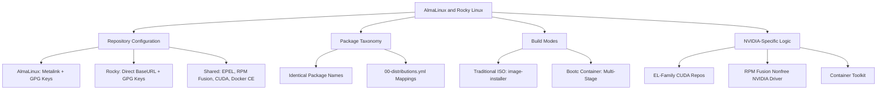

This page details how the **osbuild** Ansible role supports **AlmaLinux** and **Rocky Linux**, two RHEL-compatible distributions, with a focus on their **similarities, differences, and configuration patterns**. It is designed for intermediate developers who need to understand how to target these distributions in custom image builds.

---

## Overview of Distribution Support

The `osbuild` role treats **AlmaLinux** and **Rocky Linux** as **Enterprise Linux (EL) family** distributions, sharing a near-identical architecture with minor differences in **repository URLs, GPG keys, and version-specific configurations**. Both distributions are fully supported for **traditional ISO** and **bootc container** build modes, with identical component systems and package taxonomies.

**Key Shared Features**:
- **Component-based design** (e.g., `base`, `gnome`, `nvidia`, `sway`).
- **Identical package names** (no distribution-specific overrides).
- **Shared NVIDIA CUDA and container toolkit repositories**.
- **Support for both ISO and bootc build modes**.

Sources: [`defaults/main.yml`](defaults/main.yml#L1-L866), [`meta/main.yml`](meta/main.yml#L1-L33)

---

## Repository Configuration Differences

### AlmaLinux
AlmaLinux uses **mirror redirection** (`metalink`) for its `baseos`, `appstream`, and `crb` repositories, with GPG keys bundled in `/usr/share/distribution-gpg-keys/alma/`. This approach ensures load balancing across global mirrors.

**Example Repository Configuration**:
```toml
[almalinux-baseos]
metalink = "https://mirrors.almalinux.org/metalink?repo=baseos-{{ _distro_version }}&arch={{ osbuild_arch }}"
gpgkey_url = "file:///usr/share/distribution-gpg-keys/alma/RPM-GPG-KEY-AlmaLinux-{{ _distro_major_version }}"
check_gpg = true
```
Sources: [`vars/AlmaLinux.yml`](vars/AlmaLinux.yml#L10-L20)

### Rocky Linux
Rocky Linux uses **direct `baseurl`** for its repositories, with GPG keys bundled in `/usr/share/distribution-gpg-keys/rocky/`. The URLs point to the official Rocky Linux mirrors (`dl.rockylinux.org`).

**Example Repository Configuration**:
```toml
[rocky-baseos]
baseurl = "https://dl.rockylinux.org/pub/rocky/{{ _distro_major_version }}/BaseOS/{{ osbuild_arch }}/os/"
gpgkey_url = "file:///usr/share/distribution-gpg-keys/rocky/RPM-GPG-KEY-Rocky-{{ _distro_major_version }}"
check_gpg = true
```
Sources: [`vars/Rocky.yml`](vars/Rocky.yml#L10-L20)

### Shared Repositories
Both distributions use **identical configurations** for the following repositories:
- **EPEL**: `https://mirror.us.leaseweb.net/epel/{{ _distro_major_version }}/Everything/{{ osbuild_arch }}/`
- **RPM Fusion (Free/Nonfree)**: `http://download1.rpmfusion.org/{free,nonfree}/el/updates/{{ _distro_major_version }}/{{ osbuild_arch }}/`
- **NVIDIA CUDA**:
  - AlmaLinux/Rocky 10: `https://developer.download.nvidia.com/compute/cuda/repos/rhel10/{{ osbuild_arch }}` (GPG key: `CDF6BA43.pub`).
  - Rocky 9: `https://developer.download.nvidia.com/compute/cuda/repos/rhel9/{{ osbuild_arch }}` (GPG key: `D42D0685.pub`).
- **Docker CE**: `https://download.docker.com/linux/centos/{{ _distro_major_version }}/{{ osbuild_arch }}/stable`
- **VS Code**: `https://packages.microsoft.com/yumrepos/vscode`
- **Google Chrome**: `http://dl.google.com/linux/chrome/rpm/stable/x86_64`

Sources: [`vars/AlmaLinux.yml`](vars/AlmaLinux.yml#L20-L68), [`vars/Rocky.yml`](vars/Rocky.yml#L20-L90)

---

## Version-Specific Support

| **Distribution** | **Supported Versions** | **Files Directory**               | **Notes**                                  |
|------------------|------------------------|-----------------------------------|--------------------------------------------|
| AlmaLinux        | 10                     | [`files/almalinux/10`](files/almalinux/10) | AlmaLinux 9 is not explicitly defined.     |
| Rocky Linux      | 9, 10                  | [`files/rocky/9`](files/rocky/9), [`files/rocky/10`](files/rocky/10) | Rocky 9 and 10 are fully supported. |

**Implications**:
- **AlmaLinux 10** is the only explicitly supported version in the `files/` directory.
- **Rocky Linux 9 and 10** are both supported, with version-specific configurations available.
- **Build hosts** must have `image-builder` installed with support for the target distribution (e.g., `almalinux-10.2`, `rocky-9.8`).

Sources: [`files/almalinux/10`](files/almalinux/10), [`files/rocky/9`](files/rocky/9), [`files/rocky/10`](files/rocky/10)

---

## Build Mode Compatibility

Both AlmaLinux and Rocky Linux support the following **build modes**:
1. **Traditional ISO**:
   - Uses `image-builder` CLI with `image-installer` as the default image type.
   - Example:
     ```yaml
     osbuild_image_type: "image-installer"
     osbuild_build_bootc: false
     ```
   Sources: [`defaults/main.yml`](defaults/main.yml#L30-L35), [`tasks/build.yml`](tasks/build.yml#L1-L139)

2. **Bootc Container**:
   - Uses `bootc` for atomic OS updates.
   - Example:
     ```yaml
     osbuild_build_bootc: true
     ```
   - **Note**: Rocky Linux bootc builds are marked as "unverified" in the codebase but use the same EL-family logic as AlmaLinux.
   Sources: [`tasks/select_build_mode.yml`](tasks/select_build_mode.yml#L1-L33), [`defaults/main.yml`](defaults/main.yml#L100-L150)

---
## Package Taxonomy and Component System

### Identical Package Names
AlmaLinux and Rocky Linux use **identical package names** for all components. The package taxonomy is defined in:
- [`../../vars/packages/AlmaLinux.yml`](../../vars/packages/AlmaLinux.yml#L1-L613)
- [`../../vars/packages/Rocky.yml`](../../vars/packages/Rocky.yml#L1-L619)

**Key Observations**:
- Both files are **auto-generated** from a shared CSV source (`files/project_names_descriptions.csv`).
- **No distribution-specific overrides** are required for package names.
- **Component definitions** (e.g., `base`, `gnome`, `nvidia`) are shared and identical for both distributions.

Sources: [`../../vars/packages/AlmaLinux.yml`](../../vars/packages/AlmaLinux.yml#L1-L10), [`../../vars/packages/Rocky.yml`](../../vars/packages/Rocky.yml#L1-L10), [`defaults/main.yml`](defaults/main.yml#L200-L866)

### Distribution-Specific Mappings
The [`00-distributions.yml`](../../vars/packages/00-distributions.yml) file defines **package name mappings** for cases where names differ across distributions. However, **AlmaLinux and Rocky Linux share identical package names** for all categories, including:
- **Kernel packages** (e.g., `kernel`, `kernel-devel`).
- **Ansible packages** (e.g., `ansible-core`).
- **Networking packages** (e.g., `NetworkManager-config-connectivity-redhat`).
- **NVIDIA packages** (e.g., `kmod-nvidia`).

Sources: [`../../vars/packages/00-distributions.yml`](../../vars/packages/00-distributions.yml#L1-L109)

---
## NVIDIA-Specific Logic

Both AlmaLinux and Rocky Linux use the **EL-family NVIDIA repositories** and logic, defined in [`defaults/main.yml`](defaults/main.yml#L100-L150). Key details:

### Shared EL-Family Logic
- **NVIDIA Driver**: Uses `kmod-nvidia` (RPM Fusion) for both distributions.
- **CUDA Repositories**:
  - **EL10 (AlmaLinux/Rocky 10)**: `cuda-el10-x86_64` with GPG key `CDF6BA43.pub`.
  - **EL9 (Rocky 9)**: `cuda-el9-x86_64` with GPG key `D42D0685.pub`.
- **Container Toolkit**: Uses the same repository for both distributions:
  ```toml
  [nvidia-container-toolkit]
  baseurl = "https://nvidia.github.io/libnvidia-container/stable/rpm/{{ osbuild_arch }}"
  gpgkey = "https://nvidia.github.io/libnvidia-container/gpgkey"
  ```

### Bootc-Specific NVIDIA Repositories
The `_nvidia_bootc_repos_el` variable in [`defaults/main.yml`](defaults/main.yml#L120-L150) defines shell commands to add NVIDIA repositories in **bootc builds** for EL-family distributions (including AlmaLinux and Rocky Linux).

Sources: [`defaults/main.yml`](defaults/main.yml#L100-L150), [`vars/AlmaLinux.yml`](vars/AlmaLinux.yml#L40-L50), [`vars/Rocky.yml`](vars/Rocky.yml#L40-L60)

---
## Comparison Table: AlmaLinux vs. Rocky Linux

| **Category**               | **AlmaLinux**                                                                 | **Rocky Linux**                                                                 | **Notes**                                                                                     |
|----------------------------|-------------------------------------------------------------------------------|--------------------------------------------------------------------------------|-----------------------------------------------------------------------------------------------|
| **Repository URLs**        | Uses `metalink` for `baseos`, `appstream`, and `crb`.                        | Uses direct `baseurl` for `baseos`, `appstream`, and `crb`.                     | AlmaLinux uses mirror redirection; Rocky uses static URLs.                                   |
| **GPG Key Paths**          | `/usr/share/distribution-gpg-keys/alma/`                                     | `/usr/share/distribution-gpg-keys/rocky/`                                      | Distribution-specific key directories.                                                       |
| **CUDA GPG Key (EL10)**    | `CDF6BA43.pub`                                                               | `CDF6BA43.pub`                                                                | Identical for EL10.                                                                           |
| **CUDA GPG Key (EL9)**     | Not explicitly defined (falls back to EL10 logic).                          | `D42D0685.pub`                                                                | Rocky Linux 9 uses a different CUDA GPG key.                                                  |
| **Supported Versions**     | 10 (explicitly defined in `files/`).                                         | 9 and 10 (explicitly defined in `files/`).                                     | Rocky Linux 9 is explicitly supported; AlmaLinux 9 is not present in `files/`.                |
| **Package Taxonomy**       | Identical to Rocky Linux.                                                    | Identical to AlmaLinux.                                                       | No distribution-specific package differences.                                                |
| **Build Modes**            | ISO (`image-installer`) and bootc.                                           | ISO (`image-installer`) and bootc.                                            | Both support identical build modes.                                                          |
| **NVIDIA Bootc Repos**     | Uses `_nvidia_bootc_repos_el`.                                               | Uses `_nvidia_bootc_repos_el`.                                                | Shared EL-family logic.                                                                       |

Sources: [`vars/AlmaLinux.yml`](vars/AlmaLinux.yml#L1-L68), [`vars/Rocky.yml`](vars/Rocky.yml#L1-L90), [`files/almalinux/10`](files/almalinux/10), [`files/rocky/9`](files/rocky/9), [`files/rocky/10`](files/rocky/10)

---
## Architectural Relationships

The following diagram illustrates the **shared and distinct elements** between AlmaLinux and Rocky Linux in the `osbuild` role:



Sources: [`vars/AlmaLinux.yml`](vars/AlmaLinux.yml#L1-L68), [`vars/Rocky.yml`](vars/Rocky.yml#L1-L90), [`defaults/main.yml`](defaults/main.yml#L1-L866)

---
## Practical Recommendations

### Choosing Between AlmaLinux and Rocky Linux
1. **Use AlmaLinux 10** if:
   - You prefer **mirror redirection** (`metalink`) for repository load balancing.
   - You are targeting **newer hardware** or features available in AlmaLinux 10.
   - You do not require **Rocky Linux 9** support.

2. **Use Rocky Linux 9/10** if:
   - You prefer **static repository URLs** for stability.
   - You need **Rocky Linux 9** support (e.g., for legacy compatibility).
   - You are already using Rocky Linux in your infrastructure.

### Configuration Examples
#### AlmaLinux 10 ISO Build
```yaml
osbuild_distro: "almalinux-10.2"
osbuild_image_type: "image-installer"
osbuild_components:
  - base
  - gnome
  - nvidia
osbuild_build_bootc: false
```
Sources: [`defaults/main.yml`](defaults/main.yml#L10-L35)

#### Rocky Linux 9 Bootc Build
```yaml
osbuild_distro: "rocky-9.8"
osbuild_build_bootc: true
osbuild_components:
  - base
  - container-tools
  - nvidia
```
Sources: [`tasks/select_build_mode.yml`](tasks/select_build_mode.yml#L1-L33)

### Handling NVIDIA GPU Support
- For **AlmaLinux 10** and **Rocky Linux 10**, use the `cuda-el10-x86_64` repository with GPG key `CDF6BA43.pub`.
- For **Rocky Linux 9**, use the `cuda-el9-x86_64` repository with GPG key `D42D0685.pub`.
- Ensure the `nvidia` component is included to enable **NVIDIA driver**, **CUDA**, and **container toolkit** support.

Sources: [`vars/AlmaLinux.yml`](vars/AlmaLinux.yml#L40-L50), [`vars/Rocky.yml`](vars/Rocky.yml#L40-L60)

---
## Next Steps

To deepen your understanding of the `osbuild` role and its support for AlmaLinux and Rocky Linux, consider exploring the following pages:

1. **[Architectural Overview: Component-Based Design Philosophy](7-architectural-overview-component-based-design-philosophy)**: Learn how the role’s modular design enables customization for different distributions.
2. **[Repository Source Configuration and GPG Key Management](14-repository-source-configuration-and-gpg-key-management)**: Dive deeper into how repositories and GPG keys are managed for EL-family distributions.
3. **[Bootc Container Image Build Process and Multi-Stage Containerfile](12-bootc-container-image-build-process-and-multi-stage-containerfile)**: Explore how bootc builds work for AlmaLinux and Rocky Linux.
4. **[Migration from osbuild-composer to image-builder-cli](25-migration-from-osbuild-composer-to-image-builder-cli)**: Understand the migration path and compatibility considerations.

---