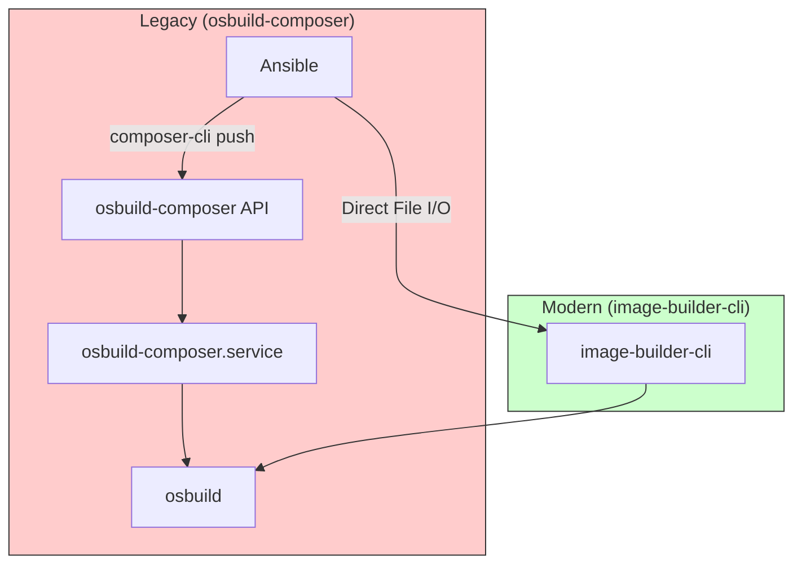
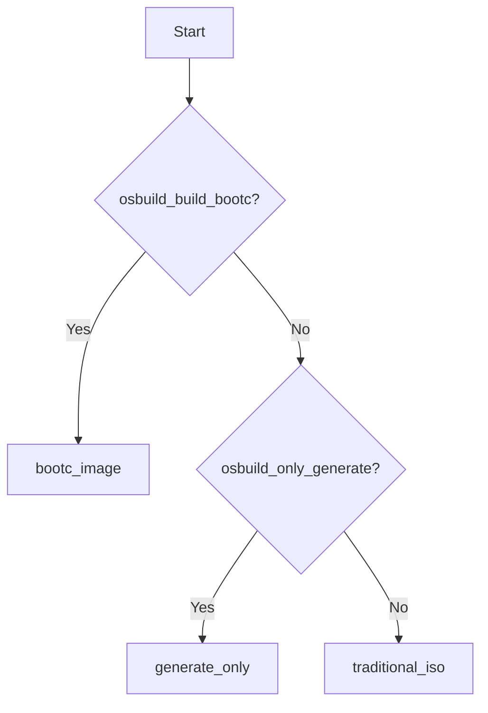

This page documents the **completed migration** of the OSBuild Ansible role from the legacy `osbuild-composer` daemon to the modern `image-builder-cli` toolchain. The migration eliminates stateful dependencies, simplifies the build process, and aligns with container-native OS best practices.

## Migration Overview

The OSBuild role has transitioned from a **stateful daemon architecture** (`osbuild-composer` + `composer-cli`) to a **stateless CLI workflow** (`image-builder-cli`). This change removes the need for daemon management, API polling, and external service dependencies, while preserving full functional parity for ISO and bootc container builds.

**Architectural Shift**:
- **Before**: Ansible → `composer-cli` → API → `osbuild-composer.service` → `osbuild`
- **After**: Ansible → `image-builder-cli` → `osbuild`



Sources: [docs/ARCHITECTURAL_REVIEW.md](docs/ARCHITECTURAL_REVIEW.md#L1-L50), [docs/MIGRATION_LOG.md](docs/MIGRATION_LOG.md#L119-L160)

---

## Key Changes

### 1. Build Engine Replacement
The role now uses `image-builder-cli` for all build operations, replacing the legacy `osbuild-composer` daemon and `composer-cli` commands. This change is **fully backward-compatible** at the Ansible interface level.

| **Aspect**               | **Legacy (`osbuild-composer`)**       | **Modern (`image-builder-cli`)**       |
|--------------------------|---------------------------------------|----------------------------------------|
| **Build Command**        | `composer-cli compose start`          | `image-builder build <type>`           |
| **Blueprint Management** | API-driven (`composer-cli push`)      | File-based (`--blueprint <file.toml>`) |
| **Repository Sources**   | API-driven (`composer-cli sources`)   | CLI flags (`--extra-repo <url>`)        |
| **State Management**     | Stateful daemon (systemd)             | Stateless (direct file I/O)            |
| **Output Handling**      | API polling for status                | Direct filesystem writes               |

Sources: [tasks/build.yml](tasks/build.yml#L37-L49), [docs/MIGRATION_LOG.md](docs/MIGRATION_LOG.md#L119-L160)

---

### 2. Build Mode Abstraction
The role supports **three build modes**, all of which now use `image-builder-cli` under the hood:

1. **`bootc_image`**:
   - Builds bootc container images using Podman + `image-builder-cli` for disk images.
   - **Use Case**: Container-native OS deployments (e.g., Kubernetes, edge devices).
   - **Example**:
     ```bash
     image-builder build bootc-installer \
       --bootc-ref my-image:latest \
       --output-dir /output
     ```
   - **Source**: [tasks/bootc.yml](tasks/bootc.yml#L88-L100)

2. **`traditional_iso`**:
   - Builds traditional installer ISOs (e.g., `minimal-installer`, `image-installer`).
   - **Use Case**: Bare-metal or VM installations.
   - **Example**:
     ```bash
     image-builder build minimal-installer \
       --distro fedora-43 \
       --blueprint workstation.toml \
       --extra-repo "https://example.com/repo"
     ```
   - **Source**: [tasks/build.yml](tasks/build.yml#L37-L49)

3. **`generate_only`**:
   - Generates blueprint files and build scripts without executing the build.
   - **Use Case**: CI/CD pipelines where builds are executed separately.
   - **Output**:
     - Blueprint: `{{ osbuild_output_dir }}/{{ osbuild_blueprint_name }}.toml`
     - Build Script: `{{ osbuild_output_dir }}/build-{{ osbuild_blueprint_name }}.sh`
   - **Source**: [tasks/main.yml](tasks/main.yml#L130-L150)

**Build Mode Selection Logic**:

Sources: [tasks/select_build_mode.yml](tasks/select_build_mode.yml#L1-L33)

---

### 3. Blueprint Generation
Blueprints are dynamically generated using Jinja2 templates and are **fully compatible** with `image-builder-cli`. The role supports:
- **Templated Blueprints**: Generated from `blueprint.toml.j2` with dynamic content (e.g., packages, kernel args).
- **Static Blueprints**: Copied directly from user-provided files.
- **Injections**:
  - First-boot automation (e.g., `syncopated-firstboot`).
  - Kickstart configurations for automated installations.
  - Sudoers rules for passwordless sudo.

**Example Blueprint Injection**:
```toml
# Injected into blueprint.toml
[[customizations.files]]
path = "/usr/local/bin/syncopated-firstboot"
mode = "0755"
content = '''
#!/bin/bash
# First-boot script content
'''
```
Sources: [tasks/blueprint.yml](tasks/blueprint.yml#L1-L130), [templates/blueprint.toml.j2](templates/blueprint.toml.j2)

---
### 4. Repository Source Management
The migration replaces **API-based repository management** (`composer-cli sources add`) with **CLI flags** (`--extra-repo`). Repository URLs are:
1. Extracted from TOML files (e.g., `files/fedora/43/repositories.toml`).
2. Parsed and stored as facts (`osbuild_extra_repo_urls`).
3. Passed to `image-builder-cli` as `--extra-repo` flags.

**Example**:
```bash
image-builder build minimal-installer \
  --distro fedora-43 \
  --blueprint workstation.toml \
  --extra-repo "https://developer.download.nvidia.com/compute/cuda/repos/fedora43/x86_64"
```
Sources: [tasks/sources.yml](tasks/sources.yml#L1-L50), [tasks/build.yml](tasks/build.yml#L18-L30)

---
### 5. Backward Compatibility Layer
To ensure **zero breaking changes** for existing users, the role retains legacy variable names and provides a compatibility layer:

| **Legacy Variable**            | **Modern Equivalent**               | **Status**               |
|--------------------------------|-------------------------------------|--------------------------|
| `osbuild_blueprint_name`       | `osbuild_blueprint_name`            | Retained (compatible)    |
| `osbuild_image_type`           | `osbuild_image_type`                | Retained (mapped to `image-builder-cli` types) |
| `osbuild_distro`               | `osbuild_distro`                    | Retained (e.g., `fedora-43`) |
| `osbuild_work_dir`             | `osbuild_work_dir`                  | Retained (default: `/var/lib/osbuild-composer`) |
| `osbuild_blueprint_version`    | N/A (deprecated, ignored)           | Retained for compatibility |

**Note**: Variables marked as `[COMPATIBILITY]` in `defaults/main.yml` are preserved to avoid breaking existing playbooks but may be deprecated in future versions.
Sources: [defaults/main.yml](defaults/main.yml#L12-L30)

---
### 6. Package Dependencies
The role now installs `image-builder` and `osbuild` as host packages, replacing the legacy `osbuild-composer` daemon:

- **Fedora**:
  ```yaml
  osbuild_host_packages:
    - osbuild
    - image-builder
    - bash-completion
    - firewalld
    - python3-tomli
  ```
- **AlmaLinux/Rocky**:
  ```yaml
  osbuild_host_packages:
    - osbuild
    - image-builder
  ```

Sources: [defaults/main.yml](defaults/main.yml#L86-L95)

---
### 7. Removed Legacy Components
The following `osbuild-composer`-specific components have been **removed**:
- Daemon service management (`osbuild-composer.service`).
- API polling for build status.
- `composer-cli` commands (e.g., `blueprints push`, `sources add`).
- Repository configuration templates for `osbuild-composer`.

Sources: [docs/MIGRATION_LOG.md](docs/MIGRATION_LOG.md#L119-L160), [tasks/install.yml](tasks/install.yml#L1-L47)

---
## Migration Benefits

| **Benefit**                     | **Impact**                                                                 |
|---------------------------------|----------------------------------------------------------------------------|
| **Stateless Builds**            | No daemon state to manage; builds are hermetic and reproducible.        |
| **Simplified CI/CD**            | Direct file I/O eliminates API dependencies and polling.               |
| **Faster Iteration**            | No daemon startup or API overhead.                                        |
| **GitOps-Friendly**             | Blueprints are files (not API state), enabling version control.          |
| **Reduced Complexity**          | ~200 lines of daemon management code removed.                            |
| **Container-Native Alignment** | Supports bootc and immutable OS patterns.                                |

Sources: [docs/ARCHITECTURAL_REVIEW.md](docs/ARCHITECTURAL_REVIEW.md#L1-L50), [docs/MIGRATION_LOG.md](docs/MIGRATION_LOG.md#L119-L160)

---
## Migration Checklist for Users

### 1. Update Host Packages
Ensure the build host has `image-builder` and `osbuild` installed. The role handles this automatically via `tasks/install.yml`.
**Verification**:
```bash
dnf list installed image-builder osbuild
```
Sources: [tasks/install.yml](tasks/install.yml#L15-L20)

### 2. Replace Legacy Workflows
| **Legacy Workflow**                          | **Modern Workflow**                                      |
|---------------------------------------------|----------------------------------------------------------|
| `composer-cli blueprints push`              | Template blueprint files directly (Jinja2).             |
| `composer-cli compose start`                | `image-builder build <type> --blueprint <file.toml>`     |
| `composer-cli sources add`                  | Use `--extra-repo` flags in `image-builder build`.        |
| Manage `osbuild-composer.service`           | No service management required.                          |

Sources: [tasks/build.yml](tasks/build.yml#L37-L49), [tasks/blueprint.yml](tasks/blueprint.yml#L1-L130)

### 3. Validate Blueprints
Ensure blueprint TOML files are compatible with `image-builder-cli`:
- Use `python3-tomli` for syntax validation (handled by `tasks/blueprint.yml`).
- Avoid `composer-cli`-specific settings (e.g., `composer = {}` blocks).

**Example Validation**:
```bash
python3 -c "import tomllib; tomllib.load(open('blueprint.toml', 'rb'))"
```
Sources: [tasks/blueprint.yml](tasks/blueprint.yml#L115-L130)

### 4. Test Builds
Run a test build to verify the migration:
```bash
ansible-playbook osbuild.yml -e "osbuild_only_generate=false"
```
Sources: [tasks/main.yml](tasks/main.yml#L1-L264)

---
## Troubleshooting

| **Issue**                              | **Root Cause**                          | **Solution**                                                                 |
|----------------------------------------|-----------------------------------------|------------------------------------------------------------------------------|
| Build fails with "unknown image type"  | Legacy `osbuild_image_type` value.      | Use `image-builder list` to verify supported types (e.g., `minimal-installer`). |
| Missing `--extra-repo` flags           | Repository URLs not parsed correctly.   | Check `tasks/sources.yml` for TOML parsing logic.                          |
| Blueprint syntax errors                | Invalid TOML in blueprint.              | Run `python3-tomli` validation (see [tasks/blueprint.yml](tasks/blueprint.yml#L115-L130)). |
| Permission errors on output directory  | `osbuild_output_dir` not writable.       | Ensure the directory exists and is writable by the Ansible user.          |

Sources: [tasks/build.yml](tasks/build.yml#L50-L70), [tasks/blueprint.yml](tasks/blueprint.yml#L115-L130)

---
## Next Steps

1. **For Traditional ISO Builds**:
   Explore the [Traditional ISO Build Workflow with image-builder-cli](11-traditional-iso-build-workflow-with-image-builder-cli) for detailed steps and examples.

2. **For Bootc Container Builds**:
   See [Bootc Container Image Build Process and Multi-Stage Containerfile](12-bootc-container-image-build-process-and-multi-stage-containerfile) for bootc-specific guidance.

3. **For Backward Compatibility**:
   Review [Backward Compatibility Layer for Legacy Variables](26-backward-compatibility-layer-for-legacy-variables) for details on deprecated variables and their modern equivalents.

4. **For Advanced Customization**:
   - [Blueprint Generation: Dynamic TOML Templating with Jinja2](13-blueprint-generation-dynamic-toml-templating-with-jinja2)
   - [Repository Source Configuration and GPG Key Management](14-repository-source-configuration-and-gpg-key-management)