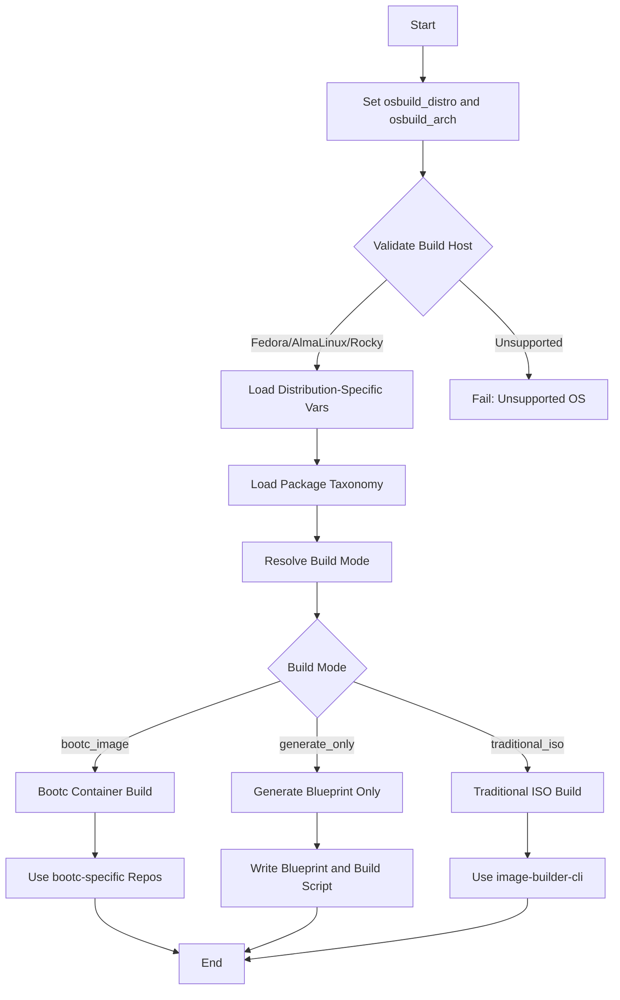

This guide explains how to select and configure the **target distribution** and **architecture** for building custom images using the **OSBuild Ansible role**. The role supports **Fedora**, **AlmaLinux**, and **Rocky Linux** as target distributions, with **x86_64** and **aarch64** as supported architectures. This page focuses on the selection process, supported combinations, and their impact on the build workflow.

---

## Overview of Supported Distributions and Architectures

The OSBuild role is designed to generate custom images for **RHEL-compatible distributions** with support for multiple architectures. The following table summarizes the supported combinations:

| **Distribution** | **Supported Architectures** | **Default Image Type**       | **Repository Strategy**                     | **Notes**                                  |
|------------------|-----------------------------|-------------------------------|---------------------------------------------|--------------------------------------------|
| Fedora           | `x86_64`, `aarch64`         | `minimal-installer`           | RPM Fusion, CUDA, Docker CE                 | Uses Fedora-specific repositories.        |
| AlmaLinux        | `x86_64`, `aarch64`         | `image-installer`             | CRB + EPEL, RPM Fusion EL                   | Shares EL-family repository topology.     |
| Rocky Linux      | `x86_64`, `aarch64`         | `image-installer`             | CRB + EPEL, RPM Fusion EL                   | Identical to AlmaLinux for repository paths. |

**Key Insight**:
The role dynamically resolves repository URLs, GPG keys, and file paths based on the selected `osbuild_distro` and `osbuild_arch`. This ensures compatibility across distributions and architectures without manual intervention.
Sources: [defaults/main.yml](defaults/main.yml#L10-L15), [vars/Fedora.yml](vars/Fedora.yml#L1-L79), [vars/AlmaLinux.yml](vars/AlmaLinux.yml#L1-L68), [vars/Rocky.yml](vars/Rocky.yml#L1-L90)

---

## Core Variables for Distribution and Architecture

The primary variables for selecting the target distribution and architecture are defined in `defaults/main.yml`. These can be overridden in your playbook, inventory, or group/host variables.

| **Variable**            | **Default Value**       | **Description**                                                                                     | **Example Override**               |
|------------------------|-------------------------|-----------------------------------------------------------------------------------------------------|------------------------------------|
| `osbuild_distro`       | `fedora-43`            | Target distribution and version (e.g., `almalinux-10.2`, `rocky-9`).                              | `osbuild_distro: "almalinux-10.2"` |
| `osbuild_arch`         | `x86_64`               | Target architecture (`x86_64` or `aarch64`).                                                        | `osbuild_arch: "aarch64"`           |
| `osbuild_image_type`   | Dynamic (Fedora: `minimal-installer`, EL: `image-installer`) | Image type for traditional ISO builds. | `osbuild_image_type: "qcow2"` |

**Note**:
- The `osbuild_image_type` is automatically set based on the distribution (e.g., `minimal-installer` for Fedora, `image-installer` for AlmaLinux/Rocky). Override this only if you require a specific image type (e.g., `qcow2`, `ami`).
- The role validates that the build host is **Fedora, AlmaLinux, or Rocky Linux** and fails otherwise.

Sources: [defaults/main.yml](defaults/main.yml#L10-L15), [defaults/main.yml](defaults/main.yml#L30-L40), [tasks/main.yml](tasks/main.yml#L20-L30)

---

## How Distribution and Architecture Selection Works

The OSBuild role employs a **dynamic resolution system** to load distribution-specific configurations and adapt repository paths based on the selected architecture. Here’s how it works:

### Step 1: Variable Initialization
- The role starts with default values for `osbuild_distro` (`fedora-43`) and `osbuild_arch` (`x86_64`).
- These can be overridden in your playbook or inventory.

### Step 2: Distribution-Specific Variable Loading
- The role dynamically loads distribution-specific variables using:
  ```yaml
  ansible.builtin.include_vars:
    file: "vars/{{ ansible_distribution }}.yml"
  ```
  This ensures that repository URLs, GPG keys, and other settings are tailored to the target distribution.

### Step 3: Architecture-Aware Path Resolution
- Repository URLs and file paths use `{{ osbuild_arch }}` to support both `x86_64` and `aarch64`. For example:
  ```yaml
  baseurl: "https://dl.rockylinux.org/pub/rocky/{{ _distro_major_version }}/BaseOS/{{ osbuild_arch }}/os/"
  ```
  This allows the same configuration to work across architectures.

### Step 4: File Structure
- Distribution-specific files (e.g., blueprints, repository configs) are organized under:
  ```
  files/<distribution>/<version>/<architecture>/
  ```
  Example:
  - `files/fedora/43/x86_64/sources/`
  - `files/almalinux/10/x86_64/`

### Step 5: Validation
- The role validates that the build host is a supported distribution (Fedora, AlmaLinux, or Rocky Linux).
- No explicit validation for architecture is performed, but unsupported combinations will fail during repository resolution or file access.

Sources: [tasks/main.yml](tasks/main.yml#L20-L40), [vars/AlmaLinux.yml](vars/AlmaLinux.yml#L10-L20), [vars/Rocky.yml](vars/Rocky.yml#L10-L20)

---
## Mermaid Diagram: Selection Flow



---
## Supported Combinations in Detail

### Fedora
- **Versions**: `fedora-43` (default), `fedora-42`, etc.
- **Architectures**: `x86_64`, `aarch64`
- **Repository Strategy**:
  - Uses **RPM Fusion** for non-free packages (e.g., NVIDIA drivers).
  - CUDA repositories are version-specific (e.g., `cuda-fedora43-x86_64`).
  - Docker CE and VS Code repositories are architecture-aware.
- **Example**:
  ```yaml
  osbuild_distro: "fedora-43"
  osbuild_arch: "x86_64"
  ```
- **Files**:
  - Repository configs: `files/fedora/43/x86_64/sources/`
  - Blueprint templates: `files/fedora/43/x86_64/workstation/`

Sources: [vars/Fedora.yml](vars/Fedora.yml#L1-L79), [files/fedora/43/x86_64](files/fedora/43/x86_64)

---

### AlmaLinux
- **Versions**: `almalinux-10.2`, `almalinux-9.8`, etc.
- **Architectures**: `x86_64`, `aarch64`
- **Repository Strategy**:
  - Uses **CRB (CodeReady Builder)** + **EPEL** for additional packages.
  - RPM Fusion EL for non-free packages (e.g., NVIDIA drivers).
  - CUDA repositories use `rhel{major_version}` paths (e.g., `rhel10`).
- **Example**:
  ```yaml
  osbuild_distro: "almalinux-10.2"
  osbuild_arch: "aarch64"
  ```
- **Files**:
  - Repository configs: `files/almalinux/10/aarch64/sources/` (if available).

Sources: [vars/AlmaLinux.yml](vars/AlmaLinux.yml#L1-L68), [files/almalinux/10/x86_64](files/almalinux/10/x86_64)

---
### Rocky Linux
- **Versions**: `rocky-10`, `rocky-9`, etc.
- **Architectures**: `x86_64`, `aarch64`
- **Repository Strategy**:
  - Uses **CRB (CodeReady Builder)** + **EPEL** (identical to AlmaLinux).
  - RPM Fusion EL for non-free packages.
  - CUDA repositories use `rhel{major_version}` paths (e.g., `rhel9`, `rhel10`).
- **Example**:
  ```yaml
  osbuild_distro: "rocky-10"
  osbuild_arch: "x86_64"
  ```
- **Files**:
  - Repository configs: `files/rocky/10/x86_64/sources/`

Sources: [vars/Rocky.yml](vars/Rocky.yml#L1-L90), [files/rocky/10/x86_64](files/rocky/10/x86_64)

---
## How to Select Distribution and Architecture

### Step 1: Choose a Distribution
Select a supported distribution and version. The default is `fedora-43`, but you can override it in your playbook or inventory:

```yaml
- hosts: build_host
  vars:
    osbuild_distro: "almalinux-10.2"
  roles:
    - osbuild
```

**Supported Values**:
- Fedora: `fedora-42`, `fedora-43`, etc.
- AlmaLinux: `almalinux-9.8`, `almalinux-10.2`, etc.
- Rocky Linux: `rocky-9`, `rocky-10`, etc.

Sources: [defaults/main.yml](defaults/main.yml#L10-L15)

---
### Step 2: Choose an Architecture
Select the target architecture. The default is `x86_64`, but you can override it for `aarch64`:

```yaml
- hosts: build_host
  vars:
    osbuild_distro: "almalinux-10.2"
    osbuild_arch: "aarch64"
  roles:
    - osbuild
```

**Supported Values**:
- `x86_64` (default)
- `aarch64`

Sources: [defaults/main.yml](defaults/main.yml#L10-L15)

---
### Step 3: Validate the Combination
Ensure that:
1. The build host is **Fedora, AlmaLinux, or Rocky Linux**.
2. The selected `osbuild_distro` and `osbuild_arch` combination has corresponding files in:
   ```
   files/<distribution>/<version>/<architecture>/
   ```
   For example:
   - `files/fedora/43/x86_64/` (exists)
   - `files/almalinux/10/aarch64/` (verify existence)

If the directory does not exist, the build may fail during file resolution.

Sources: [tasks/main.yml](tasks/main.yml#L20-L30), [files/](files/)

---
### Step 4: Run the Build
Execute the playbook to generate the image. The role will:
1. Load the distribution-specific variables.
2. Resolve repository URLs and GPG keys based on `osbuild_distro` and `osbuild_arch`.
3. Generate the blueprint and build script (or build the image directly if `osbuild_only_generate: false`).

Example:
```bash
ansible-playbook -i inventory build.yml -e "osbuild_distro=almalinux-10.2 osbuild_arch=aarch64"
```

Sources: [tasks/main.yml](tasks/main.yml#L1-L50)

---
## Common Pitfalls and Troubleshooting

| **Issue**                          | **Cause**                                                                 | **Solution**                                                                                     |
|------------------------------------|---------------------------------------------------------------------------|-------------------------------------------------------------------------------------------------|
| Unsupported distribution           | `ansible_distribution` is not Fedora, AlmaLinux, or Rocky Linux.         | Use a supported build host or override `ansible_distribution` in your inventory.               |
| Missing repository files           | `files/<distribution>/<version>/<architecture>/` does not exist.          | Ensure the directory exists or create it with the required files (e.g., `sources/`).         |
| Invalid architecture               | `osbuild_arch` is not `x86_64` or `aarch64`.                              | Use a supported architecture or extend the role to support additional architectures.         |
| Repository URL 404 errors          | The selected `osbuild_distro` or `osbuild_arch` is not supported upstream. | Verify the distribution/architecture combination is supported by the upstream repositories. |
| GPG key fetch failures              | The GPG key URL is invalid or unreachable.                               | Check the `gpgkey_url` in `vars/<Distribution>.yml` and ensure the key is accessible.          |

Sources: [tasks/main.yml](tasks/main.yml#L20-L40), [vars/Fedora.yml](vars/Fedora.yml#L1-L79)

---
## Next Steps

After selecting your target distribution and architecture, proceed to the following pages to continue your journey:

- **[Understanding Traditional ISO vs. Bootc Container Build Modes](5-understanding-traditional-iso-vs-bootc-container-build-modes)**:
  Learn how the selected distribution and architecture influence the build process for traditional ISO and bootc container images.

- **[Choosing the Right Build Mode for Your Use Case](6-choosing-the-right-build-mode-for-your-use-case)**:
  Decide whether to use **Traditional ISO** or **Bootc Container** builds based on your requirements.

- **[Configuring Build Host Requirements and Dependencies](3-configuring-build-host-requirements-and-dependencies)**:
  Ensure your build host meets the prerequisites for the selected distribution and architecture.

---
## Visual Project Structure

```
.
├── defaults
│   └── main.yml              # Default variables (osbuild_distro, osbuild_arch)
├── vars
│   ├── Fedora.yml            # Fedora-specific repositories and GPG keys
│   ├── AlmaLinux.yml         # AlmaLinux-specific repositories and GPG keys
│   ├── Rocky.yml             # Rocky Linux-specific repositories and GPG keys
│   └── packages.yml          # Redirect to distribution-specific package taxonomy
├── files
│   ├── fedora
│   │   └── 43
│   │       └── x86_64        # Fedora 43 x86_64-specific files
│   ├── almalinux
│   │   └── 10
│   │       └── x86_64        # AlmaLinux 10 x86_64-specific files
│   └── rocky
│       ├── 9
│       │   └── x86_64        # Rocky 9 x86_64-specific files
│       └── 10
│           └── x86_64        # Rocky 10 x86_64-specific files
└── tasks
    ├── main.yml              # Loads distribution-specific vars and validates inputs
    └── select_build_mode.yml # Resolves build mode (bootc, ISO, or generate-only)
```