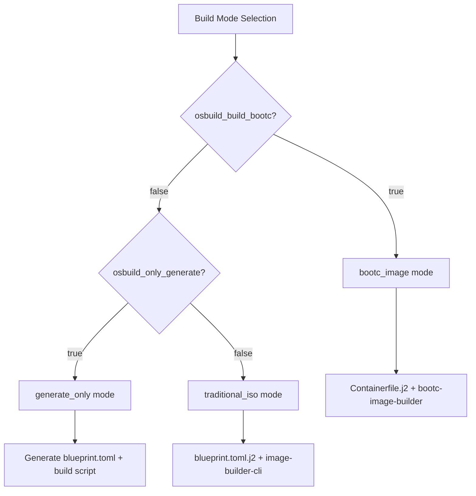
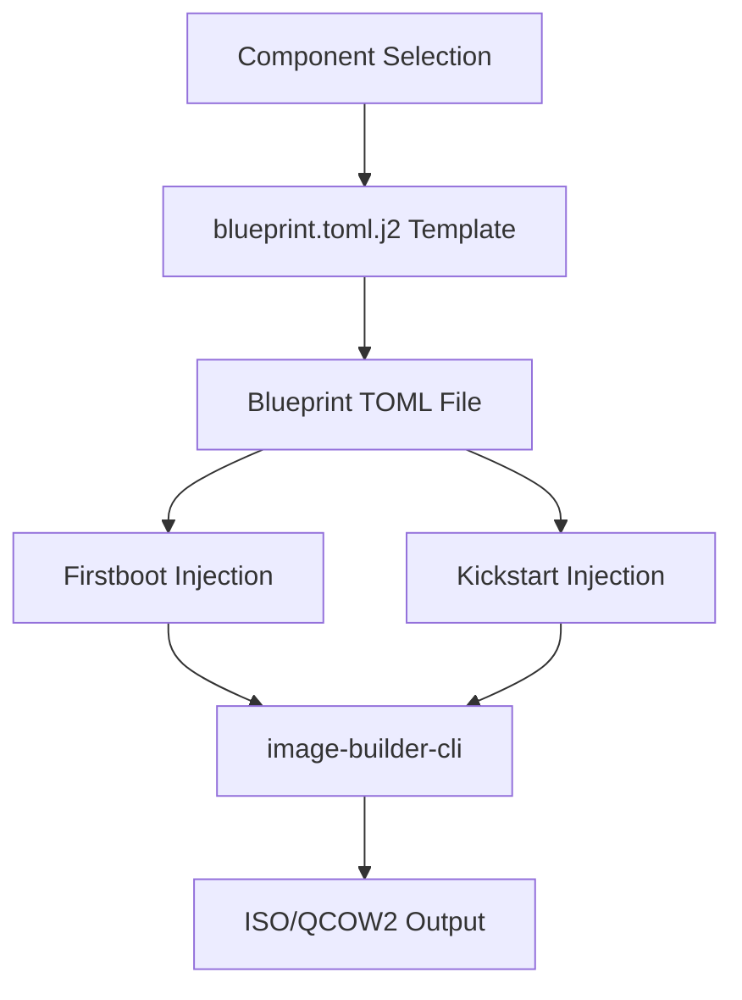
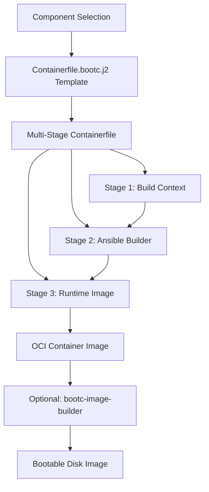

This page clarifies the architectural differences, workflows, and use cases for the two distinct build modes supported by the osbuild role: **Traditional ISO** (image-builder-cli) and **Bootc Container** (bootc-image-builder). Both modes share a common component system but produce fundamentally different artifacts with distinct deployment characteristics.

---

## Architectural Overview

The osbuild role implements a **mode-selection architecture** that resolves to one of three states: `bootc_image`, `generate_only`, or `traditional_iso`. The resolution logic prioritizes `bootc_image` when `osbuild_build_bootc` is true, otherwise defaults to `generate_only` (configuration-only) or `traditional_iso` based on `osbuild_only_generate`.



**Core distinction**: Traditional ISO builds use **image-builder-cli** to create installable media (ISO, QCOW2) with Anaconda installer, while Bootc builds use **bootc-image-builder** to create container images with atomic update capabilities.
Sources: [tasks/select_build_mode.yml](tasks/select_build_mode.yml#L1-L33)

---

## Traditional ISO Build Mode

### Workflow Architecture

The Traditional ISO mode follows a **stateless blueprint compilation** pattern:

1. **Blueprint Generation**: Jinja2 templates (`blueprint.toml.j2`) render TOML files with component-based package selections, kernel arguments, and customizations
2. **Configuration Injection**: First-boot scripts and kickstart configurations are appended to the blueprint
3. **Image Building**: `image-builder-cli` consumes the blueprint to produce installable media (ISO, QCOW2, etc.)



### Key Characteristics

| Feature | Traditional ISO Mode |
|---------|----------------------|
| **Artifact Type** | Installable media (ISO, QCOW2, AMI, VHD) |
| **Build Tool** | `image-builder-cli` (successor to osbuild-composer) |
| **Installer** | Anaconda (full interactive/installer experience) |
| **Configuration Method** | Kickstart files + blueprint customizations |
| **Update Mechanism** | Traditional package management (dnf/yum) |
| **Immutability** | Runtime mutable (standard Linux) |
| **First-Boot** | Supported via kickstart `%post` and custom scripts |
| **Component Scope** | All components (including `anaconda`, `blueprint_only`) |

### Configuration Files

- **Primary Template**: [`blueprint.toml.j2`](templates/blueprint.toml.j2#L1-L133) - Dynamic TOML generation with component-based package groups, services, kernel args, and file injections
- **Kickstart Integration**: [`kickstart.toml.j2`](templates/kickstart.toml.j2) - Anaconda installer configuration
- **Build Script**: [`image-builder-build.sh.j2`](templates/image-builder-build.sh.j2) - Generated execution script

### Build Process

The traditional build process is orchestrated through [`tasks/build.yml`](tasks/build.yml#L1-L139):
1. Validates build configuration (blueprint, distro, image type)
2. Executes `image-builder build` with repository sources
3. Handles build success/failure with detailed logging
4. Produces named output files (ISO, QCOW2) in the specified directory

**Supported Image Types** (distro-dependent):
- Fedora: `minimal-installer`, `network-installer`, `qcow2`, `ami`, `vhd`, `vmdk`
- AlmaLinux/Rocky: `image-installer`, `network-installer`, `qcow2`
Sources: [defaults/main.yml](defaults/main.yml#L40-L50)

---
## Bootc Container Build Mode

### Workflow Architecture

The Bootc mode implements a **multi-stage container build** pattern with Ansible Role Inversion:

1. **Workspace Setup**: Creates directory structure for build artifacts
2. **Template Rendering**: Generates `Containerfile` from [`Containerfile.bootc.j2`](templates/Containerfile.bootc.j2#L1-L128)
3. **Multi-Stage Build**: Uses Podman to build OCI container images with embedded Ansible playbooks
4. **Optional Disk Image**: Can produce bootable disk images (ISO, QCOW2) from the container



### Key Characteristics

| Feature | Bootc Container Mode |
|---------|---------------------|
| **Artifact Type** | OCI container image (optionally bootable disk images) |
| **Build Tool** | `podman` + `bootc-image-builder` |
| **Installer** | bootc (atomic updates, no traditional installer) |
| **Configuration Method** | Ansible Role Inversion Pattern (build-time compilation to `/usr/etc`) |
| **Update Mechanism** | Atomic updates via `bootc switch` |
| **Immutability** | Immutable (bootc manages atomic deployments) |
| **First-Boot** | Not applicable (container-based, uses `/usr/etc` for vendor defaults) |
| **Component Scope** | Excludes `blueprint_only` components (e.g., `anaconda`) |

### Configuration Files

- **Primary Template**: [`Containerfile.bootc.j2`](templates/Containerfile.bootc.j2#L1-L128) - Multi-stage Dockerfile with:
  - Stage 1: Build context (scripts, playbooks)
  - Stage 2: Ansible builder environment (compiles configs to `/usr/etc`)
  - Stage 3: Runtime image with embedded configurations
- **Build Configuration**: [`disk.toml.j2`](templates/disk.toml.j2#L1-L27) - Filesystem customizations for disk images
- **Installer Configuration**: [`iso.toml.j2`](templates/iso.toml.j2#L1-L32) - Anaconda modules for bootc installer ISO
- **Build-Time Playbook**: [`files/bootc/build.yml`](files/bootc/build.yml#L1-L137) - Ansible playbook for `/usr/etc` compilation

### Build Process

The bootc build process is orchestrated through [`tasks/bootc.yml`](tasks/bootc.yml#L1-L134):
1. Installs prerequisites (podman, buildah, skopeo, jq)
2. Creates workspace and templates all configuration files
3. Builds OCI container image using Podman with multi-stage build
4. Optionally builds bootable disk images using `bootc-image-builder`
5. Verifies container contents and displays build summary

**Key Innovation - Ansible Role Inversion Pattern**:
- Traditional Ansible: Runs post-deployment, modifies `/etc` on live systems
- Inverted Pattern: Ansible runs **at build-time**, compiles configurations into `/usr/etc` (immutable vendor defaults)
- Runtime: Systemd merges `/usr/etc` (vendor) with `/etc` (local overrides), with `/etc` taking precedence
Sources: [templates/Containerfile.bootc.j2](templates/Containerfile.bootc.j2#L1-L20)

---
## Comparative Analysis

### Feature Comparison Matrix

| Aspect | Traditional ISO | Bootc Container |
|--------|-----------------|-----------------|
| **Deployment Model** | Installable media → bare metal/VM | Container image → atomic updates |
| **Update Strategy** | Package-by-package (dnf/yum) | Atomic image replacement (bootc switch) |
| **Configuration Drift** | Possible (runtime modifications) | Minimal (immutable image) |
| **Rollback Capability** | Manual (restore from backup) | Automatic (bootc rollback) |
| **Build Time** | Longer (full OS composition) | Faster (container layers cached) |
| **Image Size** | Larger (includes installer) | Smaller (container-optimized) |
| **Hardware Support** | Full (Anaconda handles diverse hardware) | Limited (container runtime constraints) |
| **First-Boot Customization** | Full support (kickstart %post) | Limited (container entrypoints) |
| **GPU Support** | Full (NVIDIA drivers in ISO) | Full (NVIDIA CDI for container passthrough) |
| **Secure Boot** | Supported | Supported (with limitations) |

### Component Compatibility

| Component | Traditional ISO | Bootc Container | Notes |
|-----------|-----------------|-----------------|-------|
| `base` | ✅ | ✅ | Core system packages |
| `anaconda` | ✅ | ❌ | ISO installer only |
| `gnome` | ✅ | ✅ | Desktop environment |
| `sway` | ✅ | ✅ | Window manager |
| `nvidia` | ✅ | ✅ | GPU drivers + CUDA |
| `development` | ✅ | ✅ | Dev tools |
| `container-tools` | ✅ | ✅ | Podman, Buildah, etc. |
| `oneapi` | ✅ | ✅ | Intel oneAPI |
| `cockpit` | ✅ | ✅ | Web management |
| `docker` | ✅ | ⚠️ | Experimental |

**Component Definition Schema**:
Each component in [`defaults/main.yml`](defaults/main.yml#L200-L866) defines:
- `bootc_only`: Component only applies to bootc builds
- `blueprint_only`: Component only applies to ISO builds (e.g., `anaconda`)
- `bootc_repos`: Repository commands for bootc Containerfile
- `sources`: Repository sources for traditional blueprint

---
## Architectural Patterns

### Shared Component System

Both build modes leverage the same **component-based architecture** defined in [`defaults/main.yml`](defaults/main.yml#L200-L866):

```yaml
osbuild_component_defs:
  nvidia:
    label: "NVIDIA GPU Stack"
    packages: "{{ system_packages.Graphics.nvidia }}"
    services: [nvidia-cdi-refresh, nvidia-persistenced]
    kernel_args: ["rd.driver.blacklist=nouveau", ...]
    sources: "{{ _nvidia_sources }}"
    bootc_repos: "{{ _nvidia_bootc_repos }}"
    requires: [base]
    conflicts: []
    size_impact: "large"
    build_time_impact: "medium"
```

**Component Resolution**:
- Traditional ISO: Uses `packages`, `blueprint_groups`, `services`, `kernel_args`, `sources`
- Bootc Container: Uses `packages`, `bootc_repos`, `services`, `kernel_args` (via `/usr/etc`)

### Configuration Compilation Differences

| Configuration Type | Traditional ISO | Bootc Container |
|-------------------|-----------------|-----------------|
| **Package Selection** | Blueprint TOML `[[packages]]` | Containerfile `RUN dnf install` |
| **Services** | Blueprint TOML `[customizations.services]` | `/usr/lib/systemd/system/` (vendor units) |
| **Kernel Arguments** | Blueprint TOML `[customizations.kernel]` | `/usr/etc/kernel/cmdline.d/` (drop-ins) |
| **Files** | Blueprint TOML `[[customizations.files]]` | `/usr/etc/` (immutable defaults) |
| **First-Boot** | Kickstart `%post` scripts | Build-time Ansible playbook |

---
## Use Case Guidance

### Choose Traditional ISO When:

- **Target Environment**: Bare metal servers, virtual machines, or physical workstations
- **Requirement**: Full hardware detection and installer flexibility (Anaconda)
- **Use Case**: Traditional Linux deployments with package-based updates
- **Customization**: Need first-boot scripts and interactive installation
- **Compatibility**: Legacy systems or environments without container support
- **GPU Requirements**: Full NVIDIA driver stack with persistent installation

### Choose Bootc Container When:

- **Target Environment**: Container platforms (Kubernetes, Podman), edge devices, or atomic update systems
- **Requirement**: Immutable infrastructure with atomic rollbacks
- **Use Case**: Cloud-native deployments, CI/CD pipelines, or fleet management
- **Customization**: Build-time configuration compilation (Ansible Role Inversion)
- **Update Strategy**: Atomic image updates with `bootc switch` and rollback capabilities
- **Performance**: Faster builds with container layer caching
- **GPU Requirements**: NVIDIA CDI for GPU passthrough to containers

### Hybrid Approach

The osbuild role supports a **hybrid workflow**:
1. Use Traditional ISO for initial bare-metal/VM provisioning
2. Use Bootc Container for application deployment on top of the installed system
3. Leverage the same component definitions across both modes for consistency

---
## Technical Implementation Details

### Mode Selection Logic

The build mode is resolved in [`tasks/select_build_mode.yml`](tasks/select_build_mode.yml#L1-L33):

```yaml
osbuild_resolved_build_mode: >-
  {{
    osbuild_build_bootc
    | ternary('bootc_image',
      osbuild_only_generate
      | ternary('generate_only', 'traditional_iso')
    )
  }}
```

**Priority Order**:
1. `bootc_image` (if `osbuild_build_bootc: true`)
2. `generate_only` (if `osbuild_only_generate: true`)
3. `traditional_iso` (default)

### Build Mode Execution

The main orchestration in [`tasks/main.yml`](tasks/main.yml#L1-L264) implements mode-specific blocks:

```yaml
- name: MODE bootc_image
  when: osbuild_resolved_build_mode == 'bootc_image'
  block:
    - name: Import bootc workflow tasks
      ansible.builtin.import_tasks: bootc.yml

- name: MODE traditional_iso
  when: osbuild_resolved_build_mode == 'traditional_iso'
  block:
    - name: Import blueprint management tasks
      ansible.builtin.import_tasks: blueprint.yml
    - name: Import image build tasks
      ansible.builtin.import_tasks: build.yml
```

---
## Migration Considerations

### From Traditional ISO to Bootc

**Compatibility Notes**:
- Components marked `blueprint_only: true` (e.g., `anaconda`) are automatically excluded in bootc mode
- Kernel arguments are applied differently: Traditional uses blueprint TOML, Bootc uses `/usr/etc/kernel/cmdline.d/`
- NVIDIA support requires CDI setup in bootc mode vs. direct driver installation in ISO mode

**Migration Path**:
1. Start with the same component selection
2. Test bootc builds with `osbuild_build_bootc: true`
3. Adjust NVIDIA configuration to use CDI for container passthrough
4. Replace first-boot scripts with build-time Ansible configurations
5. Update deployment workflows to use `bootc switch` instead of package updates

### Backward Compatibility

The role maintains **backward compatibility** through:
- `osbuild_only_generate: true` (default): Generates blueprint and build script without executing
- `osbuild_build_bootc: false` (default): Uses traditional ISO mode
- Legacy variable support for `composer-era` naming (e.g., `osbuild_image_type`)

---
## Next Steps

To deepen your understanding of the build modes:

1. **For Traditional ISO**: Explore the [Traditional ISO Build Workflow with image-builder-cli](11-traditional-iso-build-workflow-with-image-builder-cli) to understand the detailed workflow and configuration options.

2. **For Bootc Container**: Dive into the [Bootc Container Image Build Process and Multi-Stage Containerfile](12-bootc-container-image-build-process-and-multi-stage-containerfile) to see how the multi-stage build and Ansible Role Inversion Pattern work in practice.

3. **For Component System**: Learn about the [Component System: Modular Package and Configuration Management](10-component-system-modular-package-and-configuration-management) to understand how components drive both build modes.

4. **For Choosing**: If you're unsure which mode to use, consult [Choosing the Right Build Mode for Your Use Case](6-choosing-the-right-build-mode-for-your-use-case) for decision guidance.