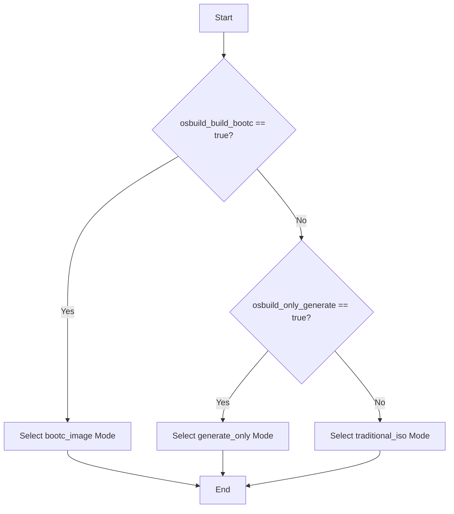

This guide helps intermediate developers select the optimal build mode for their specific use case when working with the **OSBuild Ansible role**. The role supports three distinct build modes: **Traditional ISO**, **Bootc Container**, and **Generate Only**. Each mode caters to different deployment scenarios, and this document provides a structured approach to choosing the right one.

---

## Build Mode Overview

The OSBuild role provides a **mode-selection mechanism** that resolves the build mode based on two primary flags:
- `osbuild_build_bootc`: Enables **Bootc Container** mode.
- `osbuild_only_generate`: Enables **Generate Only** mode (if `osbuild_build_bootc` is `false`).

The resolved mode is stored in `osbuild_resolved_build_mode` and can be one of:
- `bootc_image`
- `generate_only`
- `traditional_iso`

**Priority Rule**: `osbuild_build_bootc` takes precedence over `osbuild_only_generate`. If both are `false`, the role defaults to **Traditional ISO** mode.
Sources: [tasks/select_build_mode.yml](tasks/select_build_mode.yml#L1-L33)

---

## Decision Flow for Build Mode Selection

The following diagram illustrates the logical flow for selecting the build mode:



Sources: [tasks/select_build_mode.yml](tasks/select_build_mode.yml#L1-L33)

---

## Build Mode Comparison

The table below compares the three build modes across key dimensions to help you make an informed decision:

| **Feature**               | **Traditional ISO**                          | **Bootc Container**                          | **Generate Only**                          |
|---------------------------|---------------------------------------------|---------------------------------------------|-------------------------------------------|
| **Output**                | ISO, QCOW2, VMDK, AMI, etc.                  | OCI Container + (Optional) Bootable Disk     | Blueprint TOML + Build Script             |
| **Build Tool**            | `image-builder-cli`                         | `bootc-image-builder` + Podman              | `image-builder-cli` (script)               |
| **Use Case**              | Bare-metal, VMs, physical installations     | Immutable containers, edge deployments      | Debugging, CI/CD, deferred builds          |
| **Configuration**         | Blueprint TOML + Kickstart                  | Containerfile + Ansible (build-time)        | Blueprint TOML                            |
| **Atomic Updates**        | No                                          | Yes (via `bootc switch`)                    | No                                        |
| **Build Time**            | Longer (full image build)                   | Faster (container layers)                   | Minimal (only config generation)          |
| **NVIDIA Support**        | Yes (via Kickstart)                         | Yes (via CDI and container repos)           | Yes (via Blueprint)                       |
| **First-Boot Automation** | Yes (via Kickstart)                         | Yes (via Ansible playbooks in container)    | Yes (via Kickstart)                       |
| **Immutable Infrastructure** | No (runtime modifications possible)     | Yes (immutable by design)                   | No                                        |

Sources:
- [tasks/build.yml](tasks/build.yml#L1-L139)
- [tasks/bootc.yml](tasks/bootc.yml#L1-L134)
- [tasks/main.yml](tasks/main.yml#L1-L264)

---

## Use Case Recommendations

Use the following table to match your use case with the recommended build mode:

| **Use Case**                          | **Recommended Build Mode**       | **Rationale**                                                                                     |
|---------------------------------------|----------------------------------|---------------------------------------------------------------------------------------------------|
| Bare-metal deployment                 | Traditional ISO                  | Supports Kickstart for automated installations and is compatible with physical hardware.         |
| Virtual Machine (VM) deployment       | Traditional ISO                  | Outputs QCOW2, VMDK, or other VM-compatible formats for virtualized environments.                   |
| Immutable containerized workloads      | Bootc Container                  | Enables atomic updates, containerized deployments, and immutable infrastructure.                 |
| Edge deployments                      | Bootc Container                  | Lightweight, portable, and supports OCI containers for edge devices.                              |
| CI/CD pipelines                       | Generate Only                    | Generates build scripts for later execution in pipelines, enabling validation before deployment. |
| Debugging or testing configurations   | Generate Only                    | Allows inspection of blueprint and build scripts without executing the build.                   |
| GPU-accelerated workloads (NVIDIA)    | Bootc Container or Traditional ISO | Both support NVIDIA drivers, but Bootc is better for containerized GPU workloads (via CDI).       |
| Development environments              | Traditional ISO or Bootc Container | Traditional ISO for full VMs; Bootc for containerized dev environments.                          |

Sources:
- [tasks/build.yml](tasks/build.yml#L1-L139)
- [tasks/bootc.yml](tasks/bootc.yml#L1-L134)
- [defaults/main.yml](defaults/main.yml#L1-L866)

---

## Configuration Options for Build Modes

The following table summarizes the key variables for configuring each build mode:

| **Variable**                     | **Description**                                                                 | **Default** | **Applicable Modes**               |
|----------------------------------|---------------------------------------------------------------------------------|-------------|------------------------------------|
| `osbuild_build_bootc`            | Enable Bootc Container build mode.                                             | `false`     | All                                 |
| `osbuild_only_generate`          | Only generate blueprint and build script (no actual build).                   | `true`      | Traditional ISO, Generate Only      |
| `osbuild_image_type`             | Image type for traditional ISO builds (e.g., `qcow2`, `iso`, `vmdk`).         | `minimal-installer` (Fedora) / `image-installer` (EL) | Traditional ISO |
| `osbuild_bootc_base_image`       | Base image for Bootc builds (e.g., `fedora:43`, `almalinux:10`).                | N/A         | Bootc Container                     |
| `osbuild_bootc_image_type`       | Disk image type for Bootc (e.g., `iso`, `qcow2`).                              | N/A         | Bootc Container                     |
| `osbuild_bootc_build_disk_image` | Whether to build a bootable disk image from the Bootc container.               | `false`     | Bootc Container                     |
| `osbuild_components`             | List of components to include (e.g., `base`, `gnome`, `nvidia`).               | `base`, `anaconda`, `gnome`, `sway`, `nvidia`, `development`, `container-tools` | All |

Sources:
- [defaults/main.yml](defaults/main.yml#L1-L866)
- [tasks/bootc.yml](tasks/bootc.yml#L1-L134)

---

## Architectural Considerations

### Traditional ISO Mode
- **Architecture**: Uses `image-builder-cli` to create bootable images (ISO, QCOW2, etc.) from a blueprint TOML file.
- **Workflow**:
  1. Generate a blueprint (`blueprint.toml`) from selected components.
  2. Run `image-builder build` with the blueprint and distribution.
  3. Output a bootable image (e.g., ISO, QCOW2).
- **Best For**: Traditional deployments where a full OS image is required (e.g., bare-metal, VMs).
- **Limitations**: Not immutable; runtime modifications can lead to configuration drift.
  Sources: [tasks/build.yml](tasks/build.yml#L1-L139)

### Bootc Container Mode
- **Architecture**: Uses `bootc-image-builder` to create OCI-compliant container images with optional bootable disk images.
- **Workflow**:
  1. Generate a `Containerfile` for the Bootc image.
  2. Build the container image using Podman.
  3. Optionally, build a bootable disk image (ISO, QCOW2) from the container.
- **Key Features**:
  - **Immutable Infrastructure**: Configurations are compiled at build-time into `/usr/etc` (vendor defaults).
  - **Atomic Updates**: Use `bootc switch` to atomically update the OS.
  - **Ansible Role Inversion**: Ansible runs at build-time (not post-deployment) to compile configurations.
- **Best For**: Immutable, containerized workloads, edge deployments, or atomic updates.
  Sources:
  - [tasks/bootc.yml](tasks/bootc.yml#L1-L134)
  - [templates/Containerfile.bootc.j2](templates/Containerfile.bootc.j2#L1-L128)
  - [files/bootc/build.yml](files/bootc/build.yml#L1-L137)

### Generate Only Mode
- **Architecture**: Generates the blueprint and a build script (`build-<blueprint>.sh`) but does not execute the build.
- **Workflow**:
  1. Generate the blueprint TOML file.
  2. Create a build script for later execution.
- **Best For**: Debugging, CI/CD pipelines, or deferred builds where the actual build is executed separately.
  Sources: [tasks/main.yml](tasks/main.yml#L100-L130)

---

## Example Scenarios

### Scenario 1: Bare-Metal Deployment
**Goal**: Deploy a custom OS image to physical hardware.
**Recommended Mode**: Traditional ISO
**Configuration**:
```yaml
osbuild_build_bootc: false
osbuild_only_generate: false
osbuild_image_type: iso
osbuild_components:
  - base
  - anaconda
  - gnome
```
**Output**: Bootable ISO file for physical installation.
Sources: [tasks/build.yml](tasks/build.yml#L1-L139)

---

### Scenario 2: Immutable Edge Deployment
**Goal**: Deploy an immutable OS to edge devices with atomic updates.
**Recommended Mode**: Bootc Container
**Configuration**:
```yaml
osbuild_build_bootc: true
osbuild_bootc_base_image: fedora:43
osbuild_bootc_image_type: iso
osbuild_bootc_build_disk_image: true
osbuild_components:
  - base
  - container-tools
  - nvidia
```
**Output**: OCI container image + bootable ISO for edge devices.
Sources: [tasks/bootc.yml](tasks/bootc.yml#L1-L134)

---
### Scenario 3: CI/CD Pipeline
**Goal**: Validate the blueprint and build script in a CI/CD pipeline before deployment.
**Recommended Mode**: Generate Only
**Configuration**:
```yaml
osbuild_build_bootc: false
osbuild_only_generate: true
osbuild_image_type: qcow2
osbuild_components:
  - base
  - development
```
**Output**: Blueprint TOML + build script for later execution.
Sources: [tasks/main.yml](tasks/main.yml#L100-L130)

---
## Next Steps

To dive deeper into the build modes and their workflows, explore the following pages:
- [Understanding Traditional ISO vs. Bootc Container Build Modes](5-understanding-traditional-iso-vs-bootc-container-build-modes)
- [Traditional ISO Build Workflow with image-builder-cli](11-traditional-iso-build-workflow-with-image-builder-cli)
- [Bootc Container Image Build Process and Multi-Stage Containerfile](12-bootc-container-image-build-process-and-multi-stage-containerfile)
- [Blueprint Generation: Dynamic TOML Templating with Jinja2](13-blueprint-generation-dynamic-toml-templating-with-jinja2)