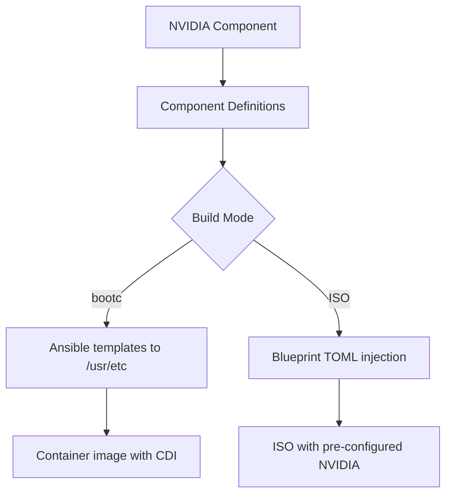

This page explains the **Ansible Role Inversion Pattern** implemented in the `osbuild` role, which shifts Ansible's execution from **post-deployment configuration management** to **build-time configuration compilation**. This pattern is foundational to achieving **immutable infrastructure** in both traditional ISO and bootc container image builds.

## Conceptual Foundation: Traditional vs. Inverted Ansible

### Traditional Ansible Pattern
In conventional Ansible usage, playbooks run **after** the operating system is deployed. They modify the live system's `/etc` directory to achieve the desired state. This approach has inherent limitations:
- **Configuration drift**: Runtime modifications can diverge from the declared state
- **Non-atomic upgrades**: Changes are applied incrementally, risking partial failures
- **State dependency**: Requires a running system to apply configurations

### Inverted Ansible Pattern
The **inversion pattern** flips this paradigm by executing Ansible **during the image build process** to compile configurations into the immutable image itself. This transforms Ansible from a configuration management tool into a **build-time configuration compiler**.

**Core principle**: Instead of modifying `/etc` on live systems, Ansible writes vendor defaults to `/usr/etc` during the build. At runtime, systemd merges `/usr/etc` (vendor defaults) with `/etc` (local overrides), preserving immutability while allowing runtime customization.

Sources: [templates/Containerfile.bootc.j2](templates/Containerfile.bootc.j2#L1-L10), [files/bootc/build.yml](files/bootc/build.yml#L1-L15)

## Architectural Implementation

### Multi-Stage Containerfile Structure
The bootc container image build employs a **three-stage Dockerfile pattern** to separate concerns and optimize the final image:

```mermaid
graph TD
    A[Stage 1: Build Context] --> B[Stage 2: Ansible Builder]
    B --> C[Stage 3: Runtime Image]
    
    A[Build Context] -->|COPY build_files/| A1[build.yml, templates/]
    B[Ansible Builder] -->|FROM base image| B1[Install ansible-core]
    B1 --> B2[Run ansible-playbook]
    B2 --> B3[Compile configs to /usr/etc]
    C[Runtime Image] -->|COPY --from=ansible-builder| C1[/usr/etc from builder]
    C1 --> C2[Immutable vendor defaults]
```

**Stage 1 (ctx)**: Contains build artifacts (Ansible playbooks, templates)
**Stage 2 (ansible-builder)**: Installs `ansible-core`, executes the build playbook to compile configurations into `/usr/etc`
**Stage 3 (Runtime)**: Copies the compiled `/usr/etc` from the builder stage, resulting in an image with pre-baked configurations

Sources: [templates/Containerfile.bootc.j2](templates/Containerfile.bootc.j2#L11-L45), [files/bootc/build.yml](files/bootc/build.yml#L1-L50)

### Build-Time Configuration Compilation
The inversion pattern is implemented through a **dedicated build playbook** (`files/bootc/build.yml`) that runs inside the container build process. This playbook:

1. **Creates immutable directories**: Ensures `/usr/etc`, `/usr/lib/systemd/system/`, and `/usr/etc/kernel/cmdline.d/` exist
2. **Templates vendor defaults**: Writes systemd units, hostname, os-release, and kernel command-line configurations to `/usr/etc`
3. **Handles component-specific configurations**: Processes NVIDIA CDI, kernel parameters, and other component-driven settings

```yaml
# Example: NVIDIA kernel parameters as vendor defaults
- name: Template NVIDIA kernel cmdline
  ansible.builtin.copy:
    dest: /usr/etc/kernel/cmdline.d/10-nvidia.conf
    content: |
      rd.driver.blacklist=nouveau modprobe.blacklist=nouveau nvidia-drm.modeset=1
    mode: "0644"
```

Sources: [files/bootc/build.yml](files/bootc/build.yml#L40-L80)

### /usr/etc vs /etc: The Immutable Hierarchy
The pattern leverages systemd's **configuration hierarchy**:

| Path | Purpose | Mutability | Priority |
|------|---------|------------|----------|
| `/usr/etc` | Vendor defaults (build-time) | Immutable (part of image) | Lower |
| `/etc` | Local overrides (runtime) | Mutable | Higher |

**Runtime behavior**: systemd merges configurations from both directories, with `/etc` taking precedence. This allows:
- **Immutable infrastructure**: The base image contains all vendor defaults
- **Runtime customization**: Users can override specific configurations by placing files in `/etc`
- **Atomic upgrades**: `bootc switch` replaces the entire image, including all vendor defaults

Sources: [files/bootc/build.yml](files/bootc/build.yml#L45-L55), [templates/Containerfile.bootc.j2](templates/Containerfile.bootc.j2#L45-L50)

## Pattern Benefits for Immutable Infrastructure

### 1. Immutability by Design
- Configurations are **baked into the image** at build time
- No runtime configuration drift — the image IS the desired state
- Changes require building a new image, not modifying running systems

### 2. Atomic Upgrades
- `bootc switch` replaces the entire OS image atomically
- New configurations are deployed alongside the new OS version
- Rollback is instantaneous: `bootc rollback`

### 3. Declarative Build Process
- The blueprint TOML file **is** the source of truth for the entire system
- Component definitions declare packages, services, and configurations
- Build is deterministic and reproducible

### 4. Separation of Concerns
- **Build-time**: Ansible compiles configurations into `/usr/etc`
- **Runtime**: System operates with merged `/usr/etc` + `/etc`
- **Customization**: Users override via `/etc` without modifying the image

### 5. Testability
- Configurations can be validated during the build process
- CI/CD pipelines can test the entire image before deployment
- No need for "configuration management" on running systems

Sources: [tasks/bootc.yml](tasks/bootc.yml#L1-L50), [templates/Containerfile.bootc.j2](templates/Containerfile.bootc.j2#L1-L10)

## Implementation in Traditional ISO Builds
While the inversion pattern is most explicit in bootc builds, the same **component-driven configuration philosophy** applies to traditional ISO builds:

1. **Blueprint generation**: The `blueprint.yml` task compiles component definitions into a TOML blueprint
2. **Configuration injection**: First-boot scripts and kickstart configurations are injected into the blueprint
3. **Build-time execution**: `image-builder-cli` consumes the blueprint to create the ISO


The key difference: Traditional ISO builds use `image-builder-cli`'s native configuration system, while bootc builds use the explicit Ansible inversion pattern with `/usr/etc`.

Sources: [tasks/blueprint.yml](tasks/blueprint.yml#L1-L50), [templates/blueprint.toml.j2](templates/blueprint.toml.j2#L1-L50)

## Component System: The Building Blocks
The inversion pattern is enabled by the **component system**, where each component declares:

| Field | Purpose | Example |
|-------|---------|---------|
| `packages` | Packages to install | `nvidia-driver`, `cuda` |
| `services` | Systemd services to enable | `nvidia-cdi-refresh` |
| `kernel_args` | Kernel command-line parameters | `rd.driver.blacklist=nouveau` |
| `files` | Custom files to include | NVIDIA CDI scripts |
| `sources` | Repository sources | CUDA, RPM Fusion |
| `bootc_repos` | Shell commands for bootc repo setup | NVIDIA repo commands |
| `requires` | Component dependencies | `base` required by all |
| `conflicts` | Incompatible components | None in current implementation |
| `blueprint_only` | ISO-only components | `anaconda` (installer) |
| `bootc_only` | bootc-only components | None in current implementation |

**Component resolution**: The `validate_components.yml` task ensures selected components have their dependencies satisfied and no conflicts exist.

Sources: [defaults/main.yml](defaults/main.yml#L200-L400), [tasks/validate_components.yml](tasks/validate_components.yml#L1-L50)

## Build Mode Selection: Unified Pattern Application
The role supports three build modes, all applying the inversion pattern differently:

| Mode | Description | Inversion Pattern Application |
|------|-------------|-------------------------------|
| `traditional_iso` | Build ISO using `image-builder-cli` | Blueprint-driven configuration (implicit inversion) |
| `bootc_image` | Build bootc container image | Explicit Ansible inversion with `/usr/etc` |
| `generate_only` | Generate blueprint and build script | Configuration compilation without execution |

**Mode selection logic** in `select_build_mode.yml`:
```yaml
osbuild_resolved_build_mode: >-
  {{
    osbuild_build_bootc
    | ternary('bootc_image',
      osbuild_only_generate
      | ternary('generate_only', 'traditional_iso')
    )
  }}
```

Sources: [tasks/select_build_mode.yml](tasks/select_build_mode.yml#L1-L33), [tasks/main.yml](tasks/main.yml#L40-L80)

## NVIDIA CDI: A Practical Example
The NVIDIA component demonstrates the inversion pattern in action:

1. **Component definition** declares NVIDIA-specific configurations:
   - Packages: `nvidia-driver`, `cuda`, etc.
   - Services: `nvidia-cdi-refresh`, `nvidia-persistenced`
   - Kernel args: Blacklist nouveau, enable NVIDIA DRM
   - Files: CDI generation script
   - Sources: CUDA, RPM Fusion, NVIDIA Container Toolkit repos

2. **Build-time execution**:
   - For **bootc**: Ansible templates the CDI service into `/usr/lib/systemd/system/` and kernel parameters into `/usr/etc/kernel/cmdline.d/`
   - For **ISO**: These configurations are injected into the blueprint TOML

3. **Runtime behavior**:
   - CDI service is enabled and runs at boot
   - Kernel parameters are applied automatically
   - GPU passthrough works out-of-the-box



Sources: [defaults/main.yml](defaults/main.yml#L250-L280), [files/bootc/build.yml](files/bootc/build.yml#L30-L45), [templates/Containerfile.bootc.j2](templates/Containerfile.bootc.j2#L90-L110)

## Comparison: Traditional vs. Inverted Pattern

| Aspect | Traditional Ansible | Inverted Ansible Pattern |
|--------|---------------------|---------------------------|
| **Execution Time** | Post-deployment | Build-time |
| **Target Directory** | `/etc` | `/usr/etc` |
| **Configuration State** | Mutable | Immutable (vendor defaults) |
| **Upgrade Mechanism** | Incremental | Atomic (image replacement) |
| **Drift Prevention** | Requires periodic runs | Built into image |
| **Testing** | On live systems | In build pipeline |
| **Customization** | Modify `/etc` directly | Override via `/etc` (runtime) |
| **Rollback** | Manual reversion | `bootc rollback` |
| **Infrastructure Paradigm** | Mutable | Immutable |

Sources: [files/bootc/build.yml](files/bootc/build.yml#L1-L20), [templates/Containerfile.bootc.j2](templates/Containerfile.bootc.j2#L1-L15)

## Technical Considerations

### Why /usr/etc Instead of /etc?
- **Immutability**: `/usr/etc` is part of the image filesystem, making it immutable
- **Systemd support**: systemd natively merges `/usr/etc` and `/etc` with the latter taking precedence
- **Vendor defaults**: `/usr/etc` is the standard location for vendor-provided defaults
- **bootc compatibility**: bootc treats `/usr/etc` as part of the image, while `/etc` is for runtime overrides

### Build-Time Ansible Execution
- **Environment**: Runs inside the container build process (not on the build host)
- **Scope**: Only compiles configurations, doesn't manage packages (handled by `dnf5` in `build.sh`)
- **Output**: Writes to `/usr/etc`, `/usr/lib/systemd/system/`, etc.

### Multi-Stage Build Optimization
- **Builder stage**: Contains build tools (ansible-core) that aren't needed in the final image
- **Runtime stage**: Only includes the compiled configurations, not the build tools
- **Result**: Smaller, more secure final images

Sources: [templates/Containerfile.bootc.j2](templates/Containerfile.bootc.j2#L20-L45), [templates/build.sh.j2](templates/build.sh.j2#L1-L50)

## Integration with Component System
The inversion pattern is deeply integrated with the component system:

1. **Component selection** drives which configurations are compiled
2. **Component definitions** declare what configurations to generate
3. **Build playbook** processes all selected components
4. **Template rendering** generates component-specific configurations

**Example flow for NVIDIA component**:
```yaml
# In component definition
nvidia:
  services:
    - nvidia-cdi-refresh
    - nvidia-persistenced
  kernel_args:
    - "rd.driver.blacklist=nouveau"
    - "nvidia-drm.modeset=1"
  files:
    - path: /usr/local/bin/nvidia-cdi-generate.sh
      content: "{{ lookup('template', 'snippets/nvidia-cdi.sh.j2') }}"
```

This results in:
- Systemd units in `/usr/lib/systemd/system/`
- Kernel parameters in `/usr/etc/kernel/cmdline.d/`
- Scripts in `/usr/local/bin/`

Sources: [defaults/main.yml](defaults/main.yml#L250-L280), [files/bootc/build.yml](files/bootc/build.yml#L30-L80)

## Validation and Error Handling
The pattern includes validation mechanisms to ensure build-time correctness:

1. **Component validation**: Checks for dependency satisfaction and conflicts
2. **Blueprint syntax validation**: Optional TOML validation
3. **Build failure handling**: Captures logs and preserves state for debugging

```yaml
# From build.yml
rescue:
  - name: Set build status to failed
    ansible.builtin.set_fact:
      build_status: "FAILED"

  - name: Capture failure logs
    ansible.builtin.copy:
      content: |
        Build Failure Report
        ====================
        Timestamp: {{ ansible_date_time.iso8601 }}
        ...
      dest: "{{ osbuild_log_dir }}/build-failure-{{ ansible_date_time.epoch }}.log"
```

Sources: [tasks/build.yml](tasks/build.yml#L50-L80), [tasks/validate_components.yml](tasks/validate_components.yml#L1-L50)

## Next Steps
To explore how this pattern integrates with other aspects of the osbuild role:

- **Build-Time Configuration Compilation**: Learn how `/usr/etc` is used for immutable vendor defaults in [Build-Time Configuration Compilation with /usr/etc](9-build-time-configuration-compilation-with-usr-etc)
- **Component System**: Understand the modular architecture that enables this pattern in [Component System: Modular Package and Configuration Management](10-component-system-modular-package-and-configuration-management)
- **Bootc Build Process**: See the inversion pattern in action for container images in [Bootc Container Image Build Process and Multi-Stage Containerfile](12-bootc-container-image-build-process-and-multi-stage-containerfile)
- **Blueprint Generation**: Discover how component definitions are compiled into TOML blueprints in [Blueprint Generation: Dynamic TOML Templating with Jinja2](13-blueprint-generation-dynamic-toml-templating-with-jinja2)