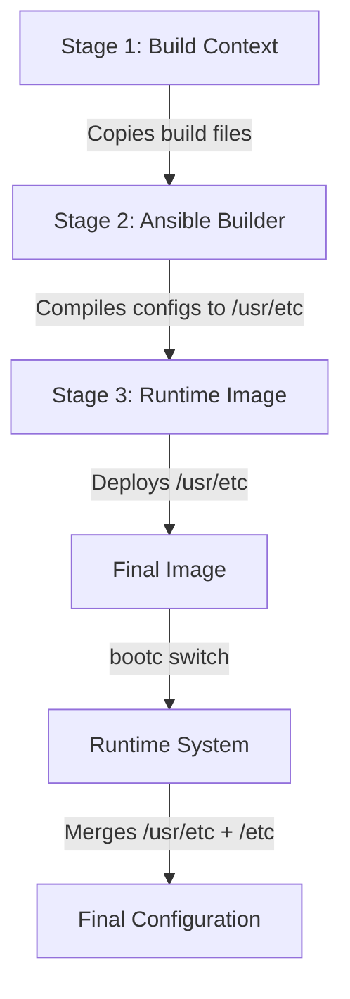

This page explains the **Ansible Role Inversion Pattern** used in the `osbuild` role to compile system configurations at **build time** into `/usr/etc`, enabling immutable infrastructure and atomic upgrades. Unlike traditional Ansible workflows that modify `/etc` on live systems, this approach **bakes configurations into the image itself**, ensuring consistency and reproducibility.

---

## Architectural Overview

The `/usr/etc` directory serves as a **vendor defaults** location for configurations compiled during the build process. This design leverages the **Ansible Role Inversion Pattern**, where Ansible runs **at build time** (inside the `Containerfile` or `image-builder` workflow) rather than post-deployment. The compiled configurations are stored in `/usr/etc` to avoid conflicts with runtime `/etc`, which may contain user-specific overrides.

### Key Concepts
- **Immutable Infrastructure**: Configurations are part of the image, not runtime state.
- **Atomic Upgrades**: `bootc switch` deploys new images with updated configurations atomically.
- **Declarative State**: The image **is** the desired state, eliminating configuration drift.
- **Testable Workflow**: Configurations are validated in CI before image creation.

### Relationship with `/etc`
At runtime, **systemd merges `/usr/etc` (vendor defaults) with `/etc` (local overrides)**. Files in `/etc` take precedence, allowing runtime customization while preserving the immutable vendor configurations in `/usr/etc`.

---

## Build-Time Configuration Workflow

### Multi-Stage Build Process (Bootc)
The `Containerfile.bootc.j2` template defines a **multi-stage build** to compile configurations into `/usr/etc`:

1. **Stage 1 (`ctx`)**:
   - Copies build scripts (`build.sh`, `build.yml`) and templates into the build context.
   - **Purpose**: Isolate build dependencies from the runtime image.

2. **Stage 2 (`ansible-builder`)**:
   - Installs `ansible-core` and runs the `build.yml` playbook.
   - **Compiles configurations into `/usr/etc`** (e.g., `hostname`, `os-release`, `fstab`, kernel command-line snippets).
   - **Purpose**: Generate immutable vendor defaults at build time.

3. **Stage 3 (Runtime Image)**:
   - Copies compiled configurations from `/usr/etc` in the `ansible-builder` stage to `/usr/etc` in the final image.
   - **Purpose**: Embed vendor defaults into the runtime image.



Sources: [templates/Containerfile.bootc.j2](templates/Containerfile.bootc.j2#L1-L128)

---

## Configuration Types Compiled into `/usr/etc`

The following configurations are compiled into `/usr/etc` during the build process:

| **Configuration**               | **Template File**                          | **Purpose**                                                                                     | **Runtime Override Path** |
|--------------------------------|--------------------------------------------|-------------------------------------------------------------------------------------------------|---------------------------|
| Hostname                       | `templates/usr/etc/hostname.j2`             | Sets the system hostname (e.g., `fedora-43-workstation`).                                      | `/etc/hostname`           |
| OS Release                     | `templates/usr/etc/os-release.j2`           | Defines OS metadata (e.g., `NAME="Fedora 43"`).                                                | `/etc/os-release`         |
| Filesystem Table (fstab)       | `templates/usr/etc/fstab.j2`               | Defines filesystem mounts (optional, typically handled by `bootc` disk config).                 | `/etc/fstab`              |
| Kernel Command-Line Snippets   | `templates/usr/etc/kernel/cmdline.d/*.conf.j2` | Adds kernel parameters (e.g., `quiet splash`, NVIDIA-specific flags).                          | `/etc/kernel/cmdline.d/` |
| NVIDIA CDI Systemd Service     | `templates/systemd/nvidia-cdi-refresh.service.j2` | Enables GPU passthrough for containers (copied to `/usr/lib/systemd/system/`).               | `/etc/systemd/system/`   |

Sources:
- [templates/usr/etc/hostname.j2](templates/usr/etc/hostname.j2#L1-L2)
- [templates/usr/etc/os-release.j2](templates/usr/etc/os-release.j2#L1-L24)
- [templates/usr/etc/fstab.j2](templates/usr/etc/fstab.j2#L1-L21)
- [templates/usr/etc/kernel/cmdline.d/custom.conf.j2](templates/usr/etc/kernel/cmdline.d/custom.conf.j2#L1-L5)
- [files/bootc/build.yml](files/bootc/build.yml#L1-L137)

---

## Ansible Role Inversion Pattern

### Traditional vs. Inverted Approach

| **Aspect**               | **Traditional Ansible**                          | **Inverted Ansible (This Role)**               |
|--------------------------|------------------------------------------------|-----------------------------------------------|
| **Execution Time**       | Post-deployment (on live systems)              | Build time (inside `Containerfile` or `image-builder`) |
| **Target Directory**     | `/etc` (runtime configurations)                | `/usr/etc` (vendor defaults)                  |
| **State Management**     | Imperative (applies changes dynamically)       | Declarative (image **is** the desired state)  |
| **Upgrade Mechanism**    | Manual or ad-hoc (e.g., `ansible-playbook`)    | Atomic (`bootc switch`)                       |
| **Drift Prevention**     | Requires periodic reconciliation               | Immutable (no drift)                          |
| **Testing**              | Requires live system                           | Validated in CI before image build            |

### Why `/usr/etc`?
- **Avoids Conflicts**: `/etc` is reserved for runtime configurations. Using `/usr/etc` ensures vendor defaults do not interfere with user customizations.
- **Immutable**: Configurations in `/usr/etc` are part of the image and cannot be modified at runtime (unless explicitly copied to `/etc`).
- **Systemd Compatibility**: Systemd merges `/usr/etc` (vendor) with `/etc` (local) at runtime, allowing overrides while preserving defaults.

Sources: [files/bootc/build.yml](files/bootc/build.yml#L40-L50)

---

## Build-Time Playbook: `files/bootc/build.yml`

The `files/bootc/build.yml` playbook is the **core of the Ansible Role Inversion Pattern**. It runs **inside the `Containerfile`** during the build process and performs the following steps:

1. **Creates `/usr/etc` Directories**:
   - Ensures `/usr/etc`, `/usr/etc/kernel`, and `/usr/etc/kernel/cmdline.d` exist.

2. **Compiles System Configurations**:
   - **Hostname**: Rendered from `hostname.j2` (e.g., `fedora-43-workstation`).
   - **OS Release**: Rendered from `os-release.j2` (e.g., `NAME="Fedora 43"`).
   - **fstab**: Rendered from `fstab.j2` (optional, controlled by `osbuild_include_fstab`).

3. **Compiles Kernel Command-Line Snippets**:
   - Renders snippets from `osbuild_kernel_cmdline_snippets` into `/usr/etc/kernel/cmdline.d/`.
   - Adds NVIDIA-specific parameters (e.g., `rd.driver.blacklist=nouveau`) if the `nvidia` component is enabled.

4. **Compiles Systemd Units**:
   - Templates the `nvidia-cdi-refresh.service` into `/usr/lib/systemd/system/` if the `nvidia` component is enabled.

5. **Verifies Build**:
   - Outputs a summary of compiled configurations (e.g., `/usr/etc/hostname`, `/usr/etc/kernel/cmdline.d/`).

```mermaid
flowchart TD
    A[Start build.yml] --> B[Create /usr/etc directories]
    B --> C[Template hostname to /usr/etc/hostname]
    C --> D[Template os-release to /usr/etc/os-release]
    D --> E[Template fstab to /usr/etc/fstab (if enabled)]
    E --> F[Template kernel cmdline snippets]
    F --> G[Template NVIDIA kernel cmdline (if nvidia component)]
    G --> H[Template systemd units (if nvidia component)]
    H --> I[Verify build-time configurations]
    I --> J[End build.yml]
```

Sources: [files/bootc/build.yml](files/bootc/build.yml#L20-L130)

---

## Integration with OSBuild and Image-Builder

### Traditional ISO Builds
For **traditional ISO builds** (using `image-builder-cli`), the `/usr/etc` pattern is **not directly used** in the same way as `bootc`. However, the **blueprint generation** process (via `tasks/blueprint.yml`) injects configurations into the image using `[customizations.files]` in the TOML blueprint. These files are:
- **First-boot scripts** (e.g., `syncopated-firstboot`).
- **Kickstart files** (e.g., `syncopated.ks`).
- **Systemd units** (e.g., `nvidia-cdi-refresh.service`).

While these files are not staged in `/usr/etc`, the **concept of build-time configuration compilation** remains consistent: configurations are **baked into the image** rather than applied post-deployment.

Sources:
- [tasks/blueprint.yml](tasks/blueprint.yml#L1-L130)
- [templates/blueprint.toml.j2](templates/blueprint.toml.j2#L1-L133)

### Bootc Container Builds
For **bootc container builds**, the `/usr/etc` pattern is **fully realized**:
1. The `Containerfile.bootc.j2` defines a multi-stage build.
2. The `files/bootc/build.yml` playbook compiles configurations into `/usr/etc`.
3. The final image includes `/usr/etc` as **immutable vendor defaults**.

Sources:
- [templates/Containerfile.bootc.j2](templates/Containerfile.bootc.j2#L1-L128)
- [files/bootc/build.yml](files/bootc/build.yml#L1-L137)

---
## Configuration Precedence and Runtime Behavior

### How `/usr/etc` and `/etc` Interact
At runtime, **systemd merges configurations** from the following locations (in order of precedence):
1. `/etc/` (highest precedence, user overrides).
2. `/usr/etc/` (vendor defaults, compiled at build time).
3. `/usr/lib/` (package defaults, lowest precedence).

This allows:
- **Immutable vendor defaults** in `/usr/etc`.
- **User customizations** in `/etc` (overriding `/usr/etc`).
- **Package defaults** in `/usr/lib/` (fallback).

### Example: Hostname Configuration
- **Vendor Default**: `/usr/etc/hostname` (compiled at build time, e.g., `fedora-43-workstation`).
- **User Override**: `/etc/hostname` (if created at runtime, takes precedence).

### Example: Kernel Command-Line
- **Vendor Defaults**: `/usr/etc/kernel/cmdline.d/*.conf` (compiled at build time).
- **User Overrides**: `/etc/kernel/cmdline.d/*.conf` (if created at runtime, takes precedence).

Sources: [files/bootc/build.yml](files/bootc/build.yml#L40-L80)

---
## Benefits of the `/usr/etc` Pattern

| **Benefit**                     | **Description**                                                                                     |
|---------------------------------|-----------------------------------------------------------------------------------------------------|
| **Immutability**                | Configurations are part of the image and cannot be modified at runtime (unless explicitly overridden in `/etc`). |
| **Atomic Upgrades**             | `bootc switch` deploys a new image with updated configurations atomically.                        |
| **Declarative State**           | The image **is** the desired state, eliminating configuration drift.                              |
| **Testable in CI**              | Configurations are validated before the image is built, reducing runtime failures.             |
| **Runtime Customization**      | Users can override vendor defaults by placing files in `/etc`.                                  |
| **Reproducibility**             | Images are built consistently, with configurations compiled from templates.                       |

---
## When to Use `/usr/etc` vs. `/etc`

| **Use Case**                          | **Recommended Location** | **Reason**                                                                                     |
|---------------------------------------|--------------------------|---------------------------------------------------------------------------------------------|
| Vendor defaults (e.g., hostname, fstab) | `/usr/etc`              | Immutable, part of the image.                                                                |
| User customizations                    | `/etc`                  | Overrides vendor defaults at runtime.                                                       |
| Package defaults                       | `/usr/lib/`             | Lowest precedence, managed by RPM packages.                                                 |
| First-boot scripts                     | `/usr/local/bin/`       | Immutable, part of the image (not `/usr/etc` because they are executables, not configurations). |
| Systemd units (vendor)                | `/usr/lib/systemd/system/` | Immutable, part of the image.                                                               |
| Systemd units (user overrides)        | `/etc/systemd/system/` | Overrides vendor units at runtime.                                                          |

---
## Next Steps

To explore how this pattern integrates with other parts of the `osbuild` role, consider the following pages:
- **[Ansible Role Inversion Pattern for Immutable Infrastructure](8-ansible-role-inversion-pattern-for-immutable-infrastructure)**: Learn how the role inverts traditional Ansible workflows to achieve immutability.
- **[Bootc Container Image Build Process and Multi-Stage Containerfile](12-bootc-container-image-build-process-and-multi-stage-containerfile)**: Dive deeper into the `bootc` build process and how `/usr/etc` is used in container images.
- **[Blueprint Generation: Dynamic TOML Templating with Jinja2](13-blueprint-generation-dynamic-toml-templating-with-jinja2)**: Understand how configurations are injected into blueprints for traditional ISO builds.
- **[First-Boot Automation with Embedded Ansible Playbooks](17-first-boot-automation-with-embedded-ansible-playbooks)**: See how first-boot scripts interact with `/usr/etc` configurations.