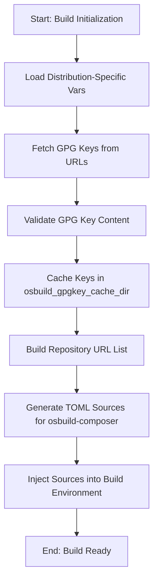

This page explains how the **osbuild** role manages package repositories and their associated GPG keys for secure image builds. It covers the architectural patterns, configuration strategies, and runtime behaviors that ensure repository metadata and cryptographic signatures are correctly integrated into the build process.

This documentation is **not** about:
- Defining custom packages or blueprints ([Understanding Blueprints: Definition and Customization](6-understanding-blueprints-definition-and-customization))
- Kickstart automation ([Kickstart Files: Automation and Configuration](7-kickstart-files-automation-and-configuration))
- Build mode selection ([Build Modes: Selecting and Configuring for Your Use Case](8-build-modes-selecting-and-configuring-for-your-use-case))

---

## Core Concepts

### Repository Sources and GPG Keys
The **osbuild** role uses a **declarative repository model** to define package sources for image builds. Each repository is defined as a dictionary entry in distribution-specific variable files (e.g., `vars/Fedora.yml`, `vars/AlmaLinux.yml`). These definitions include:

- **Repository URLs**: Metalinks or base URLs for package metadata and RPMs.
- **GPG Key URLs**: Locations of the public keys used to verify package signatures.
- **Validation Flags**: Controls for SSL and GPG verification (`check_gpg`, `check_ssl`).

The role **fetches and validates GPG keys at runtime** using Ansible’s `get_url` module, ensuring that keys are available before the build process begins. Keys are stored in a cache directory (`osbuild_gpgkey_cache_dir`) and injected into the build environment as PEM-encoded strings.

Sources:
- [vars/Fedora.yml](vars/Fedora.yml#L1-L79)
- [vars/AlmaLinux.yml](vars/AlmaLinux.yml#L1-L68)
- [vars/Rocky.yml](vars/Rocky.yml#L1-L90)
- [tasks/repo_keys.yml](tasks/repo_keys.yml#L1-L116)

---

## Architectural Overview

### Repository and GPG Key Workflow
The following Mermaid diagram illustrates the workflow for managing repositories and GPG keys:



Key stages:
1. **Load Vars**: Distribution-specific repository definitions are loaded from `vars/<Distro>.yml`.
2. **Fetch GPG Keys**: Keys are fetched from `gpgkey_url` (local `file://` or remote `https://`).
3. **Validate Keys**: Keys are checked for PGP markers (`-----BEGIN/END PGP PUBLIC KEY BLOCK-----`).
4. **Cache Keys**: Valid keys are stored in `osbuild_gpgkey_cache_dir` for reuse.
5. **Build URL List**: Repository URLs are aggregated into `osbuild_extra_repo_urls`.
6. **Generate TOML**: Repository definitions are converted into TOML files for `osbuild-composer`.
7. **Inject Sources**: TOML files are placed in the build environment for use by `osbuild-composer`.

Sources:
- [tasks/repo_keys.yml](tasks/repo_keys.yml#L1-L116)
- [tasks/sources.yml](tasks/sources.yml#L1-L33)

---

## Repository Configuration

### Distribution-Specific Definitions
Repositories are defined in YAML files under `vars/` for each supported distribution. The structure of these definitions is consistent across distributions, with variations in URLs and GPG keys.

#### Example: Fedora Repository Definitions
```yaml
repo:
  fedora:
    metalink: "https://mirrors.fedoraproject.org/metalink?repo=fedora-43&arch=x86_64"
    gpgkey_url: "file:///usr/share/distribution-gpg-keys/fedora/RPM-GPG-KEY-fedora-43-primary"
    check_gpg: true
  updates:
    metalink: "https://mirrors.fedoraproject.org/metalink?repo=updates-released-f43&arch=x86_64"
    gpgkey_url: "file:///usr/share/distribution-gpg-keys/fedora/RPM-GPG-KEY-fedora-43-primary"
    check_gpg: true
```

#### Example: AlmaLinux Repository Definitions
```yaml
repo:
  almalinux-baseos:
    metalink: "https://mirrors.almalinux.org/metalink?repo=baseos-{{ _distro_version }}&arch={{ osbuild_arch }}"
    gpgkey_url: "file:///usr/share/distribution-gpg-keys/alma/RPM-GPG-KEY-AlmaLinux-{{ _distro_major_version }}"
    check_gpg: true
  almalinux-appstream:
    metalink: "https://mirrors.almalinux.org/metalink?repo=appstream-{{ _distro_version }}&arch={{ osbuild_arch }}"
    gpgkey_url: "file:///usr/share/distribution-gpg-keys/alma/RPM-GPG-KEY-AlmaLinux-{{ _distro_major_version }}"
    check_gpg: true
```

#### Example: Rocky Linux Repository Definitions
```yaml
repo:
  rocky-baseos:
    baseurl: "https://dl.rockylinux.org/pub/rocky/{{ _distro_major_version }}/BaseOS/{{ osbuild_arch }}/os/"
    gpgkey_url: "file:///usr/share/distribution-gpg-keys/rocky/RPM-GPG-KEY-Rocky-{{ _distro_major_version }}"
    check_gpg: true
  rocky-appstream:
    baseurl: "https://dl.rockylinux.org/pub/rocky/{{ _distro_major_version }}/AppStream/{{ osbuild_arch }}/os/"
    gpgkey_url: "file:///usr/share/distribution-gpg-keys/rocky/RPM-GPG-KEY-Rocky-{{ _distro_major_version }}"
    check_gpg: true
```

Sources:
- [vars/Fedora.yml](vars/Fedora.yml#L1-L79)
- [vars/AlmaLinux.yml](vars/AlmaLinux.yml#L1-L68)
- [vars/Rocky.yml](vars/Rocky.yml#L1-L90)

---

## GPG Key Management

### Key Fetching and Validation
GPG keys are fetched and validated by the `repo_keys.yml` task file. The process includes:

1. **Install `distribution-gpg-keys`**: Ensures bundled keys are available locally.
2. **Verify Local Keys**: Checks for the existence of local `file://` keys before fetching.
3. **Fetch Remote Keys**: Downloads keys from `https://` URLs if not already cached.
4. **Validate Content**: Ensures keys contain valid PGP markers.
5. **Cache Keys**: Stores keys in `osbuild_gpgkey_cache_dir` for reuse.

#### Key Fetching Task (Excerpt)
```yaml
- name: Fetch gpgkey for each repository
  ansible.builtin.get_url:
    url: "{{ item.value.gpgkey_url }}"
    dest: "{{ osbuild_gpgkey_cache_dir }}/{{ item.key }}.gpg"
    mode: "0644"
    timeout: 30
    validate_certs: true
  loop: "{{ repo | dict2items }}"
  when:
    - item.value.gpgkey_url is defined
    - item.value.gpgkey_url | length > 0
    - item.value.check_gpg | default(true)
```

#### Key Validation Task (Excerpt)
```yaml
- name: Assert gpgkey contains valid PGP markers
  ansible.builtin.assert:
    that:
      - item is not failed
      - item is not skipped
      - item.content is defined
      - (item.content | b64decode) is search('-----BEGIN PGP PUBLIC KEY BLOCK-----')
      - (item.content | b64decode) is search('-----END PGP PUBLIC KEY BLOCK-----')
    fail_msg: "Fetched gpgkey for '{{ item.item.key }}' is malformed or missing PGP markers"
  loop: "{{ gpgkey_content.results }}"
```

Sources:
- [tasks/repo_keys.yml](tasks/repo_keys.yml#L1-L116)

---

## TOML Source Generation

### Repository Sources for `osbuild-composer`
The role generates TOML files for each repository, which are used by `osbuild-composer` to fetch package metadata during the build. These files are stored in `files/<distro>/<version>/<arch>/sources/` and include:

- **Repository ID**: Unique identifier for the repository.
- **Name**: Human-readable name.
- **Type**: `yum-metalink` or `yum-baseurl`.
- **URL**: Metalink or base URL for the repository.
- **GPG Key URLs**: List of URLs for GPG keys.
- **Validation Flags**: `check_gpg` and `check_ssl`.

#### Example: AlmaLinux BaseOS TOML
```toml
id = "almalinux-baseos"
name = "AlmaLinux 10 - BaseOS"
type = "yum-metalink"
url = "https://mirrors.almalinux.org/metalink?repo=baseos-10&arch=x86_64"
check_gpg = true
check_ssl = true
gpgkey_urls = ["file:///usr/share/distribution-gpg-keys/alma/RPM-GPG-KEY-AlmaLinux-10"]
```

#### Example: Rocky Linux BaseOS TOML
```toml
id = "rocky-baseos"
name = "Rocky Linux 9 - BaseOS"
type = "yum-baseurl"
url = "https://dl.rockylinux.org/pub/rocky/9/BaseOS/x86_64/os/"
check_gpg = true
check_ssl = true
gpgkey_urls = ["file:///usr/share/distribution-gpg-keys/rocky/RPM-GPG-KEY-Rocky-9"]
```

Sources:
- [files/almalinux/10/x86_64/sources/almalinux-baseos.toml](files/almalinux/10/x86_64/sources/almalinux-baseos.toml#L1-L8)
- [files/rocky/9/x86_64/sources/rocky-baseos.toml](files/rocky/9/x86_64/sources/rocky-baseos.toml#L1-L9)

---

## Runtime Behavior

### Repository URL Aggregation
The `sources.yml` task file aggregates repository URLs into the `osbuild_extra_repo_urls` list, which is used by the build process. This list is built by iterating over the `repo` dictionary and extracting metalink or baseurl values.

#### Aggregation Task (Excerpt)
```yaml
- name: Build extra repository URLs from component sources
  ansible.builtin.set_fact:
    osbuild_extra_repo_urls: >-
      
      
      
      
      
      
      
      
      
      
      {{ ns.urls | unique | list }}
```

Sources:
- [tasks/sources.yml](tasks/sources.yml#L1-L33)

---

## Customization and Overrides

### Overriding Repository Definitions
Repository definitions can be customized by overriding the `repo` dictionary in your playbook or inventory. For example:

```yaml
# Override the Fedora updates repository URL
repo:
  updates:
    metalink: "https://custom-mirror.example.com/metalink?repo=updates-released-f43&arch=x86_64"
    gpgkey_url: "file:///path/to/custom/RPM-GPG-KEY-fedora-43-primary"
    check_gpg: true
```

### Disabling GPG Checks
To disable GPG checks for a repository (not recommended for production), set `check_gpg: false`:

```yaml
repo:
  custom-repo:
    baseurl: "https://custom-repo.example.com/packages/"
    check_gpg: false
```

Sources:
- [vars/Fedora.yml](vars/Fedora.yml#L1-L79)
- [vars/AlmaLinux.yml](vars/AlmaLinux.yml#L1-L68)

---

## Best Practices

### Security Considerations
1. **Always Use HTTPS**: Ensure repository and GPG key URLs use HTTPS to prevent man-in-the-middle attacks.
2. **Validate GPG Keys**: Always set `check_gpg: true` for production builds.
3. **Use Metalinks**: Prefer metalinks for redundancy and failover.
4. **Cache Keys Locally**: Use `file://` URLs for GPG keys bundled in `distribution-gpg-keys` to avoid network dependencies.

### Performance Considerations
1. **Parallel Fetching**: The `repo_keys.yml` task uses Ansible’s parallel execution to fetch GPG keys concurrently.
2. **Caching**: Keys are cached in `osbuild_gpgkey_cache_dir` to avoid redundant downloads.
3. **Idempotency**: The `get_url` module skips downloads if the cached file already exists.

Sources:
- [tasks/repo_keys.yml](tasks/repo_keys.yml#L1-L116)

---

## Next Steps

1. **Customize Repositories**: Override repository definitions for your use case. See [Integrating Custom Packages and Repositories](25-integrating-custom-packages-and-repositories) for advanced customization.
2. **Validate Builds**: Use the testing framework to verify repository and GPG key integration. See [Testing Framework: BATS and Python Tests](20-testing-framework-bats-and-python-tests).
3. **Explore Blueprints**: Define custom packages and configurations. See [Understanding Blueprints: Definition and Customization](6-understanding-blueprints-definition-and-customization).