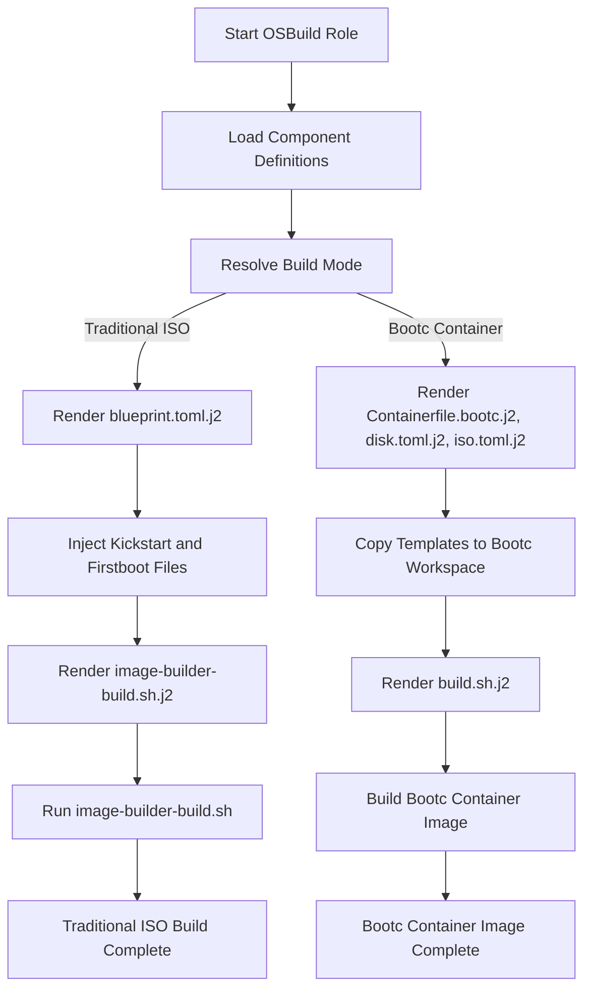

This document provides an **architectural deep dive** into the **template system** used by the OSBuild role. It explains the **purpose**, **structure**, and **customization patterns** of the Jinja2 templates that drive the dynamic generation of blueprints, configuration files, and build scripts for both **traditional ISO** and **bootc container image** builds.

This is **not** a tutorial on how to use the role or a conceptual overview of image building. Instead, it is a **precision-focused explanation** of the template system's design, intended for **advanced developers** who need to **extend**, **modify**, or **debug** the template logic.

---

## 1. Template System Overview

The OSBuild role uses **Jinja2 templates** to generate **dynamic configuration files** for image building. These templates are processed by Ansible and injected into the build process at **multiple stages**:

- **Blueprint generation** (`blueprint.toml.j2`)
- **Kickstart injection** (`kickstart.toml.j2`)
- **Disk and ISO configuration** (`disk.toml.j2`, `iso.toml.j2`)
- **Bootc container image builds** (`Containerfile.bootc.j2`, `build.sh.j2`)
- **Firstboot file injection** (`firstboot-files.toml.j2`)
- **NVIDIA CDI and systemd service templates** (`snippets/nvidia-cdi.sh.j2`, `systemd/nvidia-cdi-refresh.service.j2`)

### 1.1. Architectural Pattern: **Component-Driven Templating**

The template system is **component-driven**. Each selected component (e.g., `gnome`, `nvidia`, `development`) contributes:
- Packages
- Services
- Kernel arguments
- Files
- Repository sources
- Flatpaks

These contributions are **aggregated** in the templates using **Jinja2 loops and conditionals**, ensuring that the generated configuration is **minimal**, **correct**, and **traceable** to the selected components.

**Sources**:
- [defaults/main.yml](defaults/main.yml#L155-L180) (Component selection)
- [defaults/main.yml](defaults/main.yml#L182-L200) (Component definitions schema)
- [templates/blueprint.toml.j2](templates/blueprint.toml.j2#L15-L36) (Component-driven package aggregation)

---

## 2. Template File Structure

The `templates` directory is organized into **three logical layers**:

| Layer | Purpose | Key Files |
|-------|---------|-----------|
| **Core** | Blueprints, kickstart, and build scripts | `blueprint.toml.j2`, `kickstart.toml.j2`, `build.sh.j2`, `image-builder-build.sh.j2` |
| **Bootc** | Container image build configuration | `Containerfile.bootc.j2`, `disk.toml.j2`, `iso.toml.j2` |
| **Injection** | Firstboot, NVIDIA, and systemd templates | `firstboot-files.toml.j2`, `snippets/nvidia-cdi.sh.j2`, `systemd/nvidia-cdi-refresh.service.j2` |

**Sources**:
- [templates/](templates/#L1-L20) (Directory structure)

---

## 3. Core Templates: Blueprint and Kickstart

### 3.1. `blueprint.toml.j2`: The Dynamic Blueprint

This template generates the **TOML blueprint** for `image-builder` or `bootc-image-builder`. It is the **central configuration file** for the image build, defining:

- **Metadata** (name, version, description, distro)
- **Package groups** (DNF groups from components)
- **Packages** (aggregated from components)
- **Kernel arguments** (aggregated from components)
- **Services** (aggregated from components)
- **Timezone and locale** (from variables)
- **Installer customizations** (Anaconda modules)
- **File injections** (from components and firstboot)

#### 3.1.1. Key Jinja2 Patterns

| Pattern | Purpose | Example |
|---------|---------|---------|
| **Component loops** | Aggregate packages, services, and files from components | `` ([blueprint.toml.j2#L15](templates/blueprint.toml.j2#L15)) |
| **Namespace variables** | Accumulate kernel arguments and services | `` ([blueprint.toml.j2#L48](templates/blueprint.toml.j2#L48)) |
| **Conditional blocks** | Include NVIDIA CDI only if `nvidia` is a component | `` ([blueprint.toml.j2#L117](templates/blueprint.toml.j2#L117)) |
| **File inclusion** | Embed external files (e.g., NVIDIA script) | `` ([blueprint.toml.j2#L126](templates/blueprint.toml.j2#L126)) |

**Sources**:
- [templates/blueprint.toml.j2](templates/blueprint.toml.j2#L1-L133) (Full template)

---

### 3.2. `kickstart.toml.j2`: Kickstart Injection

This template **injects a kickstart file** into the blueprint under `[customizations.installer.kickstart]`. The kickstart file is **read from `files/kickstart/`** and embedded as a **TOML literal string**.

#### 3.2.1. Key Features

- **Dynamic variable injection**: The kickstart file can reference variables like `osbuild_locale`, `osbuild_keyboard`, and `osbuild_timezone`.
- **Partitioning mode support**: If `osbuild_kickstart_partitioning == 'auto'`, a `%pre` script is injected to generate disk layout variables.
- **TOML-safe embedding**: The template ensures the kickstart file does not contain `'''` to avoid breaking the TOML literal string.

**Sources**:
- [templates/kickstart.toml.j2](templates/kickstart.toml.j2#L1-L27) (Full template)
- [tasks/blueprint.yml#L58-L117](tasks/blueprint.yml#L58-L117) (Kickstart injection logic)

---

## 4. Bootc Templates: Container Image Builds

When `osbuild_build_bootc: true`, the role generates a **bootc container image** instead of a traditional ISO. This requires **additional templates** to configure the container build process.

### 4.1. `Containerfile.bootc.j2`: The Bootc Containerfile

This template generates a **multi-stage `Containerfile`** for building a bootc container image. It uses the **Ansible Role Inversion Pattern**, where Ansible runs **at build time** to compile configurations into `/usr/etc` (immutable vendor defaults).

#### 4.1.1. Multi-Stage Build Structure

| Stage | Purpose | Key Features |
|-------|---------|--------------|
| **ctx** | Build context | Copies build scripts and Ansible playbooks |
| **ansible-builder** | Ansible build environment | Installs `ansible-core` and runs `build.yml` to compile configurations |
| **Main runtime image** | Final bootc image | Copies compiled configurations from `ansible-builder` and runs `build.sh` |

#### 4.1.2. Key Jinja2 Patterns

| Pattern | Purpose | Example |
|---------|---------|---------|
| **Multi-stage COPY** | Copy files between stages | `COPY --from=ansible-builder /usr/etc /usr/etc` ([Containerfile.bootc.j2#L50](templates/Containerfile.bootc.j2#L50)) |
| **Dynamic component filtering** | Filter components for bootc builds | `` ([Containerfile.bootc.j2#L33](templates/Containerfile.bootc.j2#L33)) |
| **Conditional NVIDIA setup** | Include NVIDIA CDI only if `nvidia` is a component | `` ([Containerfile.bootc.j2#L85](templates/Containerfile.bootc.j2#L85)) |

**Sources**:
- [templates/Containerfile.bootc.j2](templates/Containerfile.bootc.j2#L1-L128) (Full template)

---

### 4.2. `disk.toml.j2` and `iso.toml.j2`: Bootc Image Configuration

These templates configure the **disk layout** and **ISO installer** for bootc images, respectively. They are copied into `/usr/lib/image-builder/bootc/` during the container build.

#### 4.2.1. `disk.toml.j2`

- Defines **filesystem customizations** (e.g., `/` and `/home` mountpoints).
- Uses variables like `osbuild_bootc_root_size` and `osbuild_bootc_home_size`.

**Sources**:
- [templates/disk.toml.j2](templates/disk.toml.j2#L1-L27) (Full template)

#### 4.2.2. `iso.toml.j2`

- Configures the **Anaconda installer** for bootc ISO builds.
- Enables/disables Anaconda modules (e.g., `org.fedoraproject.Anaconda.Modules.Users`).

**Sources**:
- [templates/iso.toml.j2](templates/iso.toml.j2#L1-L32) (Full template)

---

## 5. Injection Templates: Firstboot and NVIDIA

### 5.1. `firstboot-files.toml.j2`: Firstboot File Injection

This template injects **firstboot files** (e.g., scripts, desktop entries) into the blueprint. The files are read from `files/firstboot/` and embedded as **TOML literal strings**.

#### 5.1.1. Key Features

- **File metadata**: Each file has a `path`, `mode`, and `data` field.
- **TOML-safe embedding**: The template ensures files do not contain `'''` to avoid breaking the TOML literal string.

**Sources**:
- [templates/firstboot-files.toml.j2](templates/firstboot-files.toml.j2#L1-L11) (Full template)
- [tasks/blueprint.yml#L32-L52](tasks/blueprint.yml#L32-L52) (Firstboot injection logic)

---

### 5.2. NVIDIA CDI Templates

The `nvidia` component requires **two templates** for **Container Device Interface (CDI)** support, enabling **GPU passthrough** in Podman containers.

#### 5.2.1. `snippets/nvidia-cdi.sh.j2`

- A **Bash script** that generates the NVIDIA CDI specification (`/etc/cdi/nvidia.yaml`).
- Waits for NVIDIA device nodes (`/dev/nvidia0`) to appear before generating the CDI configuration.

**Sources**:
- [templates/snippets/nvidia-cdi.sh.j2](templates/snippets/nvidia-cdi.sh.j2#L1-L29) (Full template)

#### 5.2.2. `systemd/nvidia-cdi-refresh.service.j2`

- A **systemd service** that runs the NVIDIA CDI generation script at boot.
- Enabled in the `Containerfile` if `nvidia` is a component.

**Sources**:
- [templates/systemd/nvidia-cdi-refresh.service.j2](templates/systemd/nvidia-cdi-refresh.service.j2#L1-L18) (Full template)

---

## 6. Build Script Templates

### 6.1. `build.sh.j2`: Bootc Build Script

This template generates a **Bash script** (`build.sh`) that runs **inside the bootc container** during the build process. It handles:

- **Repository bootstrap**: Installs third-party repositories (e.g., RPMFusion, CUDA).
- **Package installation**: Installs packages from selected components.
- **Flatpak installation**: Installs Flatpaks from selected components.
- **User configuration**: Creates users, sets passwords, and configures SSH keys.
- **Service management**: Enables systemd services from selected components.

#### 6.1.1. Key Jinja2 Patterns

| Pattern | Purpose | Example |
|---------|---------|---------|
| **Component filtering** | Skip `blueprint_only` components | `` ([build.sh.j2#L69](templates/build.sh.j2#L69)) |
| **Repository setup** | Add COPR and DNF repositories | `` ([build.sh.j2#L37](templates/build.sh.j2#L37)) |
| **Flatpak aggregation** | Aggregate Flatpaks from components | `` ([build.sh.j2#L96](templates/build.sh.j2#L96)) |

**Sources**:
- [templates/build.sh.j2](templates/build.sh.j2#L1-L218) (Full template)

---

### 6.2. `image-builder-build.sh.j2`: Traditional ISO Build Script

This template generates a **Bash script** (`build-<blueprint>.sh`) for **traditional ISO builds** when `osbuild_only_generate: true`. It runs `image-builder` with the generated blueprint and copies the output image to `osbuild_output_filename`.

#### 6.2.1. Key Features

- **Extra repository support**: Passes `osbuild_extra_repo_urls` to `image-builder`.
- **Image discovery**: Finds the newest image file (`.iso`, `.qcow2`, `.img`) after the build.
- **Container image handling**: Loads container images into Podman if `osbuild_image_type` is `container` or `container-minimal`.

**Sources**:
- [templates/image-builder-build.sh.j2](templates/image-builder-build.sh.j2#L1-L40) (Full template)
- [tasks/main.yml#L150-L155](tasks/main.yml#L150-L155) (Template usage)

---

## 7. Template Customization Patterns

### 7.1. Adding a New Component

To add a new component (e.g., `kubernetes`), follow this pattern:

1. **Define the component in `defaults/main.yml`**:
   ```yaml
   osbuild_component_defs:
     kubernetes:
       label: "Kubernetes Tools"
       packages: ["kubectl", "kubeadm", "kubelet"]
       services: ["kubelet"]
       kernel_args: ["cgroup_enable=memory", "swapaccount=1"]
       sources: ["https://pkgs.k8s.io/core:/stable:/v1.28/rpm/"]
       size_impact: "medium"
       build_time_impact: "medium"
   ```
   **Sources**: [defaults/main.yml#L182-L200](defaults/main.yml#L182-L200)

2. **Update the component selection**:
   ```yaml
   osbuild_components:
     - base
     - gnome
     - kubernetes
   ```
   **Sources**: [defaults/main.yml#L172-L180](defaults/main.yml#L172-L180)

3. **No template changes required**: The existing templates (`blueprint.toml.j2`, `build.sh.j2`) will automatically aggregate the new component's contributions.

---

### 7.2. Overriding Template Variables

Template variables are **defined in `defaults/main.yml`** and can be overridden in **playbooks** or **inventory**. For example:

```yaml
# playbook.yml
- hosts: build_host
  vars:
    osbuild_blueprint_name: "custom-k8s-workstation"
    osbuild_components:
      - base
      - gnome
      - kubernetes
      - nvidia
    osbuild_bootc_root_size: "30 GiB"
  roles:
    - osbuild
```

**Sources**:
- [defaults/main.yml#L23-L33](defaults/main.yml#L23-L33) (Blueprint metadata variables)
- [defaults/main.yml#L172-L180](defaults/main.yml#L172-L180) (Component selection)

---

### 7.3. Adding a Custom Template

To add a **custom template** (e.g., for a new systemd service):

1. **Create the template** in `templates/`:
   ```jinja2
   # templates/systemd/custom-service.service.j2
   [Unit]
   Description=Custom Service
   After=network.target

   [Service]
   ExecStart=/usr/local/bin/custom-service.sh
   Restart=always

   [Install]
   WantedBy=multi-user.target
   ```

2. **Reference the template in a component**:
   ```yaml
   osbuild_component_defs:
     custom:
       label: "Custom Service"
       files:
         - path: "/usr/lib/systemd/system/custom-service.service"
           content: "{{ lookup('ansible.builtin.template', 'systemd/custom-service.service.j2') }}"
       services: ["custom-service"]
   ```

3. **Inject the file in `blueprint.toml.j2`**:
   ```jinja2
   
   [[customizations.files]]
   path = "{{ f.path }}"
   data = '''
   {{ f.content }}'''
   
   ```
   **Sources**: [templates/blueprint.toml.j2#L104-L115](templates/blueprint.toml.j2#L104-L115)

---

## 8. Template Rendering Workflow

The template rendering workflow is **orchestrated by Ansible tasks** in the OSBuild role. Below is a **Mermaid diagram** of the workflow:



**Sources**:
- [tasks/main.yml](tasks/main.yml#L68-L200) (Build mode resolution)
- [tasks/blueprint.yml](tasks/blueprint.yml#L5-L156) (Blueprint rendering and injection)
- [tasks/bootc.yml](tasks/bootc.yml#L1-L50) (Bootc template rendering)

---

## 9. Best Practices for Template Customization

### 9.1. TOML Literal Strings

- **Avoid `'''` in embedded files**: TOML literal strings (`'''...'''`) cannot contain `'''`. Use `ansible.builtin.assert` to validate files before embedding.
  **Sources**: [tasks/blueprint.yml#L38-L42](tasks/blueprint.yml#L38-L42)

### 9.2. Component Design

- **Minimize `blueprint_only` components**: Components marked as `blueprint_only: true` are **skipped** in bootc builds. Use this sparingly.
  **Sources**: [templates/build.sh.j2#L69](templates/build.sh.j2#L69)

### 9.3. Variable Naming

- **Prefix variables with `osbuild_`**: This avoids conflicts with other roles or playbooks.
  **Sources**: [defaults/main.yml#L9-L17](defaults/main.yml#L9-L17)

### 9.4. Idempotency

- **Use `unique` filters**: When aggregating lists (e.g., packages, services), use the `unique` filter to avoid duplicates.
  **Sources**: [templates/blueprint.toml.j2#L73](templates/blueprint.toml.j2#L73)

### 9.5. Debugging Templates

- **Use `ansible.builtin.debug`**: Print variable values during template rendering to debug issues.
  ```jinja2
  {{ ansible.builtin.debug(msg="Components: " ~ osbuild_components) }}
  ```
- **Validate TOML syntax**: Use the optional TOML validation task in `blueprint.yml`.
  **Sources**: [tasks/blueprint.yml#L139-L156](tasks/blueprint.yml#L139-L156)

---

## 10. Next Steps

Now that you understand the **template system's structure and customization patterns**, consider exploring the following pages in the catalog:

- **[Understanding Blueprints: Definition and Customization](6-understanding-blueprints-definition-and-customization)**: Learn how blueprints define the content and configuration of your images.
- **[Build Modes: Selecting and Configuring for Your Use Case](8-build-modes-selecting-and-configuring-for-your-use-case)**: Understand the differences between traditional ISO and bootc container builds.
- **[Firstboot Scripts: Injection and Execution](12-firstboot-scripts-injection-and-execution)**: Dive deeper into how firstboot scripts are injected and executed.
- **[Integrating Custom Packages and Repositories](25-integrating-custom-packages-and-repositories)**: Learn how to add custom packages and repositories to your builds.

**Sources**:
- [Catalog Navigation Context](#navigation-context) (Full catalog)