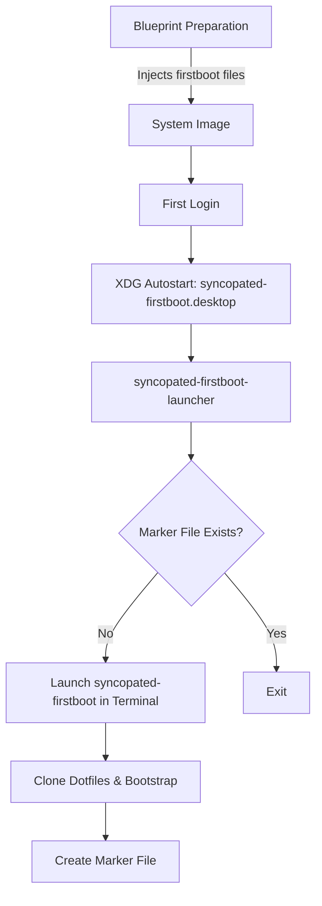

This document explains the **firstboot scripts** mechanism in the OSBuild role, focusing on how scripts are injected into system images and executed during the first login. The system is designed to provide a seamless post-installation setup experience, including dotfiles cloning, package bootstrapping, and user environment configuration.

---

## 1. Architectural Overview
The firstboot system consists of three core components:

1. **`syncopated-firstboot`**: The primary script executed during the first login. It clones a dotfiles repository using `yadm` and runs `yadm bootstrap` to configure the user's environment.
2. **`syncopated-firstboot-launcher`**: An XDG autostart entry point that launches `syncopated-firstboot` in a terminal emulator unless a per-user marker file exists.
3. **`syncopated-firstboot.desktop`**: An XDG autostart desktop entry that triggers the launcher.

These components are injected into the system image during the blueprint preparation phase, ensuring they are available at `/usr/local/bin` and `/etc/xdg/autostart` in the target image.

### Key Workflow


**Sources**:
- [syncopated-firstboot](files/firstboot/syncopated-firstboot#L1-L10)
- [syncopated-firstboot-launcher](files/firstboot/syncopated-firstboot-launcher#L1-L5)
- [syncopated-firstboot.desktop](files/firstboot/syncopated-firstboot.desktop#L1-L10)
- [firstboot-files.toml.j2](templates/firstboot-files.toml.j2#L1-L11)

---

## 2. Firstboot Scripts: Implementation Details
### 2.1 `syncopated-firstboot`
This script is the core of the firstboot experience. It performs the following actions:
1. **Terminal Animation**: Displays a typewriter-style logo and system information using `gum` (if available) or fallback ASCII output.
2. **User Environment Setup**: Clones a dotfiles repository using `yadm` and runs `yadm bootstrap` to configure the user's environment.
3. **Marker File Creation**: Creates a marker file at `$XDG_STATE_HOME/syncopated/firstboot.done` to prevent re-execution.
4. **Tool Validation**: Checks for the presence of required tools (e.g., `git`, `yadm`, `ansible`, `podman`).

#### Key Features
- **Override Support**: Environment variables (e.g., `SYNCOPATED_YADM_URL`, `SYNCOPATED_DOTFILES_URL`) allow customization of the dotfiles repository and `yadm` binary location.
- **Terminal Emulator Agnostic**: Uses `gum` for styling if available, with fallback to basic ASCII output.
- **Idempotency**: Skips execution if the marker file exists.

**Sources**:
- [syncopated-firstboot](files/firstboot/syncopated-firstboot#L11-L50)
- [syncopated-firstboot](files/firstboot/syncopated-firstboot#L100-L150)

---

### 2.2 `syncopated-firstboot-launcher`
This script acts as a gatekeeper for `syncopated-firstboot`. It:
1. **Checks for Marker File**: Exits if the marker file exists, ensuring the firstboot script runs only once per user.
2. **Launches Terminal Emulator**: Opens a terminal emulator (e.g., `gnome-terminal`, `kitty`, `alacritty`) and executes `syncopated-firstboot`.
3. **Fallback Handling**: Provides a manual execution message if no supported terminal emulator is found.

#### Supported Terminal Emulators
| Emulator          | Launch Command                                                                 |
|-------------------|-------------------------------------------------------------------------------|
| `xdg-terminal-exec` | `xdg-terminal-exec bash -c "$cmd"`                                           |
| `ptyxis`          | `ptyxis --new-window -- bash -c "$cmd"`                                      |
| `gnome-terminal`  | `gnome-terminal -- bash -c "$cmd"`                                           |
| `kitty`           | `kitty --start-as fullscreen bash -c "$cmd"`                                 |
| `alacritty`       | `alacritty -e bash -c "$cmd"`                                                |
| `xterm`           | `xterm -e bash -c "$cmd"`                                                    |

**Sources**:
- [syncopated-firstboot-launcher](files/firstboot/syncopated-firstboot-launcher#L10-L30)

---

### 2.3 `syncopated-firstboot.desktop`
This XDG autostart desktop entry ensures the launcher is triggered during the first login. Key properties:
- **`X-GNOME-Autostart-enabled=true`**: Enables autostart for GNOME-based environments.
- **`X-GNOME-Autostart-Delay=5`**: Delays execution by 5 seconds to allow the desktop environment to stabilize.
- **`NoDisplay=true`**: Hides the entry from the application menu.

**Sources**:
- [syncopated-firstboot.desktop](files/firstboot/syncopated-firstboot.desktop#L1-L10)

---

## 3. Injection Mechanism
Firstboot scripts are injected into the system image during the **blueprint preparation phase** using the `firstboot-files.toml.j2` template. This template:
1. Iterates over a predefined list of firstboot files (`_osbuild_firstboot_files`).
2. Injects each file into the blueprint as a `[[customizations.files]]` entry with:
   - **`path`**: Target location in the system image (e.g., `/usr/local/bin/syncopated-firstboot`).
   - **`mode`**: File permissions (e.g., `0755` for executables).
   - **`data`**: The file's content, read directly from the source.

### Example Injection Entry
```toml
[[customizations.files]]
path = "/usr/local/bin/syncopated-firstboot"
mode = "0755"
data = '''
#!/usr/bin/env bash
# syncopated-firstboot: first-login splash...
'''
```

**Sources**:
- [firstboot-files.toml.j2](templates/firstboot-files.toml.j2#L1-L11)
- [blueprint.yml](tasks/blueprint.yml) (Referenced in `main.yml`)

---

## 4. Validation and Testing
The OSBuild role includes a **validation playbook** (`validate_firstboot_injection.yml`) and a **Python script** (`check_injection.py`) to ensure firstboot scripts are correctly injected into blueprints.

### Validation Workflow
1. **Blueprint Preparation**: Generates blueprints for all static workstation configurations and a templated blueprint.
2. **TOML Parsing**: Uses `tomllib` to parse blueprints and verify the presence of firstboot files.
3. **Byte-Level Comparison**: Ensures the injected file content matches the source files exactly.
4. **Idempotency Check**: Verifies that re-running the blueprint preparation does not duplicate firstboot entries.

### Key Validation Rules
| Rule                          | Description                                                                 |
|-------------------------------|-----------------------------------------------------------------------------|
| **File Presence**             | Each firstboot file must appear exactly once in the blueprint.             |
| **Content Integrity**         | Injected content must match the source files byte-for-byte.                |
| **No Legacy Entries**         | Blueprints must not contain legacy `custom-first-boot` entries.             |
| **TOML Validity**             | Blueprints must be valid TOML documents.                                   |

**Sources**:
- [validate_firstboot_injection.yml](tests/validate_firstboot_injection.yml#L1-L83)
- [check_injection.py](tests/firstboot/check_injection.py#L1-L47)

---

## 5. Customization and Overrides
The firstboot system supports customization through **environment variables** and **Ansible variables**:

### Environment Variables (for `syncopated-firstboot`)
| Variable                     | Default Value                                      | Description                                  |
|------------------------------|----------------------------------------------------|----------------------------------------------|
| `SYNCOPATED_YADM_URL`        | `https://github.com/yadm-dev/yadm/raw/master/yadm` | URL to the `yadm` binary.                    |
| `SYNCOPATED_DOTFILES_URL`    | `https://github.com/b08x/dots.git`                 | URL to the dotfiles repository.              |
| `SYNCOPATED_CHECK_TOOLS`     | `git yadm gum ansible podman zsh flatpak nvidia-smi` | Space-separated list of tools to validate.   |
| `SYNCOPATED_NO_ANIM`         | `0`                                                | Skip the intro animation if set to `1`.      |

### Ansible Variables (for Blueprint Injection)
| Variable                     | Default Value                                      | Description                                  |
|------------------------------|----------------------------------------------------|----------------------------------------------|
| `_osbuild_firstboot_files`   | List of firstboot files (defined in `defaults/main.yml`) | Files to inject into the blueprint.          |

**Sources**:
- [syncopated-firstboot](files/firstboot/syncopated-firstboot#L10-L20)
- [defaults/main.yml](defaults/main.yml#L1-L100)

---

## 6. Next Steps
To deepen your understanding of the OSBuild role, explore the following pages:
- **[Blueprint Creation and Validation](13-blueprint-creation-and-validation)**: Learn how blueprints are prepared and validated before injection.
- **[Handling Post-Installation Tasks with Systemd Services](16-handling-post-installation-tasks-with-systemd-services)**: Discover how firstboot scripts integrate with systemd for post-installation tasks.
- **[Testing Framework: BATS and Python Tests](20-testing-framework-bats-and-python-tests)**: Understand the testing methodologies used to validate firstboot injection and execution.

**Sources**:
- [main.yml](tasks/main.yml#L100-L150)
- [ARCHITECTURAL_REVIEW.md](docs/ARCHITECTURAL_REVIEW.md)