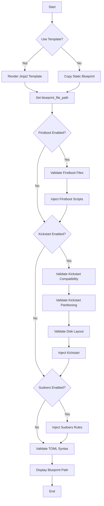

This page explains the **blueprint creation and validation** process in the OSBuild role, focusing on how blueprints are dynamically generated, customized, and validated to ensure compatibility with the **image-builder** toolchain. Blueprints serve as the foundational configuration for defining the contents, packages, services, and customizations of a Linux image. This documentation covers the architectural patterns, validation mechanisms, and integration points for blueprints in the role.

---

## **1. Blueprint Architecture: Dynamic Generation and Customization**
Blueprints in this role are **dynamically generated** using Jinja2 templates or copied as static files, depending on the configuration. The role prioritizes flexibility, allowing users to define blueprints either as **templated configurations** (for dynamic customization) or as **predefined static files** (for reproducibility).

## **1.1 Core Workflow**
The blueprint creation process follows a **two-phase workflow**:
1. **Generation**: Render a Jinja2 template or copy a static file to the output directory.
2. **Injection**: Append firstboot scripts, kickstart configurations, and sudoers rules to the blueprint.

The workflow is orchestrated in `tasks/blueprint.yml`, which handles conditional logic for template rendering, static file copying, and post-generation injections.
**Key decision points**:
- If `osbuild_blueprint_components` is non-empty, the role merges the named component files with a static frame (`templates/blueprint-components.toml.j2`). This wins over the two options below.
- Otherwise, if `osbuild_use_blueprint_template` is `true`, the role renders the Jinja2 template (`templates/blueprint.toml.j2`).
- Otherwise, the role copies a static blueprint file from `osbuild_static_blueprint_path`.

**Output**: A TOML-formatted blueprint file is written to `{{ osbuild_output_dir }}/{{ osbuild_blueprint_name }}.toml`.
Sources: [blueprint.yml](tasks/blueprint.yml#L5-L20)

---

### **1.2 Blueprint Template Structure**
The Jinja2 template (`templates/blueprint.toml.j2`) is the **primary source of dynamic customization**. It defines the following sections:

| **Section**               | **Purpose**                                                                                     | **Dynamic Source**                                                                                     |
|---------------------------|-------------------------------------------------------------------------------------------------|--------------------------------------------------------------------------------------------------------|
| `name`, `description`     | Metadata for the blueprint.                                                                     | Variables: `osbuild_blueprint_name`, `osbuild_blueprint_description`, `osbuild_blueprint_version`.    |
| `[[groups]]`              | Package groups defined by components.                                                           | Component definitions (`osbuild_component_defs`).                                                     |
| `[[packages]]`            | Packages included in the image.                                                                 | Component packages (`osbuild_component_defs[c].packages`) and `osbuild_extra_packages`.               |
| `[customizations.kernel]` | Kernel arguments for the image.                                                                 | Component kernel arguments (`osbuild_component_defs[c].kernel_args`).                                 |
| `[customizations.services]` | Systemd services to enable.                                                                   | Component services (`osbuild_component_defs[c].services`).                                            |
| `[customizations.timezone]` | Timezone and locale settings.                                                                | Variables: `osbuild_timezone`, `osbuild_locale`, `osbuild_keyboard`.                                  |
| `[customizations.files]`  | File injections (e.g., NVIDIA CDI scripts, firstboot scripts).                                  | Component files (`osbuild_component_defs[c].files`) or hardcoded injections (e.g., NVIDIA support).   |
| `[customizations.installer]` | Installer modules (e.g., Anaconda user module).                                              | Hardcoded to enable `org.fedoraproject.Anaconda.Modules.Users`.                                       |

**Example**: The `[[packages]]` section iterates over all selected components (`osbuild_components`) and includes their packages, with optional version pinning via `osbuild_package_pins`.
Sources: [blueprint.toml.j2](templates/blueprint.toml.j2#L20-L40)

---

## **2. Validation: Ensuring Blueprint Integrity**
Validation is a **multi-layered process** that ensures blueprints are syntactically correct, logically consistent, and compatible with the **image-builder** toolchain. The role performs validation at **three levels**:
1. **Component Validation**: Ensures selected components are defined, conflict-free, and have all required dependencies.
2. **Blueprint Syntax Validation**: Confirms the generated TOML file is syntactically valid.
3. **Kickstart Compatibility Validation**: Ensures the blueprint does not contain settings that conflict with kickstart configurations.

---

### **2.1 Component Validation**
Component validation is performed in `tasks/validate_components.yml` and focuses on **schema compliance**, **dependency resolution**, and **conflict detection**. The validation process includes:

| **Validation Step**               | **Purpose**                                                                                     | **Implementation**                                                                                     |
|-----------------------------------|-------------------------------------------------------------------------------------------------|--------------------------------------------------------------------------------------------------------|
| **Component Existence**           | Ensures all selected components are defined in `osbuild_component_defs`.                       | Asserts that each item in `osbuild_components` exists in `osbuild_component_defs.keys()`.             |
| **Schema Compliance**             | Ensures components have all required fields (e.g., `packages`, `requires`, `conflicts`).        | Asserts the presence of all fields listed in `REQUIRED_FIELDS` (see `tests/validate_schema.py`).      |
| **Conflict Detection**            | Ensures no conflicting components are selected together.                                        | Builds a list of conflicts from `osbuild_component_defs[c].conflicts` and asserts none are selected.   |
| **Dependency Resolution**         | Ensures all required dependencies for a component are selected.                                | Asserts that `osbuild_component_defs[c].requires` is a subset of `osbuild_components`.                 |

**Example**: If a component `nvidia` conflicts with `nouveau`, the role will fail if both are selected.
Sources: [validate_components.yml](tasks/validate_components.yml#L5-L69), [validate_schema.py](tests/validate_schema.py#L20-L50)

---

### **2.2 Blueprint Syntax Validation**
The role performs **optional TOML syntax validation** using Python's `tomllib` (or `tomli` for Python < 3.11). This step ensures the generated blueprint is syntactically valid before being passed to **image-builder**.

**Implementation**:
- The validation is performed in `tasks/blueprint.yml` using a Python one-liner:
  ```python
  python3 -c "import sys; toml = __import__('tomllib' if sys.version_info >= (3, 11) else 'tomli'); toml.load(open('{{ blueprint_file_path }}', 'rb'))"
  ```
- If `tomli` is not installed, the role skips validation and logs a warning, ensuring the build process is not blocked by missing dependencies.

**Output**: A success message (`✓ Blueprint TOML syntax is valid`) or a warning (`⚠ TOML validation skipped`).
Sources: [blueprint.yml](tasks/blueprint.yml#L140-L156)

---

### **2.3 Kickstart Compatibility Validation**
Kickstart configurations are **injected into the blueprint** as TOML literal strings. However, **image-builder rejects** blueprints that contain both:
- `[[customizations.user]]` or `[[customizations.group]]` sections, **and**
- A kickstart configuration under `[customizations.installer.kickstart]`.

**Validation Steps**:
1. **Read the Blueprint**: The role reads the generated blueprint using `ansible.builtin.slurp`.
2. **Check for Conflicts**: It uses a regex to detect conflicting settings:
   ```regex
   (?m)^\s*(\[\[customizations\.(?:user|group)\]\]|unattended|sudo-nopasswd)(?=\s|=|$)
   ```
3. **Fail on Conflicts**: If conflicts are detected, the role fails with a descriptive error message.

**Example**: If the blueprint contains `[[customizations.user]]` and `osbuild_kickstart_enabled` is `true`, the role will fail with:
```
{{ blueprint_file_path }} contains [[customizations.user]], which image-builder rejects next to [customizations.installer.kickstart].
Remove them or set osbuild_kickstart_enabled: false.
```
Sources: [blueprint.yml](tasks/blueprint.yml#L60-L90)

---

## **3. Injection: Extending Blueprints with Dynamic Content**
Blueprints are **extended dynamically** with additional configurations, such as:
1. **Firstboot Scripts**: Injected as TOML literal strings if `osbuild_firstboot_enabled` is `true`.
2. **Kickstart Configurations**: Appended to the blueprint if `osbuild_kickstart_enabled` is `true`.
3. **Sudoers Rules**: Added if `osbuild_kickstart_sudoers` is `true`.

---

### **3.1 Firstboot Injection**
Firstboot scripts are injected into the blueprint using the `ansible.builtin.blockinfile` module. The scripts are defined in `files/firstboot/` and include:
- `syncopated-firstboot`: The main firstboot script.
- `syncopated-firstboot-launcher`: A launcher script.
- `syncopated-firstboot.desktop`: A desktop autostart file.

**Validation**: The role ensures these files do not contain `'''` (TOML literal string delimiters) to avoid syntax errors.
**Injection**: The scripts are appended to the blueprint using a Jinja2 template (`firstboot-files.toml.j2`).
Sources: [blueprint.yml](tasks/blueprint.yml#L25-L45), [firstboot-files.toml.j2](templates/firstboot-files.toml.j2)

---

### **3.2 Kickstart Injection**
Kickstart configurations are injected into the blueprint as TOML literal strings. The role performs the following validations before injection:
1. **Partitioning Mode**: Ensures `osbuild_kickstart_partitioning` is either `auto` or `interactive`.
2. **Disk Layout Sanity**: Validates disk layout variables (e.g., `osbuild_kickstart_root_percent + osbuild_kickstart_reserve_percent < 100`).
3. **TOML Compatibility**: Ensures the kickstart file does not contain `'''`.

**Injection**: The kickstart configuration is appended using `kickstart.toml.j2`.
Sources: [blueprint.yml](tasks/blueprint.yml#L70-L110), [kickstart.toml.j2](templates/kickstart.toml.j2)

---

### **3.3 Sudoers Injection**
If `osbuild_kickstart_sudoers` is `true`, the role appends a passwordless sudo rule for the `wheel` group using `kickstart-sudoers.toml.j2`.
Sources: [blueprint.yml](tasks/blueprint.yml#L115-L125), [kickstart-sudoers.toml.j2](templates/kickstart-sudoers.toml.j2)

---

## **4. Architectural Diagram: Blueprint Workflow**
The following Mermaid diagram illustrates the **end-to-end blueprint creation and validation workflow**:



---

## **5. Key Variables and Defaults**
The following table summarizes the **key variables** that control blueprint creation and validation:

| **Variable**                          | **Purpose**                                                                                     | **Default Value**                          | **Defined In**                     |
|---------------------------------------|-------------------------------------------------------------------------------------------------|--------------------------------------------|------------------------------------|
| `osbuild_use_blueprint_template`      | Whether to render the Jinja2 template or use a static blueprint.                               | `true`                                     | Playbook/Inventory                 |
| `osbuild_blueprint_components`        | Component files to merge into the blueprint, in order. Non-empty selects the components path.   | `[]`                                       | Playbook/Inventory                 |
| `osbuild_components_dir`              | Directory of component files, relative to the role's `files/`; follows `osbuild_distro`.        | `<distro>/<ver>/<arch>/components`         | `defaults/main.yml`                |
| `osbuild_blueprint_frame_path`        | Static, non-composable blueprint part (firewall, locale, timezone, files) for the components path. | `<distro>/<ver>/<arch>/frames/workstation.toml` | `defaults/main.yml`           |
| `osbuild_blueprint_template`          | Path to the Jinja2 template for dynamic blueprint generation.                                   | `templates/blueprint.toml.j2`              | `defaults/main.yml`                |
| `osbuild_static_blueprint_path`       | Path to a static blueprint file (used if `osbuild_use_blueprint_template` is `false`).         | `""`                                       | Playbook/Inventory                 |
| `osbuild_blueprint_name`              | Name of the blueprint (used for output files).                                                  | `"custom"`                                 | `defaults/main.yml`                |
| `osbuild_components`                  | List of components to include in the blueprint.                                                 | `[]`                                       | Playbook/Inventory                 |
| `osbuild_component_defs`              | Definitions for all available components (packages, services, conflicts, etc.).                 | `{}`                                       | `vars/packages/{Distribution}.yml` |
| `osbuild_kickstart_enabled`           | Whether to inject a kickstart configuration into the blueprint.                                | `false`                                    | Playbook/Inventory                 |
| `osbuild_firstboot_enabled`           | Whether to inject firstboot scripts into the blueprint.                                         | `false`                                    | Playbook/Inventory                 |
| `osbuild_kickstart_sudoers`           | Whether to inject passwordless sudo rules for the `wheel` group.                                | `false`                                    | Playbook/Inventory                 |

Sources: [defaults/main.yml](defaults/main.yml#L10-L50), [validate_schema.py](tests/validate_schema.py#L20-L50)

---

## **6. Next Steps**
To deepen your understanding of the OSBuild role, explore the following pages:
- **[OSBuild Composer: Workflow and Integration](14-osbuild-composer-workflow-and-integration)**: Learn how blueprints are consumed by the `image-builder` toolchain.
- **[Template Files: Structure and Customization](11-template-files-structure-and-customization)**: Understand how Jinja2 templates are structured and customized.
- **[Testing Framework: BATS and Python Tests](20-testing-framework-bats-and-python-tests)**: Explore how blueprints and components are tested for validity.
- **[Distribution-Specific Variables and Configurations](18-distribution-specific-variables-and-configurations)**: Learn how blueprints adapt to different Linux distributions.