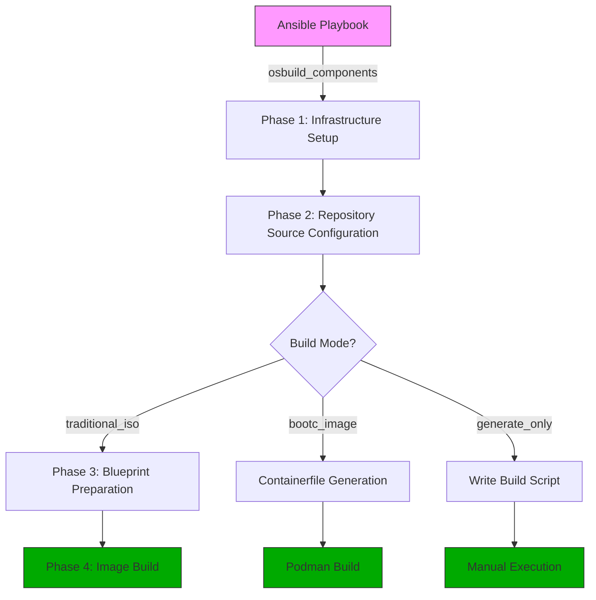

This page explains the **workflow** and **integration** of the OSBuild role with the modern `image-builder-cli` toolchain. It covers how the role generates blueprints, configures repositories, and executes builds — both for **traditional ISO images** and **bootc container images** — while maintaining a stateless, reproducible build process.

This documentation is **not** about:
- The legacy `osbuild-composer` daemon (deprecated)
- Blueprint syntax or customization ([See: Understanding Blueprints](6-understanding-blueprints-definition-and-customization))
- Kickstart or firstboot injection ([See: Kickstart Files](7-kickstart-files-automation-and-configuration) and [Firstboot Scripts](12-firstboot-scripts-injection-and-execution))
- Build mode selection ([See: Build Modes](8-build-modes-selecting-and-configuring-for-your-use-case))

---

## 1. Core Workflow: From Blueprint to Image

The OSBuild role implements a **three-phase workflow** that transforms a declarative blueprint into a bootable image. This workflow is **stateless** and **deterministic**, relying on the `image-builder-cli` tool for execution.

### Workflow Overview



> **Key Principle**: The role **never** interacts with a running daemon. All build logic is executed via CLI tools (`image-builder-cli`, `podman`) or generated scripts.

---

## 2. Phase Breakdown and Integration Points

### Phase 1: Infrastructure Setup (`tasks/install.yml`)

**Purpose**: Install and configure the build environment on the Ansible-controlled host.

**Key Actions**:
- Install `image-builder-cli`, `osbuild`, and `podman`
- Create output and log directories
- Validate host OS compatibility (Fedora, AlmaLinux, Rocky)

**Integration Point**:
The role assumes the build host is **not** the target system. It installs only the tools required to **generate** images, not to run them.

> **Note**: This phase does **not** start any daemons. The `osbuild-composer` service is **not** used.
Sources: [tasks/install.yml](tasks/install.yml#L1-L50)

---

### Phase 2: Repository Source Configuration (`tasks/sources.yml`)

**Purpose**: Aggregate repository URLs from selected components and prepare them for use in the build.

**How It Works**:
- Each component in `osbuild_components` may define `sources` (e.g., `rpmfusion-nonfree-nvidia-driver`, `cuda-fedora43-x86_64`)
- The role maps these source names to actual repository URLs using distribution-specific variables (e.g., `vars/Fedora.yml`)
- URLs are deduplicated and combined with user-provided `osbuild_extra_repo_urls`
- The final list is passed to `image-builder-cli --extra-repo` flags

**Example**:
```yaml
# vars/Fedora.yml
repo:
  rpmfusion-nonfree-nvidia-driver:
    metalink: "https://mirrors.rpmfusion.org/metalink?repo=nonfree-fedora-nvidia-driver-{{ _distro_version }}&arch={{ osbuild_arch }}"
  cuda-fedora43-x86_64:
    baseurl: "https://developer.download.nvidia.com/compute/cuda/repos/fedora43/x86_64/"
```

**Integration Point**:
Repository configuration is **build-time only**. No persistent state is written to the host.
Sources: [tasks/sources.yml](tasks/sources.yml#L6-L33), [vars/Fedora.yml](vars/Fedora.yml#L1-L50)

---

### Phase 3: Blueprint Preparation (`tasks/blueprint.yml`)

**Purpose**: Generate a valid TOML blueprint file from Jinja2 templates or static files.

**How It Works**:
- If `osbuild_blueprint_components` is non-empty, the role renders `templates/blueprint-components.toml.j2` from the component files and a static frame
- Otherwise it renders `templates/blueprint.toml.j2` if `osbuild_use_blueprint_template: true`
- Otherwise, it copies a static blueprint from `files/`
- **Firstboot** and **kickstart** files are injected as TOML literal strings
- Blueprint syntax is validated (optional, requires `python3-tomli`)

**Key Integration**:
- Components define `packages`, `groups`, `services`, and `kernel_args` in `defaults/main.yml`
- The blueprint template iterates over `osbuild_components` to aggregate these definitions

**Example Blueprint Snippet**:
```toml
[[packages]]
name = "podman"
version = "*"

[customizations.kernel]
append = "nvidia-drm.modeset=1 rd.driver.blacklist=nouveau"

[customizations.services]
enabled = ["podman.socket", "cockpit.socket"]
```

Sources: [tasks/blueprint.yml](tasks/blueprint.yml#L5-L156), [templates/blueprint.toml.j2](templates/blueprint.toml.j2#L28-L76)

---

### Phase 4: Image Build Execution

#### A. Traditional ISO Mode (`tasks/build.yml`)

**Purpose**: Execute `image-builder-cli` to build an ISO, QCOW2, or installer image.

**Command Template**:
```bash
image-builder build {{ osbuild_image_type }} \
  --distro {{ osbuild_distro }} \
  --blueprint {{ osbuild_blueprint_name }}.toml \
  --extra-repo "{{ url }}" 
```

**Workflow**:
1. The role runs the command in `osbuild_output_dir`
2. Build output is monitored asynchronously (timeout: `osbuild_build_timeout`)
3. On success, the newest image file is renamed to `{{ osbuild_output_filename }}`
4. On failure, logs are written to `{{ osbuild_log_dir }}`

**Integration Point**:
- The role **does not** use `composer-cli` or API polling
- All state is local to the build directory
- Builds are **reproducible** given the same blueprint and repositories

Sources: [tasks/build.yml](tasks/build.yml#L36-L53), [tasks/build.yml](tasks/build.yml#L84-L138)

---

#### B. Bootc Container Mode (`tasks/bootc.yml`)

**Purpose**: Generate a bootable container image using `podman build`.

**Workflow**:
1. The role renders `templates/Containerfile.bootc.j2`
2. A build script (`build.sh`) is generated from `templates/build.sh.j2`
3. The script is executed via `podman build`
4. The resulting container image is tagged and exported

**Key Integration**:
- The `Containerfile` installs packages, configures users, and enables services **at build time**
- No post-deployment Ansible runs are required (immutable pattern)
- NVIDIA CDI and kernel args are baked into the image

**Example Containerfile Snippet**:
```dockerfile
FROM quay.io/fedora/fedora-bootc:43

# Install packages from components
RUN dnf5 install -y podman cockpit sway

# Configure user and SSH
RUN useradd -m -s /usr/bin/zsh user && \
    echo 'user ALL=(ALL) NOPASSWD: ALL' > /etc/sudoers.d/99-user

# Enable services
RUN systemctl enable podman.socket cockpit.socket
```

Sources: [tasks/bootc.yml](tasks/bootc.yml#L1-L100), [templates/Containerfile.bootc.j2](templates/Containerfile.bootc.j2#L1-L50), [templates/build.sh.j2](templates/build.sh.j2#L1-L218)

---

#### C. Generate-Only Mode (`tasks/main.yml`)

**Purpose**: Generate build scripts without executing them (for CI/CD or manual builds).

**Workflow**:
1. The role writes a build script (`build-{{ osbuild_blueprint_name }}.sh`) using `templates/image-builder-build.sh.j2`
2. The script contains the full `image-builder-cli` command
3. Users can execute the script manually on the build host

**Example Script**:
```bash
#!/usr/bin/env bash
sudo image-builder build minimal-installer \
  --distro fedora-43 \
  --blueprint workstation.toml \
  --extra-repo "https://developer.download.nvidia.com/compute/cuda/repos/fedora43/x86_64"
```

**Integration Point**:
- Enables **GitOps workflows**: blueprints and build scripts can be version-controlled
- Decouples Ansible execution from image building
- Supports air-gapped or CI environments

Sources: [tasks/main.yml](tasks/main.yml#L150-L176), [templates/image-builder-build.sh.j2](templates/image-builder-build.sh.j2#L15-L30)

---

## 3. Integration with Ansible: Stateless Design

The OSBuild role is designed for **stateless integration** with Ansible. It does **not**:
- Start or manage daemons
- Store state in databases or sockets
- Require persistent services

### Key Integration Patterns

| Pattern | Implementation | Benefit |
|--------|----------------|--------|
| **Component-Driven Builds** | `osbuild_components` list defines packages, services, repos | Modular, reusable components |
| **Jinja2 Templating** | Blueprints and Containerfiles are rendered from templates | Dynamic configuration |
| **Build-Time Compilation** | All configuration baked into image (no post-deploy Ansible) | Immutable infrastructure |
| **Generate-Only Mode** | Scripts written to disk for manual execution | CI/CD and GitOps friendly |
| **Repository Aggregation** | Repos sourced from components + user input | Flexible, maintainable |

---

## 4. Error Handling and Debugging

### Build Failures
- The role captures `stdout` and `stderr` from `image-builder-cli` and writes them to `{{ osbuild_log_dir }}/build-failure-*.log`
- Build status is tracked via `build_status` fact (`RUNNING`, `FINISHED`, `FAILED`, `GENERATED`)
- The play fails explicitly if `build_status == "FAILED"`

### Common Issues
| Issue | Cause | Resolution |
|-------|-------|------------|
| `No new image found` | Build succeeded but no output file was created | Check `osbuild_output_dir` permissions and `osbuild_image_type` |
| `TOML syntax error` | Invalid blueprint template | Run `python3 -m tomllib blueprint.toml` manually |
| `Repository not found` | Missing or misconfigured `sources` in component | Verify `vars/Fedora.yml` or `vars/AlmaLinux.yml` |
| `Permission denied` | `image-builder-cli` requires `sudo` | Run playbook with `become: true` |

Sources: [tasks/build.yml](tasks/build.yml#L55-L82), [tasks/blueprint.yml](tasks/blueprint.yml#L138-L156)

---

## 5. Next Steps

1. **[Understanding Blueprints](6-understanding-blueprints-definition-and-customization)**: Learn how to customize blueprints for your use case.
2. **[Build Modes](8-build-modes-selecting-and-configuring-for-your-use-case)**: Configure the role for ISO, bootc, or generate-only modes.
3. **[Kickstart Files](7-kickstart-files-automation-and-configuration)**: Automate installer behavior with kickstart injection.
4. **[Firstboot Scripts](12-firstboot-scripts-injection-and-execution)**: Add post-installation setup scripts.
5. **[Testing Framework](20-testing-framework-bats-and-python-tests)**: Validate your builds with BATS and Python tests.

---