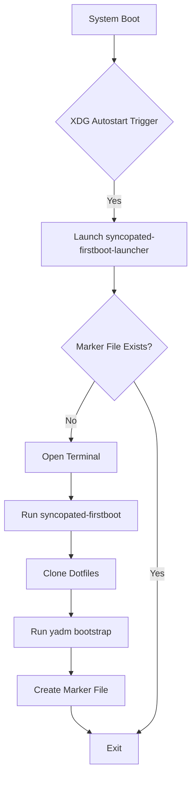

This page explains how the **OSBuild role** handles post-installation tasks using **Systemd services**, focusing on two key workflows:
1. **Firstboot user setup** (dotfiles cloning and environment bootstrapping)
2. **NVIDIA CDI refresh** (GPU acceleration for containers)

These mechanisms ensure critical tasks run **once after installation**, either at the system or user level, without manual intervention.

---

## Systemd Service Injection for Post-Installation Tasks

### Core Pattern
The role injects **Systemd services** into the generated image to handle tasks that must run **after the system boots for the first time**. This is achieved through:
- **Template-based service generation** (Jinja2 templates)
- **Blueprint-driven file inclusion** (TOML-based file injection)
- **Conditional execution** (marker files, environment checks)

### Key Files
| File | Purpose | Injection Mechanism |
|------|---------|---------------------|
| [`templates/systemd/nvidia-cdi-refresh.service.j2`](templates/systemd/nvidia-cdi-refresh.service.j2#L1-L18) | Generates NVIDIA CDI specifications for Podman | Blueprint TOML injection |
| [`files/firstboot/syncopated-firstboot`](files/firstboot/syncopated-firstboot#L1-L391) | Firstboot user setup script | Blueprint TOML injection |
| [`files/firstboot/syncopated-firstboot-launcher`](files/firstboot/syncopated-firstboot-launcher#L1-L30) | XDG autostart entry point | Blueprint TOML injection |
| [`templates/firstboot-files.toml.j2`](templates/firstboot-files.toml.j2#L1-L11) | Blueprint template for firstboot file injection | Dynamic TOML generation |

Sources:
[`templates/systemd/nvidia-cdi-refresh.service.j2`](templates/systemd/nvidia-cdi-refresh.service.j2#L1-L18),
[`files/firstboot/syncopated-firstboot`](files/firstboot/syncopated-firstboot#L1-L391),
[`templates/firstboot-files.toml.j2`](templates/firstboot-files.toml.j2#L1-L11)

---

## Firstboot Workflow: User Setup

### Overview
The **firstboot workflow** ensures a **one-time setup** for each user after the system boots. It:
1. Clones a **dotfiles repository** using `yadm`
2. Runs `yadm bootstrap` to configure the user environment
3. Creates a **marker file** to prevent re-execution

## Workflow Diagram


### Key Components
1. **XDG Autostart Launcher**
   - Located at [`files/firstboot/syncopated-firstboot-launcher`](files/firstboot/syncopated-firstboot-launcher#L1-L30)
   - Triggered by **XDG autostart** (`.desktop` file)
   - Detects terminal emulators (`xdg-terminal-exec`, `gnome-terminal`, `kitty`, etc.)
   - Skips execution if the **marker file** exists

2. **Firstboot Script**
   - Located at [`files/firstboot/syncopated-firstboot`](files/firstboot/syncopated-firstboot#L1-L391)
   - Handles:
     - **Dotfiles repository cloning** (default: `https://github.com/b08x/dots.git`)
     - **User environment bootstrapping** (`yadm bootstrap`)
     - **Marker file creation** (`~/.local/state/syncopated/firstboot.done`)
   - Supports **overrides** for testing (e.g., `SYNCOPATED_DOTFILES_URL`)

3. **Marker File**
   - Path: `~/.local/state/syncopated/firstboot.done`
   - Ensures the script runs **only once per user**

Sources:
[`files/firstboot/syncopated-firstboot-launcher`](files/firstboot/syncopated-firstboot-launcher#L1-L30),
[`files/firstboot/syncopated-firstboot`](files/firstboot/syncopated-firstboot#L13-L199)

---

## NVIDIA CDI Refresh Service

### Purpose
The **NVIDIA CDI refresh service** generates **Container Device Interface (CDI) specifications** for Podman, enabling GPU acceleration in containers. This is critical for:
- **AI/ML workloads**
- **CUDA-accelerated applications**
- **NVIDIA GPU passthrough**

### Service Definition
The service is defined in [`templates/systemd/nvidia-cdi-refresh.service.j2`](templates/systemd/nvidia-cdi-refresh.service.j2#L1-L18):
```ini
[Unit]
Description=Generate NVIDIA CDI specification for Podman
Documentation=https://github.com/NVIDIA/nvidia-container-toolkit
Wants=network-online.target
After=network-online.target
ConditionPathExists=/usr/bin/nvidia-ctk
ConditionPathExists=/usr/local/bin/nvidia-cdi-generate.sh

[Service]
Type=oneshot
ExecStart=/usr/local/bin/nvidia-cdi-generate.sh
RemainAfterExit=true
StandardOutput=journal
StandardError=journal

[Install]
WantedBy=multi-user.target
```

### Key Features
| Feature | Description |
|---------|-------------|
| **Type** | `oneshot` (runs once and exits) |
| **Conditions** | Requires `nvidia-ctk` and `nvidia-cdi-generate.sh` |
| **Dependencies** | Waits for `network-online.target` |
| **Persistence** | `RemainAfterExit=true` (service stays "active" after execution) |
| **Logging** | Outputs to `journal` (systemd journal) |

### Injection Mechanism
1. The service template is rendered during the **blueprint preparation phase**.
2. Injected into the image via **TOML customizations** in [`templates/firstboot-files.toml.j2`](templates/firstboot-files.toml.j2#L1-L11).
3. Enabled during **firstboot** or **post-installation**.

Sources:
[`templates/systemd/nvidia-cdi-refresh.service.j2`](templates/systemd/nvidia-cdi-refresh.service.j2#L1-L18),
[`templates/firstboot-files.toml.j2`](templates/firstboot-files.toml.j2#L1-L11)

---

## Blueprint-Driven File Injection

### How It Works
The role uses **TOML-based blueprints** to inject files into the generated image. This is handled by:
1. **Dynamic TOML generation** (`templates/firstboot-files.toml.j2`)
2. **File inclusion** in the blueprint (`[[customizations.files]]`)

### Example: Firstboot Files Injection
The [`templates/firstboot-files.toml.j2`](templates/firstboot-files.toml.j2#L1-L11) template dynamically includes firstboot files:
```toml

[[customizations.files]]
path = "{{ f.path }}"
mode = "{{ f.mode }}"
data = '''
{{ lookup('ansible.builtin.file', 'firstboot/' ~ f.src, rstrip=false) }}'''

```

### Key Variables
| Variable | Purpose | Defined In |
|----------|---------|------------|
| `_osbuild_firstboot_files` | List of files to inject (path, mode, source) | `defaults/main.yml` |
| `osbuild_components` | Components that trigger file injection (e.g., `nvidia`, `firstboot`) | [`defaults/main.yml`](defaults/main.yml#L172-L180) |

Sources:
[`templates/firstboot-files.toml.j2`](templates/firstboot-files.toml.j2#L1-L11),
[`defaults/main.yml`](defaults/main.yml#L172-L180)

---

## Task Orchestration

### Build Phase Integration
Post-installation tasks are integrated into the **build phase** via:
1. **Blueprint preparation** (`tasks/blueprint.yml`)
2. **File injection** (`templates/firstboot-files.toml.j2`)
3. **Service enablement** (handled by `systemd` in the generated image)

### Key Tasks
| Task | Purpose | File |
|------|---------|------|
| **Blueprint preparation** | Generates TOML blueprint with file/service injections | [`tasks/blueprint.yml`](tasks/blueprint.yml) |
| **Build execution** | Runs `image-builder` with the generated blueprint | [`tasks/build.yml`](tasks/build.yml#L37-L49) |

Sources:
[`tasks/build.yml`](tasks/build.yml#L37-L49),
[`tasks/blueprint.yml`](tasks/blueprint.yml)

---

## Testing and Validation

### Firstboot Testing
The [`tests/firstboot`](tests/firstboot) directory contains:
- **BATS tests** (`firstboot.bats`) for firstboot script validation
- **Python tests** (`check_injection.py`) for file injection verification
- **Stub files** for testing overrides (e.g., `SYNCOPATED_DOTFILES_URL`)

### NVIDIA CDI Testing
- Validated via **manual testing** in a VM with NVIDIA GPU passthrough
- Logs are checked in the **systemd journal** (`journalctl -u nvidia-cdi-refresh`)

Sources:
[`tests/firstboot/firstboot.bats`](tests/firstboot/firstboot.bats),
[`tests/firstboot/check_injection.py`](tests/firstboot/check_injection.py)

---

## Next Steps
1. **[Debugging Build Failures and Log Analysis](23-debugging-build-failures-and-log-analysis)**
   Learn how to troubleshoot post-installation task failures using systemd logs and build logs.

2. **[Security Hardening in Image Builds](26-security-hardening-in-image-builds)**
   Explore how to secure Systemd services and firstboot scripts in generated images.

3. **[Integrating Custom Packages and Repositories](25-integrating-custom-packages-and-repositories)**
   Extend post-installation tasks by injecting custom packages and repositories.

Sources:
[Catalog Navigation Context](#navigation-context)