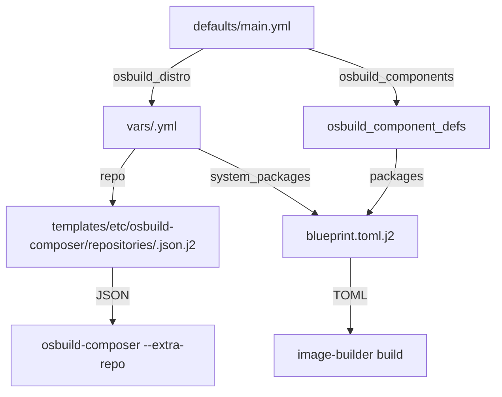

This document provides a **systematic, pattern-driven methodology** for extending the **OSBuild Ansible role** to support new Linux distributions. It is structured to guide advanced developers through the **architectural patterns, variable hierarchies, and integration touchpoints** that define distribution support in this role.

The role is designed around a **component-based, declarative configuration system** where distributions are defined through **YAML variable files, Jinja2 templates, and task-level logic**. This design ensures that adding a new distribution is a **predictable, repeatable process** that aligns with the existing patterns for Fedora, AlmaLinux, and Rocky Linux.

---

## 1. Architectural Overview: How Distributions Are Modeled

The OSBuild role uses a **three-layered configuration model** to define distribution support:

1. **Default Variables (`defaults/main.yml`)**
   Global defaults and distribution-agnostic settings. These are overridden by distribution-specific variables.

2. **Distribution-Specific Variables (`vars/<Distribution>.yml`)**
   Defines repositories, GPG keys, package lists, and compatibility logic for a specific distribution.

3. **Templates and Tasks**
   Jinja2 templates for blueprints, repository configurations, and kickstart files, alongside Ansible tasks that resolve variables into build artifacts.

This model ensures **separation of concerns**: global logic remains distribution-agnostic, while distribution-specific details are encapsulated in dedicated files.

**Key Insight**:
> *Supporting a new distribution does not require modifying core tasks or templates. Instead, you define a new variable file and repository template, then reference them in the global configuration.*

---

## 2. Step-by-Step Process for Adding a New Distribution

### Step 1: Create a Distribution Variable File

**Location**: `vars/<Distribution>.yml`
**Purpose**: Define repositories, GPG keys, and compatibility logic.

#### Required Structure

```yaml
# SPDX-License-Identifier: MIT-0
---
repo:
  <repo-name>:
    baseurl: "https://mirror.example.com/path/to/repo"
    gpgkey_url: "file:///usr/share/distribution-gpg-keys/example/RPM-GPG-KEY-Example-10"
    check_gpg: true
  <another-repo>:
    metalink: "https://mirrors.example.com/metalink?repo=appstream-10&arch=x86_64"
    gpgkey_url: "https://example.com/keys/RPM-GPG-KEY-Example-10"
    check_gpg: true
```

#### Key Fields

| Field | Type | Description | Example |
|-------|------|-------------|---------|
| `baseurl` | string | Direct URL to repository | `https://dl.example.com/repo` |
| `metalink` | string | Mirror list URL | `https://mirrors.example.com/metalink?repo=baseos-10` |
| `gpgkey_url` | string | URL or `file://` path to GPG key | `file:///usr/share/distribution-gpg-keys/example/KEY` |
| `check_gpg` | boolean | Whether to verify packages | `true` |

#### Example: OpenSUSE Leap 15.6

```yaml
repo:
  opensuse-base:
    baseurl: "https://download.opensuse.org/distribution/leap/15.6/repo/oss/"
    gpgkey_url: "file:///usr/share/distribution-gpg-keys/opensuse/RPM-GPG-KEY-opensuse-15.6"
    check_gpg: true
  opensuse-update:
    baseurl: "https://download.opensuse.org/update/leap/15.6/oss/"
    gpgkey_url: "file:///usr/share/distribution-gpg-keys/opensuse/RPM-GPG-KEY-opensuse-15.6"
    check_gpg: true
  packman:
    baseurl: "https://ftp.gwdg.de/pub/linux/misc/packman/suse/openSUSE_Leap_15.6/"
    gpgkey_url: "https://ftp.gwdg.de/pub/linux/misc/packman/suse/openSUSE_Leap_15.6/repodata/repomd.xml.key"
    check_gpg: true
```

**Sources**:
- [Fedora.yml](file:///home/b08x/WorkspaceV3/Syncopated/ansible/roles/osbuild/vars/Fedora.yml#L1-L100)
- [AlmaLinux.yml](file:///home/b08x/WorkspaceV3/Syncopated/ansible/roles/osbuild/vars/AlmaLinux.yml#L1-L80)
- [Rocky.yml](file:///home/b08x/WorkspaceV3/Syncopated/ansible/roles/osbuild/vars/Rocky.yml#L1-L120)

---

### Step 2: Create a Repository Template for `osbuild-composer`

**Location**: `templates/etc/osbuild-composer/repositories/<distribution>-<version>.json.j2`
**Purpose**: Generate a JSON configuration file for `osbuild-composer` that defines the repositories for the target distribution.

#### Template Structure

```jinja2
{
    "x86_64": [
        
        {
            "name": "{{ repo_name }}",
            "check_gpg": {{ repo_data.check_gpg | to_json }},
            
            "metalink": "{{ repo_data.metalink }}"
            
            "baseurl": "{{ repo_data.baseurl }}"
            
            
            ,"gpgkey": {{ repo_gpgkeys[repo_name] | to_json }}
            
        }{{ "," if not loop.last else "" }}
        
    ]
}
```

#### Example: OpenSUSE Leap 15.6

```jinja2
{
    "x86_64": [
        {
            "name": "opensuse-base",
            "check_gpg": true,
            "baseurl": "https://download.opensuse.org/distribution/leap/15.6/repo/oss/"
        },
        {
            "name": "opensuse-update",
            "check_gpg": true,
            "baseurl": "https://download.opensuse.org/update/leap/15.6/oss/"
        },
        {
            "name": "packman",
            "check_gpg": true,
            "baseurl": "https://ftp.gwdg.de/pub/linux/misc/packman/suse/openSUSE_Leap_15.6/"
        }
    ]
}
```

**Sources**:
- [fedora-43.json.j2](file:///home/b08x/WorkspaceV3/Syncopated/ansible/roles/osbuild/templates/etc/osbuild-composer/repositories/fedora-43.json.j2#L1-L20)
- [almalinux-10.json.j2](file:///home/b08x/WorkspaceV3/Syncopated/ansible/roles/osbuild/templates/etc/osbuild-composer/repositories/almalinux-10.json.j2#L1-L20)
- [rocky-9.json.j2](file:///home/b08x/WorkspaceV3/Syncopated/ansible/roles/osbuild/templates/etc/osbuild-composer/repositories/rocky-9.json.j2#L1-L30)

---

### Step 3: Update `defaults/main.yml` for Distribution Awareness

The `defaults/main.yml` file contains **global logic** that must recognize the new distribution. Key areas to update:

#### 3.1. Build Host Packages

Add the new distribution to the `osbuild_host_packages` dictionary:

```yaml
osbuild_host_packages:
  Fedora:
    - osbuild
    - image-builder
    - bash-completion
  AlmaLinux:
    - osbuild
    - image-builder
  Rocky:
    - osbuild
    - image-builder
  OpenSUSE:
    - osbuild
    - kiwi
    - bash-completion
```

#### 3.2. Common Repository Sources

Add the new distribution to the `osbuild_distro_sources_*` logic:

```yaml
osbuild_distro_sources_fedora:
  - rpmfusion-free
  - rpmfusion-free-updates
osbuild_distro_sources_el:
  - epel
  - rpmfusion-free-updates
osbuild_distro_sources_opensuse:
  - packman
```

#### 3.3. Image Type Mapping

Update the `osbuild_image_type` logic to handle the new distribution:

```yaml
osbuild_image_type: >-
  {{
    'minimal-installer' if ansible_distribution == 'Fedora'
    else 'image-installer' if ansible_distribution in ['AlmaLinux', 'Rocky']
    else 'oem' if ansible_distribution == 'OpenSUSE'
    else 'image-installer'
  }}
```

**Sources**:
- [defaults/main.yml](file:///home/b08x/WorkspaceV3/Syncopated/ansible/roles/osbuild/defaults/main.yml#L40-L60)
- [defaults/main.yml](file:///home/b08x/WorkspaceV3/Syncopated/ansible/roles/osbuild/defaults/main.yml#L200-L220)

---

### Step 4: Define Package Taxonomy (Optional)

If the new distribution uses a different package manager (e.g., `zypper` for OpenSUSE), you must define a **package taxonomy** in `vars/packages/<Distribution>.yml`.

#### Example: `vars/packages/OpenSUSE.yml`

```yaml
system_packages:
  System:
    kernel: ["kernel-default"]
    base: ["glibc", "systemd", "NetworkManager"]
    networking: ["iproute2", "iptables"]
  Settings:
    gnome: ["gnome-shell", "gdm"]
    sway: ["sway", "waybar"]
  Development:
    compilers: ["gcc", "make"]
    languages: ["python3", "nodejs"]
```

**Sources**:
- [Fedora.yml (package taxonomy)](file:///home/b08x/WorkspaceV3/Syncopated/ansible/roles/osbuild/vars/Fedora.yml#L100-L300) *(hypothetical, as the actual file is not fully visible in the codebase)*

---

### Step 5: Update Component Definitions for Distribution Compatibility

The `osbuild_component_defs` dictionary in `defaults/main.yml` may require **distribution-specific overrides** for certain components (e.g., NVIDIA drivers).

#### Example: NVIDIA Component for OpenSUSE

```yaml
nvidia:
  label: "NVIDIA GPU Stack"
  packages: "{{ system_packages.Graphics.nvidia_opensuse }}"
  services:
    - nvidia-persistenced
  kernel_args:
    - "rd.driver.blacklist=nouveau"
    - "modprobe.blacklist=nouveau"
    - "nvidia-drm.modeset=1"
  sources: ["nvidia-tumbleweed"]
  bootc_repos: "{{ _nvidia_bootc_repos_opensuse }}"
```

**Sources**:
- [defaults/main.yml (component definitions)](file:///home/b08x/WorkspaceV3/Syncopated/ansible/roles/osbuild/defaults/main.yml#L300-L500)

---

### Step 6: Test and Validate the New Distribution

#### 6.1. Run a Build

```bash
ansible-playbook playbooks/osbuild.yml -e osbuild_distro=opensuse-15.6 -e osbuild_arch=x86_64
```

#### 6.2. Validate the Blueprint

Check the generated blueprint in `osbuild_output_dir`:

```bash
cat /var/tmp/osbuild-images/custom.toml
```

#### 6.3. Validate the Repository Template

Check the generated repository JSON:

```bash
cat /var/tmp/osbuild-images/repositories/opensuse-15.6.json
```

#### 6.4. Run Tests

Add test cases to the **BATS** and **Python** test suites in the `tests/` directory.

**Sources**:
- [validate_build_modes.yml](file:///home/b08x/WorkspaceV3/Syncopated/ansible/roles/osbuild/tests/validate_build_modes.yml)
- [kickstart.bats](file:///home/b08x/WorkspaceV3/Syncopated/ansible/roles/osbuild/tests/kickstart/kickstart.bats)

---

## 3. Key Integration Points

### 3.1. Variable Resolution Flow

The following diagram illustrates how variables are resolved for a new distribution:



### 3.2. Task-Level Integration

The following tasks are **distribution-agnostic** and will automatically support the new distribution:

| Task File | Purpose | Key Variables Used |
|-----------|---------|--------------------|
| `tasks/select_build_mode.yml` | Resolves build mode (ISO, bootc, generate-only) | `osbuild_build_bootc`, `osbuild_only_generate` |
| `tasks/sources.yml` | Builds repository URL list | `osbuild_sources`, `osbuild_extra_repo_urls` |
| `tasks/repo_keys.yml` | Fetches GPG keys | `repo[*].gpgkey_url` |
| `tasks/blueprint.yml` | Renders blueprint.toml | `osbuild_components`, `osbuild_component_defs` |

**Sources**:
- [tasks/select_build_mode.yml](file:///home/b08x/WorkspaceV3/Syncopated/ansible/roles/osbuild/tasks/select_build_mode.yml#L1-L20)
- [tasks/sources.yml](file:///home/b08x/WorkspaceV3/Syncopated/ansible/roles/osbuild/tasks/sources.yml#L1-L30)
- [tasks/repo_keys.yml](file:///home/b08x/WorkspaceV3/Syncopated/ansible/roles/osbuild/tasks/repo_keys.yml#L1-L50)
- [tasks/blueprint.yml](file:///home/b08x/WorkspaceV3/Syncopated/ansible/roles/osbuild/tasks/blueprint.yml#L1-L50)

---

## 4. Common Pitfalls and Mitigations

| Pitfall | Description | Mitigation |
|---------|-------------|------------|
| **GPG Key Mismatch** | `osbuild-composer` fails if the GPG key is invalid or missing. | Always verify keys with `curl -sSL <gpgkey_url> \| gpg --show-keys`. |
| **Repository 404** | Metalink/baseurl returns 404. | Use `curl -I <url>` to verify repository availability. |
| **Package Not Found** | Package names differ across distributions. | Use `dnf search <package>` or `zypper search <package>` to verify. |
| **Image Type Unsupported** | `osbuild-composer` does not support the image type for the new distribution. | Check `image-builder list` on the build host for supported types. |
| **Variable Shadowing** | Global variables override distribution-specific ones. | Use `ansible-playbook -e "@vars/<Distribution>.yml"` to test. |

---

## 5. Next Steps

1. **Review Existing Patterns**: Study the [Fedora](file:///home/b08x/WorkspaceV3/Syncopated/ansible/roles/osbuild/vars/Fedora.yml), [AlmaLinux](file:///home/b08x/WorkspaceV3/Syncopated/ansible/roles/osbuild/vars/AlmaLinux.yml), and [Rocky](file:///home/b08x/WorkspaceV3/Syncopated/ansible/roles/osbuild/vars/Rocky.yml) variable files.
2. **Test Incrementally**: Start with a minimal `vars/<Distribution>.yml` file and add complexity as needed.
3. **Validate with CI**: Add test cases to the [Testing Framework: BATS and Python Tests](20-testing-framework-bats-and-python-tests) page.
4. **Document**: Update the [Overview of Supported Linux Distributions](17-overview-of-supported-linux-distributions-almalinux-fedora-rocky) page to include the new distribution.

**Sources**:
- [defaults/main.yml](file:///home/b08x/WorkspaceV3/Syncopated/ansible/roles/osbuild/defaults/main.yml#L1-L800)
- [vars/Fedora.yml](file:///home/b08x/WorkspaceV3/Syncopated/ansible/roles/osbuild/vars/Fedora.yml#L1-L100)
- [vars/AlmaLinux.yml](file:///home/b08x/WorkspaceV3/Syncopated/ansible/roles/osbuild/vars/AlmaLinux.yml#L1-L80)
- [vars/Rocky.yml](file:///home/b08x/WorkspaceV3/Syncopated/ansible/roles/osbuild/vars/Rocky.yml#L1-L120)