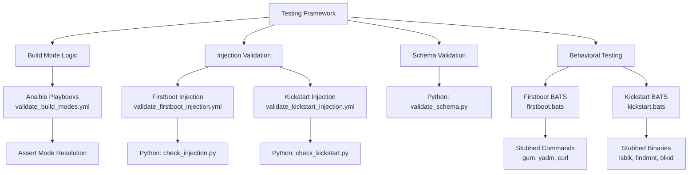

This page documents the **multi-layered testing framework** used to validate the `osbuild` role, ensuring correctness across **build logic**, **injection mechanisms**, **schema compliance**, and **runtime behavior**. The framework integrates **Ansible playbooks**, **BATS (Bash Automated Testing System)**, and **Python scripts** to provide comprehensive coverage without external dependencies.

---

## 1. Core Testing Domains

The testing framework is organized into **four primary domains**, each targeting a specific aspect of the role’s functionality:

| **Domain**               | **Tools Used**                          | **Key Focus Areas**                                                                                     | **Example Test Files**                                                                 |
|--------------------------|-----------------------------------------|---------------------------------------------------------------------------------------------------------|----------------------------------------------------------------------------------------|
| **Build Mode Logic**     | Ansible playbooks (`assert` module)     | Validate branching logic for build modes (`bootc_image`, `generate_only`, `traditional_iso`).          | [`validate_build_modes.yml`](tests/validate_build_modes.yml)                           |
| **Injection Validation** | Ansible + Python (`tomllib`, `subprocess`) | Ensure idempotency and correctness of injected files (firstboot scripts, kickstart configurations).    | [`validate_firstboot_injection.yml`](tests/validate_firstboot_injection.yml), [`check_injection.py`](tests/firstboot/check_injection.py) |
| **Schema Validation**    | Python (`yaml`, `re`)                   | Enforce structural rules for component definitions in `defaults/main.yml`.                             | [`validate_schema.py`](tests/validate_schema.py)                                       |
| **Behavioral Testing**   | BATS (stubbed commands)                 | Simulate real-world scenarios (e.g., disk selection, terminal emulators, network failures).            | [`firstboot.bats`](tests/firstboot/firstboot.bats), [`kickstart.bats`](tests/kickstart/kickstart.bats) |

---

## 2. Build Mode Logic Validation

### **Purpose**
Validate the **branching logic** in [`tasks/select_build_mode.yml`](../tasks/select_build_mode.yml) to ensure the correct build mode is resolved based on input variables (e.g., `osbuild_build_bootc`, `osbuild_only_generate`).

### **Implementation**
- **Tool**: Ansible playbook with `ansible.builtin.assert`.
- **Scope**: Tests all supported build modes and edge cases (e.g., priority of `bootc_image` over `generate_only`).
- **Key Pattern**: Isolated hosts (`host1-host4`) with predefined variables to verify mode resolution.

### **Example Test Case**
```yaml
- name: Validate bootc_image mode selection
  hosts: host1
  vars:
    osbuild_build_bootc: true
    osbuild_only_generate: false
  tasks:
    - name: Resolve build mode
      ansible.builtin.include_tasks: ../tasks/select_build_mode.yml
    - name: Verify resolved mode
      ansible.builtin.assert:
        that: osbuild_resolved_build_mode == 'bootc_image'
```
**Sources**: [`validate_build_modes.yml`](tests/validate_build_modes.yml#L10-L25)

---

## 3. Injection Validation

### **Purpose**
Ensure that **firstboot scripts** and **kickstart configurations** are injected into blueprints **correctly**, **idempotently**, and **without conflicts**.

### **Firstboot Injection**
- **Tool**: Ansible playbook + Python script (`check_injection.py`).
- **Scope**:
  - Validate TOML structure and file paths for injected files (e.g., `/usr/local/bin/syncopated-firstboot`).
  - Ensure byte-identical content between source files and blueprint entries.
  - Confirm no duplicate or conflicting entries (e.g., `custom-first-boot`).
- **Key Pattern**: Runs tasks twice to test idempotency.

#### **Example Workflow**
1. **Prepare Blueprints**: Generate static and templated blueprints twice.
2. **Check Injections**: Use `check_injection.py` to validate TOML structure and content.
3. **Assert Results**: Verify no duplicates or mismatches.

**Sources**: [`validate_firstboot_injection.yml`](tests/validate_firstboot_injection.yml#L20-L50), [`check_injection.py`](tests/firstboot/check_injection.py#L10-L47)

---

### **Kickstart Injection**
- **Tool**: Ansible playbook + Python script (`check_kickstart.py`).
- **Scope**:
  - Validate kickstart content (e.g., `lang`, `keyboard`, `timezone` headers).
  - Ensure idempotency (no duplicate blocks).
  - Detect conflicts (e.g., user definitions in both blueprint and kickstart).
  - Optional: Run `ksvalidator` for schema compliance.
- **Key Pattern**: Uses regex to strip and validate dynamic content (e.g., layout `%pre` scripts).

#### **Example Workflow**
1. **Prepare Blueprints**: Generate blueprints with kickstart enabled/disabled.
2. **Check Kickstart**: Use `check_kickstart.py` to validate content and structure.
3. **Conflict Detection**: Reject blueprints with conflicting user definitions.

**Sources**: [`validate_kickstart_injection.yml`](tests/validate_kickstart_injection.yml#L50-L100), [`check_kickstart.py`](tests/kickstart/check_kickstart.py#L20-L108)

---

## 4. Schema Validation

### **Purpose**
Enforce **structural and semantic rules** for component definitions in [`defaults/main.yml`](../defaults/main.yml).

### **Implementation**
- **Tool**: Python script (`validate_schema.py`).
- **Scope**:
  - Validate required fields (e.g., `label`, `packages`, `size_impact`).
  - Check data types (e.g., `secure_boot_compatible` must be boolean).
  - Allow Jinja2 expressions in list fields (e.g., `{{ osbuild_sources }}`).
  - Enforce constraints (e.g., `size_impact` must be `none|small|medium|large`).

### **Example Validation Rules**
```python
REQUIRED_FIELDS = [
    "label", "packages", "blueprint_groups", "services", "kernel_args",
    "sources", "files", "flatpaks", "copr_repos", "bootc_repos",
    "requires", "conflicts", "size_impact", "build_time_impact",
    "secure_boot_compatible", "bootc_only", "blueprint_only"
]

VALID_SIZE = {"none", "small", "medium", "large"}
```
**Sources**: [`validate_schema.py`](tests/validate_schema.py#L20-L50)

---

## 5. Behavioral Testing with BATS

### **Purpose**
Simulate **real-world scenarios** to test runtime behavior, including:
- **Firstboot scripts**: User interactions, tool availability, and network failures.
- **Kickstart scripts**: Disk selection logic in `%pre` scripts.

### **Firstboot Testing**
- **Tool**: BATS with stubbed commands (`gum`, `yadm`, `curl`).
- **Scope**:
  - Validate user prompts (e.g., dotfile setup, terminal selection).
  - Test failure handling (e.g., GitHub unreachable, missing tools).
  - Ensure no `sudo` usage in launcher scripts.
- **Key Pattern**: Environment isolation with curated `PATH` and stubbed binaries.

#### **Example Test Case**
```bash
@test "fact 10: missing yadm is downloaded to ~/.local/bin/yadm" {
  rm "$BIN/yadm"
  answers "Set up dotfiles" "__default__"
  run "$SCRIPT" </dev/null
  [ "$status" -eq 0 ]
  grep -q '^curl .*yadm-dev/yadm' "$STUB_LOG"
  [ -x "$HOME/.local/bin/yadm" ]
}
```
**Sources**: [`firstboot.bats`](tests/firstboot/firstboot.bats#L150-L165)

---

### **Kickstart Testing**
- **Tool**: BATS with stubbed binaries (`lsblk`, `findmnt`, `blkid`).
- **Scope**:
  - Validate disk selection logic (e.g., NVMe wins over SATA, USB disks excluded).
  - Test error handling (e.g., disk too small, no candidates).
  - Verify partition layout calculations.
- **Key Pattern**: Dynamic generation of disk configurations for testing.

#### **Example Test Case**
```bash
@test "F9: NVMe wins over a larger SATA disk" {
  disk sda 2000 sata
  disk nvme0n1 500 nvme
  run bash "$PRE"
  [ "$status" -eq 0 ]
  [ "$(target)" = nvme0n1 ]
}
```
**Sources**: [`kickstart.bats`](tests/kickstart/kickstart.bats#L40-L50)

---

## 6. Integration and Execution

### **Running Tests**
Tests are executed via `ansible-playbook` or directly with `bats`/`pytest`:

| **Test Type**            | **Command**                                                                                     |
|--------------------------|-------------------------------------------------------------------------------------------------|
| Build Mode Validation    | `ansible-playbook roles/osbuild/tests/validate_build_modes.yml`                                |
| Firstboot Injection      | `ansible-playbook roles/osbuild/tests/validate_firstboot_injection.yml`                        |
| Kickstart Injection      | `ansible-playbook roles/osbuild/tests/validate_kickstart_injection.yml`                        |
| Schema Validation        | `python3 roles/osbuild/tests/validate_schema.py`                                               |
| Firstboot BATS Tests     | `bats roles/osbuild/tests/firstboot/firstboot.bats`                                            |
| Kickstart BATS Tests     | `bats roles/osbuild/tests/kickstart/kickstart.bats`                                            |

### **Key Integration Points**
1. **Ansible Playbooks**:
   - Orchestrate setup/teardown (e.g., temporary directories, blueprint generation).
   - Invoke Python scripts for validation.
2. **Python Scripts**:
   - Parse TOML/YAML, compare content, and validate structure.
3. **BATS Tests**:
   - Simulate user interactions and system behavior with stubbed commands.

---

## 7. Visual Overview
Below is a **Mermaid diagram** illustrating the testing framework's architecture:



---

## 8. Next Steps
To deepen your understanding of the testing framework, explore the following pages:
- **[Validating Kickstart and Firstboot Injection](21-validating-kickstart-and-firstboot-injection)**: Learn how injection validation ensures idempotency and conflict detection.
- **[Schema Validation and Best Practices](22-schema-validation-and-best-practices)**: Dive into the rules and constraints enforced by `validate_schema.py`.
- **[Debugging Build Failures and Log Analysis](23-debugging-build-failures-and-log-analysis)**: Discover how to troubleshoot test failures and analyze logs.